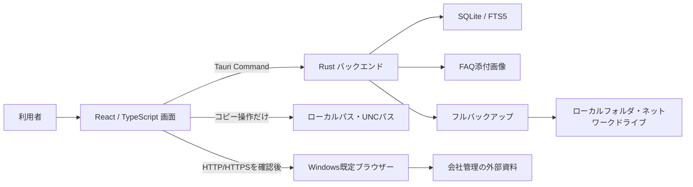
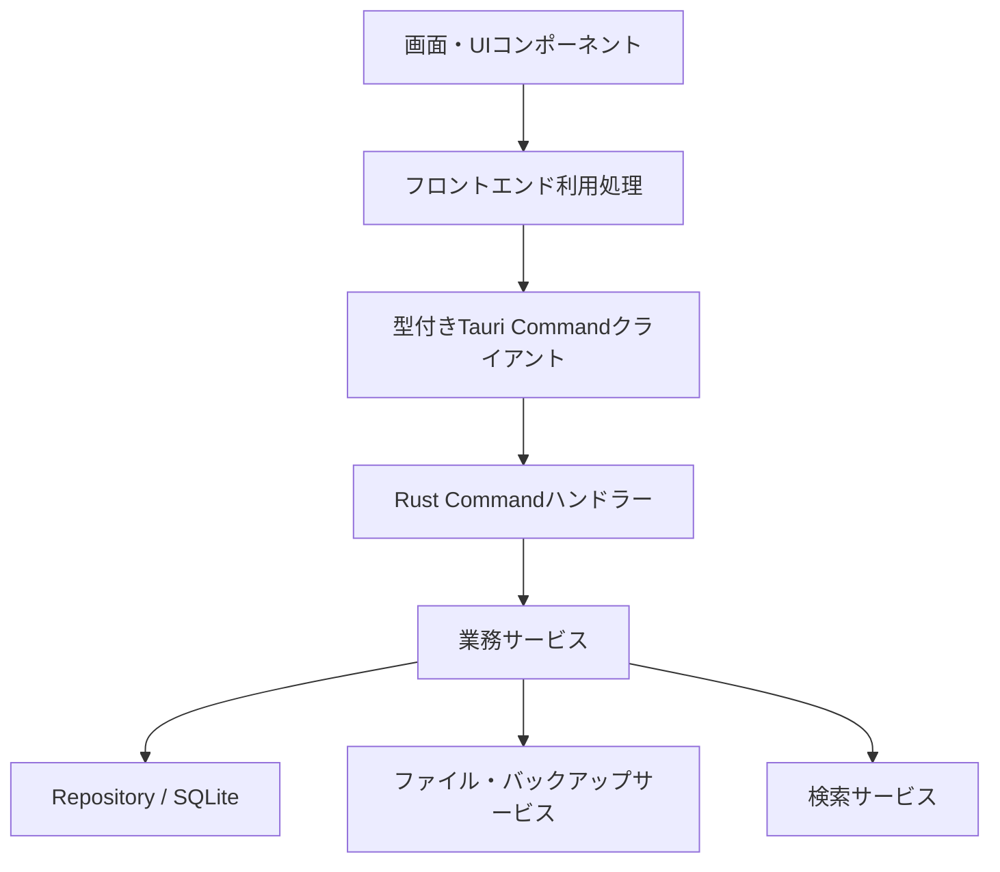
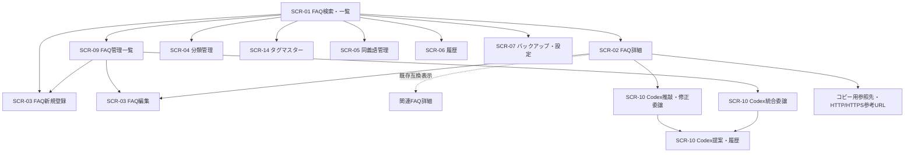
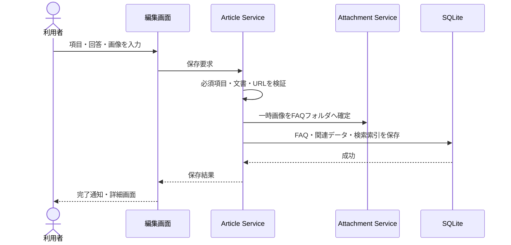
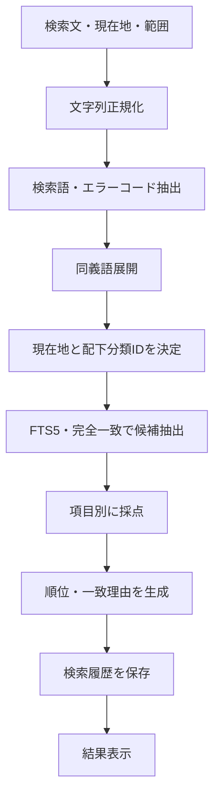
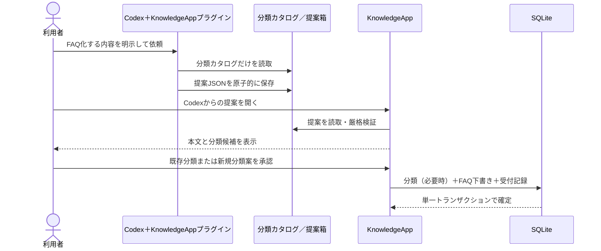
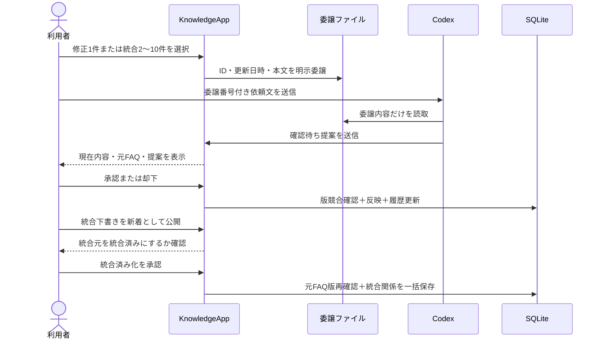
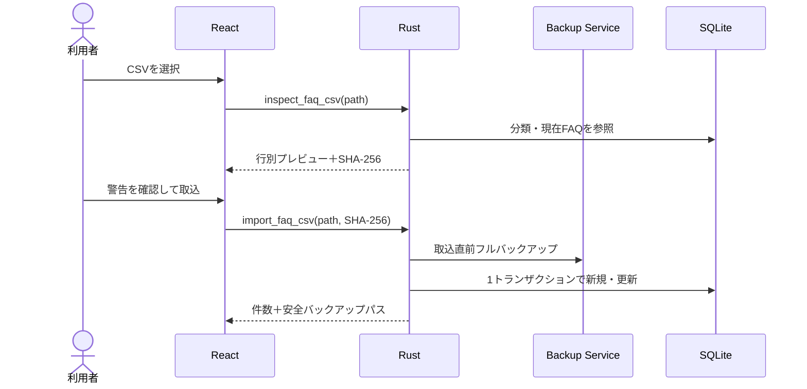

# FAQシステム基本設計書

## 1. 文書情報

| 項目 | 内容 |
|---|---|
| 文書名 | FAQシステム基本設計書 |
| 版 | 1.46（一人利用試行・延期記録・0.4.4候補版） |
| 作成日 | 2026-08-08 |
| 上位文書 | `FAQシステム要件定義書.md` v1.35 |
| 対象リリース | MVP（初回リリース） |
| 仮称 | KnowledgeApp（正式名称決定後に置換する） |

### 1.1 本書の目的

本書は、要件定義書で確定した内容を、画面、データ、処理、ファイル、配布、セキュリティの構成へ落とし込むものである。

本書では「何を、どの構成で実現するか」を定義する。個々の関数、SQL全文、画面部品の内部実装、テストコードなどは詳細設計・実装段階で定義する。

### 1.1.1 0.4.4の正式設計基準

2026-08-16の実装画面確認をもって、FAQ編集の4区分、タグマスター管理、マスター選択による複数タグ付与、検索情報入力の非表示、関連FAQ編集の将来移管を`0.4.0`の正式設計基準とする。旧検索情報と既存関連FAQは画面から変更させない互換データとして保持し、通常のFAQ編集保存、検索索引、JSON入出力、完全バックアップで消去しない。

関連FAQを将来再導入する場合は、タグとの役割分担、権限、循環・重複、検索・表示、既存関係の移行を別の変更単位として設計し、現行タグ選択へ暗黙に混在させない。

0.4.3では、Surfaceで再現した画像保存不具合に対し、React側の保存境界で管理画像を許可4属性だけへ再構成し、Rust側の許可ノード・属性・UUID・管理参照検証を維持する。検証失敗時は構造上の分岐だけを詳細エラーコードとして返し、FAQ本文、属性値、画像、ファイルパス、添付IDを画面、ログ、診断ファイルへ出力しない。

0.4.4では、全管理者のパスワード失念による利用不能を暫定回避するため、初期管理者の内部固定IDに限って別管理の固定緊急認証を追加する。通常のDB保存パスワードを先に検証し、不一致の場合だけ固定Argon2ハッシュを照合する。利用停止判定は照合より先に行い、追加管理者・一般利用者には緊急照合を行わない。平文はソース、DB、設定、ログ、画面、配布文書へ保持しない。この方式は将来の一回限り復旧キー方式へ置換する暫定設計である。

### 1.1.2 2026-08-16 一人利用試行の延期範囲

2026-08-16の利用者判断により、会社PCで利用者本人だけがソースを取得して試行する段階を、複数人への正式配布と分離する。一人利用試行では、コード署名・正式配布経路・社内承認、Surface再試験、旧版更新・アンインストール・別PC復元・二重起動の広範な手動リハーサル、表示倍率・アクセシビリティの組合せ確認、大容量CSV・バックアップの画面応答と6桁管理IDの実表示、ネットワーク・UNC障害、会社の実資料参照を2026-08-16付で延期する。

延期は機能削除または合格を意味しない。次の再開条件で該当設計・試験を再びリリース条件へ戻す。

| 設計・試験項目 | 再開条件 |
|---|---|
| コード署名・正式配布・公開範囲 | 利用者追加、正式社内配布、外部配布、公開リポジトリ化、または会社規定による要求 |
| Surface・端末固有回帰 | 画像、認証、WebView2または端末固有不具合の再発 |
| 旧版更新・再導入・別端末復元・二重起動 | 版更新、PC交換、複数端末利用または正式配布の前 |
| 表示・アクセシビリティ | 利用者追加、表示倍率変更、支援機能利用または表示不具合の発生 |
| 大容量CSV・バックアップ・6桁管理ID | 大量取込の前、採番値9万件到達前後、または応答性問題の発生 |
| ネットワークドライブ・UNC | ネットワーク保存先を設定する前 |
| 会社の実パス・HTTP/HTTPS資料 | 実FAQから会社管理資料を参照する前 |

一人利用試行の開始条件は、対象コミットの固定取得、会社PCでの起動、利用者別ローカルデータルートの確認、通常パスワードと初期管理者緊急認証の確認、緊急認証情報の分離管理、ローカルのフルバックアップ・復元確認、Gitフックと利用者データ混入防止検査である。これらは延期しない。実際の会社規定が署名、申請、保存場所または情報取扱いを要求する場合は、その規定を優先する。

この判断はリリース・検証範囲だけを変更し、画面、Tauri Command、DBスキーマ、保存形式、検索、バックアップ形式およびセキュリティ実装を変更しない。会社向け正式リリース判定は延期事項の必要範囲が完了するまで保留する。

### 1.2 設計方針

1. Windows 11上で、コマンド操作なしに利用できることを優先する。
2. FAQ、履歴、添付ファイルを外部サービスへ自動送信せず、Codexへ渡す既存FAQは利用者が画面で明示的に選択する。
3. ローカルの単一セッションを保ちながら複数利用者を登録し、将来の複数人・管理者運用へ移行できる境界を保つ。
4. 従量課金の生成AI APIをアプリへ組み込まず、定額利用のCodexへ必要な作成・修正・統合を明示的に委譲する。
5. 外部資料本体はアプリへ取り込まず、ローカルパス・UNCパスはコピー専用、HTTP/HTTPS参考URLは確認後の既定ブラウザー表示に限定する。
6. データを実行ファイルから分離し、アプリ更新による消失を防ぐ。
7. GitHub等ではプログラムだけを管理し、実データを混入させない。
8. バックアップを利用者が理解しやすい一操作で作成できるようにする。
9. 開発で仕様・画面・データ・処理・運用を変更する場合は、実装と同じ作業内で要件定義書・基本設計書を更新する。
10. Codexが作成するFAQは、結論を先に示し、必要最小限の手順・注意・備考・参考リンクへ段階的に進む簡潔な構成とする。
11. 画面の主要操作色は共通テーマ変数へ集約し、緑・青を切り替えても状態色とアクセシビリティを維持する。
12. FAQタイトル本体へ分類名を固定保存せず、設定がONの場合だけ検索結果の表示時に現在のトップ分類名を付ける。分類名変更・FAQ移動へ自動追従し、OFFで元表示へ戻せるようにする。
13. ネットワークパスなど正確な転記が必要な文字列はコピー用テキスト枠として明示し、クリップボードへ書き込むだけの安全な一操作を提供する。
14. FAQマスコットは同梱静的素材と共通App Shell内の独立部品で構成し、主要操作を妨げない小さい静止表示、クリック時だけのランダム動作、友達の登場状態、キーボード操作、動きを減らすOS設定への対応を両立する。
15. Excel一括編集は固定形式CSVを境界とし、回答本文セルが未変更なら現在の構造化本文を保持し、変更時だけ安全なプレーンテキスト段落へ置換する。CSVには内部UUIDを出さず、接頭辞付きの人間向け管理IDを使用する。
16. 未認証のTauri Command呼出しをRust側で拒否し、利用者・パスワードハッシュ・FAQ作成者／更新者をSQLiteへ保存する。

### 1.3 初回実装の到達点

2026-08-08に、MVP第1段階の最初の開発単位として次を実装した。

- Tauri 2、React、TypeScript、Vite、Tiptap、Rust、SQLiteによるアプリ基盤
- `appLocalDataDir`を使用する`DataRootService`と、作業フォルダへの代替保存禁止
- 初期DBマイグレーションと、分類作成、FAQの新規・更新・一覧・詳細表示
- 下書き、公開、廃止の状態と公開必須項目のRust側検証
- 許可ノード方式のリッチテキスト検証と、クリック可能なリンクにおけるHTTP/HTTPS以外のURL拒否
- URL文字列のプレーンテキスト貼り付け、明示的な参考URL設定・解除
- FAQ保存失敗時の原因・対処表示への自動スクロール
- `.gitignore`、コミット前hook、GitHub Actions、配布物検査による利用者データ混入防止
- 任意名・任意保存先の`.faqbackup`作成、内容・SHA-256検証、復元前プレビュー、事前安全バックアップ付き復元
- バックアップ対象件数・推定サイズの表示、前回成功した保存先の再利用、同名ファイルの上書き確認
- FAQの論理削除、通常検索からの除外、削除済みFAQの分離表示と復元
- `#/manage`のFAQ管理一覧、状態・分類・削除状態・キーワードによる絞り込み、50件単位のページング
- FAQごとの新着・更新表示終了日、空欄でONにした際の端末現在日付から7日後の初期表示、非表示設定、通常検索からの非表示FAQ除外
- 回答欄の通常段落をチャット欄に近い密度で表示する編集スタイル
- 分類の名称変更、親分類選択による配下ごとの移動、循環・6階層化・同一親同名の拒否、空分類の安全な削除
- FAQ本文への画像ファイル選択・クリップボード貼り付け、代替テキスト設定、再編集・詳細表示
- PNG・JPEG・WebP・GIFのファイル内容検証、画像1件10MB上限、SHA-256検証、FAQ保存時の添付確定
- 外部画像URL・Base64画像・貼り付けHTML内の外部画像拒否、添付・一時画像フォルダだけに限定した表示許可
- FAQ本文から画像を外した場合の保存成功後削除と、論理削除FAQに属する画像の保持
- 参考URLの表示文字・接続先ホスト名・完全なURLを示す確認画面と、Windows既定ブラウザーでの外部オープン
- FAQ詳細・管理一覧からの複製、下書き化、「元タイトル（コピー）」の付与、添付画像の独立コピー
- Codexへの新規FAQ作成、既存FAQ1件の推敲・修正委譲、2～10件の非破壊統合委譲
- Codex修正案の版競合検出、既存画像・分類・状態・表示設定の維持、承認後反映
- Codex提案の承認・却下履歴と、依頼系列ごとの最新却下案だけを再検討する制御
- 統合FAQの初回公開時に新着期限を必須化し、公開成功後の利用者確認で統合元を「統合済み」として通常検索から除外する解除可能な関係管理
- Codex FAQ提案の結論、手順、注意、備考、参考リンクを一定順序にする標準構成
- Codex FAQで必要な画像・スクリーンショットの追加位置を案内し、著作権・機密情報・代替テキストを確認する利用方針
- 設定画面で参照でき、利用者が変更できないCodex分類カタログ・提案箱の固定保存先表示
- 白を基調に緑・青を切り替えられる全画面カラーテーマ、共通メニュー・分類絞り込み・検索結果の3領域化、比較しやすい1列の横長FAQカード
- FAQ編集画面の4区分ナビゲーション、入力状況表示、基本情報の入力単位カード、タグマスター選択、項目別エラー、公開状態カード、用途別回答ツールバー、常時確認できる保存バー
- 検索結果タイトルの`【トップ分類名】`表示をON/OFFできる端末設定と、分類変更へ追従する表示時合成
- 選択文字列をコピー用テキスト枠へ変換する回答ツール、FAQ詳細での正確なプレーンテキストコピー、編集・通常文章への復元
- クリップボード書込だけを許可するTauri権限と、コピー用テキスト枠を許可ノードへ追加したリッチテキスト形式第2版
- 金縁の片眼鏡と紺色の角帽を持つちびフクロウと友達の茶トラ猫「ムギ」の透明ドット絵スプライトシート、通常時の静止画、眠る・訪問・お茶・遊び・読書・帰宅を含むクリック時のランダム動作、約64×70ピクセルを基準とした左下固定表示、表示ON/OFF、右クリック非表示、キーボード・動きを減らす設定への対応

複数値のFAQ検索情報、双方向の関連FAQ、未保存離脱警告、3種類の検索範囲、日本語分解・順位付け、同義語辞書、検索・閲覧履歴、JSON入出力、分類の同一親内での上下並べ替えは2026-08-16のリリース前開発単位で実装した。その後の仕様変更により、FAQ編集画面の個別検索情報と関連FAQ編集は現行リリースから外し、既存`tags`テーブルを正式なタグマスターとして管理・選択する構成へ変更した。旧検索情報と関連FAQは既存DB・JSON・検索との互換性のため保持し、編集保存で消去しない。外部資料参照はコピー用テキスト枠とHTTP/HTTPS参考URLで実装済みとし、専用HTML手順書管理は2026-08-16の方針変更により対象外とする。

## 2. システム概要

### 2.1 利用形態

| 項目 | 設計内容 |
|---|---|
| 開発場所 | 自宅の個人PC（Windows 11 64ビット） |
| 自宅での利用 | 生成AIの活用事例を題材に、FAQ作成・検索・編集機能をテストする。 |
| 会社での利用 | PCトラブル、PC設定、ネットワーク、プログラム修正などの会社業務FAQを利用する。 |
| MVP利用者 | 1名 |
| 配布 | GitHub等のリリースからWindowsインストーラーを取得 |
| データ保存 | Windowsの利用者別ローカルフォルダ |
| データ移行 | フルバックアップの作成と復元 |
| 通信 | 通常の検索・閲覧・手動編集・バックアップはオフライン。参考URLを既定ブラウザーで開く操作と、利用者が選択した内容のCodex明示委譲だけが外部利用を伴う。アプリ自体は生成AI API通信を行わない。 |

#### 2.1.1 FAQ内容に関する前提

- 自宅で作成されるFAQは、生成AIの活用事例を中心とする場合がある。
- 会社で作成されるFAQは、PCトラブル、PC設定、ネットワーク、プログラム修正などを中心とする場合がある。
- この違いは登録内容の例であり、アプリの機能やデータ構造を利用場所ごとに切り替える要件ではない。
- FAQ内容が生成AI中心でも、アプリを生成AI専用として設計しない。生成AI APIを組み込まない理由は従量課金費用の抑制であり、定額利用のCodexへの明示的委譲は積極的に利用する。

### 2.2 システム構成



### 2.3 採用技術

| 分類 | 採用候補 | 用途 |
|---|---|---|
| デスクトップ基盤 | Tauri 2 | Windowsアプリ化、画面とRustの橋渡し、配布 |
| フロントエンド | React＋TypeScript | 画面、分類ツリー、フォーム、状態管理 |
| ビルド | Vite | フロントエンド開発・ビルド |
| 画面ルーティング | React Routerのハッシュルーター | デスクトップ内の画面遷移 |
| リッチテキスト | Tiptap | 見出し、表、画像、リンク、箇条書き |
| クリップボード | Tauri Clipboard Manager | コピー用テキスト枠のプレーンテキスト書込。読取権限は与えない。 |
| バックエンド | Rust | 入力検証、DB、検索、ファイル、バックアップ |
| データベース | SQLite | FAQ、分類、履歴、設定の永続化 |
| 全文検索 | SQLite FTS5 trigram＋アプリ側順位計算 | 日本語部分一致と項目別重み付け |
| ID | UUID v7 | 端末間移行でも衝突しにくい一意ID |
| Tauri内部識別子 | `jp.local.webknowledgesystem` | 利用者データフォルダを安定して解決する固定ID |
| 配布 | Tauri NSIS・利用者単位インストーラー | 管理者権限を原則必要としない導入 |

バージョン番号は実装開始時点の安定版を採用し、依存関係のロックファイルで固定する。更新は一括して検証後に行う。

### 2.4 CodexによるFAQ作成・修正・統合支援

本アプリは、利用量に応じたAPI費用の増大を避けるためOpenAI APIキーや従量課金の生成AIモデルを組み込まず、通常検索もローカル検索で行う。一方、生成AI連携自体を避けるものではなく、利用者が定額利用するCodexへ明示的に依頼した場合は、KnowledgeApp専用プラグインを使い、新規FAQ、既存FAQの推敲・修正、複数FAQの統合案を作成できる。

| 項目 | 設計内容 |
|---|---|
| 手動作成 | 従来の「新しいFAQ」画面を維持し、利用者が一から登録・編集できる。 |
| Codexへ渡す情報 | 新規作成では会話で提供した内容と分類カタログだけを使う。既存FAQでは、利用者が画面で選択して生成した`codex-bridge/delegations/{delegationId}.knowledge-delegation.json`だけを使う。未選択FAQ、DB、履歴、添付画像本体、外部資料本体は渡さない。選択FAQ本文に含まれる参照先文字列は利用者が委譲対象を確認した範囲として扱う。 |
| Codexの出力 | 形式第2版で`create`、`revise`、`merge`を区別し、受付番号、依頼系列番号、元FAQ ID・更新日時、FAQ案、分類案を`.knowledge-proposal.json`として原子的に保存する。 |
| 利用者確認 | 「Codexからの提案」で本文と現在FAQまたは統合元を確認する。新規・統合では分類を最終選択し、修正では現在FAQとの比較後に反映する。 |
| 新規・統合反映 | 新規と統合は常に新しい下書きにする。統合元FAQは取込時に変更・廃止・削除しない。統合下書きの初回公開では新着期限を必須とし、公開成功後に利用者が確認した場合だけ統合元から統合先への関係を記録する。 |
| 修正反映 | 元FAQのID・委譲時更新日時が現在DBと一致する場合だけ、タイトル、概要、回答、重要度を更新する。分類、状態、新着・更新、非表示、添付画像は維持する。 |
| 履歴 | 提案受信時にDB履歴へ保存し、承認・却下後も保持する。同じ依頼系列では最新の却下案だけ再検討可能とし、古い案は閲覧専用にする。 |
| FAQ標準構成 | 概要を原則1文の結論とし、本文は手順、明示した注意、必要な備考、参考リンクの順にする。1 FAQ 1目的、手順は原則7項目以内とし、空見出しや未確認情報を作らない。 |
| タイトル | Codex提案の`faq.title`には分類接頭辞を含めず、検索しやすい質問文だけを保存する。検索結果の`【トップ分類名】`はアプリの表示設定が現在の分類階層から動的に付ける。修正案でも表示設定を理由に接頭辞を追加・削除しない。 |
| 画像利用 | 文章だけでは操作箇所や状態の違いが伝わりにくく、画像・スクリーンショットが視認性・理解を実質的に高める場合だけ利用を案内する。新規・統合案では提案JSONへ画像を含めず、送信後に内容・挿入位置・代替テキスト案を伝える。修正案では委譲元画像を変更しない。著作権、利用条件、個人情報・機密情報・認証情報を確認できない画像は利用しない。 |
| 禁止事項 | Codexから`knowledge.db`、WAL、SHMを読み書きしない。自動公開・削除、未承認の既存FAQ変更を行わない。統合済み化はKnowledgeAppでの公開成功後に利用者が確認した場合だけ行う。 |
| 重複防止 | `codex_proposal_receipts`へ受付番号と作成FAQを記録し、提案ファイルが残った場合や再送時にも二重登録しない。 |
| プラグイン | `codex-plugins/knowledgeapp-faq`にスキル、提案形式、分類カタログ取得コマンド、提案送信コマンドを配置する。通常コマンドは固定のappLocalDataDir配下だけを扱う。 |

今回の統合委譲は利用者が画面で選んだ2～10件を対象とする対話的な機能である。数十件以上の一括整理は、将来`.knowledge-export.json`の出力・検証付きインポート完成後に扱い、現在の選択式統合で代替しない。

## 3. 配置・配布設計

### 3.1 インストール方式

- 通常利用はNSIS形式の利用者単位インストーラーを採用する。
- スタートメニューとデスクトップに起動用ショートカットを作成できるようにする。
- アプリ更新時は同じインストーラーで上書き更新する。
- アンインストール時、利用者データは自動削除せず、削除する場合は明示確認を求める。
- ポータブルZIP版は試用・障害切り分け用の補助配布とし、通常運用の第一候補にはしない。
- 自動更新はMVPに含めず、リリースページから手動更新する。

### 3.2 利用者データの保存場所

標準のデータルートを次のようにする。

```text
%LOCALAPPDATA%/jp.local.webknowledgesystem/
├─ data/
│  └─ knowledge.db
├─ attachments/
│  └─ articles/
├─ manuals/                 # 旧版バックアップ互換用。現行画面からは追加しない
├─ logs/
├─ restore-staging/
├─ safety-backups/
├─ settings/
├─ temp/
├─ codex-bridge/
│  ├─ categories.json
│  └─ delegations/
│     └─ {delegationId}.knowledge-delegation.json
└─ codex-inbox/
   └─ {requestId}.knowledge-proposal.json
```

| フォルダ | 内容 | フルバックアップ対象 |
|---|---|---:|
| `data` | SQLiteデータベース | ○ |
| `attachments/articles` | FAQ本文へ挿入した画像 | ○ |
| `manuals` | 旧版バックアップ互換用の予約領域。現行画面から新規ファイルを追加しない。 | ○（互換性維持） |
| `logs` | アプリ診断ログ | × |
| `restore-staging` | 復元中だけ使用する一時データ | × |
| `safety-backups` | DB移行・復元・CSV取込の直前に自動作成するローカル安全バックアップ | × |
| `settings` | DB外に置く起動・表示設定 | ○ |
| `temp` | バックアップ作成・検査などの一時データ | × |
| `codex-bridge` | FAQ本文を含まない分類カタログと、利用者が明示選択したFAQだけを含む委譲ファイル。 | × |
| `codex-inbox` | 利用者が確認する前のCodex FAQ提案 | × |

インストール先やGitリポジトリには利用者データを書き込まない。通常版はRust側でTauriの`appLocalDataDir`を解決し、この固定パスだけをDB、添付、設定の基準にする。パス解決に失敗した場合、現在の作業ディレクトリへ代替保存せず起動を停止する。会社管理の外部資料はデータルートへ複製しない。ポータブル版の保存方式は実装時に本方針を維持して別途定義する。

### 3.3 GitHub等で管理する範囲

管理対象：

- ソースコード
- DBマイグレーション定義
- 自動テスト
- ビルド設定
- サンプル設定
- 開発用に明示して作成したテストフィクスチャー
- `AGENTS.md`、要件定義書、基本設計書
- リリース成果物

管理対象外：

- `knowledge.db`と関連するWAL・SHMファイル
- 利用者がローカル環境で作成したFAQ、検索履歴、閲覧履歴
- 添付画像
- 旧版互換用`manuals`領域に残る利用者ファイル
- フルバックアップ、JSONエクスポート
- アプリ診断ログ
- 一時ファイル
- Codex提案、分類カタログ

除外設定に加え、リリース前検査で禁止ファイルや既知のデータフォルダが含まれないことを確認する。

リポジトリが公開・非公開のどちらであっても、利用者がアプリ上で作成したFAQ内容を登録しない。テストへデータが必要な場合は、ローカルFAQから転用せず、開発用フィクスチャーとして明示的に作成する。

保存先、`.gitignore`、コミット前検査、CI検査、リリース梱包の詳細は`ローカルFAQデータ・Git除外詳細設計書.md`に従う。

## 4. アプリケーション構成

### 4.1 レイヤー構成



依存方向を上から下へ限定し、画面がSQLや任意ファイルを直接操作しないようにする。

### 4.2 フロントエンドの責務

| モジュール | 主な責務 |
|---|---|
| App Shell / Auth Context | ログイン状態の読込と共有、未認証ルート保護、共通ヘッダー、利用者表示、ログアウト、左ナビゲーション、管理者メニュー分岐、表示設定・FAQマスコット |
| Search | 分類選択、検索条件、検索結果の並び替え・ページング、トップ分類名を付けるタイトル表示 |
| Article View | FAQ詳細、既存互換の関連FAQ表示、外部資料の参照先、参考URL、コピー用テキスト枠 |
| Article Editor | 基本情報、回答、タグマスター選択、公開・表示設定、画像、表、コピー用テキスト枠、保存前検証 |
| Category Manager | 追加、名称変更、移動、並べ替え、削除 |
| Tag Manager | タグ追加、名称変更、使用件数確認、未使用タグ削除 |
| Synonym Manager | 同義語グループの管理 |
| History | 検索履歴、0件検索、閲覧履歴 |
| Backup & Settings | カラーテーマ、タイトル分類表示、マスコット表示の選択、フルバックアップ、復元、MVP必須のJSON入出力 |
| User Manager | 管理者向け利用者追加、利用停止・再開、パスワード再設定 |
| CSV Transfer | 保存・選択ダイアログ、書出し、取込プレビュー、警告確認、結果表示 |
| Shared UI | ボタン、ダイアログ、通知、入力部品、空表示 |

### 4.3 Rustバックエンドの責務

| サービス | 主な責務 |
|---|---|
| Category Service | 階層検証、再帰取得、移動、深さ制御 |
| Article Service | FAQ CRUD、状態変更、論理削除、複製 |
| Search Service | 正規化、同義語展開、候補取得、採点、履歴 |
| Rich Content Service | Tiptap文書検証、プレーンテキスト生成 |
| Attachment Service | 画像検査、コピー、参照、孤立判定 |
| Backup Service | DBスナップショット、梱包、検証、復元 |
| Settings Service | カラーテーマを含むアプリ設定の取得・検証・保存 |
| Migration Service | DBバージョン確認と移行 |
| Auth Service | Argon2ハッシュ、パスワード検証、ログインID正規化、単一インメモリセッション |
| CSV Transfer Service | Excel互換CSV、本文ハッシュ、プレーンテキスト段落変換 |
| Log Service | 診断ログと利用者向けエラー番号の記録 |

### 4.4 ソースコード構成案

```text
KnowledgeApp/
├─ src/
│  ├─ app/
│  ├─ pages/
│  ├─ features/
│  │  ├─ search/
│  │  ├─ articles/
│  │  ├─ categories/
│  │  ├─ synonyms/
│  │  ├─ history/
│  │  └─ backup/
│  ├─ components/
│  ├─ assets/
│  │  └─ mascot/
│  ├─ api/
│  ├─ types/
│  └─ styles/
├─ src-tauri/
│  ├─ src/
│  │  ├─ commands/
│  │  ├─ services/
│  │  ├─ repositories/
│  │  ├─ search/
│  │  ├─ backup/
│  │  ├─ security/
│  │  └─ errors/
│  ├─ migrations/
│  └─ capabilities/
├─ tests/
├─ docs/
└─ .github/
   └─ workflows/
```

### 4.5 文字コード・改行コード

- ソースコード、設定、SQL、設計文書、PowerShellスクリプトはUTF-8（BOMなし）を正本とする。
- 改行コードはOSにかかわらずLFへ統一し、`.gitattributes`でGitの`core.autocrlf`より優先する。
- 対応エディターでは`.editorconfig`によりUTF-8・LFを適用する。
- コミット前hookとGitHub Actionsで`scripts/check-text-encoding.ps1`を実行し、UTF-8として厳密に復号できないファイル、UTF-8 BOM、置換文字`U+FFFD`、NUL文字、CRを含む改行を拒否する。
- Rustの`serde_json`出力とPowerShellのJSON入出力はUTF-8を明示し、OS既定のANSIコードページへ依存しない。PowerShell 5.1を使用するhookの代替経路では、UTF-8指定でスクリプト本文を読み込んでから実行する。
- Web画面の入口HTMLには`<meta charset="UTF-8">`を保持する。SQLiteの文字列は8.1のUTF-8方針に従う。

## 5. 共通画面設計

### 5.1 画面構成

```text
┌────────────────────────────────────────────────────────────────────┐
│ KnowledgeApp                                   ローカルに保存済み │
├──────────────┬─────────────────────────────────────────────────────┤
│ 共通メニュー │ 画面見出し                         [主操作]         │
│              │ [検索欄・検索条件]                                  │
│ FAQを探す    ├──────────────┬──────────────────────────────────────┤
│ 新しいFAQ    │ 分類絞り込み │ 現在地・件数                         │
│ FAQの管理    │ すべて       │ FAQカード                            │
│ 分類の管理   │ ├ PC関連     │ FAQカード                            │
│ タグマスター │ └ プログラム │ FAQカード                            │
│ 設定・情報   │              │                                      │
└──────────────┴──────────────┴──────────────────────────────────────┘
```

- 共通メニューは画面左側へ常時表示し、検索画面ではその右側に分類絞り込みを表示する。
- 共通ヘッダーのブランド補足は、簡潔な業務向け表記として「Knowledge Base」を表示する。
- 分類絞り込みは選択分類と配下を検索対象とし、選択中の範囲を検索条件と結果見出しの両方へ表示する。
- 編集や設定など横幅が必要な画面では、分類ツリーを折り畳める。
- 左右の境界はドラッグで幅を調整でき、設定を端末内に保存する。
- 1280×720を最小想定とし、それ以上では余白と表示件数を増やす。
- 全画面は白い操作面を基調とし、設定で選択した緑または青を主要操作、選択、フォーカスの強調色に用いる。検索結果のFAQカードは画面幅にかかわらず1列とし、狭い場合は更新日・重要度をカード下部へ移す。
- 公開・成功は緑、注意は黄、エラーは赤の意味色としてテーマ変数から分離し、文字とアイコンを併用する。

### 5.2 画面遷移



画面内ルートはハッシュ形式とする。

| 画面 | ルート例 |
|---|---|
| FAQ検索 | `#/search` |
| FAQ詳細 | `#/articles/{articleId}` |
| FAQ新規 | `#/articles/new` |
| FAQ編集 | `#/articles/{articleId}/edit` |
| 分類管理 | `#/categories` |
| タグマスター | `#/tags` |
| 同義語管理 | `#/synonyms` |
| 履歴 | `#/history` |
| バックアップ・設定 | `#/settings` |
| FAQ管理一覧 | `#/manage` |
| Codex提案・履歴 | `#/codex-proposals` |
| ログイン | `#/login` |
| 利用者管理 | `#/users` |
| CSVインポート | `#/manage/csv-import` |

### 5.3 共通操作

- 主操作ボタンは右側、キャンセルは左側に配置する。
- 保存成功は短い通知で表示する。FAQ編集の保存失敗は、画面上部にある理由・対処の通知へ自動スクロールしてフォーカスを移す。その他の失敗は処理内容に応じて通知またはダイアログで表示する。
- 削除、復元、外部URL、バックアップ復元には確認ダイアログを表示する。
- 実行中に連続操作できない処理はボタンを無効化し、進行状況を表示する。
- `Ctrl+F`は検索欄へ移動、`Ctrl+S`は編集画面で保存、`Esc`はダイアログを閉じる。
- キーボードだけでも分類選択、検索、結果選択、保存を行えるようにする。
- 色だけで状態を伝えず、アイコンと文字を併用する。

### 5.4 共通FAQマスコット

共通App Shellの`app-body`内に`FaqMascot`を1つ配置し、表示設定がONの場合だけ左共通メニュー下部の空きスペースへ固定表示する。フクロウ単独時は64×70ピクセル、ムギを含む場面は約88×95ピクセルを基準とし、操作用ボタン領域はそれぞれ76×82ピクセル、100×107ピクセルに収める。左位置は共通メニュー幅から中央揃えになるよう算出し、場面の幅と共通メニュー幅が変わる場合も追従させる。ダイアログより低い重なり順とし、主要操作と重ならないようにする。

静的素材は、フクロウ単独の`src/assets/mascot/faq-owl-spritesheet.webp`とムギを含む場面の`src/assets/mascot/faq-owl-mugi-spritesheet.webp`へ置く。どちらもアトラスは8列×9行、1セル192×208ピクセル、全体1536×1872ピクセルとし、未使用セルを完全透過にする。画面ではフクロウ単独セルを64×70ピクセルへ縮小する。ムギを含むセルは幅88ピクセルを基準に、元セルの縦横比192:208を維持して高さを約95.33ピクセルとし、背景位置と背景全体の寸法にも同じ拡大率を適用する。`image-rendering: pixelated`でドット輪郭を維持する。

| 行 | 状態 | 用途 |
|---:|---|---|
| 0 | `idle` | 通常時に第1コマだけを静止表示。残りは再生しない |
| 1 | `running-right` | 右向き移動。将来の状態連動用 |
| 2 | `running-left` | 左向き移動。片眼鏡と房の左右を保つため別生成 |
| 3 | `waving` | クリック時の手振り |
| 4 | `jumping` | クリック時のジャンプ |
| 5 | `failed` | 将来のエラー状態連動用 |
| 6 | `waiting` | クリック時の見回し |
| 7 | `running` | クリック時の作業中動作 |
| 8 | `review` | クリック時の考え中動作 |

ムギ場面用アトラスは、既存の9行形式を次の用途へ割り当てる。

| 行 | 実装上の状態 | 用途 |
|---:|---|---|
| 0 | `still-with-mugi` | ムギ滞在中に第1コマだけを静止表示 |
| 1 | `friend-arrives` | ムギが画面端から遊びに来てフクロウの隣へ着く |
| 2 | `friend-leaves` | ムギがフクロウへ別れを告げて画面端へ帰る |
| 3 | `tea-together` | 小さい卓を囲んで一緒にお茶を飲む |
| 4 | `high-five` | 翼と前足でハイタッチする |
| 5 | `sleeping` | ムギを表示せずフクロウが眠って起きる |
| 6 | `nuzzle` | ムギがフクロウへすり寄る |
| 7 | `play-together` | その場で一緒に遊ぶ |
| 8 | `read-together` | 1冊のFAQ本を一緒に読む |

- 初期状態はフクロウ単独の`still`とし、単独アトラス0行目の第1コマを表示したままタイマーを起動しない。クリックまたはボタンのEnter・Space実行時は`waving`、`jumping`、`waiting`、`running`、`review`、`sleeping`、`friend-arrives`から、直前と異なる1つを等確率で選ぶ。
- `friend-arrives`完了後は`still-with-mugi`へ遷移し、ムギ場面用アトラス0行目の第1コマを静止表示する。ムギ滞在中の実行時は`tea-together`、`high-five`、`nuzzle`、`play-together`、`read-together`、`friend-leaves`から直前と異なる1つを等確率で選ぶ。
- 友達との動作は1周期後に`still-with-mugi`へ戻し、`friend-leaves`だけは完了後にフクロウ単独の`still`へ戻す。動作再生中の追加クリックは状態遷移の競合を避けるため受け付けず、右クリックの表示設定は利用できる状態を保つ。
- `running-right`、`running-left`、`failed`はスプライトへ収録するが、日常のクリックで不自然な移動・失敗反応を出さないためランダム候補には含めない。
- 読み上げ名を「FAQ Owlをクリックしてランダムに動かす」とし、現在の動作を視覚外テキストで通知する。
- `prefers-reduced-motion: reduce`の場合も通常時は静止画を維持し、クリック時は選択状態を600ミリ秒だけ表示して遷移先の静止画へ戻す。訪問と帰宅ではコマ送りを抑制しても、ムギの登場・退場という状態変更は維持する。
- 右クリックでは既定のコンテキストメニューを抑止し、画面内メニューへ「マスコットを非表示にする」を表示する。メニューキーとShift+F10でも開き、Escapeまたはメニュー外操作で閉じる。設定保存に失敗した場合は非表示にせず、メニュー内で再操作を案内する。
- 表示設定をOFFにした後は対象自体を操作できないため、設定画面の「マスコットを表示する」を正式な再表示手段とする。
- マスコット素材はFAQ添付画像ではなくアプリ同梱の静的UI素材であり、SQLite、利用者データルート、フルバックアップ、JSONエクスポートへ含めない。

## 6. 画面別設計

### 6.1 SCR-01 FAQ検索・一覧

#### 表示項目

| 領域 | 項目 |
|---|---|
| 見出し | 「FAQを探す」、補足「必要な情報をすばやく検索」 |
| 分類 | コンパクトな分類ツリー、個別開閉、すべて開く／閉じる、現在地、配下の公開FAQ件数 |
| 検索 | 自然文入力欄、検索ボタン、検索範囲、条件初期化 |
| 絞り込み | タグ、更新日、重要度 |
| 結果 | 件数、並び順、FAQカード、ページング |
| FAQカード | タイトル、概要、所属階層、タグ、更新日、一致理由 |

初回のメイン画面UI改善では、共通メニュー、分類絞り込み、検索・結果を独立した領域として配置する。画面見出しは「FAQを探す」、補足は「必要な情報をすばやく検索」とし、同じ役割を繰り返す装飾文言は置かない。検索パネルと検索入力欄は白の単色とし、グラデーションと外側の影は使用しない。検索入力欄はテーマ色の2ピクセル枠、パネルは共通の強い実線枠で囲み、入力位置を背景効果へ依存せず判別できるようにする。分類ツリーは1行約30ピクセルを基準にし、分類名選択とは独立した開閉ボタンを子分類のある行へ置く。「すべて開く」「すべて閉じる」も上部へ配置する。FAQカードは1列の横長一覧とし、左側の主情報へ分類、状態、新着・更新、タイトル、概要、右側の補助情報へ更新日、重要度、詳細移動マークを表示する。同種情報の位置を各カードで揃え、カード全体から詳細へ移動できる。狭い表示では補助情報を主情報の下へ移し、1列一覧を維持する。将来お気に入りを追加する場合はカード単位の独立操作として右側へ追加し、カード詳細リンクと操作領域を分離できる構造とする。分類の選択件数は直接所属件数を補助表示し、検索結果件数は選択分類の配下を含む実際の総件数を表示する。タイトル分類表示がONの場合は、一覧取得済みの分類IDと親IDをたどってトップ分類名を求め、タイトルを`【トップ分類名】タイトル本体`として描画する。保存済みタイトルと検索索引は変更しない。

#### 動作

1. 起動直後は仮想ルート「すべて」を現在地にする。
2. 検索範囲の初期値は「現在地以下」とする。
3. Enterまたは検索ボタンで検索を実行し、この時点で検索履歴を1件記録する。
4. 入力途中の文字ごとには履歴を記録しない。
5. 検索語が空の場合は、選択範囲内の公開かつ非表示でないFAQ一覧を更新日の降順で表示する。
6. 1ページ50件で固定し、総件数、現在の表示範囲、前後ページ、先頭・末尾・現在付近のページ番号を表示する。存在しないページ番号は最終ページへ補正する。
7. 結果0件の場合、範囲変更、語の短縮、同義語登録への案内を表示する。
8. FAQカードを選択するとSCR-02へ移動し、検索ログIDを引き継ぐ。
9. 分類を選択した場合は、検索欄直下と結果見出しへ「選択分類以下」と表示し、「すべての分類」または「条件を初期化」から解除できる。
10. 検索結果は常に1列の横長カードで表示する。通常幅では主情報と補助情報を左右に分け、狭い表示では補助情報をカード下部へ移して、タイトル・概要の読み順と詳細への導線を維持する。
11. 実行済みの検索語、選択分類、下書き・廃止表示、既定値以外の並び順、2ページ目以降の現在ページはURLの検索パラメーターへ保持する。FAQカード選択時は検索画面のURLとスクロール位置を遷移情報として保持し、SCR-02の「一覧へ戻る」で同じ条件・並び順・ページを再検索した後、元の表示位置を復元する。
12. 検索条件欄に「条件を初期化」を常設する。実行時は検索語を空、分類を仮想ルート「すべて」、下書き・廃止表示をオフ、並び順を「更新日（新しい順）」へ一括変更して初期一覧を再取得し、既に初期状態の場合は無効表示する。
13. タイトル分類表示がOFFの場合はタイトル本体だけを描画する。分類名変更やFAQ移動後は同じ表示処理で現在のトップ分類名を再計算し、タイトル本体の更新やDB移行を行わない。
14. 検索語、分類、下書き・廃止表示を変更した場合は1ページ目へ戻す。ページ操作時は結果見出しへフォーカスとスクロールを移し、キーボード・読み上げ操作でも新しいページを認識できるようにする。
15. 分類ツリーは初期状態ですべて展開する。個別開閉と一括開閉の状態はWebViewの`sessionStorage`へ一時保存し、FAQ詳細から戻った場合も同一アプリ起動中は維持する。URL、SQLite、バックアップ、エクスポートには保存しない。URLで選択済みの下位分類を復元する場合は、その祖先を展開して選択行を表示する。
16. 結果見出し右側の並び替え選択は「更新日（新しい順）」を初期値とし、「更新日（古い順）」「重要度（高い順）」「重要度（低い順）」へ変更できる。変更時は1ページ目へ戻す。
17. Rust側は検索条件に一致する全件へ選択された並び順を適用した後、`LIMIT`と`OFFSET`で現在ページの50件だけを返す。同値の場合は更新日時の降順、IDの降順で結果を安定させる。

分類ツリーの件数バッジは、その分類自身と配下にある公開FAQの合計とする。分類管理画面では直接所属件数と配下合計を分けて表示する。

検索URLは画面遷移中の検索条件、並び順、現在ページを再構成するために用い、FAQ本文や検索履歴の正本にはしない。スクロール位置と分類ツリーの開閉状態はWebViewの`sessionStorage`へ一時保存し、復元後またはアプリ終了時に破棄する。SQLite、バックアップ、エクスポート、ソース管理対象のファイルへは保存しない。

### 6.2 SCR-02 FAQ詳細

#### 表示順

1. パンくず、状態または統合済み、統合先、新着・更新・非表示フラグ、重要度、更新日
2. タイトル、概要
3. リッチテキスト形式の簡易回答
4. 症状、原因、対象、エラーコード
5. 対応手順、注意事項
6. タグ
7. 既存互換の関連FAQ（保存済みの場合だけ）
8. 編集、複製、廃止の操作

#### 動作

- 表示時に閲覧履歴を1件記録する。
- 検索結果から遷移した場合は、元の検索ログIDを閲覧履歴へ記録する。
- 検索結果から遷移した場合、「一覧へ戻る」は引き継いだ検索画面URLへ戻し、同じ検索条件と元のスクロール位置を復元する。検索画面以外から直接開いた場合は、初期状態のFAQ検索・一覧へ戻す。
- 参考URLはURLと接続先ホスト名を確認ダイアログに表示し、承認後に既定ブラウザーで開く。
- ローカルパス・UNCパスなどの外部資料参照はコピー用テキスト枠で表示し、文字列を変えずにクリップボードへ書き込むだけとする。アプリは存在確認、自動オープン、自動実行を行わない。
- Web上の外部資料はHTTP/HTTPS参考URLとして表示し、接続先ホスト名と完全なURLを確認してから既定ブラウザーで開く。ブラウザーへ委譲後の内容は会社のブラウザー・ネットワーク管理に従う。
- 削除済みFAQへ直接遷移した場合は通常表示せず、復元可能である旨を表示する。
- 統合済みFAQへ直接遷移した場合は「統合済み」、統合先FAQへのリンク、通常検索から除外される旨を表示し、確認後に統合関係だけを解除できる。本文、状態、非表示設定は解除時に変更しない。
- コピー用テキスト枠は等幅文字で改行・空白・記号を判別しやすく表示し、「コピー」で枠内の全文をプレーンテキストとしてクリップボードへ書き込む。成功時は「コピーしました」、失敗時は手動選択できる旨を枠内へ表示し、パスやURLを自動で開かない。
- 旧版で保存済みの検索情報と関連FAQは読取互換のため表示できる。現行編集画面から新規追加・変更する導線は設けない。

### 6.3 SCR-03 FAQ編集

#### 入力区分

| 区分 | 項目 |
|---|---|
| 基本情報 | タイトル、分類、概要、重要度 |
| 回答 | リッチテキスト簡易回答。外部資料参照は回答内のコピー用テキストまたは参考URLとして扱う。 |
| タグ | タグマスターから選択する複数タグ |
| 公開・表示設定 | 状態、新着と表示終了日、更新と表示終了日、非表示 |

#### レイアウトと入力ナビゲーション

- 「基本情報」「回答」「タグ」「公開・表示設定」を1画面内の独立したカードとして上から順に配置する。検索情報と関連FAQの入力区分は表示しない。
- 画面上部に4区分のナビゲーションを置き、各区分へスクロール移動できるようにする。必須情報や回答の入力状況を番号またはチェックで表示するが、区分を順番に完了しないと次へ進めないウィザードにはしない。
- 基本情報では、タイトル、所属分類、重要度、概要を個別の入力単位カードへ分け、タイトルと概要の文字数、分類・重要度の説明、公開時必須となる項目を入力欄の近くに表示する。カードは薄い背景と左ラインを持ち、必須項目はテーマ色、任意項目は中立色で区別する。未入力の必須カードは背景を一段強くする。ラベルは本文より太くし、必須・任意・公開時必須を文字バッジで併記する。
- 新規FAQでは所属分類を空欄の`選択してください`で初期化し、先頭分類を自動選択しない。利用者が分類を明示的に選ぶまで下書き・公開の保存を無効にし、追従保存バーにも所属分類が不足している旨を表示する。既存FAQの編集では保存済み分類を読み込み、勝手に解除・変更しない。
- 基本情報の入力欄へフォーカスが入った場合はカード全体の枠と背景をテーマ色で強調し、`focus-visible`による入力欄自体のアウトラインも維持する。入力エラー時はカード全体をエラー色へ切り替え、`aria-invalid`、エラー文、必須バッジを併用して色だけに依存しない。
- 回答欄はツールバーを「段落・文字」「リスト」「表・画像」「参考URL」「コピー用」「履歴」に分ける。表内では選択位置に対する行・列の追加と削除を表示し、画像選択時は代替テキストと削除を表示する。
- タグ区分はタグマスターをプルダウン表示し、未選択タグを1件ずつ追加する。選択済みタグはチップ表示して個別に外せる。選択肢にないタグをFAQ画面で自由入力せず、`#/tags`のタグマスターへ移動して先に登録する。
- 回答区分の見出し下には「最初に結論を簡潔に示し、その後に手順や詳細を記載すると、読み手に伝わりやすくなります。」を表示する。結論を先に示す標準構成を短く案内し、旧文言「見出しや番号付きリストを使い、利用者が上から順番に実行できるように整理します。」は表示しない。
- 公開状態は下書き・公開・廃止を説明付きの選択カードで表示し、新着・更新・非表示は状態とは別の設定として区別する。
- Codex統合案から作成したFAQでは統合元一覧を案内枠へ表示する。下書きから公開を選ぶと新着を自動でONにし、表示終了日が空なら端末のローカル現在日付から7日後を設定する。
- 新着または更新をONにした時点で対応する表示終了日が空欄の場合は、WebViewが参照する端末のローカル現在日付へ7日を加えた`YYYY-MM-DD`を入力する。保存済みまたは利用者が入力した日付がある場合は上書きせず、そのまま編集可能にする。
- 画面下部に保存状態、キャンセル、保存をまとめた追従バーを置く。保存状態には現在選択中の公開状態と、タイトル・分類が不足して保存できない理由を表示する。
- 保存時の入力エラーは画面上部の一覧と該当入力欄の両方に表示し、`aria-invalid`と説明の関連付けによりキーボード・読み上げ操作でも位置を特定できるようにする。
- `Ctrl+S`で現在選択中の状態を保存できることを画面上で案内する。
- パスワード、秘密鍵、個人情報をFAQへ登録しない旨は、共通メニューの注意枠ではなく、FAQ作成・編集画面の説明文直下へ10ピクセル相当の補足文として表示する。

#### リッチテキストのツールバー

- 見出し2・見出し3
- 太字、斜体
- 箇条書き、番号付きリスト
- 表の挿入、行列の追加・削除、セル結合
- 画像の挿入、削除、代替テキスト
- 参考URLの挿入、編集、解除
- 選択文字列のコピー用テキスト枠への変換
- 元に戻す、やり直す

任意HTML編集、iframe、動画埋め込み、JavaScript、外部画像の直接埋め込みは提供しない。

URLを含む文字列を通常入力または外部から貼り付けた場合、リンク書式を除去し、クリックされない通常テキストとして保持する。クリック可能にしたい文字列だけを選択して「参考URL」を設定する。「リンク解除」では表示文字列を残したままクリック機能を外す。画像の保存場所、このリンク化条件、コピー用テキスト枠の内部動作を説明する開発者向け補助枠は回答欄の直下に表示せず、詳しい操作説明は将来のマニュアルまたはヘルプで扱う。

ネットワークパス、ローカルパス、長いファイル名などは、1～4,000文字を選択して「コピー用」を押すと`copyBlock`へ置き換える。選択が空の場合は変換せず、先に文字列を選択する案内を表示する。コピー枠では文字列を編集でき、「通常の文章に戻す」で改行単位の段落へ戻せる。コピー枠自体も選択・削除・元に戻す操作の対象とする。

回答欄の通常段落は行高1.6、段落上下余白0.3emを基準とし、Enterで段落を連続入力しても過大な空白が生じないようにする。見出し、箇条書き、表、画像には用途に応じた区切りを残す。

#### 保存ルール

| 保存方法 | 必須項目 |
|---|---|
| 下書き保存 | タイトル、所属分類 |
| 公開保存 | タイトル、所属分類、概要、簡易回答 |
| 廃止 | 既存FAQだけが対象。確認後に状態変更 |
| 削除 | 既存FAQだけが対象。確認後に論理削除 |

- `Ctrl+S`は現在選択中の状態で保存する。
- 保存時にリッチテキストを検証し、検索用プレーンテキストを生成する。
- コピー用テキスト枠の文字列も検索用プレーンテキストへ含める。枠内文字列はTiptap JSONの属性として保存し、クリップボードへ書き込んだ結果や既存のクリップボード内容は保存しない。
- 新着・更新をONにした場合は`YYYY-MM-DD`形式の表示終了日を必須とし、指定日当日までフラグを表示する。ONにした時点で日付が空欄なら端末のローカル現在日付から7日後を初期値にし、既存値は上書きしない。両方を同時設定できる。
- Codex統合案の下書きを初めて公開する場合は新着期限を必須とし、Reactの入力検証に加えてRustの`save_article`でも未設定を拒否する。公開保存成功後に統合元を「統合済み」にする確認を表示する。
- 非表示は状態と独立して保存し、ONのFAQは公開状態でも通常検索から除外する。直接URLとFAQ管理一覧からの閲覧・編集は許可する。
- 画像は保存前の一時領域からFAQ専用フォルダへ移動する。
- 未保存状態で画面を離れる場合は確認する。
- 既存FAQの編集開始時に読み込んだ旧検索情報と関連FAQ IDは画面に表示しないが、保存要求へそのまま含め、タイトル・回答・タグ等の変更だけで旧値を消去しない。新規FAQでは空配列とする。
- 保存に失敗した場合は、画面上部の通知領域へ滑らかに移動し、エラー番号、原因、次に行う操作を表示する。
- 複製時は新しいIDを発行し、状態を下書き、タイトルを「元タイトル（コピー）」とする。期限切れや意図しない表示を避けるため新着・更新終了日は解除し、非表示設定は複製元から引き継ぐ。
- 複製元の添付画像は新FAQ用にコピーし、元FAQと独立させる。

### 6.4 SCR-04 分類管理

#### 構成

- 左側：分類ツリー
- 右側：選択分類の名称、親分類、階層、表示順、FAQ件数
- 操作：子分類追加、名称変更、移動、上下移動、削除

#### 動作

- ドラッグ＆ドロップと「移動先を選択」の両方を提供する。
- 移動前に、移動後の階層と配下最深階層をプレビューする。
- 6階層以上になる移動、自分自身・子孫への移動を拒否する。
- FAQまたは子分類が残る分類は削除できない。
- 同一親の同名分類は、全角半角・英字大小を正規化した名前で重複判定する。

右側編集領域の「移動先を選択」による移動、名称変更、空分類削除を実装する。移動先候補は画面側で自分自身・子孫・6階層化する候補を除外し、Rust側でも再検証する。一覧行の上下ボタンは同じ親を持つ兄弟分類の間だけで順序を入れ替え、先頭の上操作と末尾の下操作を無効化する。Rust側の`reorder_category`も兄弟一覧を現在順に正規化してから2件を入れ替え、別階層の順序を変更しない。ドラッグ＆ドロップは提供しない。

### 6.5 SCR-05 同義語管理

#### 構成

- 左側：同義語グループ一覧と検索
- 右側：代表語、同義語一覧、追加・削除
- 操作：新規、保存、削除、JSON入出力

#### 動作

- 代表語も検索時には同義語の一つとして扱う。
- 正規化後に同じ語が同一グループ内で重複する場合は一つにまとめる。
- 別グループへの重複登録は警告し、保存前に利用者へ確認を求める。
- 保存直後から次の検索へ反映する。

### 6.5.1 SCR-14 タグマスター

- 左側にタグ名検索、タグ一覧、FAQ使用件数を表示し、右側で新規追加・名称変更・削除を行う。
- タグ名は1～100文字の1行テキストとし、NFKC、英字大小、空白を正規化した値を一意にする。
- 名称変更は`tags.id`を維持して更新するため、`article_tags`を張り替えず、使用中の全FAQへ直ちに反映する。同じトランザクションで対象FAQの検索索引を更新する。
- FAQ使用件数が1件以上のタグは削除を拒否し、先に該当FAQからタグを外すよう案内する。未使用タグは確認後に削除する。
- FAQ本文や利用履歴をタグマスター画面へ表示せず、タグ名と使用件数だけを扱う。

### 6.6 SCR-06 履歴

タブで次を切り替える。

| タブ | 内容 |
|---|---|
| 検索履歴 | 日時、検索文、範囲、現在地、結果件数 |
| 0件検索 | 結果が0件だった検索だけを表示 |
| 閲覧履歴 | 日時、FAQタイトル、遷移元検索 |

- 履歴は期間制限なしで保存する。
- 表示期間と検索文字列で絞り込める。
- 選択期間または全履歴を削除できる。
- 削除前に件数と対象期間を表示して確認する。
- MVPでは1名利用のため権限機能を設けない。
- 将来は管理者だけが分析画面と集計データを閲覧できるようにする。

### 6.7 SCR-07 バックアップ・設定

#### 画面の配色

- 画面上部に「ブルー」と「グリーン」の2つのテーマ選択カードを置き、それぞれに共通メニュー、検索欄、カードの簡易プレビューを表示する。
- ブルーは`#2563EB`を主色、`#1D4ED8`をホバー色、`#EAF2FF`を淡色面とする。グリーンは既存の`#15724F`、`#0B5238`、`#E7F3ED`を使用する。
- テーマ選択時はReactの`ColorThemeProvider`が`document.documentElement`の`data-color-theme`を更新し、CSSの共通テーマ変数を介して全画面へ即時反映する。
- 認証前は既定のグリーンテーマを使用し、ログイン成立後に限り`get_settings`で`app_settings`から読み込む。`get_settings`と`save_settings`はいずれもRust側で認証済みセッションを必須とする。保存に失敗した場合は直前のテーマへ戻し、`SET`エラーを表示する。
- 成功、注意、エラー、公開状態など意味を持つ色は共通テーマの主色へ追従させず、テーマ切り替え後も維持する。

#### FAQタイトルの分類表示

- 「検索結果のタイトルにトップ分類名を表示する」チェックを設け、ONでは`【トップ分類名】タイトル本体`、OFFではタイトル本体だけを表示する。
- 初期値はONとし、既存の`app_settings`キー`appearance`へカラーテーマとまとめて保存する。旧JSONに設定値がない場合もONとして読み込む。
- 接頭辞は検索結果の描画時だけ現在の分類階層から生成し、`articles.title`、正規化タイトル、検索索引、Codex提案へ書き戻さない。
- 設定保存に失敗した場合は直前のON/OFFへ戻し、`SET`エラーとして原因と再操作を表示する。

#### FAQマスコットの表示

- 「マスコットを表示する」チェックを設け、ONでは全画面共通の左下へ表示し、OFFでは全画面から隠す。
- 初期値はONとし、既存の`app_settings`キー`appearance`へ他の表示設定とまとめて保存する。旧JSONに設定値がない場合もONとして読み込む。
- マスコットの右クリックメニューから非表示にした場合も同じ設定保存処理を使用し、設定画面から再表示できる。
- 保存に失敗した場合は直前のON/OFFへ戻し、設定画面では`SET`エラー、右クリックメニューでは短い再操作案内を表示する。

#### 利用者パスワードの設定

- 管理者にだけ「空欄のパスワードを許可する」チェックを表示し、初期値はONとする。一般利用者には設定値と変更操作を表示せず、Rust側の取得・保存コマンドでも管理者権限を検査する。
- OFFにすると、以後の利用者追加とパスワード再設定で空文字列を拒否する。既存の`users.password_hash`は走査・更新せず、設定変更前から空パスワードの利用者は引き続き空欄で認証できる。
- 設定値は`app_settings`の独立キー`password_policy`へ`{"allowEmptyPasswords":true|false}`として保存し、表示設定の更新と競合させない。保存に失敗した場合は画面を直前の状態へ戻す。

#### フルバックアップ

- FAQ・分類・添付画像の対象件数と推定サイズ
- 「フルバックアップを作成」ボタン
- Windowsのファイル保存画面によるバックアップ名・保存先指定
- 進行状況、完了ファイル、結果

バックアップ名の初期値は`KnowledgeApp_yyyyMMdd_HHmm`とし、利用者が変更できる。拡張子は`.faqbackup`とする。前回成功した保存先は`settings/backup.json`へ記録し、次回のファイル保存画面の初期位置に使用する。

#### 復元

- Windowsのファイル選択画面によるバックアップファイル指定
- 作成日時、FAQ数、分類数、添付画像数、データサイズのプレビュー
- ハッシュ、形式版、DB整合性の事前検査結果
- 現在状態を自動退避する旨の案内と「この内容を復元」ボタン
- 復元完了後の安全バックアップ保存場所

#### その他

- Codex連携用の保存先は設定画面の端末情報領域へ置き、分類カタログと提案箱の実際のパスを「参照のみ」として表示する。Codex提案画面には保存先を表示しない。
- 表示値はReactでパスを組み立てず、Rustの`get_system_info`が`DataRootService`とCodex提案サービスから取得した固定パスを返す。入力欄、フォルダ選択、保存先変更用Tauri Commandは設けない。
- 固定する理由を「安全性と連携の整合性を保つため」と短く表示する。プラグインとの受け渡し、パス検証、Git除外、バックアップ除外が同じ場所を前提とするため、利用者が任意変更できる設定にはしない。
- JSONエクスポート・インポートはFAQ管理の「JSON入出力」画面から行う。
- 既定バックアップ先
- アプリ版・DB版表示
- 診断ログフォルダを開く
- 履歴削除

自動バックアップのスケジュール設定はMVPに表示しない。

### 6.8 SCR-09 FAQ管理一覧

要件定義書のSCR-08「管理者向け分析」は将来機能であるため、MVPでは画面を作成しない。SCR-09は、下書きや削除済みFAQへ安全にアクセスするため、本基本設計で追加するMVP管理画面である。

通常検索では表示しない下書き、廃止、統合済み、削除済みFAQを含め、管理対象を一覧表示する。

| 領域 | 項目 |
|---|---|
| 検索 | タイトル・概要の管理用検索、所属分類 |
| 絞り込み | 状態、削除状態、タグ、更新日 |
| 一覧 | タイトル、分類、状態または統合済み、統合先、新着・更新期限、非表示、作成者、更新者、更新日、画像の有無 |
| 操作 | 新規、編集、複製、CSVエクスポート、CSVインポート、JSONエクスポート・インポート、公開、廃止、統合解除、削除、復元 |

- 初期表示は削除されていない全状態のFAQを更新日降順で表示する。
- 非表示FAQも管理一覧へ表示し、「非表示」ラベルを付ける。終了日を過ぎた新着・更新設定は「期限切れ」として設定を確認できる。
- 統合済みFAQは状態ラベルより優先して「統合済み」と統合先を表示し、再統合の委譲対象には選択できない。確認後に関係を解除すると、元の状態・非表示設定に従う通常表示へ戻る。
- 「削除済み」を選択した場合だけ論理削除FAQを表示する。
- 一覧は50件単位でページングする。
- 削除済みFAQは復元できる。復元先分類が存在しない場合は、分類を選び直してから復元する。
- 公開操作では公開必須項目を再検証する。
- MVPでは一括削除・一括公開を提供しない。
- 一覧上部に「表示：通常／詳細」の切替を置く。初期状態の通常表示はFAQ、分類、状態、最終更新、操作を優先し、作成者・更新者を表示しない。詳細表示では作成者・更新者を同じ管理情報列へ追加し、各表示名を1行の省略表示として保持する。
- 行操作は「編集」を常設し、頻度の低い「複製」「統合を解除」「削除」を「その他の操作」メニューへまとめる。削除済み一覧では「復元」を常設し、必要な場合だけ統合解除をメニューへ置く。
- 一覧コンテナーが900px以下の場合は表見出しを隠してFAQごとのカードへ切り替え、分類、状態、作成者・更新者、最終更新をラベル付きで縦に配置する。詳細表示の監査情報はカード内でも作成・更新を別行にする。
- 通常／詳細の選択と開いている行メニューはReactの一時状態とし、SQLite、URL、`localStorage`、`sessionStorage`へ保存しない。画面を開き直した場合は通常表示へ戻す。

初回実装では、キーワード・分類・状態・削除状態の絞り込み、個別編集、個別複製、個別論理削除、個別復元、ページングを実装済みとする。一覧上での直接公開・廃止変更は次のFAQ管理開発単位へ含める。

### 6.9 SCR-10 Codex提案・履歴

- 画面上部は見出し「Codexからの提案」と説明「新規下書き、既存FAQの推敲・修正、複数FAQの統合案を確認できます。」を表示する。補助見出しとDB直接変更防止の説明は画面へ重ねて表示せず、正式文書と承認フローの設計として維持する。
- 従量課金API、定額利用のCodex、明示委譲の方針は正式文書と委譲処理の設計として維持し、画面上部のオレンジ色の方針バナーは表示しない。
- 「確認待ち」と「承認・却下履歴」の2タブを持つ。
- 確認待ちが0件の場合、空表示の文言は「確認待ちの提案はありません」だけとする。新規FAQはCodexへの直接依頼、既存FAQ修正はFAQ詳細、統合はFAQ管理一覧から委譲する導線は各機能の設計として維持し、空表示へ説明を重ねない。
- 新規提案ではFAQ案と分類候補、統合提案では統合元一覧とFAQ案、修正提案では現在FAQと修正案を表示する。
- FAQ詳細の「Codexに推敲・修正を依頼」は対象1件の委譲番号とCodexへ送る依頼文を表示する。
- FAQ管理一覧では2～10件をチェックして統合委譲できる。委譲時に、統合元を自動変更しないことを確認画面へ表示する。
- 承認済み履歴は反映先FAQを開ける。却下済み履歴は内容を表示し、同じ依頼系列の最新案だけ「再検討へ戻す」を有効にする。
- 履歴から再検討へ戻しても受付番号は変えず、受付記録による重複反映防止を維持する。
- FAQ案のプレビューでは、概要の結論、手順、`※注意`、`■備考`、`■参考リンク`を提案本文の順序どおり表示する。色だけで注意を表現せず、見出しと文言を読み上げ・キーボード操作でも識別できるようにする。

### 6.10 SCR-11 ログイン

- `AuthProvider`が起動時にRustのインメモリセッションを確認し、未認証なら保護ルートから`#/login`へ遷移する。
- ログインIDとパスワードを入力する。初期表示はID`0000`、パスワード空欄とし、空パスワードを通常の入力値として送る。
- 認証失敗はIDの存在、パスワード不一致、利用停止のどれかを特定できない共通メッセージにする。
- 有効な初期管理者だけは、通常パスワード不一致時に別管理の固定緊急認証を追加照合する。画面には緊急認証の存在や値を表示しない。
- 認証成功後は元の遷移先またはFAQ検索へ移り、共通ヘッダーへ表示名・ログインID・ログアウトを表示する。

### 6.11 SCR-12 利用者管理

- 管理者ルートとRust側の管理者検査を併用する。一般利用者はナビゲーションを表示せず、直接コマンドを呼んでも拒否する。
- 追加フォームはログインID、表示名、初期パスワード、管理者／一般利用者を持つ。初期パスワード欄の下に空欄許可を説明する補足文は置かず、空パスワード許可がOFFの場合だけ入力必須にする。
- 一覧は表示名、ログインID、権限、利用状態、最終ログイン、パスワード再設定、利用停止・再開を表示する。
- 利用者は物理削除しない。本人の利用停止ボタンを無効にし、Rust側でも本人と最後の有効管理者を拒否する。
- パスワード再設定はブラウザー組込みの入力欄を使わず、アプリ内ダイアログで新しいパスワードと確認用パスワードを2回入力する。一致した場合だけRustへ送信し、エラーはダイアログ内へ原因と対処を表示する。空パスワード許可OFF時の空欄は画面とRust側の両方で拒否する。設定切替だけでは既存利用者のハッシュを変更しない。

### 6.12 SCR-13 CSVインポート

- Windowsファイル選択で`*.knowledge-faq.csv`を選び、全行検証後に件数集計と行別処理を表示する。
- 本文置換と書出し後更新の上書きは警告、列・値・分類・FAQ ID不正はエラーとして区別する。
- エラー0件の場合だけ取込確認を有効にし、確認時は新規・更新・変更なし・本文置換・旧版上書き件数を再表示する。
- 取込直前の自動フルバックアップ、ファイルSHA-256再検査、DBトランザクション成功後に結果と安全バックアップパスを表示する。

## 7. 主要業務フロー

### 7.1 FAQ登録



FAQ本体、関連項目、添付情報、検索索引は一つのトランザクションとして扱う。ファイル確定後にDB保存が失敗した場合は、今回追加したファイルをロールバック対象として削除する。

### 7.2 分類移動

1. 移動元分類と全子孫を取得する。
2. 移動先が移動元自身または子孫でないことを確認する。
3. 移動先の深さと、移動元サブツリーの相対最大深さを計算する。
4. 移動後の最大深さが5以下であることを確認する。
5. 同一親の同名分類がないことを確認する。
6. トランザクション内で親ID、深さ、表示順を更新する。
7. 分類ツリーと検索範囲キャッシュを更新する。

### 7.3 FAQ検索



### 7.4 フルバックアップ

1. バックアップ名と保存先を検証する。
2. 保存先と利用者データ側一時フォルダへ一意な検査ファイルを作成・同期・削除できることを確認し、対象推定サイズにZIP付帯情報と安全余裕を加えた必要容量を空き容量と比較する。
3. ローカル一時フォルダへSQLiteの整合したスナップショットを作成する。
4. 添付画像、設定を収集する。FAQ本文に保存された外部資料参照文字列はDBスナップショットへ含まれるが、外部資料本体は収集しない。
5. ファイル一覧、サイズ、ハッシュ、バージョンを`manifest.json`へ記録する。
6. ローカルで`.faqbackup`を完成させ、内容とハッシュを検証する。
7. 保存先へ`.partial`名でコピーする。
8. コピー完了とサイズを確認後、最終ファイル名へ変更する。
9. 結果と保存場所を表示する。

ネットワーク切断時も、元データと既存バックアップを変更しない。作成途中の`.partial`は完成済みバックアップとして扱わない。

### 7.5 復元

1. 選択ファイルの形式、manifest、ハッシュ、対応バージョンを検証する。
2. 復元内容を画面に表示する。
3. 現在状態の復元前バックアップをローカルへ作成する。
4. `restore-staging`へ展開し、DB整合性と必要ファイルを検証する。
5. DB操作を排他し、検証済みDBをSQLite Backup APIでローカルDBへ反映する。
6. 添付画像、設定を退避・配置し、途中失敗時はDBと各フォルダを復元前状態へ戻す。旧版バックアップに`manuals`がある場合は互換データとして保持するが、現行UIの外部資料参照には使用しない。
7. DBマイグレーションが必要なら実行する。
8. 起動確認後、完了を表示する。失敗時は復元前状態へ戻す。

### 7.6 FAQ論理削除・復元

1. FAQ詳細またはFAQ管理一覧で削除を選択し、FAQ名と復元可能であることを確認画面へ表示する。
2. 承認後、`articles.deleted_at`と`updated_at`を同一時刻で更新し、FTS検索索引から対象FAQを除外する。本文、分類、添付画像、履歴は保持する。
3. 削除済みFAQは通常検索と通常の管理一覧に表示せず、FAQ管理一覧の「削除済み」へだけ表示する。
4. 復元時は確認後に`deleted_at`をNULLへ戻し、保存済み検索文書からFTS検索索引を再生成する。
5. 削除済みFAQの編集URLへ直接遷移した場合は保存画面を表示せず、先に復元するよう案内する。

削除・復元はRust側のDBトランザクションで処理し、実ファイルとDB行を物理削除しない。

### 7.7 Codex下書き提案・取込



- `list_codex_proposals`は分類カタログを最新化し、提案箱内の通常ファイルだけを最大1MBまで読む。未知項目を含むJSON、ファイル名と受付番号が異なる提案、任意HTML・危険なリンク、新規・統合時の画像を拒否する。修正時は委譲元の画像参照集合が同一であることを確認する。
- `accept_codex_proposal`は画面で選択した既存分類、または提案された新規分類1件だけを受け取る。状態、新着・更新、非表示はCodexから受け取らず、`draft`、フラグなし、非表示OFFを固定する。
- 新規分類案は親分類の現在状態をDB内で再確認する。親削除、6階層化、同一親内の同名があれば全処理をロールバックし、現在の分類から選び直すよう案内する。
- 成功後に提案ファイルを削除する。削除に失敗しても受付記録で一覧から除外し、重複取込を防ぐ。
- 不正提案はDBへ反映せず、画面にファイル名と利用者向け理由を表示する。

#### 7.7.1 Codex FAQタイトル・本文の標準構成

1. `faq.title`は検索しやすい質問文とし、`【分類名】`の接頭辞を含めない。検索結果の接頭辞は表示設定に従ってアプリが現在のトップ分類名から生成し、修正案でも表示設定を理由に追加・削除しない。
2. `faq.summary`へ、利用者が最初に把握すべき結論を原則1文で記載する。前置きから始めず、正確性・安全性に必要な条件は省略しない。
3. 操作を伴うFAQでは、`faq.bodyDoc`を見出し`■手順`と番号付きリストから始める。1項目を1操作とし、手順は必要最小限かつ原則7項目以内にする。操作を伴わない場合は、架空の手順を作らず`■確認方法`または`■対応`など内容に合う見出しを使う。
4. 注意事項は関係する手順の直前または直後へ`※注意`と明記し、必要に応じて太字を併用する。現行の許可リッチテキストに文字色は含まれないため赤字を必須とせず、将来色を追加する場合も補助表現に限定する。
5. 補足情報が必要な場合だけ`■備考`を置き、短い箇条書きにする。結論・手順と同じ説明を繰り返さない。
6. 利用者が提示した、または依頼範囲で確認できた補足リンクがある場合だけ、本文の最後に`■参考リンク`を置く。各リンクへ表示名と参照目的を添え、未確認URLを推測しない。クリック可能にする場合はHTTP/HTTPSだけを使用し、それ以外は通常テキストとして扱う。
7. 文章だけでは操作箇所や状態の違いが伝わりにくく、画像・スクリーンショットが視認性・理解を実質的に高める場合だけ利用を案内する。関係する手順の直後に必要範囲だけを置き、追加画像には内容が分かる代替テキストを付ける。利用者が作成・提供した画像または利用条件を確認できた画像だけを対象とし、著作権侵害のおそれや利用条件の不明確さがある場合は文章で補う。個人情報・機密情報・認証情報は除去またはマスクする。新規・統合案は画像ノードを含めず、送信後に画像内容、挿入位置、代替テキスト案を案内する。修正案では委譲元画像の参照・位置・代替テキストを変更しない。

1 FAQは1つの質問・目的に限定する。原則7項目を超える手順、複数目的、複雑な画像・表を要する場合は、FAQ分割または会社管理の外部資料への切り分けを利用者へ提案する。簡潔さと正確性・安全性が競合する場合は、正確性・安全性を優先する。

### 7.8 Codex既存FAQ委譲・修正・統合・履歴



- 修正委譲は1件、統合委譲は2～10件とし、削除済みFAQ、統合済みFAQ、重複選択を拒否する。
- 委譲ファイルは5MB以下の通常ファイルとし、FAQ ID、`sourceUpdatedAt`、分類、タイトル、概要、Tiptap本文、状態、重要度、添付のID・名称・代替文・形式だけを含む。添付画像本体とローカルパスを含めない。
- 提案受付時と承認時に、依頼系列番号が委譲番号と一致し、元FAQ集合と更新日時が一致することを検証する。
- 修正提案の画像ノードは委譲元と同じ参照集合を維持する。追加・削除・参照変更がある提案は反映しない。
- 却下時は提案を`codex_proposal_history`へ残し、提案箱ファイルだけを削除する。
- 再検討可能性は同一`series_id`内の履歴順で判定し、自身より新しい提案が1件でもあれば古い却下案を再開しない。
- 統合案の承認は従来どおり新規下書き作成までとし、元FAQを変更しない。統合下書きが`published`へ初めて変わる保存では`new_badge_until`を必須とする。
- 公開保存が成功し、利用者が続く確認を承認した場合だけ、提案履歴の`accepted_article_id`から統合案を取得し、各`sourceUpdatedAt`と現在の元FAQを再照合して`article_merge_relations`へ一括保存する。変更、削除、別FAQへの統合が1件でもあれば全件をロールバックする。
- 「統合済み」は`articles.status`や`is_hidden`、`deleted_at`へ新しい値を追加せず、元FAQから統合先への関係として表現する。通常検索は関係を持つ元FAQを除外し、FAQ管理・詳細は関係と統合先を表示する。解除は関係行だけを削除する。
- 統合関係が1件以上残る統合先FAQは`published`かつ非表示OFFに保つ。`save_article`と`delete_article`は下書き・廃止・非表示・論理削除への変更を拒否し、先に元FAQの統合解除を案内する。

### 7.9 ログイン・利用者操作

1. アプリ起動時のセッションは空とし、`get_current_user`だけでログイン有無を確認する。
2. `login`は正規化ログインIDで利用者を取得し、利用停止を先に拒否してからArgon2で空欄を含む入力パスワードを検証する。通常ハッシュが不一致で、利用者IDが初期管理者の内部固定IDと一致する場合だけ固定緊急Argon2ハッシュを追加照合する。成功時だけ`AppState.session`へID・表示名・権限を保持し、最終ログイン日時を更新する。
3. 各保護コマンドは処理開始前にセッションを検査する。利用者管理と完全バックアップ・復元は管理者権限も検査する。
4. `logout`またはバックアップ復元成功時にセッションを破棄し、再ログインを要求する。
5. FAQ保存系処理はセッション利用者IDをRepositoryへ渡し、新規では作成者・更新者、既存では更新者へ設定する。
6. `get_password_policy`と`save_password_policy`は管理者だけに公開する。`create_user`と`reset_user_password`は保存済み方針をRust側で再確認し、OFF時の空文字列を拒否する。ログイン処理には方針を適用せず、既存の空パスワード認証を維持する。
7. 固定緊急認証の平文はソース、DB、設定、ログ、診断、CSV、JSON、Codex委譲、バックアップへ保存しない。固定ハッシュはアプリコード内だけに保持し、DBスキーマと利用者レコードを変更しない。

### 7.10 CSV書出し・取込



- 書出しはUTF-8 BOM、CRLF、RFC 4180相当の引用符規則を使い、固定17列と形式版2を持つ。FAQと分類には内部UUIDではなく`FAQ-00001`／`CAT-00001`形式の管理IDを出力する。Excel数式として解釈され得るアプリ由来文字列は先頭アポストロフィで無害化し、再取込時だけ対応するエスケープを戻す。
- 回答本文ハッシュは改行をLFへ正規化した文字列のSHA-256とする。既存FAQで取込本文のハッシュが書出し時ハッシュと同じなら、DBの現在の`body_doc_json`と`body_plain_text`を採用する。
- 本文が変わった新規・更新行は1行を1段落とする許可済みTiptap文書へ変換する。本文から外れた添付メタデータと実ファイルは即時破棄せず安全バックアップへ含め、通常編集で次回保存された時に既存の孤立添付整理を適用する。
- 更新日時は警告判定だけに使い、CSVの取込可否には使わない。行不足でFAQを削除せず、削除済みFAQ管理IDは更新対象にしない。FAQ管理ID空欄は新規FAQとして内部UUIDと次の未使用管理IDを発行する。
- 管理IDの数値部は5桁固定ではなく最低5桁とし、採番値`100000`以降は6桁以上へ自動拡張する。FAQまたは分類の採番値が9万件へ達した段階を運用上の再評価時点とし、画面・CSV列幅、一括出力・取込時間、バックアップ容量、外部資料参照の表記を確認する。再評価中も採番を停止・初期化・再利用しない。
- 構造・値エラーがあればプレビューだけを返し、反映しない。確認後にファイルSHA-256が変わった場合は再プレビューを要求する。

## 8. データベース設計

### 8.1 SQLite共通設定

| 項目 | 設計 |
|---|---|
| 文字コード | UTF-8 |
| 外部キー | `PRAGMA foreign_keys = ON` |
| ジャーナル | WAL |
| 同期待ち | `busy_timeout`を設定 |
| トランザクション | FAQ保存、分類移動、復元準備などを処理単位で実行 |
| 日時 | UTCのISO 8601文字列で保存し、画面でローカル時刻へ変換 |
| 真偽値 | 0 / 1 |
| ID | UUID v7の文字列表現 |
| DB版 | `schema_migrations`で管理 |

DBは常にローカルへ置く。SQLiteファイル自体をネットワークドライブ上で直接開かず、ネットワークドライブはバックアップ先としてのみ利用する。

### 8.2 ER構成

```mermaid
erDiagram
    CATEGORIES ||--o{ CATEGORIES : parent
    CATEGORIES ||--o{ ARTICLES : contains
    ARTICLES ||--o{ ARTICLE_SYMPTOMS : has
    ARTICLES ||--o{ ARTICLE_CAUSES : has
    ARTICLES ||--o{ ARTICLE_TARGETS : has
    ARTICLES ||--o{ ARTICLE_ERROR_CODES : has
    ARTICLES ||--o{ ARTICLE_SEARCH_TERMS : has
    ARTICLES ||--o{ ARTICLE_TAGS : tagged
    TAGS ||--o{ ARTICLE_TAGS : used_by
    ARTICLES ||--o{ ARTICLE_RELATIONS : source
    ARTICLES ||--o{ ARTICLE_ATTACHMENTS : owns
    ARTICLES ||--o{ ARTICLE_MANUAL_LINKS : links
    MANUALS ||--o{ ARTICLE_MANUAL_LINKS : referenced_by
    SYNONYM_GROUPS ||--o{ SYNONYMS : contains
    ARTICLES ||--o{ VIEW_LOGS : viewed
    SEARCH_LOGS ||--o{ VIEW_LOGS : source_search
    ARTICLES ||--o{ CODEX_PROPOSAL_RECEIPTS : created_from
    ARTICLES ||--o{ CODEX_PROPOSAL_HISTORY : accepted_into
    ARTICLES ||--o| ARTICLE_MERGE_RELATIONS : merge_source
    ARTICLES ||--o{ ARTICLE_MERGE_RELATIONS : merge_target
```



### 8.3 テーブル一覧

| テーブル | 目的 |
|---|---|
| `schema_migrations` | DB版と適用日時 |
| `users` | ローカル利用者、Argon2パスワードハッシュ、権限、利用状態 |
| `categories` | 1～5階層の分類 |
| `articles` | FAQ本体 |
| `article_symptoms` | 症状の複数値 |
| `article_causes` | 原因の複数値 |
| `article_targets` | OS、製品、機種の複数値 |
| `article_error_codes` | エラーコード |
| `article_search_terms` | FAQ固有の検索用語 |
| `tags` | タグマスター |
| `article_tags` | FAQとタグの関連 |
| `article_relations` | 関連FAQ |
| `article_attachments` | FAQ内画像 |
| `manuals` | 旧版互換用の予約テーブル。現行UIから追加・更新しない。 |
| `article_manual_links` | 旧版互換用の予約テーブル。現行UIの外部資料参照には使用しない。 |
| `synonym_groups` | 同義語グループ |
| `synonyms` | グループ内の語 |
| `article_search_documents` | 検索用に結合・正規化した文書 |
| `article_search_fts` | FTS5仮想テーブル |
| `search_logs` | 検索履歴 |
| `view_logs` | 閲覧履歴 |
| `app_settings` | アプリ設定 |
| `codex_proposal_receipts` | Codex提案の重複取込防止記録 |
| `codex_proposal_history` | Codex提案の依頼系列、提案内容、承認・却下状態、判断日時 |
| `article_merge_relations` | 統合元から統合先への解除可能な関係と、版確認・統合日時 |

### 8.4 主要テーブル

#### categories

| 列 | 型 | 制約・用途 |
|---|---|---|
| `id` | TEXT | PK、UUID v7 |
| `management_code` | TEXT | 一意。`CAT-`＋5桁以上の自動連番。CSV用で変更・再利用しない |
| `parent_id` | TEXT | NULL可、自己参照FK、削除制限 |
| `name` | TEXT | 表示名、必須 |
| `normalized_name` | TEXT | 同一親での重複確認 |
| `description` | TEXT | 任意、500文字以内。分類カタログの判断材料 |
| `depth` | INTEGER | 1～5 |
| `sort_order` | INTEGER | 同一親内の順序 |
| `created_at` | TEXT | UTC |
| `updated_at` | TEXT | UTC |

同一親では`normalized_name`を一意にする。ルート直下のNULL親も同一グループとして扱う専用一意索引を設ける。

#### articles

| 列 | 型 | 制約・用途 |
|---|---|---|
| `id` | TEXT | PK、UUID v7 |
| `management_code` | TEXT | 一意。`FAQ-`＋5桁以上の自動連番。CSV用で変更・再利用しない |
| `category_id` | TEXT | FK、必須、削除制限 |
| `title` | TEXT | 必須 |
| `normalized_title` | TEXT | 検索・重複確認補助 |
| `summary` | TEXT | 公開時必須 |
| `body_doc_json` | TEXT | Tiptap構造化JSON、公開時必須 |
| `body_format_version` | INTEGER | リッチテキスト文書形式版。コピー用テキスト枠を含む文書は第2版。 |
| `body_plain_text` | TEXT | 検索・コピー用に自動生成 |
| `procedure_text` | TEXT | 短い対応手順 |
| `caution_text` | TEXT | 注意事項 |
| `status` | TEXT | `draft` / `published` / `archived` |
| `importance` | INTEGER | 1～3 |
| `new_badge_until` | TEXT | NULL可。新着フラグの表示終了日（ローカル日付、`YYYY-MM-DD`、指定日を含む） |
| `updated_badge_until` | TEXT | NULL可。更新フラグの表示終了日（ローカル日付、`YYYY-MM-DD`、指定日を含む） |
| `is_hidden` | INTEGER | 0/1、既定値0。1の場合は通常検索から除外 |
| `created_at` | TEXT | UTC |
| `updated_at` | TEXT | UTC |
| `deleted_at` | TEXT | NULLなら有効、値ありは論理削除 |
| `created_by_user_id` | TEXT | `users.id`へのFK。FAQ作成者、物理削除制限 |
| `updated_by_user_id` | TEXT | `users.id`へのFK。最終更新者、物理削除制限 |

分類、状態、非表示、更新日時、論理削除状態に索引を設ける。DBスキーマ第2版で表示フラグ3列、第3版で分類説明と`codex_proposal_receipts`、第4版で`codex_proposal_history`、第5版で`article_merge_relations`、第6版で`users`とFAQ作成者・更新者FK、第7版でFAQ・分類管理IDと採番表・自動採番トリガーを追加する。第1～6版DBおよび旧バックアップは、起動・復元時に未適用マイグレーションを順番に実行して第7版へ移行する。既存FAQの作成者・更新者は初期管理者へ、管理IDは作成日時と内部IDの順で補完する。採番表は削除時に巻き戻さず、管理IDを再利用しない。コピー用テキスト枠ではDB列を追加せず、保存または更新したFAQの`body_format_version`を2とする。

`management_code_sequences.next_value`は5桁へ制限せず、表示時のゼロ埋めを最低5桁とする。したがって`99999`到達後も`FAQ-100000`／`CAT-100000`として継続でき、ID枯渇による登録停止は発生させない。採番値が9万件へ達した場合は、6桁化そのものではなく、一覧・CSV・帳票等の表示幅と大量データ処理性能を中心に次期設計の要否を判断する。

#### users

| 列 | 型 | 制約・用途 |
|---|---|---|
| `id` | TEXT | PK、UUID v7。初期管理者は固定内部ID |
| `login_id` | TEXT | 表示用ログインID、1～100文字 |
| `normalized_login_id` | TEXT | trim・小文字化後の一意値 |
| `display_name` | TEXT | 作成者・更新者表示名、1～100文字 |
| `password_hash` | TEXT | Argon2 PHC文字列。空パスワードもハッシュ化 |
| `role` | TEXT | `admin` / `user` |
| `is_active` | INTEGER | 0/1。0はログイン不可 |
| `created_at` / `updated_at` | TEXT | UTC |
| `last_login_at` | TEXT | NULL可、最終認証成功日時 |

利用者を物理削除しないため、過去FAQの表示名参照を維持する。初回マイグレーション後に利用者が0件なら、ID`0000`、表示名「初期管理者」、空パスワードのArgon2ハッシュ、管理者権限で1件作成する。

#### codex_proposal_receipts

| 列 | 型 | 制約・用途 |
|---|---|---|
| `request_id` | TEXT | PK、Codex提案の受付UUID |
| `article_id` | TEXT | 作成したFAQへのFK、削除制限 |
| `accepted_at` | TEXT | 取込日時（UTC） |

#### codex_proposal_history

| 列 | 型 | 制約・用途 |
|---|---|---|
| `history_id` | INTEGER | PK、自動採番。依頼系列内の新旧判定に使用 |
| `request_id` | TEXT | UNIQUE、Codex提案の受付UUID |
| `series_id` | TEXT | 新規依頼または委譲番号。複数提案を同じ依頼系列として関連付ける |
| `proposal_kind` | TEXT | `create` / `revise` / `merge` |
| `payload_json` | TEXT | Rust検証済みの提案内容。却下後の再確認に使用 |
| `status` | TEXT | `pending` / `accepted` / `rejected` |
| `received_at` | TEXT | 受信日時（UTC） |
| `decided_at` | TEXT | NULL可、承認・却下日時（UTC） |
| `accepted_article_id` | TEXT | NULL可、承認時の反映先FAQ FK |

#### article_merge_relations

| 列 | 型 | 制約・用途 |
|---|---|---|
| `source_article_id` | TEXT | PK、統合元FAQへのFK。元FAQ1件につき統合先は最大1件 |
| `target_article_id` | TEXT | 統合先FAQへのFK。自己参照禁止 |
| `source_updated_at` | TEXT | 委譲時の元FAQ更新日時。統合済み化時の版確認記録 |
| `merged_at` | TEXT | 統合済み化日時（UTC） |

両FKは物理削除を制限する。論理削除、状態、非表示は`articles`側の値をそのまま保持する。関係の作成と複数元FAQの版確認は同一トランザクションで行い、解除は対象元FAQの関係1行だけを削除する。

#### 複数値テーブル

`article_symptoms`、`article_causes`、`article_targets`、`article_error_codes`、`article_search_terms`は共通して次を持つ。

| 列 | 型 | 用途 |
|---|---|---|
| `id` | TEXT | PK |
| `article_id` | TEXT | FK、FAQ削除に追従 |
| `value` | TEXT | 表示値 |
| `normalized_value` | TEXT | 検索・重複確認 |
| `sort_order` | INTEGER | 表示順 |

同一FAQ内の同一正規化値は重複登録しない。

#### tags / article_tags

`tags`は正式なタグマスターとして`id`、`name`、`normalized_name`、日時を持ち、正規化名を一意にする。`article_tags`は`article_id`と`tag_id`の複合主キーを持つ。タグ名称変更ではIDを維持し、関連FAQの検索文書・FTS索引内のタグ文字列を同一トランザクションで再生成する。使用中タグは`article_tags`の件数を確認して削除を拒否する。既存テーブルを利用するためDBスキーマ版は変更しない。

#### article_relations

| 列 | 型 | 用途 |
|---|---|---|
| `source_article_id` | TEXT | 関連元FAQ |
| `target_article_id` | TEXT | 関連先FAQ |
| `sort_order` | INTEGER | 表示順 |

自己参照と同じ組み合わせの重複を禁止する。既存DB・JSONとの非破壊互換のためテーブルと読取処理を保持し、保存済み関係は双方の詳細から確認できる。現行FAQ編集画面から新規登録・変更する経路は設けず、関連FAQの再設計は将来リリースで行う。

#### article_attachments

| 列 | 型 | 用途 |
|---|---|---|
| `id` | TEXT | PK、本文から参照するID |
| `article_id` | TEXT | 所有FAQ |
| `relative_path` | TEXT | データルートからの相対パス |
| `original_name` | TEXT | 選択時のファイル名 |
| `media_type` | TEXT | PNG、JPEG、WebP、GIF |
| `byte_size` | INTEGER | 上限確認 |
| `sha256` | TEXT | 重複・破損確認 |
| `alt_text` | TEXT | 代替テキスト |
| `created_at` | TEXT | UTC |

本文JSONはOS上の絶対パスを持たず、`attachmentId`を保持する。表示時にバックエンドが許可済みファイルへ解決する。

#### manuals / article_manual_links（旧版互換）

初期DB形式に含まれていたため、既存DBと旧版バックアップを破壊しない目的でテーブル定義を保持する。現行UIは読み書きせず、新しい外部資料参照はTiptap回答内のコピー用テキストまたはHTTP/HTTPS参考URLとして保存する。

| 列 | 型 | 用途 |
|---|---|---|
| `id` | TEXT | PK |
| `title` | TEXT | 旧版の管理名 |
| `manual_dir` | TEXT | 旧版の管理フォルダ |
| `entry_path` | TEXT | 旧版の開始HTML |
| `last_checked_at` | TEXT | 旧版の最終検査日時 |
| `check_status` | TEXT | 旧版の検査状態 |
| `created_at` | TEXT | UTC |
| `updated_at` | TEXT | UTC |

`article_manual_links`は旧版の関連情報として次を持つ。

| 列 | 型 | 用途 |
|---|---|---|
| `article_id` | TEXT | FAQ ID |
| `manual_id` | TEXT | 旧版手順書ID |
| `display_name` | TEXT | 旧版のリンク表示名 |
| `sort_order` | INTEGER | 表示順 |

互換テーブルと`manuals`フォルダは自動削除しない。将来削除する場合は、既存DB・旧版バックアップの移行仕様と非破壊検証を別途定義する。

#### synonyms

`synonym_groups`は`id`、`display_name`、日時を持つ。`synonyms`は`id`、`group_id`、`term`、`normalized_term`を持ち、同一グループ内の正規化語を一意にする。

#### search_logs

| 列 | 型 | 用途 |
|---|---|---|
| `id` | TEXT | PK、検索セッションIDとして使用 |
| `query_text` | TEXT | 入力された検索文 |
| `normalized_query` | TEXT | 正規化後の検索文 |
| `scope` | TEXT | descendants / current / all |
| `category_id` | TEXT | 実行時の現在地。全体はNULL可 |
| `result_count` | INTEGER | 結果件数 |
| `created_at` | TEXT | UTC |

検索日時、結果件数、正規化検索文へ索引を設ける。

#### view_logs

| 列 | 型 | 用途 |
|---|---|---|
| `id` | TEXT | PK |
| `article_id` | TEXT | 閲覧したFAQ |
| `source_search_log_id` | TEXT | 検索から遷移した場合の検索ログ |
| `viewed_at` | TEXT | UTC |

将来の人気FAQ、検索後閲覧率、FAQ不足分析に使える原データとして保持する。

#### app_settings

キーとJSON値を保持する。既定バックアップ先、画面サイズ、分類ツリー幅などの端末設定を保存する。

表示設定はキー`appearance`、値`{"colorTheme":"green","showTopCategoryInTitle":true,"showMascot":true}`として保存する。カラーテーマは`green`または`blue`、タイトル分類表示とマスコット表示は真偽値とする。未保存時は`green`かつ両表示設定ONを既定値とし、旧JSONに`showTopCategoryInTitle`または`showMascot`がない場合も該当設定をONとして読み込む。空パスワード許可方針は独立キー`password_policy`、値`{"allowEmptyPasswords":true}`として保存し、未保存時はONを既定値とする。未知の項目や値はRustで受け付けない。既存テーブルを使用するためDBマイグレーションは追加しない。`app_settings`はSQLiteスナップショットに含まれるため、フルバックアップと復元の対象になる。

### 8.5 検索索引

`article_search_documents`は、1FAQにつき1行の検索用文書を持つ。

| 列 | 内容 |
|---|---|
| `article_id` | FAQ ID |
| `title` | 正規化タイトル |
| `summary` | 正規化概要 |
| `body` | リッチテキストから抽出した本文 |
| `symptoms` | 症状の結合値 |
| `causes` | 原因の結合値 |
| `targets` | 対象の結合値 |
| `error_codes` | エラーコードの結合値 |
| `tags` | タグの結合値 |
| `search_terms` | FAQ固有検索用語の結合値 |

`article_search_fts`は上記列をFTS5 trigramで索引化する。FAQ保存と同じトランザクションで検索文書を再生成し、論理削除・廃止・統合済み時は通常検索対象から外す。統合済みは索引を削除せず、検索SQLの`NOT EXISTS`で除外して解除時に再構築を不要とする。

会社管理の外部資料本体と外部参考サイトの本文は取り込まず、索引へ含めない。コピー用テキスト枠の参照先文字列と参考URLの表示文字はFAQ回答の一部として通常どおり検索用プレーンテキストへ含める。

## 9. 検索設計

### 9.1 正規化

検索文と検索対象へ共通して次を行う。

1. Unicode NFKC正規化
2. 英字の小文字化
3. 全角・半角空白の統一と連続空白の圧縮
4. 検索に不要な記号の区切り化
5. 長音、濁点などは原文を損なわない範囲で統一
6. エラーコード、型番、英数字列の個別抽出

原文は表示・履歴用に残し、正規化値は検索だけに使用する。

### 9.2 検索語と同義語

- 日本語はFTS5 trigramによる部分文字列候補と、空白・記号で区切れる語を併用する。
- 「の」「が」「です」など検索寄与が小さい語は、設定可能な除外語一覧で候補から外す。
- 同義語辞書に一致した語は、同じグループの語へ展開する。
- FAQ固有の検索用語は、そのFAQだけの別名として扱う。
- 3文字未満の語はtrigramだけで検索できないため、完全一致・前方一致・正規化列の部分一致を補助的に使用する。
- 展開語が多すぎる場合は上限を設け、画面へ警告を表示する。

### 9.3 階層範囲

| 範囲 | 対象分類 |
|---|---|
| 現在地以下 | 現在地＋再帰的に取得した全子孫 |
| 現在地のみ | 現在地のみ |
| すべて | 全分類。仮想ルート選択時の現在地以下と同じ |

子孫分類はSQLiteの再帰CTEで取得する。検索対象は`published`かつ`deleted_at IS NULL`、`is_hidden = 0`で、`article_merge_relations`に統合元として存在しないFAQだけとする。

### 9.4 採点

要件定義書の初期重みを基準とする。

| 一致 | 基本点 |
|---|---:|
| タイトル完全一致、エラーコード完全一致 | 10 |
| 症状一致、タイトル部分一致 | 8 |
| タグ、FAQ固有検索用語、対象 | 6 |
| 概要、原因 | 4 |
| 簡易回答、対応手順 | 1 |

追加ルール：

- 入力から抽出した複数語に広く一致するほど加点する。
- 原語への一致を同義語展開だけの一致より優先する。
- 完全一致を部分一致より優先する。
- 同点時は重要度、更新日時の順にする。
- FTS5の順位値は候補抽出の補助に使い、最終順位は項目別の点数で決める。

### 9.5 一致理由

検索結果には、最高得点となった一致を最大3件表示する。

例：

```text
一致：タイトル「画面が真っ黒」／症状「スタートメニューが開かない」／タグ「Windows 11」
```

同義語で一致した場合は「PC → パソコン」のように展開内容を表示できるよう、採点結果に理由コードと元語を保持する。

### 9.6 検索性能

- 階層、状態、検索語に一致する総件数を取得し、指定された更新日時または重要度の昇順・降順で全件の並び順を確定してから、指定ページの50件だけを画面へ返す。同値は更新日時の降順、IDの降順で確定する。
- 画面返却は50件単位とし、一度に全結果をReactへ渡さない。
- FAQ 10,000件で通常検索1秒以内を受入目標とする。
- 検索索引の不整合を検出した場合、設定画面から再構築できる保守機能を用意する。

## 10. リッチテキスト・添付画像設計

### 10.1 保存形式

- Tiptapの構造化JSONを正本として`articles.body_doc_json`へ保存する。
- 表示用HTMLを正本として保存しない。
- 保存時に許可ノードと属性を検証する。
- 検索用プレーンテキストを同時生成する。
- 文書形式に版番号を持たせ、将来のTiptap構成変更時に移行できるようにする。

### 10.2 許可要素

| 種別 | 許可 |
|---|---|
| 段落、改行 | ○ |
| 見出し2・3 | ○ |
| 太字、斜体 | ○ |
| 箇条書き、番号付きリスト | ○ |
| 表、行、セル、見出しセル | ○ |
| 管理済み添付画像 | ○ |
| HTTP/HTTPS参考URL | ○ |
| コピー用テキスト枠 | ○。1～4,000文字のプレーンテキスト属性だけを許可 |
| 任意HTML、script、iframe、object、embed | × |
| 外部画像URL、Base64画像 | × |
| 動画・音声埋め込み | × |

### 10.3 画像取り込み

1. 利用者がファイルを選択またはクリップボードから貼り付ける。
2. 拡張子だけでなくファイル内容から形式を検証する。
3. PNG、JPEG、WebP、GIF以外を拒否する。
4. 1件10MBを初期上限とし、超過時は圧縮・縮小を案内する。
5. UUIDファイル名を発行し、一時フォルダへ保存する。
6. FAQ保存時に`attachments/articles/{articleId}`へ確定する。
7. DBへ相対パス、サイズ、SHA-256、代替テキストを登録する。本文の画像ノードは、保存境界で許可する`src`、`alt`、`title`、`attachmentId`だけを出力し、エディターが表示用に追加する幅・高さ等の属性は保存前に除外する。

画像は文章だけでは伝わりにくい操作箇所や状態の違いを補う目的で使用し、装飾目的では追加しない。利用者が作成・提供した画像または利用条件を確認できた画像だけを取り込み、著作権侵害のおそれや利用条件が不明な画像は使用しない。個人情報、機密情報、認証情報は取り込み前に除去またはマスクし、内容が分かる代替テキストを設定する。アプリとCodexプラグインは、権利状態が不明な外部画像を自動収集しない。

画像削除時は本文から参照を外す。実ファイルの即時削除はせず、FAQ保存後に未参照であることを再確認して削除する。論理削除FAQの画像は復元のため保持する。

実装では本文JSONに端末固有の絶対パスを保存せず、画像ノードの`attachmentId`と`knowledge-attachment:{UUID}`という管理参照だけを保存する。表示時にDBの相対パスを利用者データルート配下の実ファイルへ解決する。Tauriのasset protocolは`attachments/articles`と`temp/staged-article-images`だけを読めるように限定し、DB、設定、バックアップ、その他の利用者ファイルをWebViewへ公開しない。

ファイル選択とクリップボード貼り付けはいずれもRust側でサイズ、マジックバイト、SHA-256を検査する。拡張子だけを変更したファイルは受け付けない。FAQ保存前は`temp/staged-article-images`へUUID名で置き、保存成功後に一時ファイルを削除する。画面で追加を取り消した場合も一時ファイルを削除し、異常終了等で残った一時ファイルは次回起動時に24時間経過を条件として整理する。

FAQ更新では、既存添付の相対パス・形式・サイズ・SHA-256を再確認してからDBを更新する。新規画像の確定後にDBトランザクションが失敗した場合は今回確定したファイルを削除して一時画像を維持する。本文から外れた既存画像はDB保存成功後にのみ削除するため、保存失敗で既存画像を失わない。

画像参照検証の`ATT-004`は、属性形式`A01`、許可外属性`A02`、添付ID`I01`～`I03`、保存用参照`S01`～`S03`、代替テキスト・タイトル`T01`～`T04`へ細分化できる。画面へ表示するのはコード、固定説明、許可外の場合に安全化した属性名、文字数だけとし、属性値や端末固有情報は返さない。添付ファイル確定時の参照不整合は従来どおり汎用`ATT-004`とする。

### 10.4 URL

- 通常テキスト内のURLらしい文字列はリンクとして解釈せず、そのまま保存・表示・検索する。通常テキストはクリックや自動実行を行わないため、文字列のスキームを理由に保存を拒否しない。
- 外部から貼り付けたHTMLのアンカーは、貼り付け時にリンク属性を外し、表示文字列を通常テキストとして保持する。
- 利用者が明示的に設定したクリック可能な参考URLは、`http://`と`https://`だけを許可する。
- `javascript:`、`data:`、`file:`、UNC、実行ファイルへの直接リンクは、クリック可能なリンクとして拒否する。リンク解除後の表示文字列は保存できる。
- ユーザー名・パスワードをURL内に含む形式は、接続先の誤認と認証情報露出を防ぐため拒否する。
- 表示時はTauri画面内へ読み込まず、確認後にWindowsの既定ブラウザーで開く。
- URL表示文字列と実際のホスト名が分かる確認画面を表示する。
- Tiptapが生成するリンク・表・番号付きリストの既定属性は、使用中の版に合わせて許可値を検証する。任意属性を無条件に許可しない。

実装ではリンクを押しても直ちに遷移せず、表示文字、接続先ホスト名、完全なURLをモーダル画面へ表示する。利用者が「既定ブラウザーで開く」を選んだ場合だけ`open_external_url`を呼び出す。Rust側でURL長、構文、ホストの存在、HTTP/HTTPSスキームを再検証した後、Tauri OpenerのRust APIへ渡す。画面側へファイルオープン権限や任意URLを直接開くplugin権限は付与しない。

### 10.5 コピー用テキスト枠

- Tiptapのブロックノード名は`copyBlock`とし、子ノードやマークを持たないatomノードとして扱う。
- 属性は`text`だけを許可し、1～4,000文字、NUL文字なしをRust側でも検証する。未知属性、HTMLイベント、子コンテンツ、マークを含む文書は保存しない。
- `text`は改行、空白、円記号、記号、日本語を変更せずTiptap JSONへ保存し、表示では`white-space: pre-wrap`相当と手動選択可能な等幅文字を使う。
- 検索用プレーンテキストには`text`を含める。クリップボードへ書き込む際は保存済み属性をそのまま渡し、パスやURLの解析・補完・正規化を行わない。
- Tauri Clipboard Managerには`allow-write-text`だけを与える。クリップボード読取、消去、HTML・画像書込の権限を与えず、コピー内容を診断ログ、DB、履歴へ追加記録しない。
- ブラウザーでの開発プレビュー時だけ標準Clipboard APIを代替利用し、Tauriアプリでは許可済みplugin経由でWindowsクリップボードへ書き込む。
- リッチテキスト文書形式版を2へ上げ、フルバックアップのmanifestにも第2版を記録する。第1版本文とバックアップは引き続き読み取れるが、第2版バックアップは第1版だけを理解する旧アプリへ復元しない。

## 11. 外部資料参照設計

### 11.1 参照方式

会社管理のHTML、Excel、PDF、Wordその他の資料本体はKnowledgeAppへ取り込まない。FAQ回答内に次のいずれかで参照先だけを記載する。

| 参照先 | 表示・操作 |
|---|---|
| ローカルパス、割り当て済みネットワークドライブ、UNCパス、ファイル名 | コピー用テキスト枠。利用者の「コピー」操作だけで全文をクリップボードへ書き込む。 |
| HTTP/HTTPS URL | 参考URL。表示文字、接続先ホスト名、完全なURLを確認した後にWindows既定ブラウザーで開く。 |

コピー用テキスト枠はHTMLリンクへ変換せず、パスの補完、正規化、存在確認、自動オープン、自動実行を行わない。`file:`、`javascript:`、`data:`などはクリック可能な参考URLとして保存しない。

### 11.2 外部資料との責任境界

- KnowledgeAppは外部資料本体を読み取り、変更、複製、検索、検査、バックアップしない。
- 外部資料の配置、ファイル名、アクセス権、更新、安全性、可用性、バックアップは会社側の管理対象とする。
- HTTP/HTTPS参考URLを既定ブラウザーへ委譲した後のJavaScript、外部リソース、認証、ダウンロードは、会社のブラウザー・ネットワーク・アクセス制御に従う。
- FAQ本文に保存した参照先文字列と参考URLはFAQデータの一部として検索、フルバックアップ、復元の対象にする。CSVではプレーンテキスト表現だけを扱い、コピー枠・リンク属性の完全移行形式にはしない。いずれも参照先の実ファイルやWebページ本文は含めない。
- 外部資料のリンク切れや内容更新はKnowledgeAppで検知しない。FAQは参照先が利用できない場合も通常どおり閲覧・編集できる。

### 11.3 旧版互換

初期DB形式の`manuals`、`article_manual_links`テーブルとデータルートの`manuals`フォルダは、既存DB・旧版バックアップの非破壊互換性のため予約領域として残す。現行UIとTauri Commandから新規登録・表示・検査する経路は設けない。旧版データの削除は自動実行せず、将来必要になった場合だけ移行仕様と利用者確認を追加する。

## 12. バックアップ設計

### 12.1 ファイル形式

フルバックアップは拡張子`.faqbackup`のZIP互換コンテナとする。利用者は任意名を指定できるが、Windowsで使用できない文字を拒否する。

```text
KnowledgeApp_20260808_1200.faqbackup
├─ manifest.json
├─ data/
│  └─ knowledge.db
├─ attachments/
├─ manuals/                 # 旧版互換データがある場合だけ保持
└─ settings/
```

`manifest.json`には次を持つ。

- バックアップ形式版
- アプリ版、DB版、リッチテキスト形式版
- 作成日時
- 利用者が付けた表示名
- FAQ、分類、添付の件数。旧版互換用`manuals`が存在する場合はmanifest上の従来件数を保持する。
- 各ファイルの相対パス、サイズ、SHA-256
- バックアップ全体の検証情報

### 12.2 保存先

- ローカルフォルダ
- Windowsで割り当て済みのネットワークドライブ
- UNCパス

前回成功した保存先を`settings/backup.json`へ保持する。接続できない場合は保存先を選び直せるようにし、FAQの通常利用は継続できる。Gitリポジトリ配下と判定できる保存先は、実データ混入防止のため保存を拒否する。

保存開始前に保存先で一意な書込み検査ファイルを作成し、書込み、ディスク同期、削除まで成功することを確認する。さらにDB、添付、設定の推定合計へ5%または1MiBの大きい方を加えた容量を完成アーカイブの必要容量とし、保存先の利用者が使用可能な空き容量と比較する。利用者データ側の一時フォルダにはDBスナップショットと完成アーカイブを同時保持できる容量を要求する。検査失敗時は`BK-003`、容量不足時は`BK-010`として作成開始前に停止し、既存バックアップへ触れない。

### 12.3 DBスナップショット

稼働中のDBファイルを単純コピーせず、SQLiteのバックアップAPIまたは整合性を保証できる方式でスナップショットを作る。スナップショット作成中のFAQ更新は短時間だけ待機させ、画面へ処理中であることを表示する。

### 12.4 CSV入出力

CSVは人がExcelでFAQ一覧と回答本文を編集するための形式であり、完全復元形式ではない。拡張子を`*.knowledge-faq.csv`に固定し、Git管理フォルダ内の入出力をRust側で拒否する。形式版2の列は、形式版、FAQ管理ID、分類管理ID、分類パス、タイトル、概要、回答本文、回答本文ハッシュ、状態、重要度、新着・更新表示終了日、非表示、作成者、更新者、作成日時、更新日時の順とする。内部UUIDは出力しない。

作成者、更新者、作成日時、更新日時は書出し時の参照列であり、取込時の更新者はログイン利用者、更新日時は反映時刻とする。登録済みFAQ管理IDは更新、空欄は内部UUID v7と次のFAQ管理IDを発行して新規作成する。分類は分類パスを優先し、空欄なら分類管理IDで解決する。管理IDは大文字小文字を区別せず取り込み、名称変更・移動・論理削除で変更せず、採番済み番号を再利用しない。状態は日本語表示名または内部値、非表示は`TRUE`／`FALSE`を受け付ける。削除、分類自動作成、添付画像本体の取込は行わない。形式版1のUUID入りCSVは取り込まず、最新版からの再エクスポートを求める。

FAQまたは分類の採番値が9万件へ達した場合は、CSV形式版を直ちに変更せず、まず現在の可変桁コードで継続する。そのうえでCSV列幅、Excel上の判読性、出力・プレビュー・一括取込時間、バックアップ容量、他システムとの受け渡し有無を計測し、固定桁数変更または別形式が必要な場合だけ上位要件とCSV形式版を更新する。

### 12.5 JSON入出力（MVP必須）

JSONエクスポートはFAQ構造の確認・移行補助を目的とする。画像や外部資料本体は含めず、FAQ本文内の参照先文字列と参考URLだけを含む。完全な端末移行にはフルバックアップを使用する。

Codexによる多数FAQの整理・統合では、このJSONエクスポートとインポートを正規の受け渡し経路とする。Codexが作成した候補JSONも、画面から作成したデータと同じRust側検証、事前プレビュー、トランザクション、ロールバックを通す。CodexからSQLite DBを直接変更する経路や、検証を省略する専用コマンドは設けない。

インポート時は次を行う。

- 形式版と必須項目の検証
- ID衝突の検出
- 追加、更新、スキップ件数の事前表示
- トランザクション内での反映
- 失敗時の全体ロールバック

固定拡張子は`*.knowledge-export.json`、文字コードはUTF-8（BOMなし）、形式版は`formatVersion: 1`とする。トップレベルは`exportedAt`、`categories`、`tags`、`synonymGroups`、`articles`、`relations`、`mergeRelations`で構成し、未知項目を拒否する。分類・FAQ・タグ・同義語グループは内部UUIDを保持し、分類・FAQは人間向け管理IDも保持する。FAQには状態、表示期限、非表示・論理削除、Tiptap本文、症状、原因、対象、エラーコード、対応手順、注意事項、タグID、検索用語を含める。関連FAQは順序付きの無向関係、統合関係は元FAQ、統合先、元版日時、統合日時として保持する。

エクスポート時は管理画像ノードと添付画像本体を除外するが、`copyBlock`の文字列と許可済みHTTP/HTTPSリンクマークは変更しない。外部資料本体、利用者、認証情報、検索・閲覧履歴、設定は含めない。これらを含む端末全体の移行にはフルバックアップを使用する。

`inspect_json`は100MB上限、厳格JSON、形式版、UUID、管理ID、日時、5階層、同一親同名、タグ・同義語重複、FAQ項目上限、許可Tiptapノード、画像参照なし、関連・統合関係、現在DBとのID・管理ID・正規化名衝突を検査する。画面へ対象種別ごとの件数と、新規・更新・変更なし・エラー件数および理由を返し、ファイルSHA-256を発行する。

`import_json`は確認時SHA-256を再検査し、取込直前にフルバックアップを作成する。分類、タグ、同義語、FAQ、検索索引、関連・統合関係を外部キー有効の単一トランザクションで追加・更新し、途中で1件でも失敗した場合は全変更をロールバックする。JSONにない既存データを削除とは扱わない。取込後は管理ID採番値とCodex分類カタログを更新する。入出力ともGit管理フォルダ内を拒否する。

### 12.6 自動バックアップ

自動実行、頻度、保持世代、古いバックアップの削除は将来機能とし、MVPでは実装しない。

## 13. セキュリティ設計

| リスク | 対策 |
|---|---|
| リッチテキストによるスクリプト実行 | 許可ノード方式、構造化JSON、表示時検証 |
| 外部資料パスの誤実行 | コピー専用ノード、クリップボード書込権限だけを許可し、自動オープン・存在確認・実行権限を持たせない。 |
| 既定ブラウザーで開く外部資料 | HTTP/HTTPS限定、接続先ホスト名と完全なURLを確認し、委譲後は会社のブラウザー・ネットワーク管理に従う。 |
| パストラバーサル | Rust側で正規化し、管理ルート配下であることを確認 |
| 危険な外部URL | HTTP/HTTPS限定、確認後に既定ブラウザーで開く |
| SQLインジェクション | パラメーター化SQL、フロントエンドから任意SQLを受け取らない |
| 未認証・権限外のCommand呼出し | Rustの各保護コマンドでインメモリセッションを検査し、利用者管理と完全バックアップ・復元は管理者権限も検査する。Reactのルート保護だけに依存しない。 |
| パスワード漏えい・方針迂回 | 平文をDB・ログへ保存せず、空欄を含む全パスワードをランダムsalt付きArgon2ハッシュで保存する。空パスワード方針の変更と取得は管理者専用とし、新規追加・再設定時はRust側でも方針を検証する。認証失敗理由は共通化する。 |
| CSV式注入・不正形式 | 書出し文字列の危険な先頭記号をExcel向けに無害化し、固定見出し・形式版・50MB上限・値・分類・IDをRustで再検証する。 |
| CSV確認後の差替え・部分反映 | プレビュー時SHA-256を反映直前に再検査し、取込前完全バックアップと単一DBトランザクションを使用する。 |
| 任意ファイルアクセス | Tauri capabilityを最小化し、Rust側コマンドで対象を制限 |
| GitHubへのローカルFAQデータ混入 | 利用者データをリポジトリ外へ保存し、`.gitignore`、禁止ファイル検査、リリース前確認を行う。 |
| バックアップ破損 | ローカル完成後コピー、ハッシュ、`.partial`運用 |
| ネットワークドライブ切断 | 元データを変更せず失敗終了、再試行案内 |
| 機密情報の診断ログ混入 | FAQ本文・検索文を通常ログへ出さない |
| Codex等の外部支援へ渡すFAQの過剰提供 | 新規作成は会話入力、既存FAQは画面で選択した1～10件の委譲ファイルだけを対象にする。DB、履歴、未選択FAQ、添付画像本体を含めない。 |
| 外部ツールによるDB不整合 | SQLite DBの直接編集を禁止し、検証・プレビュー・バックアップ・トランザクションを備えたJSONインポートだけを統合経路にする。 |
| 不正なCodex提案 | 固定拡張子の通常ファイルだけを1MB上限で読み、厳格JSON、UUID、文字数、許可Tiptapノード、HTTP/HTTPSリンクをRust側で検証する。新規・統合は画像なし、修正は委譲元と同じ画像参照集合に限定する。 |
| Codex提案の分類が古い | 画面には現在の分類を表示し、取込時に親分類、深さ、同名、所属先存在をDBトランザクション内で再確認する。 |
| 同一提案の再取込 | 受付UUIDを`codex_proposal_receipts`の主キーとして保存し、ファイル削除失敗や再送時にも重複登録を拒否する。 |
| 古い修正案による上書き | 委譲時の`sourceUpdatedAt`と現在FAQの`updated_at`を同一トランザクション内で比較し、不一致なら再委譲を要求する。 |
| 古い却下案の誤承認 | 依頼系列ごとの履歴順をDBで判定し、最新の却下案だけ再検討へ戻す。受付UUIDによる重複反映防止も併用する。 |
| 統合による元FAQ消失 | 統合案は新規下書きとして保存し、元FAQの更新・廃止・削除を同時実行しない。 |
| 統合後の検索重複・誤整理 | 統合FAQを新着として公開した後だけ確認を出し、元FAQの版を再検証して統合関係を一括保存する。状態・非表示・論理削除は変更せず、統合解除を提供する。 |
| 著作権または機密情報を含む画像の利用 | 利用者が作成・提供した画像または利用条件を確認できた画像だけを使用し、不明な場合は文章で補う。個人情報・機密情報・認証情報は除去またはマスクし、Codexから外部画像を自動収集しない。 |
| コピー用テキストによる意図しない実行・情報取得 | プレーンテキストの書込だけを許可し、読取権限、HTML・画像書込、自動オープン、自動実行を提供しない。保存時は許可属性と長さをRust側で再検証する。 |

### 13.1 Tauri権限

- 画面へ公開するコマンドを機能単位で列挙する。
- フロントエンドへ汎用シェル実行、任意SQL、無制限ファイル操作を公開しない。
- 通常アクセスは利用者別アプリデータフォルダへ限定する。
- バックアップ先は利用者がファイル選択画面で選んだ場所だけを処理対象にする。
- バックアップ画面にはTauri dialogの`open`・`save`だけを許可し、汎用ファイルシステム権限は付与しない。選択後のパス、拡張子、ファイル名、Gitリポジトリ配下判定はRust側でも再検証する。
- URLオープンはHTTP/HTTPSの検証済み文字列だけを渡す。
- クリップボードは`clipboard-manager:allow-write-text`だけを許可し、read、clear、write-html、write-imageは許可しない。

### 13.2 通信

アプリ自身はFAQ検索・編集・履歴・バックアップのためのHTTP通信を行わない。参考URLを開く操作はWindows既定ブラウザーへ委譲するため、遷移後の通信はブラウザー側の管理となる。

## 14. バックエンド公開処理

画面へ公開する主なTauri Commandを次の粒度とする。名前と型は詳細設計で確定する。

| 分類 | コマンド例 | 概要 |
|---|---|---|
| 認証 | `login` / `logout` / `get_current_user` | ローカル認証、セッション破棄、現在利用者取得 |
| 利用者 | `list_users` / `create_user` / `set_user_active` / `reset_user_password` | 管理者専用の利用者管理 |
| 利用者設定 | `get_password_policy` / `save_password_policy` | 管理者専用の空パスワード許可方針 |
| 分類 | `get_category_tree` | ツリーと件数取得 |
| 分類 | `create_category` | 子分類作成 |
| 分類 | `update_category` | 名称・順序変更 |
| 分類 | `move_category` | 深さ検証付き移動 |
| 分類 | `delete_category` | 空分類削除 |
| FAQ | `get_article` | 詳細取得 |
| FAQ | `list_articles_for_management` | 下書き・廃止・削除済みを含む管理一覧 |
| FAQ | `save_article` | 新規・更新保存 |
| FAQ | `duplicate_article` | FAQと画像の複製 |
| FAQ | `change_article_status` | 公開・廃止変更 |
| FAQ | `delete_article` / `restore_article` | 論理削除・復元 |
| FAQ | `clear_article_merge` | 元FAQの統合済み関係を解除し、元の表示条件へ戻す |
| 検索 | `search_articles` | 階層・自然文検索 |
| 添付 | `stage_article_image` / `stage_article_image_bytes` | 選択画像・貼り付け画像の検証と一時保存 |
| 添付 | `discard_staged_article_image` | 追加取消・画面離脱時の一時画像削除 |
| 参考URL | `open_external_url` | HTTP/HTTPS再検証後に既定ブラウザーへ委譲 |
| タグ | `list_tags` / `save_tag` / `delete_tag` | タグマスター一覧・追加・名称変更・未使用タグ削除 |
| 同義語 | `list_synonym_groups` / `save_synonym_group` | 同義語管理 |
| 履歴 | `list_search_logs` / `list_view_logs` | 履歴取得 |
| 履歴 | `delete_history` | 期間・全件削除 |
| バックアップ | `create_full_backup` | 任意名の完全バックアップ |
| バックアップ | `get_backup_overview` | 対象件数、推定サイズ、前回保存先 |
| バックアップ | `inspect_backup` | 復元前情報取得 |
| バックアップ | `restore_backup` | 事前退避付き復元 |
| 入出力 | `export_faq_csv` / `inspect_faq_csv` / `import_faq_csv` | CSV書出し、全行プレビュー、自動バックアップ付き一括取込 |
| 入出力 | `export_json` / `inspect_json` / `import_json` | 形式版付きJSONの書出し、衝突・安全性プレビュー、事前バックアップ付き一括取込 |
| 設定 | `get_settings` / `save_settings` | 設定管理 |
| 保守 | `rebuild_search_index` | 検索索引再構築 |
| Codex | `create_codex_delegation` | 修正1件・統合2～10件の明示委譲ファイル作成 |
| Codex | `list_codex_proposals` | 確認待ち提案、承認・却下履歴、形式エラー取得 |
| Codex | `accept_codex_proposal` | 新規・修正・統合案の版検証付き反映 |
| Codex | `get_codex_merge_publication_context` | 統合FAQの元FAQ一覧、版競合、統合済み状況を取得 |
| Codex | `mark_codex_merge_sources` | 公開・新着・元FAQ版を再検証し、統合関係を一括保存 |
| Codex | `reject_codex_proposal` | 提案を却下し履歴へ保持 |
| Codex | `reopen_rejected_codex_proposal` | 同一依頼系列の最新却下案を再検討へ戻す |

全コマンドは入力値をRust側でも検証し、成功データまたは共通形式のエラーを返す。

## 15. エラー・ログ設計

### 15.1 利用者向けエラー

```text
エラー番号：BK-003
内容：指定したバックアップ先へ書き込めませんでした。
対処：ネットワーク接続と保存先の権限を確認するか、別の保存先を選択してください。
```

| 接頭辞 | 分類 |
|---|---|
| `CAT` | 分類 |
| `ART` | FAQ |
| `TAG` | タグマスター |
| `SRCH` | 検索 |
| `ATT` | 添付画像 |
| `REF` | 外部資料参照 |
| `BK` | バックアップ・復元 |
| `DB` | DB・移行 |
| `CDX` | Codex提案・分類カタログ |
| `SET` | 画面・端末設定 |
| `SYS` | 起動・予期しないエラー |

FAQ保存エラーでは、保存要求の失敗後に画面上部のエラー領域へ自動スクロールし、通知領域へフォーカスを移す。エラー領域には、エラー番号、利用者が理解できる原因、再保存するための具体的な対処を表示する。クリック可能なURLの形式が不正な場合は、HTTP/HTTPSへ修正する方法と、リンク解除して通常テキストとして残す方法を案内する。

### 15.2 診断ログ

- 日時、アプリ版、エラー番号、処理名、技術的原因を記録する。
- FAQ本文、リッチテキスト、検索文、URL全文、ファイル内容を原則記録しない。
- ファイルパスは必要な場合もデータルートからの相対表現へ置き換える。
- ログは1ファイル10MB、最大5世代を初期値とする。
- 設定画面からログフォルダを開ける。

検索履歴・閲覧履歴は診断ログではなくDB内の業務データとして扱い、フルバックアップへ含める。

## 16. 起動・終了設計

### 16.1 初回起動

1. データルートを作成する。
2. DBがなければ新規作成し、全マイグレーションを適用する。
3. 利用者が0件なら、初期管理者`0000`と空パスワードのArgon2ハッシュを作成し、既存FAQの作成者・更新者を初期管理者へ補完する。
4. FAQ・分類が空の初期状態を作る。サンプルFAQは自動登録しない。
5. ログイン画面を開き、認証成功後にFAQ検索へ移る。

### 16.2 通常起動

1. 単一起動制御により、同一データルートを複数プロセスで同時編集しない。
2. DB版を確認する。
3. 移行が必要なら事前バックアップを作成後に適用する。
4. DB整合性の簡易確認を行う。
5. 現在の分類からCodex用分類カタログを再生成する。生成できない場合は起動を失敗させ、リポジトリや作業フォルダへ代替保存しない。
6. 前回の画面サイズ、分類ツリー幅、既定バックアップ先、カラーテーマ、タイトル分類表示設定、マスコット表示設定を復元する。未保存時はグリーンかつ両表示設定ONを使用する。
7. ログインセッションは再利用せず、毎回ログイン画面から開始する。

単一起動制御にはTauri 2のSingle Instanceプラグインを最初のプラグインとして登録する。MVPではWindows利用者ごとに`appLocalDataDir`が固定されるため、アプリ単位の単一起動が同一データルートの排他に一致する。2回目の起動要求では新しいWebViewとDB接続を作らず、最小化されている既存の`main`ウィンドウを復元・表示してフォーカスする。OSのプロセス排他を使用するため、異常終了後にロックファイルが残って次回起動を恒久的に妨げない。

既存DBは読取専用で`quick_check`と版を確認する。第1～6版であれば、`safety-backups/KnowledgeApp_before_migration_v{旧版}_to_v{新版}_{日時}.faqbackup`へSQLite Backup APIによるDBスナップショット、添付、設定を含む検証済みフルバックアップを作成してから、DBを書込み可能で開いて段階移行する。事前バックアップまたは移行に失敗した場合は日本語の原因と対処をネイティブエラーダイアログへ表示して通常起動を中止する。各マイグレーションはトランザクションとし、途中失敗時は旧版を維持する。安全バックアップ先は通常の「前回成功した保存先」へ記録せず、利用者が明示的に整理するまで保持する。

### 16.3 終了

- 未保存FAQがある場合は保存・破棄・終了取消を選択させる。
- 実行中のバックアップ・復元中は終了を止める。
- 一時画像を安全に整理する。
- 自動バックアップは行わない。

## 17. 性能・データ量設計

| 項目 | 想定・目標 |
|---|---|
| FAQ | 10,000件 |
| 分類 | 1,000件、最大5階層 |
| タグ | 5,000件 |
| 検索・閲覧履歴 | 期間無制限。100万件を超える場合は将来再評価 |
| 通常検索 | 原則1秒以内 |
| FAQ詳細 | 原則0.5秒以内 |
| 一覧 | 50件単位 |
| FAQ画像 | 1件10MB以下、FAQ全体上限は試験後調整 |
| 外部資料参照 | コピー用テキスト枠1件4,000文字以下、参考URL1件2,048文字以下。外部資料本体の容量は対象外。 |

- 分類ツリーと件数は起動後にキャッシュし、分類・FAQ変更時に差分更新する。
- 履歴画面は期間・件数でページングし、全件を一度に読み込まない。
- 長時間処理はRust側で実行し、画面へ進行状況を通知する。
- DBのVACUUMや検索索引再構築は利用者が保守操作として実行できるようにするが、MVPの通常画面では目立たせない。

## 18. テスト方針

### 18.1 自動テスト

| 種類 | 対象 |
|---|---|
| TypeScript単体 | 入力整形、画面状態、表示分岐 |
| React部品 | ログイン、利用者管理、CSVプレビュー、検索条件、エディター、確認ダイアログ、Codex提案・分類選択、表示設定、FAQマスコット |
| Rust単体 | Argon2認証、CSV改行・本文ハッシュ・段落変換、正規化、採点、パス検証、バックアップ名、Codex提案形式検証 |
| DB統合 | 利用者追加・停止・最後の管理者保護、FAQ監査者、CSV構造保持・本文置換・トランザクション、階層、CRUD、索引、履歴、Codex、表示設定 |
| ファイル統合 | CSV BOM・CRLF、JSON固定拡張子・形式版・SHA-256差替え検知・取込前バックアップ、画像、バックアップ、復元、分類カタログ、提案箱 |
| Codexプラグイン | マニフェスト・スキル検証、固定分類カタログ取得、提案の原子的送信 |
| 文字コード | 全追跡テキストの厳密なUTF-8復号、BOM・置換文字・NUL・CR拒否、日本語JSON往復 |
| 画面結合 | 登録→検索→閲覧→編集→バックアップ、Codex提案→確認→下書き編集 |
| 専用Windows・会社環境 | 出所を固定した旧版からの更新、合成データ、Excel、外部資料参照、表示倍率、単一起動、バックアップ・復元、アンインストール・再インストール、会社規定 |

### 18.2 重点テスト

- 5階層目への追加成功と6階層目の拒否
- 子孫への分類移動拒否
- 現在地以下・現在地のみ・全体検索の境界
- 「PC」「パソコン」など同義語検索
- 日本語自然文とエラーコードの順位
- 検索結果からFAQ詳細を開いて戻った際の検索語・分類・下書き表示・スクロール位置の復元
- 検索条件初期化による検索語・分類・下書き表示の一括解除と初期状態での無効表示
- 51件以上の検索結果を50件単位でページ移動し、総件数・表示範囲・現在ページが正しく、条件変更時は1ページ目へ戻ること
- 分類ツリーの親単位の開閉、すべて開く／閉じる、選択分類の祖先展開、同一アプリ起動中の開閉状態復元ができ、分類選択と開閉を独立して操作できること
- 検索結果を更新日の新しい順・古い順、重要度の高い順・低い順へ切り替えると、現在条件の全件を並び替えてから50件単位で返し、1ページ目へ戻ること。FAQ詳細から戻ると並び順とページを復元し、条件初期化で更新日の新しい順へ戻ること
- 下書き・廃止・論理削除FAQの除外
- 非表示FAQの通常検索除外と管理一覧・直接表示、表示終了日当日の境界、新着・更新を空欄でONにした際のローカル現在日付から7日後の初期値と既存値維持
- FAQ回答欄直下に画像・参考URL・コピー用の開発者向け説明枠が表示されないこと
- コミット`5f99114e`からクリーンビルドした0.2.0で合成FAQと画像を登録し、0.4.3へ上書き更新した際に、移行前安全バックアップ、DB第7版移行、初期管理者・監査情報・管理ID補完、既存検索情報・関連FAQ・タグ・画像の保持をSurfaceで確認すること
- タグマスターで追加・名称変更・未使用タグ削除ができ、正規化重複と使用中タグ削除を拒否すること。FAQ編集画面ではマスターから複数タグを選択・解除し、タグ名変更後の検索に反映されること
- 形式版付きの合成JSONで`CAT-100000`と`FAQ-100000`を取り込み、通常・詳細・900px以下のカード表示で6桁管理IDが欠けずに読めること
- KnowledgeAppから書き出した合成FAQ CSVを基に10,000件を生成し、実Excelでの往復、プレビュー、一括取込、処理中表示、ページング、検索、フルバックアップをSurfaceで確認すること
- 0.4.3を最後にSurface再試験は行わないこと。0.4.4の一人利用試行では会社PCで通常認証、初期管理者緊急認証、既存データ保持、利用者別データルート、ローカルバックアップ・復元を確認し、未署名配布と固定共通認証の正式な会社判断は複数人・正式配布の再開条件まで延期すること
- DB第1～6版から第7版以降への起動時移行前バックアップ、バックアップ失敗時の移行停止、途中失敗時の旧版維持、初期管理者・既存FAQ監査者補完、旧バックアップ復元後の移行
- 通常起動、二重起動時の既存ウィンドウ復帰、異常終了後の再起動
- ローカル、割当済みネットワークドライブ、UNCパスでの書込み事前検査と空き容量不足、権限不足、切断、同名上書き時の既存ファイル保護
- 空パスワード許可の初期値ON、管理者だけの切替、OFF後の新規追加・再設定拒否、切替前から空パスワードの利用者のログイン維持
- パスワード再設定で確認入力の不一致を画面内で拒否し、成功後とDB再オープン後は新しいパスワードだけで認証でき、以前の空パスワードでは認証できないこと
- 統合FAQの初回公開で新着期限が自動入力され、期限なしの公開をRust側でも拒否すること
- 公開成功後の確認を承認した場合だけ、未変更・未削除の元FAQを全件統合済みにし通常検索から除外すること。取消、版競合、途中失敗では元FAQと関係を変更せず、解除後は元の表示条件へ戻ること
- 表・画像・参考URLの保存と再編集。画像ノードへエディター由来の`width`・`height`等を混入させず、管理参照と代替テキストを保存できること
- 危険なURL・貼り付けHTMLの拒否、`file:`・`javascript:`・`data:`をクリック可能にしないこと
- ローカルパス・UNCパスを文字列どおりコピーし、自動オープン・自動実行・存在確認しないこと
- HTTP/HTTPS参考URLで表示文字、接続先ホスト名、完全なURLを確認してから既定ブラウザーへ委譲すること
- ネットワーク切断中のバックアップ失敗
- バックアップ改ざん・破損検出
- 別PCへのバックアップ復元
- アプリ更新後のデータ保持
- GitHubリリースへの実データ混入防止
- 利用者がローカル環境で作成したFAQデータがリポジトリやリリースへ含まれないこと
- Codex提案の未知項目、1MB超過、新規・統合時の画像、修正時の画像参照変更、危険なリンク、受付番号不一致を拒否し、DBを変更しないこと
- 新規分類案の親削除、6階層化、同名競合で分類とFAQの両方をロールバックすること
- 同一受付番号を再送してもFAQを二重登録しないこと
- 分類カタログにFAQ本文、FAQ件数、履歴、添付、外部資料の参照先・内容が含まれないこと
- Codexが作成するFAQで、概要の結論1文、手順、`※注意`、`■備考`、末尾の`■参考リンク`という構成が守られ、不要な空見出しや未確認情報が含まれないこと
- Codexが画像・スクリーンショットを必要と判断した新規・統合FAQで、提案JSONに画像を含めず、追加対象の手順、画像内容、挿入位置、代替テキスト案、著作権・機密情報の確認事項を送信後に案内すること。不要または利用条件を確認できない画像を無理に追加しないこと
- Codex提案画面の上部が指定された見出しと1文の説明だけで構成され、補助見出し、DB直接変更防止の追記、委譲方針バナーが表示されないこと。確認待ちが0件の場合は「確認待ちの提案はありません」だけが空表示の文言として表示されること
- Codex連携用の分類カタログ・提案箱の実パスが設定画面へ「参照のみ」として表示され、入力・選択・変更操作がないこと。同じ保存先情報がCodex提案画面に表示されないこと
- 追跡対象の日本語ソース・設定・文書がUTF-8（BOMなし）・LFであり、Codex提案JSONへ書き込んだ日本語を厳密なUTF-8で再読込して同一内容を確認できること
- 1280×720でメイン画面の共通メニュー、分類絞り込み、検索欄、新規FAQ操作、1列の横長FAQカードが判別でき、各カードの分類・状態、タイトル・概要、更新日・重要度が同じ位置に揃い、フォーカス表示と文字によって選択状態を確認できること
- 検索パネルと入力欄が白の単色でグラデーションを持たず、テーマ色の入力枠と共通の実線パネル枠により、緑・青の両テーマで検索位置を判別できること
- 共通ヘッダーに「Knowledge Base」、検索画面に「FAQを探す」と「必要な情報をすばやく検索」が表示され、置換前の補足・見出し・装飾文言が表示されないこと
- FAQ編集画面で基本情報・回答・タグ・公開表示の4区分を移動でき、検索情報と関連FAQ入力が表示されないこと。基本情報の入力単位カードと必須・任意・公開時必須の文字表示、公開状態と表示フラグの区別、項目別エラー、回答ツールバー、追従保存バーをマウスとキーボードの両方で操作できること
- 設定画面で青・緑を切り替えると全画面の主要操作色、選択色、フォーカス色が直ちに変わり、再起動後も選択を保持すること。保存失敗時は直前のテーマへ戻ること
- 青テーマでも公開・成功、注意、エラーの意味色と文字・アイコンが維持されること
- タイトル分類表示ONで下位分類のFAQへトップ分類名が付き、分類名変更・別トップ分類への移動に追従すること。OFFではタイトル本体だけとなり、ON/OFFでDBの`articles.title`と検索索引が変わらないこと
- 旧`appearance`設定JSONにタイトル分類表示またはマスコット表示項目がなくても各設定をONとして読み込み、選択値を再起動・フルバックアップ・復元後も保持すること
- 選択したネットワークパスを`copyBlock`へ変換し、保存・再編集後も改行、空白、円記号、日本語を含む文字列が同一であること
- FAQ詳細のコピー操作が保存済み文字列だけをクリップボードへ書き込み、成功・失敗を文字で通知すること。パスを自動で開かず、クリップボード読取権限がないこと
- 未知属性、子ノード、NUL文字、4,000文字超を含む`copyBlock`をRust側で拒否し、正しい枠内文字列を検索用プレーンテキストへ含めること
- FAQマスコットがフクロウ単独時は約64×70ピクセル、ムギを含む場面は元セルの縦横比を維持した約88×95ピクセルで全画面共通の左メニュー下部へ表示され、クリックされるまで第1コマの静止画から変化しないこと
- フクロウ単独時のクリックで従来の5動作、眠る、ムギが遊びに来るから直前と異なる動作を選び、訪問後は2体の静止画へ移ること。ムギ滞在中はお茶、ハイタッチ、すり寄り、遊び、読書、帰宅から動作を選び、帰宅後はフクロウ単独の静止画へ戻ること
- 設定画面でマスコット表示をOFFにすると全画面から消え、ONに戻すと再表示されること。右クリック、メニューキー、Shift+F10からも非表示操作を選べ、保存失敗時は表示を維持すること
- パスワード、秘密鍵、個人情報をFAQへ登録しない旨がFAQ作成・編集画面の小さい補足文として表示され、共通メニューには表示されないこと
- FAQマスコットをEnter・Spaceで実行でき、`prefers-reduced-motion: reduce`ではクリック時の連続コマ送りを抑制しつつ訪問・帰宅の状態変更を維持すること
- 配布物に`faq-owl-spritesheet.webp`と`faq-owl-mugi-spritesheet.webp`が含まれ、利用者FAQの添付画像、DB、バックアップ、エクスポートが混入しないこと

## 19. リリース設計

### 19.1 バージョン

アプリはセマンティックバージョニングを使用する。

```text
MAJOR.MINOR.PATCH
例：0.4.4（初期管理者緊急認証・会社環境検証候補版）
```

- MAJOR：互換性に影響する大変更
- MINOR：後方互換の機能追加
- PATCH：不具合修正

DBスキーマ版とバックアップ形式版はアプリ版とは別に管理する。

### 19.2 リリース手順

1. `npm test`、`npm run build`、Rustの整形・Clippy・テスト、文字コード、利用者データ混入、Codexプラグインの各検査を実行する。
2. OS一時フォルダの生成データだけを使用し、FAQ 10,000件、分類1,000件、履歴100万件の性能試験をリリースモードで実行する。
3. `npm run tauri build`でWindows 11 64ビット向けの利用者単位NSISインストーラーを作成する。
4. 配布設定とNSIS出力へDB、FAQ、履歴、添付画像、会社管理の外部資料、CSV、JSON、バックアップ、Codex提案が含まれないことを自動検査する。
5. インストーラーの版、サイズ、SHA-256、署名状態をリリース試験記録へ残す。
6. 0.3.3～0.4.3のSurface結果は画像不具合の診断・解消証跡として保持し、0.4.3を最後にSurface再試験を終了する。0.4.4の一人利用試行は会社FAQへ接続しない検証用Windows利用者から開始し、通常認証、緊急認証、利用者別データルート、ローカルバックアップ・復元を確認してから実FAQへ進む。
7. 複数人利用または正式配布へ移る前に、2026-08-16付の延期事項を再開し、会社規定のコード署名、GitHub公開範囲、配布経路、WebView2・実行制限・ウイルス対策・UNCアクセスを確認する。
8. 変更内容、DB移行、互換性、既知事項、実機確認結果を添えて正式リリースを判定する。

GitHub Actionsはロックファイルどおりの依存関係で同じ自動検査とNSIS生成を行い、成果物を保存する。実機で利用者データを扱う確認はCIへ持ち込まず、専用環境のリリースリハーサルで行う。

コード署名は一人利用試行では延期し、取得元コミットまたはインストーラーのSHA-256で出所を固定する。会社での複数人利用または正式配布前に要否を確認し、必要ならリリース工程へ追加する。

### 19.3 設計書の更新

- 開発着手時に`AGENTS.md`、要件定義書、基本設計書を確認する。
- 利用者要求や対象範囲が変わる場合は要件定義書を更新する。
- 画面、データ、DB、検索、ファイル、バックアップ、セキュリティ、配布、運用の設計が変わる場合は基本設計書を更新する。
- 変更が両方に影響する場合は、実装と同じ作業内で両文書を更新する。
- 実装が設計から外れる場合は、理由と影響を文書へ反映し、文書と実装の不一致を残さない。
- 外部仕様に影響しない修正でも、完了前に文書への影響がないことを確認し、作業報告へ記載する。

## 20. 将来拡張の境界

MVPでは次を実装しないが、移行しやすいようにデータ・処理を分離する。

| 将来機能 | MVPで準備すること |
|---|---|
| 利用者権限の細分化 | 現在利用者と`admin`／`user`をAuth ContextとRustセッションで分離する |
| 複数人利用 | UIとRepositoryを分離し、SQLite固有処理を閉じ込める |
| 人気FAQ | `view_logs`を保存する |
| FAQ不足分析 | `search_logs`と結果件数を保存する |
| 検索後の行動分析 | `source_search_log_id`を閲覧履歴へ保存する |
| 解決率 | FAQと検索セッションの識別子を維持する |
| 自動バックアップ | Backup Serviceを手動実行から独立させる |
| 共有DB | Repository層を介してDBへアクセスする |
| C#移行 | CSV形式、型付きAPI、業務検証、Repository境界を維持し、会社デモ後にASP.NETまたは.NET Framework 4.8を比較する |

従量課金費用を抑えるため生成AI APIはアプリへ組み込まない。ローカル生成AIモデルも配布サイズ、端末性能、会社PCへの導入・保守負荷を増やすためMVPの対象外とするが、生成AI連携自体を避ける方針ではない。定額利用のCodexによる新規FAQ、既存FAQの修正、選択式統合は専用プラグイン、明示委譲ファイル、確認待ち提案箱で実装する。多数FAQの一括整理はJSONエクスポート・インポート完成後の別機能とする。

C#への移行は技術的に可能だが、現行のFAQ編集表・リッチテキスト・検索視認性を会社デモで評価した後に判断する。会社標準がWebであれば`.aspx`・C#・CSS、デスクトップであれば.NET Framework 4.8 C# `.exe`を候補とする。ASP.NET案ではIIS、サーバー認証、同時更新、共有DBが新たな設計対象となり、デスクトップ案ではWebView2等で現行HTML/CSS UIを活用するか、WinForms/WPFで同等の視認性を再現するかを比較する。視認性が劣る移行は採用しない。

## 21. 設計決定事項

| ID | 決定 | 理由 |
|---|---|---|
| BD-01 | Tauri 2のインストーラー版を通常配布とする。 | 操作性、更新、ショートカット、データ分離を管理しやすい。 |
| BD-02 | React＋TypeScriptを使用する。 | 状態の多い画面を部品化し、型検査で保守しやすい。 |
| BD-03 | DB・ファイル処理をRust側へ集約する。 | 入力・パス・権限の境界を一か所に置ける。 |
| BD-04 | リッチテキストはTiptap JSONを正本とする。 | 任意HTMLより検証と将来移行がしやすい。 |
| BD-05 | FAQ画像はDBへ埋め込まず、管理ファイルにする。 | DB肥大化を避け、バックアップと画像処理を分離できる。 |
| BD-06 | 会社管理の外部資料本体は取り込まず、ローカル・UNCパスはコピー専用、HTTP/HTTPSは確認後の既定ブラウザー表示とする。 | 既存の会社ディレクトリを重複管理せず、HTML以外の業務資料も同じ方式で案内できる。 |
| BD-07 | SQLite DBはローカルだけで使用する。 | ネットワーク共有による破損・ロック問題を避ける。 |
| BD-08 | フルバックアップは`.faqbackup`とする。 | 利用者が通常ZIPやJSONと区別しやすい。 |
| BD-09 | 履歴を無期限保持し、手動削除可能とする。 | 将来のFAQ改善分析に利用する。 |
| BD-10 | 外部資料本文を取り込まず検索しない。 | 会社管理の資料とKnowledgeAppの責任境界を明確にし、検索索引へ外部内容を混在させない。 |
| BD-11 | 実装変更時に要件定義書・基本設計書を同じ作業内で更新する。 | 文書と実装の食い違いを防ぎ、後続開発の判断基準を維持する。 |
| BD-12 | Tauri内部識別子を`jp.local.webknowledgesystem`へ固定する。 | 表示名変更後も利用者データの保存先を変えない。 |
| BD-13 | リポジトリ外保存、`.gitignore`、コミット前・CI検査、リリース許可リストの4層でFAQデータを保護する。 | 単一の除外設定だけに依存せず、GitHubへの混入を防ぐ。 |
| BD-14 | Codexによる多数FAQの整理・統合は、リポジトリ外のJSONエクスポートと検証付きインポートを介して行い、SQLite DBを直接編集しない。 | 生成AIをアプリへ組み込まずに保守支援を利用しつつ、入力検証、検索索引、関連データ、バックアップ、Git除外の整合性を維持する。 |
| BD-15 | Codexによる新規FAQ作成は、分類カタログ、KnowledgeApp専用プラグイン、確認待ち提案箱、アプリ上の利用者承認を介し、常に新規下書きとして登録する。 | 手動作成を維持しながら作成負担を減らし、CodexのDB直接変更、自動公開、既存FAQ変更を防ぐ。 |
| BD-16 | Codexの新規分類案は最大1件とし、利用者承認後にFAQ下書きと同一トランザクションで作成する。 | 分類階層を重要な利用者判断として残し、途中失敗による空分類や不整合を防ぐ。 |
| BD-17 | 生成AI APIをアプリへ組み込まず、定額利用のCodexへ明示委譲する。 | 従量課金による費用増大を避けながら、生成AIの作成・校正能力を活用する。 |
| BD-18 | 既存FAQ修正は1件の委譲と版競合確認後に反映し、統合は2～10件から新規下書きを作成する。 | 古い案の上書きと統合元FAQのデータ消失を防ぐ。 |
| BD-19 | Codex提案をDB履歴へ保存し、同一依頼系列では最新の却下案だけ再検討可能とする。 | 誤却下から回復しつつ、古い案の取り違えと状態分岐の複雑化を抑える。 |
| BD-20 | Codex FAQ提案は、概要の結論、手順、注意、必要な備考、参考リンクの標準順序で作成する。 | 利用者が最初に答えを把握し、情報量を増やしすぎず安全に作業できるようにする。 |
| BD-21 | メイン画面は白を基調に、共通メニュー・分類絞り込み・検索結果を分離し、FAQカードを画面幅にかかわらず1列の横長一覧で表示する。通常幅では主情報と補助情報を左右に分け、狭い表示では補助情報を下部へ移す。 | タイトルと概要を上から同じ読み順で比較しやすくし、現状の閲覧中心用途と将来のお気に入り追加に対して、表形式や常設プレビューより単純な部品構造を維持する。 |
| BD-22 | FAQ編集画面は入力を隠すウィザードにせず、基本情報・回答・タグ・公開表示の4区分を1画面で確認できる構成とし、入力状況ナビゲーションと追従保存バーを併用する。 | 回答を確認しながら基本情報・タグ・公開方法を調整でき、長い画面でも現在の入力状況と保存操作を見失わないようにする。 |
| BD-23 | FAQ画像・スクリーンショットは視認性・理解を実質的に高める場合だけ利用し、新規・統合のCodex提案では取込後の追加位置を案内する。利用条件が不明な画像は使わず、機密情報を除去し代替テキストを付ける。 | 情報量を増やしすぎずに操作箇所を理解しやすくし、著作権侵害や情報漏えい、画像だけに依存する説明を防ぐ。 |
| BD-24 | 全画面の主要操作色を共通テーマ変数へ集約し、設定画面で緑・青を選択して`app_settings`へ保存する。意味を持つ状態色はテーマから分離する。 | 利用者が見やすい配色を継続利用でき、画面ごとの色の不統一と状態の誤認を防ぐ。 |
| BD-25 | 検索条件はURL検索パラメーター、結果一覧のスクロール位置はWebViewの`sessionStorage`へ一時保持し、FAQ詳細から戻った際に状態を復元する。 | 検索をやり直す負担をなくしつつ、FAQデータや永続設定、バックアップへ一時的な画面状態を混入させない。 |
| BD-26 | FAQタイトル本体に分類接頭辞を保存せず、設定がONの場合だけ検索結果で現在のトップ分類名を`【トップ分類名】`として動的に付ける。初期値はONとする。 | 別分類のFAQを一覧で区別しやすくしながら、分類名変更・FAQ移動後の古い接頭辞、検索索引の不要な変更、OFF時のタイトル書換えを防ぐ。 |
| BD-27 | 選択文字列をTiptapの`copyBlock`として保存し、Tauri Clipboard Managerのプレーンテキスト書込だけでコピーする。リッチテキスト形式版は2とする。 | ネットワークパスなどを一字違えず転記できるようにしつつ、クリップボード読取やパスの自動実行による情報取得・誤操作を防ぐ。 |
| BD-28 | FAQマスコットはフクロウ単独用とムギ場面用の8列×9行透明WebPアトラスを使用し、左共通メニュー下部で通常時は第1コマを静止表示する。クリック時だけ単独動作、眠り、ムギの訪問・交流・帰宅を状態別にランダム再生する。表示設定は既存`appearance`へ保存し、右クリックからも非表示にできる。 | 常時アニメーションによる注意の分散を避けつつ、クリック時の楽しさと友達の滞在状態を提供する。素材をアプリ同梱UIへ限定し、画面ごとの重複実装や利用者データとの混在を避ける。 |
| BD-29 | Codex分類カタログと提案箱の保存先はappLocalDataDir配下へ固定し、設定画面ではRustが返す実パスを参照表示するだけとする。 | プラグインとの受け渡し、パス検証、Git・バックアップ除外の前提を維持し、取り違えやリポジトリ内への誤保存を防ぐ。 |
| BD-30 | Codex統合FAQの初回公開は新着期限を必須とし、公開成功後の利用者確認で元FAQから統合先への関係を記録する。「統合済み」は状態フラグを増やさず解除可能な関係とし、元FAQの状態・非表示・論理削除を変更しない。 | 「廃止」「削除」「非表示」「下書き」と統合の意味を混在させず、検索重複を解消しながら元データと復元可能性を保つ。 |
| BD-31 | FAQ基本情報は入力単位ごとの薄いカードへ分け、必須項目のテーマ色ライン、文字バッジ、未入力・フォーカス・エラー時のカード強調を併用する。新規FAQの分類は自動選択せず、利用者の明示選択を必須とする。 | 分類などの入力を見落としにくくしながら、背景色だけに意味を持たせず、緑・青の両テーマとキーボード操作で判別できるようにする。意図しない先頭分類への登録も防ぐ。 |
| BD-32 | 回答区分の説明は、結論を簡潔に示してから手順や詳細を記載する順序を案内する。 | 回答の構造を特定の書式だけで説明せず、読み手が最初に答えを把握できるFAQ標準構成へ誘導する。 |
| BD-33 | 検索パネルを白の単色とし、入力欄のテーマ色2ピクセル枠とパネルの実線枠で検索領域を示す。検索結果は更新日または重要度の昇順・降順をRust側で全件へ適用してから50件ずつ返し、選択値を検索URLへ保持する。 | 背景グラデーションによる文字と境界の見づらさをなくし、FAQ増加後もページ単位ではなく全一致結果を一貫した順で比較できるようにする。 |
| BD-34 | 既存`tags`テーブルを正式なタグマスターとして管理し、FAQ画面はマスター選択に限定する。個別検索情報と関連FAQ編集は画面から外すが、既存値を編集保存・JSON互換で消去しない。 | FAQ登録を簡素化し、表記の重複を防ぎながら、既存データと検索・バックアップの非破壊互換性を維持する。 |
| BD-35 | 管理画像は保存前に許可4属性だけへ再構成し、Rust側の厳格検証は維持する。`ATT-004`の詳細コードは構造上の失敗分岐だけを示し、本文、属性値、画像、パス、添付IDを含めない。 | WebView2・Tiptap差による保存失敗を防ぎ、実機不具合を1回で切り分けながら利用者データを診断情報へ露出させない。 |

## 22. 詳細設計へ引き継ぐ事項

1. 正式な表示名、アイコン、配色、FAQマスコットの正式名称
2. 各画面のピクセル単位レイアウトと部品仕様
3. Tauri Commandの正確な入出力型
4. SQLiteのDDL、トリガー、索引、マイグレーションSQL
5. FTS5候補抽出SQLと最終採点式
6. Tiptapの具体的な拡張構成と文書JSONスキーマ
7. 外部資料参照の画面文言と会社運用ルール
8. `.faqbackup` manifestのJSON Schema
9. GitHub Actionsとリリース作業の具体的手順
10. FAQ画像容量上限のプロトタイプ試験結果による調整
11. 会社配布時のGitHub公開範囲とコード署名要否

## 23. 要件との対応

| 要件定義書の区分 | 本書の主な対応箇所 |
|---|---|
| FR-CAT 分類階層 | 6.4、7.2、8.2～8.4 |
| FR-FAQ FAQ管理 | 6.2～6.3、7.1、7.7～7.8、8.3～8.4、10 |
| FR-SRCH 検索 | 6.1、7.3、8.5、9 |
| FR-SYN 同義語 | 6.5、8.3～8.4、9.2 |
| FR-TAG タグマスター | 6.3、6.5.1、8.3～8.4、14 |
| FR-VIEW FAQ詳細 | 6.2、10、11 |
| FR-REF 外部資料参照 | 6.2、10～11、13、17～18 |
| FR-EDIT 編集 | 6.3、10 |
| FR-LOG 履歴・分析 | 6.6、8.3～8.4、20 |
| FR-BK バックアップ | 6.7、7.4～7.5、12 |
| FR-SET 表示設定 | 4.2～4.3、5、6.7、8.4、14、16 |
| NFR-USE 操作性 | 5、6 |
| NFR-PERF 性能 | 9.6、17 |
| NFR-DATA データ保護 | 3.2、7、8、12、16 |
| NFR-SEC セキュリティ | 3.3、10.4、11.1～11.2、13 |
| NFR-MNT 保守性 | 4、8.1、18、19、20、21 |

## 24. 参照資料

- `AGENTS.md`
- `FAQシステム要件定義書.md` v1.35
- `ローカルFAQデータ・Git除外詳細設計書.md` v0.48
- [Tauri 2：Windowsの事前準備](https://v2.tauri.app/start/prerequisites/)
- [Tauri 2：Windowsインストーラー](https://v2.tauri.app/distribute/windows-installer/)
- [Tauri 2：ファイルシステムとアクセス権限](https://v2.tauri.app/plugin/file-system/)
- [Tiptap：Reactへの導入](https://tiptap.dev/docs/editor/getting-started/install/react)
- [Tiptap：表](https://tiptap.dev/docs/editor/extensions/nodes/table)
- [Tiptap：画像](https://tiptap.dev/docs/editor/extensions/nodes/image)
- [Tauri 2：クリップボード](https://v2.tauri.app/plugin/clipboard/)
- [SQLite：FTS5とtrigram tokenizer](https://www.sqlite.org/fts5.html)
- [OpenAI Docs：Codex use cases](https://developers.openai.com/codex/use-cases)
- [OpenAI Developers：Plugin concepts](https://developers.openai.com/plugins/concepts/plugins)
