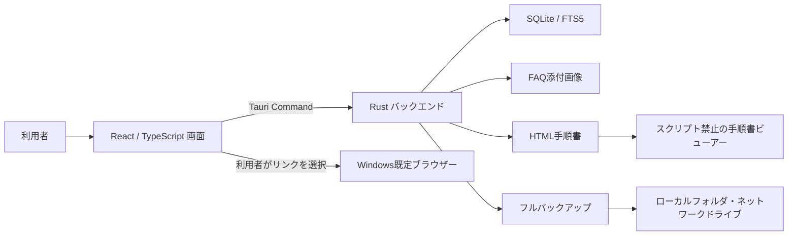
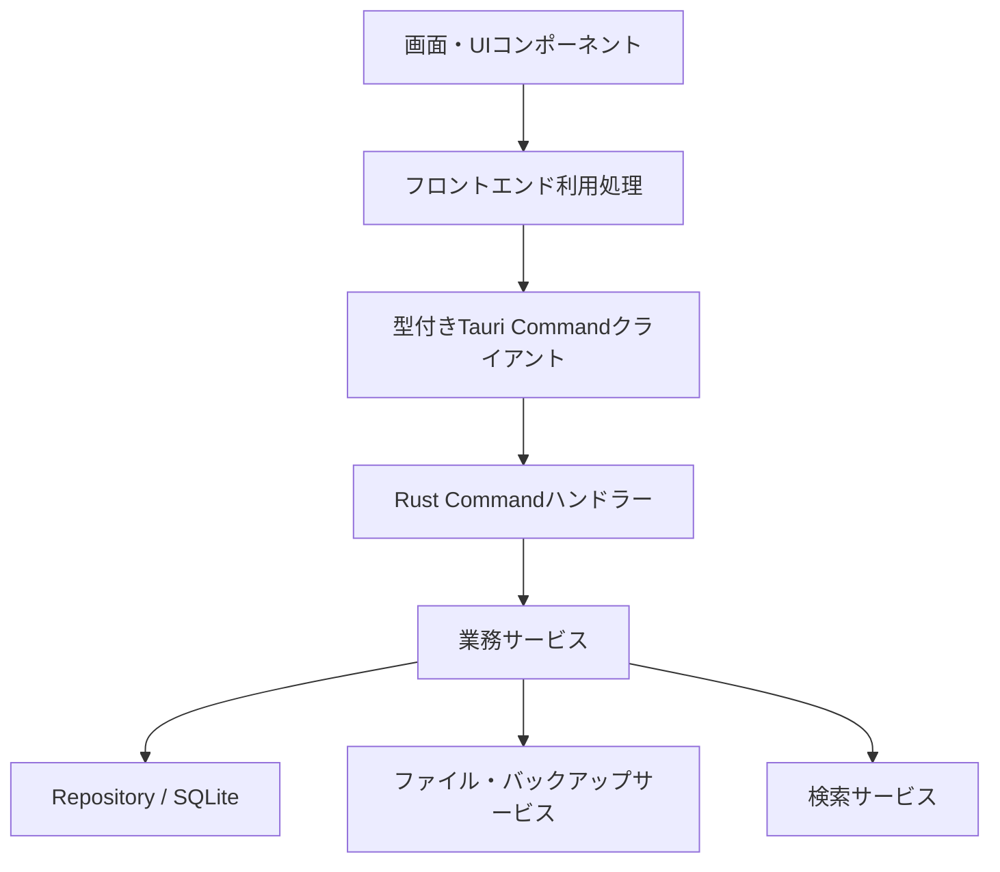
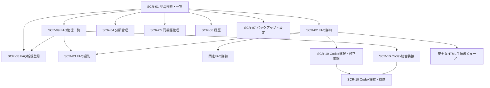
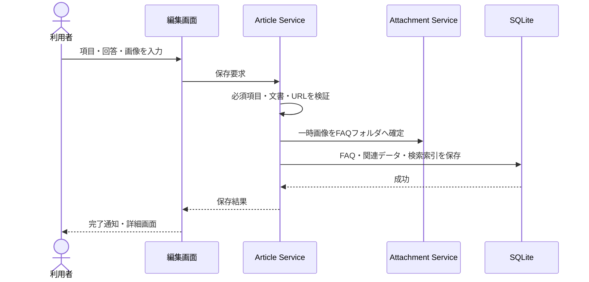
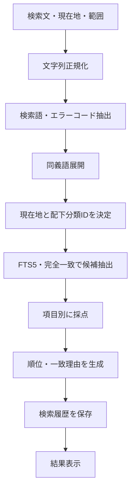
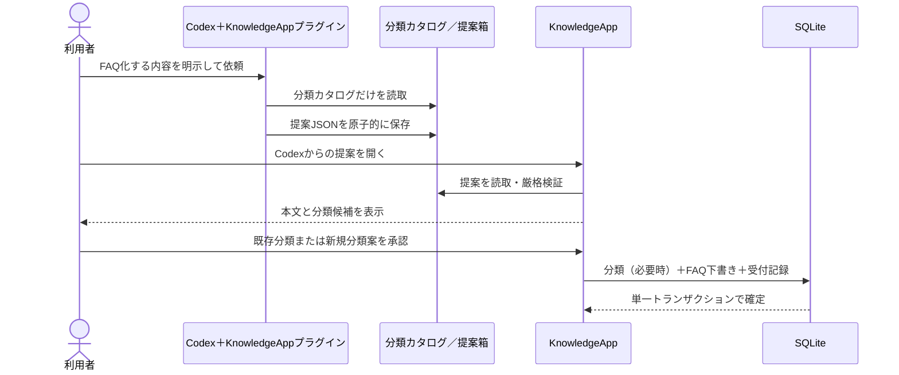
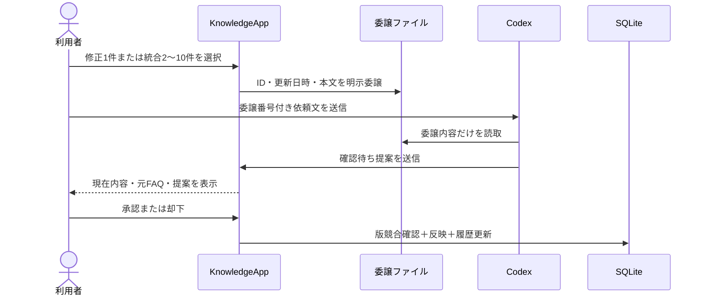
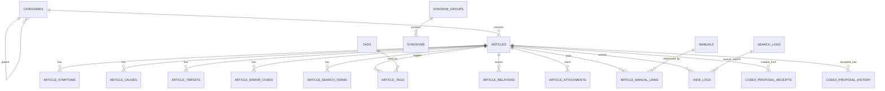

# FAQシステム基本設計書

## 1. 文書情報

| 項目 | 内容 |
|---|---|
| 文書名 | FAQシステム基本設計書 |
| 版 | 1.7（Codex FAQ標準構成実装版） |
| 作成日 | 2026-08-08 |
| 上位文書 | `FAQシステム要件定義書.md` v0.9 |
| 対象リリース | MVP（初回リリース） |
| 仮称 | KnowledgeApp（正式名称決定後に置換する） |

### 1.1 本書の目的

本書は、要件定義書で確定した内容を、画面、データ、処理、ファイル、配布、セキュリティの構成へ落とし込むものである。

本書では「何を、どの構成で実現するか」を定義する。個々の関数、SQL全文、画面部品の内部実装、テストコードなどは詳細設計・実装段階で定義する。

### 1.2 設計方針

1. Windows 11上で、コマンド操作なしに利用できることを優先する。
2. FAQ、履歴、添付ファイルを外部サービスへ自動送信せず、Codexへ渡す既存FAQは利用者が画面で明示的に選択する。
3. 一人利用のMVPを簡潔に作りつつ、将来の複数人・管理者運用へ移行できる境界を保つ。
4. 従量課金の生成AI APIをアプリへ組み込まず、定額利用のCodexへ必要な作成・修正・統合を明示的に委譲する。
5. リッチテキストやHTML手順書を扱う際も、任意スクリプトを実行しない。
6. データを実行ファイルから分離し、アプリ更新による消失を防ぐ。
7. GitHub等ではプログラムだけを管理し、実データを混入させない。
8. バックアップを利用者が理解しやすい一操作で作成できるようにする。
9. 開発で仕様・画面・データ・処理・運用を変更する場合は、実装と同じ作業内で要件定義書・基本設計書を更新する。
10. Codexが作成するFAQは、結論を先に示し、必要最小限の手順・注意・備考・参考リンクへ段階的に進む簡潔な構成とする。

### 1.3 初回実装の到達点

2026-08-08に、MVP第1段階の最初の開発単位として次を実装した。

- Tauri 2、React、TypeScript、Vite、Tiptap、Rust、SQLiteによるアプリ基盤
- `appLocalDataDir`を使用する`DataRootService`と、作業フォルダへの代替保存禁止
- 初期DBマイグレーションと、分類作成、FAQの新規・更新・一覧・詳細表示
- 下書き、公開、廃止の状態と公開必須項目のRust側検証
- 許可ノード方式のリッチテキスト検証と、クリック可能なリンクにおけるHTTP/HTTPS以外のURL拒否
- URL文字列のプレーンテキスト貼り付け、明示的な参考URL設定・解除
- FAQ保存失敗時の原因・対処表示への自動スクロール
- `.gitignore`、コミット前hook、GitHub Actions、配布物検査による利用者データ混入防止
- 任意名・任意保存先の`.faqbackup`作成、内容・SHA-256検証、復元前プレビュー、事前安全バックアップ付き復元
- バックアップ対象件数・推定サイズの表示、前回成功した保存先の再利用、同名ファイルの上書き確認
- FAQの論理削除、通常検索からの除外、削除済みFAQの分離表示と復元
- `#/manage`のFAQ管理一覧、状態・分類・削除状態・キーワードによる絞り込み、50件単位のページング
- FAQごとの新着・更新表示終了日、非表示設定、通常検索からの非表示FAQ除外
- 回答欄の通常段落をチャット欄に近い密度で表示する編集スタイル
- 分類の名称変更、親分類選択による配下ごとの移動、循環・6階層化・同一親同名の拒否、空分類の安全な削除
- FAQ本文への画像ファイル選択・クリップボード貼り付け、代替テキスト設定、再編集・詳細表示
- PNG・JPEG・WebP・GIFのファイル内容検証、画像1件10MB上限、SHA-256検証、FAQ保存時の添付確定
- 外部画像URL・Base64画像・貼り付けHTML内の外部画像拒否、添付・一時画像フォルダだけに限定した表示許可
- FAQ本文から画像を外した場合の保存成功後削除と、論理削除FAQに属する画像の保持
- 参考URLの表示文字・接続先ホスト名・完全なURLを示す確認画面と、Windows既定ブラウザーでの外部オープン
- FAQ詳細・管理一覧からの複製、下書き化、「元タイトル（コピー）」の付与、添付画像の独立コピー
- Codexへの新規FAQ作成、既存FAQ1件の推敲・修正委譲、2～10件の非破壊統合委譲
- Codex修正案の版競合検出、既存画像・分類・状態・表示設定の維持、承認後反映
- Codex提案の承認・却下履歴と、依頼系列ごとの最新却下案だけを再検討する制御
- Codex FAQ提案の結論、手順、注意、備考、参考リンクを一定順序にする標準構成

分類の並べ替え、複数値項目、関連FAQ、同義語、日本語検索、履歴画面、HTML手順書、JSON入出力は後続の開発単位で実装する。本節は進捗を示すものであり、後続機能の要件を変更するものではない。

## 2. システム概要

### 2.1 利用形態

| 項目 | 設計内容 |
|---|---|
| 開発場所 | 自宅の個人PC（Windows 11 64ビット） |
| 自宅での利用 | 生成AIの活用事例を題材に、FAQ作成・検索・編集機能をテストする。 |
| 会社での利用 | PCトラブル、PC設定、ネットワーク、プログラム修正などの会社業務FAQを利用する。 |
| MVP利用者 | 1名 |
| 配布 | GitHub等のリリースからWindowsインストーラーを取得 |
| データ保存 | Windowsの利用者別ローカルフォルダ |
| データ移行 | フルバックアップの作成と復元 |
| 通信 | 通常の検索・閲覧・手動編集・バックアップはオフライン。参考URLを既定ブラウザーで開く操作と、利用者が選択した内容のCodex明示委譲だけが外部利用を伴う。アプリ自体は生成AI API通信を行わない。 |

#### 2.1.1 FAQ内容に関する前提

- 自宅で作成されるFAQは、生成AIの活用事例を中心とする場合がある。
- 会社で作成されるFAQは、PCトラブル、PC設定、ネットワーク、プログラム修正などを中心とする場合がある。
- この違いは登録内容の例であり、アプリの機能やデータ構造を利用場所ごとに切り替える要件ではない。
- FAQ内容が生成AI中心でも、アプリを生成AI専用として設計しない。生成AI APIを組み込まない理由は従量課金費用の抑制であり、定額利用のCodexへの明示的委譲は積極的に利用する。

### 2.2 システム構成



### 2.3 採用技術

| 分類 | 採用候補 | 用途 |
|---|---|---|
| デスクトップ基盤 | Tauri 2 | Windowsアプリ化、画面とRustの橋渡し、配布 |
| フロントエンド | React＋TypeScript | 画面、分類ツリー、フォーム、状態管理 |
| ビルド | Vite | フロントエンド開発・ビルド |
| 画面ルーティング | React Routerのハッシュルーター | デスクトップ内の画面遷移 |
| リッチテキスト | Tiptap | 見出し、表、画像、リンク、箇条書き |
| バックエンド | Rust | 入力検証、DB、検索、ファイル、バックアップ |
| データベース | SQLite | FAQ、分類、履歴、設定の永続化 |
| 全文検索 | SQLite FTS5 trigram＋アプリ側順位計算 | 日本語部分一致と項目別重み付け |
| ID | UUID v7 | 端末間移行でも衝突しにくい一意ID |
| Tauri内部識別子 | `jp.local.webknowledgesystem` | 利用者データフォルダを安定して解決する固定ID |
| 配布 | Tauri NSIS・利用者単位インストーラー | 管理者権限を原則必要としない導入 |

バージョン番号は実装開始時点の安定版を採用し、依存関係のロックファイルで固定する。更新は一括して検証後に行う。

### 2.4 CodexによるFAQ作成・修正・統合支援

本アプリは、利用量に応じたAPI費用の増大を避けるためOpenAI APIキーや従量課金の生成AIモデルを組み込まず、通常検索もローカル検索で行う。一方、生成AI連携自体を避けるものではなく、利用者が定額利用するCodexへ明示的に依頼した場合は、KnowledgeApp専用プラグインを使い、新規FAQ、既存FAQの推敲・修正、複数FAQの統合案を作成できる。

| 項目 | 設計内容 |
|---|---|
| 手動作成 | 従来の「新しいFAQ」画面を維持し、利用者が一から登録・編集できる。 |
| Codexへ渡す情報 | 新規作成では会話で提供した内容と分類カタログだけを使う。既存FAQでは、利用者が画面で選択して生成した`codex-bridge/delegations/{delegationId}.knowledge-delegation.json`だけを使う。未選択FAQ、DB、履歴、添付画像本体、手順書は渡さない。 |
| Codexの出力 | 形式第2版で`create`、`revise`、`merge`を区別し、受付番号、依頼系列番号、元FAQ ID・更新日時、FAQ案、分類案を`.knowledge-proposal.json`として原子的に保存する。 |
| 利用者確認 | 「Codexからの提案」で本文と現在FAQまたは統合元を確認する。新規・統合では分類を最終選択し、修正では現在FAQとの比較後に反映する。 |
| 新規・統合反映 | 新規と統合は常に新しい下書きにする。統合元FAQは変更・廃止・削除しない。必要な新規分類1件、FAQ下書き、受付記録、履歴状態を同一トランザクションで確定する。 |
| 修正反映 | 元FAQのID・委譲時更新日時が現在DBと一致する場合だけ、タイトル、概要、回答、重要度を更新する。分類、状態、新着・更新、非表示、添付画像は維持する。 |
| 履歴 | 提案受信時にDB履歴へ保存し、承認・却下後も保持する。同じ依頼系列では最新の却下案だけ再検討可能とし、古い案は閲覧専用にする。 |
| FAQ標準構成 | 概要を原則1文の結論とし、本文は手順、明示した注意、必要な備考、参考リンクの順にする。1 FAQ 1目的、手順は原則7項目以内とし、空見出しや未確認情報を作らない。 |
| 禁止事項 | Codexから`knowledge.db`、WAL、SHMを読み書きしない。自動公開・削除、未承認の既存FAQ変更、統合元FAQの自動廃止を行わない。 |
| 重複防止 | `codex_proposal_receipts`へ受付番号と作成FAQを記録し、提案ファイルが残った場合や再送時にも二重登録しない。 |
| プラグイン | `codex-plugins/knowledgeapp-faq`にスキル、提案形式、分類カタログ取得コマンド、提案送信コマンドを配置する。通常コマンドは固定のappLocalDataDir配下だけを扱う。 |

今回の統合委譲は利用者が画面で選んだ2～10件を対象とする対話的な機能である。数十件以上の一括整理は、将来`.knowledge-export.json`の出力・検証付きインポート完成後に扱い、現在の選択式統合で代替しない。

## 3. 配置・配布設計

### 3.1 インストール方式

- 通常利用はNSIS形式の利用者単位インストーラーを採用する。
- スタートメニューとデスクトップに起動用ショートカットを作成できるようにする。
- アプリ更新時は同じインストーラーで上書き更新する。
- アンインストール時、利用者データは自動削除せず、削除する場合は明示確認を求める。
- ポータブルZIP版は試用・障害切り分け用の補助配布とし、通常運用の第一候補にはしない。
- 自動更新はMVPに含めず、リリースページから手動更新する。

### 3.2 利用者データの保存場所

標準のデータルートを次のようにする。

```text
%LOCALAPPDATA%/jp.local.webknowledgesystem/
├─ data/
│  └─ knowledge.db
├─ attachments/
│  └─ articles/
├─ manuals/
├─ logs/
├─ restore-staging/
├─ safety-backups/
├─ settings/
├─ temp/
├─ codex-bridge/
│  ├─ categories.json
│  └─ delegations/
│     └─ {delegationId}.knowledge-delegation.json
└─ codex-inbox/
   └─ {requestId}.knowledge-proposal.json
```

| フォルダ | 内容 | フルバックアップ対象 |
|---|---|---:|
| `data` | SQLiteデータベース | ○ |
| `attachments/articles` | FAQ本文へ挿入した画像 | ○ |
| `manuals` | 取り込んだHTML、CSS、ローカル画像 | ○ |
| `logs` | アプリ診断ログ | × |
| `restore-staging` | 復元中だけ使用する一時データ | × |
| `safety-backups` | 復元直前に自動作成するローカル安全バックアップ | × |
| `settings` | DB外に置く起動・表示設定 | ○ |
| `temp` | バックアップ作成・検査などの一時データ | × |
| `codex-bridge` | FAQ本文を含まない分類カタログと、利用者が明示選択したFAQだけを含む委譲ファイル。 | × |
| `codex-inbox` | 利用者が確認する前のCodex FAQ提案 | × |

インストール先やGitリポジトリには利用者データを書き込まない。通常版はRust側でTauriの`appLocalDataDir`を解決し、この固定パスだけをDB、添付、手順書、設定の基準にする。パス解決に失敗した場合、現在の作業ディレクトリへ代替保存せず起動を停止する。ポータブル版の保存方式は実装時に本方針を維持して別途定義する。

### 3.3 GitHub等で管理する範囲

管理対象：

- ソースコード
- DBマイグレーション定義
- 自動テスト
- ビルド設定
- サンプル設定
- 開発用に明示して作成したテストフィクスチャー
- `AGENTS.md`、要件定義書、基本設計書
- リリース成果物

管理対象外：

- `knowledge.db`と関連するWAL・SHMファイル
- 利用者がローカル環境で作成したFAQ、検索履歴、閲覧履歴
- 添付画像
- HTML手順書
- フルバックアップ、JSONエクスポート
- アプリ診断ログ
- 一時ファイル
- Codex提案、分類カタログ

除外設定に加え、リリース前検査で禁止ファイルや既知のデータフォルダが含まれないことを確認する。

リポジトリが公開・非公開のどちらであっても、利用者がアプリ上で作成したFAQ内容を登録しない。テストへデータが必要な場合は、ローカルFAQから転用せず、開発用フィクスチャーとして明示的に作成する。

保存先、`.gitignore`、コミット前検査、CI検査、リリース梱包の詳細は`ローカルFAQデータ・Git除外詳細設計書.md`に従う。

## 4. アプリケーション構成

### 4.1 レイヤー構成



依存方向を上から下へ限定し、画面がSQLや任意ファイルを直接操作しないようにする。

### 4.2 フロントエンドの責務

| モジュール | 主な責務 |
|---|---|
| App Shell | 共通ヘッダー、左ナビゲーション、画面遷移 |
| Search | 分類選択、検索条件、検索結果、ページング |
| Article View | FAQ詳細、関連FAQ、手順書、参考URL |
| Article Editor | 入力、リッチテキスト、画像、表、保存前検証 |
| Category Manager | 追加、名称変更、移動、並べ替え、削除 |
| Synonym Manager | 同義語グループの管理 |
| History | 検索履歴、0件検索、閲覧履歴 |
| Backup & Settings | フルバックアップ、復元、JSON入出力、リンク検査 |
| Shared UI | ボタン、ダイアログ、通知、入力部品、空表示 |

### 4.3 Rustバックエンドの責務

| サービス | 主な責務 |
|---|---|
| Category Service | 階層検証、再帰取得、移動、深さ制御 |
| Article Service | FAQ CRUD、状態変更、論理削除、複製 |
| Search Service | 正規化、同義語展開、候補取得、採点、履歴 |
| Rich Content Service | Tiptap文書検証、プレーンテキスト生成 |
| Attachment Service | 画像検査、コピー、参照、孤立判定 |
| Manual Service | 手順書取り込み、検査、安全表示、リンク切れ検査 |
| Backup Service | DBスナップショット、梱包、検証、復元 |
| Settings Service | アプリ設定の取得・保存 |
| Migration Service | DBバージョン確認と移行 |
| Log Service | 診断ログと利用者向けエラー番号の記録 |

### 4.4 ソースコード構成案

```text
KnowledgeApp/
├─ src/
│  ├─ app/
│  ├─ pages/
│  ├─ features/
│  │  ├─ search/
│  │  ├─ articles/
│  │  ├─ categories/
│  │  ├─ synonyms/
│  │  ├─ history/
│  │  └─ backup/
│  ├─ components/
│  ├─ api/
│  ├─ types/
│  └─ styles/
├─ src-tauri/
│  ├─ src/
│  │  ├─ commands/
│  │  ├─ services/
│  │  ├─ repositories/
│  │  ├─ search/
│  │  ├─ backup/
│  │  ├─ security/
│  │  └─ errors/
│  ├─ migrations/
│  └─ capabilities/
├─ tests/
├─ docs/
└─ .github/
   └─ workflows/
```

## 5. 共通画面設計

### 5.1 画面構成

```text
┌────────────────────────────────────────────────────────────┐
│ FAQナレッジ     [検索] [FAQ管理] [履歴] [設定]             │
├──────────────────┬─────────────────────────────────────────┤
│ 分類ツリー       │ 現在の画面                              │
│                  │                                         │
│ すべて           │ 検索・詳細・編集など                    │
│ ├ PC関連         │                                         │
│ │ ├ PC修理       │                                         │
│ │ └ PC設定       │                                         │
│ └ プログラム     │                                         │
├──────────────────┴─────────────────────────────────────────┤
│ 状態・エラー・バックアップ結果など                         │
└────────────────────────────────────────────────────────────┘
```

- 分類ツリーは検索・詳細画面で常時表示する。
- 編集や設定など横幅が必要な画面では、分類ツリーを折り畳める。
- 左右の境界はドラッグで幅を調整でき、設定を端末内に保存する。
- 1280×720を最小想定とし、それ以上では余白と表示件数を増やす。

### 5.2 画面遷移



画面内ルートはハッシュ形式とする。

| 画面 | ルート例 |
|---|---|
| FAQ検索 | `#/search` |
| FAQ詳細 | `#/articles/{articleId}` |
| FAQ新規 | `#/articles/new` |
| FAQ編集 | `#/articles/{articleId}/edit` |
| 分類管理 | `#/categories` |
| 同義語管理 | `#/synonyms` |
| 履歴 | `#/history` |
| バックアップ・設定 | `#/settings` |
| FAQ管理一覧 | `#/manage/articles` |
| Codex提案・履歴 | `#/codex-proposals` |

### 5.3 共通操作

- 主操作ボタンは右側、キャンセルは左側に配置する。
- 保存成功は短い通知で表示する。FAQ編集の保存失敗は、画面上部にある理由・対処の通知へ自動スクロールしてフォーカスを移す。その他の失敗は処理内容に応じて通知またはダイアログで表示する。
- 削除、復元、外部URL、バックアップ復元には確認ダイアログを表示する。
- 実行中に連続操作できない処理はボタンを無効化し、進行状況を表示する。
- `Ctrl+F`は検索欄へ移動、`Ctrl+S`は編集画面で保存、`Esc`はダイアログを閉じる。
- キーボードだけでも分類選択、検索、結果選択、保存を行えるようにする。
- 色だけで状態を伝えず、アイコンと文字を併用する。

## 6. 画面別設計

### 6.1 SCR-01 FAQ検索・一覧

#### 表示項目

| 領域 | 項目 |
|---|---|
| 分類 | 分類ツリー、現在地、配下の公開FAQ件数 |
| 検索 | 自然文入力欄、検索ボタン、検索範囲 |
| 絞り込み | タグ、更新日、重要度 |
| 結果 | 件数、並び順、FAQカード、ページング |
| FAQカード | タイトル、概要、所属階層、タグ、更新日、一致理由 |

#### 動作

1. 起動直後は仮想ルート「すべて」を現在地にする。
2. 検索範囲の初期値は「現在地以下」とする。
3. Enterまたは検索ボタンで検索を実行し、この時点で検索履歴を1件記録する。
4. 入力途中の文字ごとには履歴を記録しない。
5. 検索語が空の場合は、選択範囲内の公開かつ非表示でないFAQ一覧を更新日の降順で表示する。
6. 1ページ50件を初期値とし、前後ページへ移動できる。
7. 結果0件の場合、範囲変更、語の短縮、同義語登録への案内を表示する。
8. FAQカードを選択するとSCR-02へ移動し、検索ログIDを引き継ぐ。

分類ツリーの件数バッジは、その分類自身と配下にある公開FAQの合計とする。分類管理画面では直接所属件数と配下合計を分けて表示する。

### 6.2 SCR-02 FAQ詳細

#### 表示順

1. パンくず、状態、新着・更新・非表示フラグ、重要度、更新日
2. タイトル、概要
3. リッチテキスト形式の簡易回答
4. 症状、原因、対象、エラーコード
5. 対応手順、注意事項
6. タグ
7. HTML手順書
8. 関連FAQ
9. 編集、複製、廃止の操作

#### 動作

- 表示時に閲覧履歴を1件記録する。
- 検索結果から遷移した場合は、元の検索ログIDを閲覧履歴へ記録する。
- 参考URLはURLと接続先ホスト名を確認ダイアログに表示し、承認後に既定ブラウザーで開く。
- HTML手順書はアプリ内の専用ビューアーで開く。
- リンク切れの場合は登録パスと修正方法を表示し、FAQ本文は引き続き閲覧できる。
- 削除済みFAQへ直接遷移した場合は通常表示せず、復元可能である旨を表示する。

### 6.3 SCR-03 FAQ編集

#### 入力区分

| 区分 | 項目 |
|---|---|
| 基本情報 | タイトル、分類、概要、状態、重要度 |
| 表示設定 | 新着と表示終了日、更新と表示終了日、非表示 |
| 検索情報 | 症状、原因、対象、エラーコード、タグ、検索用語 |
| 回答 | リッチテキスト簡易回答、対応手順、注意事項 |
| 関連情報 | 関連FAQ、HTML手順書 |

#### リッチテキストのツールバー

- 見出し2・見出し3
- 太字、斜体
- 箇条書き、番号付きリスト
- 表の挿入、行列の追加・削除、セル結合
- 画像の挿入、削除、代替テキスト
- 参考URLの挿入、編集、解除
- 元に戻す、やり直す

任意HTML編集、iframe、動画埋め込み、JavaScript、外部画像の直接埋め込みは提供しない。

URLを含む文字列を通常入力または外部から貼り付けた場合、リンク書式を除去し、クリックされない通常テキストとして保持する。クリック可能にしたい文字列だけを選択して「参考URL」を設定する。「リンク解除」では表示文字列を残したままクリック機能を外す。この区別と操作方法を回答欄の直下に表示する。

回答欄の通常段落は行高1.6、段落上下余白0.3emを基準とし、Enterで段落を連続入力しても過大な空白が生じないようにする。見出し、箇条書き、表、画像には用途に応じた区切りを残す。

#### 保存ルール

| 保存方法 | 必須項目 |
|---|---|
| 下書き保存 | タイトル、所属分類 |
| 公開保存 | タイトル、所属分類、概要、簡易回答 |
| 廃止 | 既存FAQだけが対象。確認後に状態変更 |
| 削除 | 既存FAQだけが対象。確認後に論理削除 |

- `Ctrl+S`は現在選択中の状態で保存する。
- 保存時にリッチテキストを検証し、検索用プレーンテキストを生成する。
- 新着・更新をONにした場合は`YYYY-MM-DD`形式の表示終了日を必須とし、指定日当日までフラグを表示する。両方を同時設定できる。
- 非表示は状態と独立して保存し、ONのFAQは公開状態でも通常検索から除外する。直接URLとFAQ管理一覧からの閲覧・編集は許可する。
- 画像は保存前の一時領域からFAQ専用フォルダへ移動する。
- 未保存状態で画面を離れる場合は確認する。
- 保存に失敗した場合は、画面上部の通知領域へ滑らかに移動し、エラー番号、原因、次に行う操作を表示する。
- 複製時は新しいIDを発行し、状態を下書き、タイトルを「元タイトル（コピー）」とする。期限切れや意図しない表示を避けるため新着・更新終了日は解除し、非表示設定は複製元から引き継ぐ。
- 複製元の添付画像は新FAQ用にコピーし、元FAQと独立させる。

### 6.4 SCR-04 分類管理

#### 構成

- 左側：分類ツリー
- 右側：選択分類の名称、親分類、階層、表示順、FAQ件数
- 操作：子分類追加、名称変更、移動、上下移動、削除

#### 動作

- ドラッグ＆ドロップと「移動先を選択」の両方を提供する。
- 移動前に、移動後の階層と配下最深階層をプレビューする。
- 6階層以上になる移動、自分自身・子孫への移動を拒否する。
- FAQまたは子分類が残る分類は削除できない。
- 同一親の同名分類は、全角半角・英字大小を正規化した名前で重複判定する。

初回実装では、右側編集領域の「移動先を選択」による移動、名称変更、空分類削除を実装する。移動先候補は画面側で自分自身・子孫・6階層化する候補を除外し、Rust側でも再検証する。ドラッグ＆ドロップと上下並べ替えはFR-CAT-08（推奨）の後続改善として実装する。

### 6.5 SCR-05 同義語管理

#### 構成

- 左側：同義語グループ一覧と検索
- 右側：代表語、同義語一覧、追加・削除
- 操作：新規、保存、削除、JSON入出力

#### 動作

- 代表語も検索時には同義語の一つとして扱う。
- 正規化後に同じ語が同一グループ内で重複する場合は一つにまとめる。
- 別グループへの重複登録は警告し、保存前に利用者へ確認を求める。
- 保存直後から次の検索へ反映する。

### 6.6 SCR-06 履歴

タブで次を切り替える。

| タブ | 内容 |
|---|---|
| 検索履歴 | 日時、検索文、範囲、現在地、結果件数 |
| 0件検索 | 結果が0件だった検索だけを表示 |
| 閲覧履歴 | 日時、FAQタイトル、遷移元検索 |

- 履歴は期間制限なしで保存する。
- 表示期間と検索文字列で絞り込める。
- 選択期間または全履歴を削除できる。
- 削除前に件数と対象期間を表示して確認する。
- MVPでは1名利用のため権限機能を設けない。
- 将来は管理者だけが分析画面と集計データを閲覧できるようにする。

### 6.7 SCR-07 バックアップ・設定

#### フルバックアップ

- FAQ・分類・添付画像・手順書の対象件数と推定サイズ
- 「フルバックアップを作成」ボタン
- Windowsのファイル保存画面によるバックアップ名・保存先指定
- 進行状況、完了ファイル、結果

バックアップ名の初期値は`KnowledgeApp_yyyyMMdd_HHmm`とし、利用者が変更できる。拡張子は`.faqbackup`とする。前回成功した保存先は`settings/backup.json`へ記録し、次回のファイル保存画面の初期位置に使用する。

#### 復元

- Windowsのファイル選択画面によるバックアップファイル指定
- 作成日時、FAQ数、分類数、添付画像数、手順書数、データサイズのプレビュー
- ハッシュ、形式版、DB整合性の事前検査結果
- 現在状態を自動退避する旨の案内と「この内容を復元」ボタン
- 復元完了後の安全バックアップ保存場所

#### その他

- JSONエクスポート・インポート
- 既定バックアップ先
- HTML手順書リンクの一括検査
- 取り込み済み手順書の一覧、参照FAQ、管理フォルダを開く、未参照手順書の削除
- アプリ版・DB版表示
- 診断ログフォルダを開く
- 履歴削除

自動バックアップのスケジュール設定はMVPに表示しない。

### 6.8 SCR-09 FAQ管理一覧

要件定義書のSCR-08「管理者向け分析」は将来機能であるため、MVPでは画面を作成しない。SCR-09は、下書きや削除済みFAQへ安全にアクセスするため、本基本設計で追加するMVP管理画面である。

通常検索では表示しない下書き、廃止、削除済みFAQを含め、管理対象を一覧表示する。

| 領域 | 項目 |
|---|---|
| 検索 | タイトル・概要の管理用検索、所属分類 |
| 絞り込み | 状態、削除状態、タグ、更新日 |
| 一覧 | タイトル、分類、状態、新着・更新期限、非表示、更新日、外部手順書・画像の有無 |
| 操作 | 新規、編集、複製、公開、廃止、削除、復元 |

- 初期表示は削除されていない全状態のFAQを更新日降順で表示する。
- 非表示FAQも管理一覧へ表示し、「非表示」ラベルを付ける。終了日を過ぎた新着・更新設定は「期限切れ」として設定を確認できる。
- 「削除済み」を選択した場合だけ論理削除FAQを表示する。
- 一覧は50件単位でページングする。
- 削除済みFAQは復元できる。復元先分類が存在しない場合は、分類を選び直してから復元する。
- 公開操作では公開必須項目を再検証する。
- MVPでは一括削除・一括公開を提供しない。

初回実装では、キーワード・分類・状態・削除状態の絞り込み、個別編集、個別複製、個別論理削除、個別復元、ページングを実装済みとする。一覧上での直接公開・廃止変更は次のFAQ管理開発単位へ含める。

### 6.9 SCR-10 Codex提案・履歴

- 「確認待ち」と「承認・却下履歴」の2タブを持つ。
- 新規提案ではFAQ案と分類候補、統合提案では統合元一覧とFAQ案、修正提案では現在FAQと修正案を表示する。
- FAQ詳細の「Codexに推敲・修正を依頼」は対象1件の委譲番号とCodexへ送る依頼文を表示する。
- FAQ管理一覧では2～10件をチェックして統合委譲できる。委譲時に、統合元を自動変更しないことを確認画面へ表示する。
- 承認済み履歴は反映先FAQを開ける。却下済み履歴は内容を表示し、同じ依頼系列の最新案だけ「再検討へ戻す」を有効にする。
- 履歴から再検討へ戻しても受付番号は変えず、受付記録による重複反映防止を維持する。
- FAQ案のプレビューでは、概要の結論、手順、`※注意`、`■備考`、`■参考リンク`を提案本文の順序どおり表示する。色だけで注意を表現せず、見出しと文言を読み上げ・キーボード操作でも識別できるようにする。

## 7. 主要業務フロー

### 7.1 FAQ登録



FAQ本体、関連項目、添付情報、検索索引は一つのトランザクションとして扱う。ファイル確定後にDB保存が失敗した場合は、今回追加したファイルをロールバック対象として削除する。

### 7.2 分類移動

1. 移動元分類と全子孫を取得する。
2. 移動先が移動元自身または子孫でないことを確認する。
3. 移動先の深さと、移動元サブツリーの相対最大深さを計算する。
4. 移動後の最大深さが5以下であることを確認する。
5. 同一親の同名分類がないことを確認する。
6. トランザクション内で親ID、深さ、表示順を更新する。
7. 分類ツリーと検索範囲キャッシュを更新する。

### 7.3 FAQ検索



### 7.4 フルバックアップ

1. バックアップ名と保存先を検証する。
2. 保存先の書き込み可否と空き容量を確認する。
3. ローカル一時フォルダへSQLiteの整合したスナップショットを作成する。
4. 添付画像、手順書、設定を収集する。
5. ファイル一覧、サイズ、ハッシュ、バージョンを`manifest.json`へ記録する。
6. ローカルで`.faqbackup`を完成させ、内容とハッシュを検証する。
7. 保存先へ`.partial`名でコピーする。
8. コピー完了とサイズを確認後、最終ファイル名へ変更する。
9. 結果と保存場所を表示する。

ネットワーク切断時も、元データと既存バックアップを変更しない。作成途中の`.partial`は完成済みバックアップとして扱わない。

### 7.5 復元

1. 選択ファイルの形式、manifest、ハッシュ、対応バージョンを検証する。
2. 復元内容を画面に表示する。
3. 現在状態の復元前バックアップをローカルへ作成する。
4. `restore-staging`へ展開し、DB整合性と必要ファイルを検証する。
5. DB操作を排他し、検証済みDBをSQLite Backup APIでローカルDBへ反映する。
6. 添付画像、手順書、設定を退避・配置し、途中失敗時はDBと各フォルダを復元前状態へ戻す。
7. DBマイグレーションが必要なら実行する。
8. 起動確認後、完了を表示する。失敗時は復元前状態へ戻す。

### 7.6 FAQ論理削除・復元

1. FAQ詳細またはFAQ管理一覧で削除を選択し、FAQ名と復元可能であることを確認画面へ表示する。
2. 承認後、`articles.deleted_at`と`updated_at`を同一時刻で更新し、FTS検索索引から対象FAQを除外する。本文、分類、添付画像、履歴は保持する。
3. 削除済みFAQは通常検索と通常の管理一覧に表示せず、FAQ管理一覧の「削除済み」へだけ表示する。
4. 復元時は確認後に`deleted_at`をNULLへ戻し、保存済み検索文書からFTS検索索引を再生成する。
5. 削除済みFAQの編集URLへ直接遷移した場合は保存画面を表示せず、先に復元するよう案内する。

削除・復元はRust側のDBトランザクションで処理し、実ファイルとDB行を物理削除しない。

### 7.7 Codex下書き提案・取込



- `list_codex_proposals`は分類カタログを最新化し、提案箱内の通常ファイルだけを最大1MBまで読む。未知項目を含むJSON、ファイル名と受付番号が異なる提案、任意HTML・危険なリンク、新規・統合時の画像を拒否する。修正時は委譲元の画像参照集合が同一であることを確認する。
- `accept_codex_proposal`は画面で選択した既存分類、または提案された新規分類1件だけを受け取る。状態、新着・更新、非表示はCodexから受け取らず、`draft`、フラグなし、非表示OFFを固定する。
- 新規分類案は親分類の現在状態をDB内で再確認する。親削除、6階層化、同一親内の同名があれば全処理をロールバックし、現在の分類から選び直すよう案内する。
- 成功後に提案ファイルを削除する。削除に失敗しても受付記録で一覧から除外し、重複取込を防ぐ。
- 不正提案はDBへ反映せず、画面にファイル名と利用者向け理由を表示する。

#### 7.7.1 Codex FAQ本文の標準構成

1. `faq.summary`へ、利用者が最初に把握すべき結論を原則1文で記載する。前置きから始めず、正確性・安全性に必要な条件は省略しない。
2. 操作を伴うFAQでは、`faq.bodyDoc`を見出し`■手順`と番号付きリストから始める。1項目を1操作とし、手順は必要最小限かつ原則7項目以内にする。操作を伴わない場合は、架空の手順を作らず`■確認方法`または`■対応`など内容に合う見出しを使う。
3. 注意事項は関係する手順の直前または直後へ`※注意`と明記し、必要に応じて太字を併用する。現行の許可リッチテキストに文字色は含まれないため赤字を必須とせず、将来色を追加する場合も補助表現に限定する。
4. 補足情報が必要な場合だけ`■備考`を置き、短い箇条書きにする。結論・手順と同じ説明を繰り返さない。
5. 利用者が提示した、または依頼範囲で確認できた補足リンクがある場合だけ、本文の最後に`■参考リンク`を置く。各リンクへ表示名と参照目的を添え、未確認URLを推測しない。クリック可能にする場合はHTTP/HTTPSだけを使用し、それ以外は通常テキストとして扱う。

1 FAQは1つの質問・目的に限定する。原則7項目を超える手順、複数目的、複雑な画像・表を要する場合は、FAQ分割または外部HTML手順書への切り分けを利用者へ提案する。簡潔さと正確性・安全性が競合する場合は、正確性・安全性を優先する。

### 7.8 Codex既存FAQ委譲・修正・統合・履歴



- 修正委譲は1件、統合委譲は2～10件とし、削除済みFAQと重複選択を拒否する。
- 委譲ファイルは5MB以下の通常ファイルとし、FAQ ID、`sourceUpdatedAt`、分類、タイトル、概要、Tiptap本文、状態、重要度、添付のID・名称・代替文・形式だけを含む。添付画像本体とローカルパスを含めない。
- 提案受付時と承認時に、依頼系列番号が委譲番号と一致し、元FAQ集合と更新日時が一致することを検証する。
- 修正提案の画像ノードは委譲元と同じ参照集合を維持する。追加・削除・参照変更がある提案は反映しない。
- 却下時は提案を`codex_proposal_history`へ残し、提案箱ファイルだけを削除する。
- 再検討可能性は同一`series_id`内の履歴順で判定し、自身より新しい提案が1件でもあれば古い却下案を再開しない。

## 8. データベース設計

### 8.1 SQLite共通設定

| 項目 | 設計 |
|---|---|
| 文字コード | UTF-8 |
| 外部キー | `PRAGMA foreign_keys = ON` |
| ジャーナル | WAL |
| 同期待ち | `busy_timeout`を設定 |
| トランザクション | FAQ保存、分類移動、復元準備などを処理単位で実行 |
| 日時 | UTCのISO 8601文字列で保存し、画面でローカル時刻へ変換 |
| 真偽値 | 0 / 1 |
| ID | UUID v7の文字列表現 |
| DB版 | `schema_migrations`で管理 |

DBは常にローカルへ置く。SQLiteファイル自体をネットワークドライブ上で直接開かず、ネットワークドライブはバックアップ先としてのみ利用する。

### 8.2 ER構成



### 8.3 テーブル一覧

| テーブル | 目的 |
|---|---|
| `schema_migrations` | DB版と適用日時 |
| `categories` | 1～5階層の分類 |
| `articles` | FAQ本体 |
| `article_symptoms` | 症状の複数値 |
| `article_causes` | 原因の複数値 |
| `article_targets` | OS、製品、機種の複数値 |
| `article_error_codes` | エラーコード |
| `article_search_terms` | FAQ固有の検索用語 |
| `tags` | タグマスター |
| `article_tags` | FAQとタグの関連 |
| `article_relations` | 関連FAQ |
| `article_attachments` | FAQ内画像 |
| `manuals` | 管理下へ取り込んだHTML手順書 |
| `article_manual_links` | FAQとHTML手順書の関連 |
| `synonym_groups` | 同義語グループ |
| `synonyms` | グループ内の語 |
| `article_search_documents` | 検索用に結合・正規化した文書 |
| `article_search_fts` | FTS5仮想テーブル |
| `search_logs` | 検索履歴 |
| `view_logs` | 閲覧履歴 |
| `app_settings` | アプリ設定 |
| `codex_proposal_receipts` | Codex提案の重複取込防止記録 |
| `codex_proposal_history` | Codex提案の依頼系列、提案内容、承認・却下状態、判断日時 |

### 8.4 主要テーブル

#### categories

| 列 | 型 | 制約・用途 |
|---|---|---|
| `id` | TEXT | PK、UUID v7 |
| `parent_id` | TEXT | NULL可、自己参照FK、削除制限 |
| `name` | TEXT | 表示名、必須 |
| `normalized_name` | TEXT | 同一親での重複確認 |
| `description` | TEXT | 任意、500文字以内。分類カタログの判断材料 |
| `depth` | INTEGER | 1～5 |
| `sort_order` | INTEGER | 同一親内の順序 |
| `created_at` | TEXT | UTC |
| `updated_at` | TEXT | UTC |

同一親では`normalized_name`を一意にする。ルート直下のNULL親も同一グループとして扱う専用一意索引を設ける。

#### articles

| 列 | 型 | 制約・用途 |
|---|---|---|
| `id` | TEXT | PK、UUID v7 |
| `category_id` | TEXT | FK、必須、削除制限 |
| `title` | TEXT | 必須 |
| `normalized_title` | TEXT | 検索・重複確認補助 |
| `summary` | TEXT | 公開時必須 |
| `body_doc_json` | TEXT | Tiptap構造化JSON、公開時必須 |
| `body_format_version` | INTEGER | リッチテキスト文書形式版 |
| `body_plain_text` | TEXT | 検索・コピー用に自動生成 |
| `procedure_text` | TEXT | 短い対応手順 |
| `caution_text` | TEXT | 注意事項 |
| `status` | TEXT | `draft` / `published` / `archived` |
| `importance` | INTEGER | 1～3 |
| `new_badge_until` | TEXT | NULL可。新着フラグの表示終了日（ローカル日付、`YYYY-MM-DD`、指定日を含む） |
| `updated_badge_until` | TEXT | NULL可。更新フラグの表示終了日（ローカル日付、`YYYY-MM-DD`、指定日を含む） |
| `is_hidden` | INTEGER | 0/1、既定値0。1の場合は通常検索から除外 |
| `created_at` | TEXT | UTC |
| `updated_at` | TEXT | UTC |
| `deleted_at` | TEXT | NULLなら有効、値ありは論理削除 |

分類、状態、非表示、更新日時、論理削除状態に索引を設ける。DBスキーマ第2版で表示フラグ3列、第3版で分類説明と`codex_proposal_receipts`、第4版で`codex_proposal_history`を追加する。第1～3版DBおよび旧バックアップは、起動・復元時に未適用マイグレーションを順番に実行して第4版へ移行する。既存FAQは変更せず、既存分類の説明は空文字とする。

#### codex_proposal_receipts

| 列 | 型 | 制約・用途 |
|---|---|---|
| `request_id` | TEXT | PK、Codex提案の受付UUID |
| `article_id` | TEXT | 作成したFAQへのFK、削除制限 |
| `accepted_at` | TEXT | 取込日時（UTC） |

#### codex_proposal_history

| 列 | 型 | 制約・用途 |
|---|---|---|
| `history_id` | INTEGER | PK、自動採番。依頼系列内の新旧判定に使用 |
| `request_id` | TEXT | UNIQUE、Codex提案の受付UUID |
| `series_id` | TEXT | 新規依頼または委譲番号。複数提案を同じ依頼系列として関連付ける |
| `proposal_kind` | TEXT | `create` / `revise` / `merge` |
| `payload_json` | TEXT | Rust検証済みの提案内容。却下後の再確認に使用 |
| `status` | TEXT | `pending` / `accepted` / `rejected` |
| `received_at` | TEXT | 受信日時（UTC） |
| `decided_at` | TEXT | NULL可、承認・却下日時（UTC） |
| `accepted_article_id` | TEXT | NULL可、承認時の反映先FAQ FK |

#### 複数値テーブル

`article_symptoms`、`article_causes`、`article_targets`、`article_error_codes`、`article_search_terms`は共通して次を持つ。

| 列 | 型 | 用途 |
|---|---|---|
| `id` | TEXT | PK |
| `article_id` | TEXT | FK、FAQ削除に追従 |
| `value` | TEXT | 表示値 |
| `normalized_value` | TEXT | 検索・重複確認 |
| `sort_order` | INTEGER | 表示順 |

同一FAQ内の同一正規化値は重複登録しない。

#### tags / article_tags

`tags`は`id`、`name`、`normalized_name`、日時を持ち、正規化名を一意にする。`article_tags`は`article_id`と`tag_id`の複合主キーを持つ。

#### article_relations

| 列 | 型 | 用途 |
|---|---|---|
| `source_article_id` | TEXT | 関連元FAQ |
| `target_article_id` | TEXT | 関連先FAQ |
| `sort_order` | INTEGER | 表示順 |

自己参照と同じ組み合わせの重複を禁止する。画面では一方向の登録でも双方の詳細から関連を確認できるよう、取得時に両方向を検索する。

#### article_attachments

| 列 | 型 | 用途 |
|---|---|---|
| `id` | TEXT | PK、本文から参照するID |
| `article_id` | TEXT | 所有FAQ |
| `relative_path` | TEXT | データルートからの相対パス |
| `original_name` | TEXT | 選択時のファイル名 |
| `media_type` | TEXT | PNG、JPEG、WebP、GIF |
| `byte_size` | INTEGER | 上限確認 |
| `sha256` | TEXT | 重複・破損確認 |
| `alt_text` | TEXT | 代替テキスト |
| `created_at` | TEXT | UTC |

本文JSONはOS上の絶対パスを持たず、`attachmentId`を保持する。表示時にバックエンドが許可済みファイルへ解決する。

#### manuals / article_manual_links

`manuals`は取り込んだ手順書そのものを管理する。

| 列 | 型 | 用途 |
|---|---|---|
| `id` | TEXT | PK |
| `title` | TEXT | 手順書の管理名 |
| `manual_dir` | TEXT | `manuals`以下の管理フォルダ |
| `entry_path` | TEXT | 管理フォルダ内の開始HTML |
| `last_checked_at` | TEXT | 最終リンク検査 |
| `check_status` | TEXT | OK、リンク切れ、禁止要素あり |
| `created_at` | TEXT | UTC |
| `updated_at` | TEXT | UTC |

`article_manual_links`は次を持つ。

| 列 | 型 | 用途 |
|---|---|---|
| `article_id` | TEXT | FAQ ID |
| `manual_id` | TEXT | 手順書ID |
| `display_name` | TEXT | FAQ詳細でのリンク表示名 |
| `sort_order` | INTEGER | 表示順 |

同じ手順書を複数FAQから参照できる。手順書がFAQから参照中の場合は削除せず、先に関連解除を求める。

#### synonyms

`synonym_groups`は`id`、`display_name`、日時を持つ。`synonyms`は`id`、`group_id`、`term`、`normalized_term`を持ち、同一グループ内の正規化語を一意にする。

#### search_logs

| 列 | 型 | 用途 |
|---|---|---|
| `id` | TEXT | PK、検索セッションIDとして使用 |
| `query_text` | TEXT | 入力された検索文 |
| `normalized_query` | TEXT | 正規化後の検索文 |
| `scope` | TEXT | descendants / current / all |
| `category_id` | TEXT | 実行時の現在地。全体はNULL可 |
| `result_count` | INTEGER | 結果件数 |
| `created_at` | TEXT | UTC |

検索日時、結果件数、正規化検索文へ索引を設ける。

#### view_logs

| 列 | 型 | 用途 |
|---|---|---|
| `id` | TEXT | PK |
| `article_id` | TEXT | 閲覧したFAQ |
| `source_search_log_id` | TEXT | 検索から遷移した場合の検索ログ |
| `viewed_at` | TEXT | UTC |

将来の人気FAQ、検索後閲覧率、FAQ不足分析に使える原データとして保持する。

#### app_settings

キーとJSON値を保持する。既定バックアップ先、画面サイズ、分類ツリー幅などの端末設定を保存する。

### 8.5 検索索引

`article_search_documents`は、1FAQにつき1行の検索用文書を持つ。

| 列 | 内容 |
|---|---|
| `article_id` | FAQ ID |
| `title` | 正規化タイトル |
| `summary` | 正規化概要 |
| `body` | リッチテキストから抽出した本文 |
| `symptoms` | 症状の結合値 |
| `causes` | 原因の結合値 |
| `targets` | 対象の結合値 |
| `error_codes` | エラーコードの結合値 |
| `tags` | タグの結合値 |
| `search_terms` | FAQ固有検索用語の結合値 |

`article_search_fts`は上記列をFTS5 trigramで索引化する。FAQ保存と同じトランザクションで検索文書を再生成し、論理削除・廃止時は通常検索対象から外す。

外部HTML手順書の本文と外部参考サイトの本文は索引へ含めない。

## 9. 検索設計

### 9.1 正規化

検索文と検索対象へ共通して次を行う。

1. Unicode NFKC正規化
2. 英字の小文字化
3. 全角・半角空白の統一と連続空白の圧縮
4. 検索に不要な記号の区切り化
5. 長音、濁点などは原文を損なわない範囲で統一
6. エラーコード、型番、英数字列の個別抽出

原文は表示・履歴用に残し、正規化値は検索だけに使用する。

### 9.2 検索語と同義語

- 日本語はFTS5 trigramによる部分文字列候補と、空白・記号で区切れる語を併用する。
- 「の」「が」「です」など検索寄与が小さい語は、設定可能な除外語一覧で候補から外す。
- 同義語辞書に一致した語は、同じグループの語へ展開する。
- FAQ固有の検索用語は、そのFAQだけの別名として扱う。
- 3文字未満の語はtrigramだけで検索できないため、完全一致・前方一致・正規化列の部分一致を補助的に使用する。
- 展開語が多すぎる場合は上限を設け、画面へ警告を表示する。

### 9.3 階層範囲

| 範囲 | 対象分類 |
|---|---|
| 現在地以下 | 現在地＋再帰的に取得した全子孫 |
| 現在地のみ | 現在地のみ |
| すべて | 全分類。仮想ルート選択時の現在地以下と同じ |

子孫分類はSQLiteの再帰CTEで取得する。検索対象は`published`かつ`deleted_at IS NULL`のFAQだけとする。

### 9.4 採点

要件定義書の初期重みを基準とする。

| 一致 | 基本点 |
|---|---:|
| タイトル完全一致、エラーコード完全一致 | 10 |
| 症状一致、タイトル部分一致 | 8 |
| タグ、FAQ固有検索用語、対象 | 6 |
| 概要、原因 | 4 |
| 簡易回答、対応手順 | 1 |

追加ルール：

- 入力から抽出した複数語に広く一致するほど加点する。
- 原語への一致を同義語展開だけの一致より優先する。
- 完全一致を部分一致より優先する。
- 同点時は重要度、更新日時の順にする。
- FTS5の順位値は候補抽出の補助に使い、最終順位は項目別の点数で決める。

### 9.5 一致理由

検索結果には、最高得点となった一致を最大3件表示する。

例：

```text
一致：タイトル「画面が真っ黒」／症状「スタートメニューが開かない」／タグ「Windows 11」
```

同義語で一致した場合は「PC → パソコン」のように展開内容を表示できるよう、採点結果に理由コードと元語を保持する。

### 9.6 検索性能

- まず階層・状態・FTSで候補を最大500件に絞り、Rust側で最終採点する。
- 画面返却は50件単位とする。
- FAQ 10,000件で通常検索1秒以内を受入目標とする。
- 検索索引の不整合を検出した場合、設定画面から再構築できる保守機能を用意する。

## 10. リッチテキスト・添付画像設計

### 10.1 保存形式

- Tiptapの構造化JSONを正本として`articles.body_doc_json`へ保存する。
- 表示用HTMLを正本として保存しない。
- 保存時に許可ノードと属性を検証する。
- 検索用プレーンテキストを同時生成する。
- 文書形式に版番号を持たせ、将来のTiptap構成変更時に移行できるようにする。

### 10.2 許可要素

| 種別 | 許可 |
|---|---|
| 段落、改行 | ○ |
| 見出し2・3 | ○ |
| 太字、斜体 | ○ |
| 箇条書き、番号付きリスト | ○ |
| 表、行、セル、見出しセル | ○ |
| 管理済み添付画像 | ○ |
| HTTP/HTTPS参考URL | ○ |
| 任意HTML、script、iframe、object、embed | × |
| 外部画像URL、Base64画像 | × |
| 動画・音声埋め込み | × |

### 10.3 画像取り込み

1. 利用者がファイルを選択またはクリップボードから貼り付ける。
2. 拡張子だけでなくファイル内容から形式を検証する。
3. PNG、JPEG、WebP、GIF以外を拒否する。
4. 1件10MBを初期上限とし、超過時は圧縮・縮小を案内する。
5. UUIDファイル名を発行し、一時フォルダへ保存する。
6. FAQ保存時に`attachments/articles/{articleId}`へ確定する。
7. DBへ相対パス、サイズ、SHA-256、代替テキストを登録する。

画像削除時は本文から参照を外す。実ファイルの即時削除はせず、FAQ保存後に未参照であることを再確認して削除する。論理削除FAQの画像は復元のため保持する。

実装では本文JSONに端末固有の絶対パスを保存せず、画像ノードの`attachmentId`と`knowledge-attachment:{UUID}`という管理参照だけを保存する。表示時にDBの相対パスを利用者データルート配下の実ファイルへ解決する。Tauriのasset protocolは`attachments/articles`と`temp/staged-article-images`だけを読めるように限定し、DB、設定、バックアップ、その他の利用者ファイルをWebViewへ公開しない。

ファイル選択とクリップボード貼り付けはいずれもRust側でサイズ、マジックバイト、SHA-256を検査する。拡張子だけを変更したファイルは受け付けない。FAQ保存前は`temp/staged-article-images`へUUID名で置き、保存成功後に一時ファイルを削除する。画面で追加を取り消した場合も一時ファイルを削除し、異常終了等で残った一時ファイルは次回起動時に24時間経過を条件として整理する。

FAQ更新では、既存添付の相対パス・形式・サイズ・SHA-256を再確認してからDBを更新する。新規画像の確定後にDBトランザクションが失敗した場合は今回確定したファイルを削除して一時画像を維持する。本文から外れた既存画像はDB保存成功後にのみ削除するため、保存失敗で既存画像を失わない。

### 10.4 URL

- 通常テキスト内のURLらしい文字列はリンクとして解釈せず、そのまま保存・表示・検索する。通常テキストはクリックや自動実行を行わないため、文字列のスキームを理由に保存を拒否しない。
- 外部から貼り付けたHTMLのアンカーは、貼り付け時にリンク属性を外し、表示文字列を通常テキストとして保持する。
- 利用者が明示的に設定したクリック可能な参考URLは、`http://`と`https://`だけを許可する。
- `javascript:`、`data:`、`file:`、UNC、実行ファイルへの直接リンクは、クリック可能なリンクとして拒否する。リンク解除後の表示文字列は保存できる。
- ユーザー名・パスワードをURL内に含む形式は、接続先の誤認と認証情報露出を防ぐため拒否する。
- 表示時はTauri画面内へ読み込まず、確認後にWindowsの既定ブラウザーで開く。
- URL表示文字列と実際のホスト名が分かる確認画面を表示する。
- Tiptapが生成するリンク・表・番号付きリストの既定属性は、使用中の版に合わせて許可値を検証する。任意属性を無条件に許可しない。

実装ではリンクを押しても直ちに遷移せず、表示文字、接続先ホスト名、完全なURLをモーダル画面へ表示する。利用者が「既定ブラウザーで開く」を選んだ場合だけ`open_external_url`を呼び出す。Rust側でURL長、構文、ホストの存在、HTTP/HTTPSスキームを再検証した後、Tauri OpenerのRust APIへ渡す。画面側へファイルオープン権限や任意URLを直接開くplugin権限は付与しない。

## 11. HTML手順書設計

### 11.1 取り込み単位

手順書は1つの管理フォルダと、入口となるHTMLファイルを単位にする。

```text
manuals/{manualId}/
├─ index.html
├─ style.css
└─ images/
   ├─ step01.png
   └─ step02.png
```

利用者がHTMLファイルを選択した場合、その親フォルダ内の許可ファイルを走査し、件数と合計サイズを確認後にアプリ管理フォルダへコピーする。取り込み後の管理ファイルを直接更新した場合は、FAQの再登録なしで次回表示へ反映する。

### 11.2 許可ファイル

| 種類 | 取扱い |
|---|---|
| `.html` / `.htm` | 許可。表示前に安全検査 |
| `.css` | 許可。外部URL参照は禁止 |
| PNG / JPEG / WebP / GIF | 許可 |
| JavaScript | コピー・実行しない |
| SVG | MVPでは禁止 |
| iframe、動画、音声、実行ファイル | 禁止 |
| 外部CDN、外部画像、外部フォント | 読み込み禁止 |

取り込み上限は1手順書200MBを初期値とし、超過時は取り込みを停止して内容整理を案内する。

### 11.3 安全な表示

- 専用ビューアーを`iframe sandbox`相当の隔離領域で表示し、スクリプト権限を与えない。
- HTMLから`script`、イベント属性、iframe、object、embed、危険なURLを除去する。
- Content Security Policyを付与し、アプリ管理下のHTML、CSS、画像だけを許可する。
- ローカルファイルは手順書フォルダ以下だけに正規化し、`..`によるフォルダ外参照を拒否する。
- HTTP/HTTPSのアンカーリンクは自動遷移させず、確認後に既定ブラウザーで開く。
- 手順書本文はFAQ検索索引へ登録しない。

### 11.4 リンク切れ検査

次を検査する。

- 入口HTMLの存在
- HTMLから参照されるローカルCSS・画像の存在
- 禁止ファイル、禁止要素、外部リソース参照
- フォルダ外への相対参照

結果は`OK`、`警告`、`リンク切れ`で表示し、最終検査日時を記録する。

## 12. バックアップ設計

### 12.1 ファイル形式

フルバックアップは拡張子`.faqbackup`のZIP互換コンテナとする。利用者は任意名を指定できるが、Windowsで使用できない文字を拒否する。

```text
KnowledgeApp_20260808_1200.faqbackup
├─ manifest.json
├─ data/
│  └─ knowledge.db
├─ attachments/
├─ manuals/
└─ settings/
```

`manifest.json`には次を持つ。

- バックアップ形式版
- アプリ版、DB版、リッチテキスト形式版
- 作成日時
- 利用者が付けた表示名
- FAQ、分類、添付、手順書の件数
- 各ファイルの相対パス、サイズ、SHA-256
- バックアップ全体の検証情報

### 12.2 保存先

- ローカルフォルダ
- Windowsで割り当て済みのネットワークドライブ
- UNCパス

前回成功した保存先を`settings/backup.json`へ保持する。接続できない場合は保存先を選び直せるようにし、FAQの通常利用は継続できる。Gitリポジトリ配下と判定できる保存先は、実データ混入防止のため保存を拒否する。

### 12.3 DBスナップショット

稼働中のDBファイルを単純コピーせず、SQLiteのバックアップAPIまたは整合性を保証できる方式でスナップショットを作る。スナップショット作成中のFAQ更新は短時間だけ待機させ、画面へ処理中であることを表示する。

### 12.4 JSON入出力

JSONエクスポートはFAQ構造の確認・移行補助を目的とする。画像や手順書本体は含めず、相対参照とメタデータだけを含む。完全な端末移行にはフルバックアップを使用する。

Codexによる多数FAQの整理・統合では、このJSONエクスポートとインポートを正規の受け渡し経路とする。Codexが作成した候補JSONも、画面から作成したデータと同じRust側検証、事前プレビュー、トランザクション、ロールバックを通す。CodexからSQLite DBを直接変更する経路や、検証を省略する専用コマンドは設けない。

インポート時は次を行う。

- 形式版と必須項目の検証
- ID衝突の検出
- 追加、更新、スキップ件数の事前表示
- トランザクション内での反映
- 失敗時の全体ロールバック

### 12.5 自動バックアップ

自動実行、頻度、保持世代、古いバックアップの削除は将来機能とし、MVPでは実装しない。

## 13. セキュリティ設計

| リスク | 対策 |
|---|---|
| リッチテキストによるスクリプト実行 | 許可ノード方式、構造化JSON、表示時検証 |
| HTML手順書のJavaScript | 要素除去、sandbox、CSP、JSファイル禁止 |
| パストラバーサル | Rust側で正規化し、管理ルート配下であることを確認 |
| 危険な外部URL | HTTP/HTTPS限定、確認後に既定ブラウザーで開く |
| SQLインジェクション | パラメーター化SQL、フロントエンドから任意SQLを受け取らない |
| 任意ファイルアクセス | Tauri capabilityを最小化し、Rust側コマンドで対象を制限 |
| GitHubへのローカルFAQデータ混入 | 利用者データをリポジトリ外へ保存し、`.gitignore`、禁止ファイル検査、リリース前確認を行う。 |
| バックアップ破損 | ローカル完成後コピー、ハッシュ、`.partial`運用 |
| ネットワークドライブ切断 | 元データを変更せず失敗終了、再試行案内 |
| 機密情報の診断ログ混入 | FAQ本文・検索文を通常ログへ出さない |
| Codex等の外部支援へ渡すFAQの過剰提供 | 新規作成は会話入力、既存FAQは画面で選択した1～10件の委譲ファイルだけを対象にする。DB、履歴、未選択FAQ、添付画像本体を含めない。 |
| 外部ツールによるDB不整合 | SQLite DBの直接編集を禁止し、検証・プレビュー・バックアップ・トランザクションを備えたJSONインポートだけを統合経路にする。 |
| 不正なCodex提案 | 固定拡張子の通常ファイルだけを1MB上限で読み、厳格JSON、UUID、文字数、許可Tiptapノード、HTTP/HTTPSリンクをRust側で検証する。新規・統合は画像なし、修正は委譲元と同じ画像参照集合に限定する。 |
| Codex提案の分類が古い | 画面には現在の分類を表示し、取込時に親分類、深さ、同名、所属先存在をDBトランザクション内で再確認する。 |
| 同一提案の再取込 | 受付UUIDを`codex_proposal_receipts`の主キーとして保存し、ファイル削除失敗や再送時にも重複登録を拒否する。 |
| 古い修正案による上書き | 委譲時の`sourceUpdatedAt`と現在FAQの`updated_at`を同一トランザクション内で比較し、不一致なら再委譲を要求する。 |
| 古い却下案の誤承認 | 依頼系列ごとの履歴順をDBで判定し、最新の却下案だけ再検討へ戻す。受付UUIDによる重複反映防止も併用する。 |
| 統合による元FAQ消失 | 統合案は新規下書きとして保存し、元FAQの更新・廃止・削除を同時実行しない。 |

### 13.1 Tauri権限

- 画面へ公開するコマンドを機能単位で列挙する。
- フロントエンドへ汎用シェル実行、任意SQL、無制限ファイル操作を公開しない。
- 通常アクセスは利用者別アプリデータフォルダへ限定する。
- バックアップ先は利用者がファイル選択画面で選んだ場所だけを処理対象にする。
- バックアップ画面にはTauri dialogの`open`・`save`だけを許可し、汎用ファイルシステム権限は付与しない。選択後のパス、拡張子、ファイル名、Gitリポジトリ配下判定はRust側でも再検証する。
- URLオープンはHTTP/HTTPSの検証済み文字列だけを渡す。

### 13.2 通信

アプリ自身はFAQ検索・編集・履歴・バックアップのためのHTTP通信を行わない。参考URLを開く操作はWindows既定ブラウザーへ委譲するため、遷移後の通信はブラウザー側の管理となる。

## 14. バックエンド公開処理

画面へ公開する主なTauri Commandを次の粒度とする。名前と型は詳細設計で確定する。

| 分類 | コマンド例 | 概要 |
|---|---|---|
| 分類 | `get_category_tree` | ツリーと件数取得 |
| 分類 | `create_category` | 子分類作成 |
| 分類 | `update_category` | 名称・順序変更 |
| 分類 | `move_category` | 深さ検証付き移動 |
| 分類 | `delete_category` | 空分類削除 |
| FAQ | `get_article` | 詳細取得 |
| FAQ | `list_articles_for_management` | 下書き・廃止・削除済みを含む管理一覧 |
| FAQ | `save_article` | 新規・更新保存 |
| FAQ | `duplicate_article` | FAQと画像の複製 |
| FAQ | `change_article_status` | 公開・廃止変更 |
| FAQ | `delete_article` / `restore_article` | 論理削除・復元 |
| 検索 | `search_articles` | 階層・自然文検索 |
| 添付 | `stage_article_image` / `stage_article_image_bytes` | 選択画像・貼り付け画像の検証と一時保存 |
| 添付 | `discard_staged_article_image` | 追加取消・画面離脱時の一時画像削除 |
| 参考URL | `open_external_url` | HTTP/HTTPS再検証後に既定ブラウザーへ委譲 |
| 手順書 | `import_manual` | 手順書取り込み |
| 手順書 | `list_manuals` / `delete_manual` | 手順書一覧と未参照手順書の削除 |
| 手順書 | `check_manual_links` | 個別・一括検査 |
| 手順書 | `get_manual_view` | 安全化した表示内容取得 |
| 同義語 | `list_synonym_groups` / `save_synonym_group` | 同義語管理 |
| 履歴 | `list_search_logs` / `list_view_logs` | 履歴取得 |
| 履歴 | `delete_history` | 期間・全件削除 |
| バックアップ | `create_full_backup` | 任意名の完全バックアップ |
| バックアップ | `get_backup_overview` | 対象件数、推定サイズ、前回保存先 |
| バックアップ | `inspect_backup` | 復元前情報取得 |
| バックアップ | `restore_backup` | 事前退避付き復元 |
| 入出力 | `export_json` / `import_json` | JSON移行 |
| 設定 | `get_settings` / `save_settings` | 設定管理 |
| 保守 | `rebuild_search_index` | 検索索引再構築 |
| Codex | `create_codex_delegation` | 修正1件・統合2～10件の明示委譲ファイル作成 |
| Codex | `list_codex_proposals` | 確認待ち提案、承認・却下履歴、形式エラー取得 |
| Codex | `accept_codex_proposal` | 新規・修正・統合案の版検証付き反映 |
| Codex | `reject_codex_proposal` | 提案を却下し履歴へ保持 |
| Codex | `reopen_rejected_codex_proposal` | 同一依頼系列の最新却下案を再検討へ戻す |

全コマンドは入力値をRust側でも検証し、成功データまたは共通形式のエラーを返す。

## 15. エラー・ログ設計

### 15.1 利用者向けエラー

```text
エラー番号：BK-003
内容：指定したバックアップ先へ書き込めませんでした。
対処：ネットワーク接続と保存先の権限を確認するか、別の保存先を選択してください。
```

| 接頭辞 | 分類 |
|---|---|
| `CAT` | 分類 |
| `ART` | FAQ |
| `SRCH` | 検索 |
| `ATT` | 添付画像 |
| `MAN` | HTML手順書 |
| `BK` | バックアップ・復元 |
| `DB` | DB・移行 |
| `CDX` | Codex提案・分類カタログ |
| `SYS` | 起動・予期しないエラー |

FAQ保存エラーでは、保存要求の失敗後に画面上部のエラー領域へ自動スクロールし、通知領域へフォーカスを移す。エラー領域には、エラー番号、利用者が理解できる原因、再保存するための具体的な対処を表示する。クリック可能なURLの形式が不正な場合は、HTTP/HTTPSへ修正する方法と、リンク解除して通常テキストとして残す方法を案内する。

### 15.2 診断ログ

- 日時、アプリ版、エラー番号、処理名、技術的原因を記録する。
- FAQ本文、リッチテキスト、検索文、URL全文、ファイル内容を原則記録しない。
- ファイルパスは必要な場合もデータルートからの相対表現へ置き換える。
- ログは1ファイル10MB、最大5世代を初期値とする。
- 設定画面からログフォルダを開ける。

検索履歴・閲覧履歴は診断ログではなくDB内の業務データとして扱い、フルバックアップへ含める。

## 16. 起動・終了設計

### 16.1 初回起動

1. データルートを作成する。
2. DBがなければ新規作成し、全マイグレーションを適用する。
3. FAQ・分類が空の初期状態を作り、最初の分類とFAQを登録する案内を表示する。サンプルFAQは自動登録しない。
4. 保存禁止情報とバックアップに関する案内を表示する。
5. FAQ検索画面を開く。

### 16.2 通常起動

1. 単一起動制御により、同一データルートを複数プロセスで同時編集しない。
2. DB版を確認する。
3. 移行が必要なら事前バックアップを作成後に適用する。
4. DB整合性の簡易確認を行う。
5. 現在の分類からCodex用分類カタログを再生成する。生成できない場合は起動を失敗させ、リポジトリや作業フォルダへ代替保存しない。
6. 前回の画面サイズ、分類ツリー幅、既定バックアップ先を復元する。

### 16.3 終了

- 未保存FAQがある場合は保存・破棄・終了取消を選択させる。
- 実行中のバックアップ・復元中は終了を止める。
- 一時画像を安全に整理する。
- 自動バックアップは行わない。

## 17. 性能・データ量設計

| 項目 | 想定・目標 |
|---|---|
| FAQ | 10,000件 |
| 分類 | 1,000件、最大5階層 |
| タグ | 5,000件 |
| 検索・閲覧履歴 | 期間無制限。100万件を超える場合は将来再評価 |
| 通常検索 | 原則1秒以内 |
| FAQ詳細 | 原則0.5秒以内 |
| 一覧 | 50件単位 |
| FAQ画像 | 1件10MB以下、FAQ全体上限は試験後調整 |
| HTML手順書 | 1手順書200MB以下を初期値 |

- 分類ツリーと件数は起動後にキャッシュし、分類・FAQ変更時に差分更新する。
- 履歴画面は期間・件数でページングし、全件を一度に読み込まない。
- 長時間処理はRust側で実行し、画面へ進行状況を通知する。
- DBのVACUUMや検索索引再構築は利用者が保守操作として実行できるようにするが、MVPの通常画面では目立たせない。

## 18. テスト方針

### 18.1 自動テスト

| 種類 | 対象 |
|---|---|
| TypeScript単体 | 入力整形、画面状態、表示分岐 |
| React部品 | 検索条件、エディター、確認ダイアログ、Codex提案・分類選択 |
| Rust単体 | 正規化、採点、パス検証、バックアップ名、Codex提案形式検証 |
| DB統合 | 階層移動、5階層制限、CRUD、索引、履歴、Codex重複取込防止 |
| ファイル統合 | 画像、手順書、バックアップ、復元、分類カタログ、提案箱 |
| Codexプラグイン | マニフェスト・スキル検証、固定分類カタログ取得、提案の原子的送信 |
| 画面結合 | 登録→検索→閲覧→編集→バックアップ、Codex提案→確認→下書き編集 |

### 18.2 重点テスト

- 5階層目への追加成功と6階層目の拒否
- 子孫への分類移動拒否
- 現在地以下・現在地のみ・全体検索の境界
- 「PC」「パソコン」など同義語検索
- 日本語自然文とエラーコードの順位
- 下書き・廃止・論理削除FAQの除外
- 非表示FAQの通常検索除外と管理一覧・直接表示、表示終了日当日の境界
- DB第1～3版から第4版への起動時移行と、旧バックアップ復元後の移行
- 表・画像・参考URLの保存と再編集
- 危険なURL・貼り付けHTML・手順書JavaScriptの拒否
- リンク切れ検査
- ネットワーク切断中のバックアップ失敗
- バックアップ改ざん・破損検出
- 別PCへのバックアップ復元
- アプリ更新後のデータ保持
- GitHubリリースへの実データ混入防止
- 利用者がローカル環境で作成したFAQデータがリポジトリやリリースへ含まれないこと
- Codex提案の未知項目、1MB超過、新規・統合時の画像、修正時の画像参照変更、危険なリンク、受付番号不一致を拒否し、DBを変更しないこと
- 新規分類案の親削除、6階層化、同名競合で分類とFAQの両方をロールバックすること
- 同一受付番号を再送してもFAQを二重登録しないこと
- 分類カタログにFAQ本文、FAQ件数、履歴、添付、手順書が含まれないこと
- Codexが作成するFAQで、概要の結論1文、手順、`※注意`、`■備考`、末尾の`■参考リンク`という構成が守られ、不要な空見出しや未確認情報が含まれないこと

## 19. リリース設計

### 19.1 バージョン

アプリはセマンティックバージョニングを使用する。

```text
MAJOR.MINOR.PATCH
例：0.2.0（Codex委譲・提案履歴を含むプロトタイプ）
```

- MAJOR：互換性に影響する大変更
- MINOR：後方互換の機能追加
- PATCH：不具合修正

DBスキーマ版とバックアップ形式版はアプリ版とは別に管理する。

### 19.2 リリース手順

1. 自動テストと型検査を実行する。
2. 禁止ファイル・機密情報の混入検査を行う。
3. Windows 11 64ビットでリリースビルドを作成する。
4. NSISインストーラーを作成する。
5. 新規インストール、上書き更新、アンインストールを確認する。
6. バックアップ・復元を検証用データで確認する。
7. 変更内容と既知の問題を添えてGitHub等へリリースする。

コード署名は会社での本格配布前に要否を確認し、必要ならリリース工程へ追加する。

### 19.3 設計書の更新

- 開発着手時に`AGENTS.md`、要件定義書、基本設計書を確認する。
- 利用者要求や対象範囲が変わる場合は要件定義書を更新する。
- 画面、データ、DB、検索、ファイル、バックアップ、セキュリティ、配布、運用の設計が変わる場合は基本設計書を更新する。
- 変更が両方に影響する場合は、実装と同じ作業内で両文書を更新する。
- 実装が設計から外れる場合は、理由と影響を文書へ反映し、文書と実装の不一致を残さない。
- 外部仕様に影響しない修正でも、完了前に文書への影響がないことを確認し、作業報告へ記載する。

## 20. 将来拡張の境界

MVPでは次を実装しないが、移行しやすいようにデータ・処理を分離する。

| 将来機能 | MVPで準備すること |
|---|---|
| 管理者・一般利用者 | 履歴・分析処理を画面から分離する |
| 複数人利用 | UIとRepositoryを分離し、SQLite固有処理を閉じ込める |
| 人気FAQ | `view_logs`を保存する |
| FAQ不足分析 | `search_logs`と結果件数を保存する |
| 検索後の行動分析 | `source_search_log_id`を閲覧履歴へ保存する |
| 解決率 | FAQと検索セッションの識別子を維持する |
| 自動バックアップ | Backup Serviceを手動実行から独立させる |
| 共有DB | Repository層を介してDBへアクセスする |

従量課金費用を抑えるため生成AI APIはアプリへ組み込まない。ローカル生成AIモデルも配布サイズ、端末性能、会社PCへの導入・保守負荷を増やすためMVPの対象外とするが、生成AI連携自体を避ける方針ではない。定額利用のCodexによる新規FAQ、既存FAQの修正、選択式統合は専用プラグイン、明示委譲ファイル、確認待ち提案箱で実装する。多数FAQの一括整理はJSONエクスポート・インポート完成後の別機能とする。

## 21. 設計決定事項

| ID | 決定 | 理由 |
|---|---|---|
| BD-01 | Tauri 2のインストーラー版を通常配布とする。 | 操作性、更新、ショートカット、データ分離を管理しやすい。 |
| BD-02 | React＋TypeScriptを使用する。 | 状態の多い画面を部品化し、型検査で保守しやすい。 |
| BD-03 | DB・ファイル処理をRust側へ集約する。 | 入力・パス・権限の境界を一か所に置ける。 |
| BD-04 | リッチテキストはTiptap JSONを正本とする。 | 任意HTMLより検証と将来移行がしやすい。 |
| BD-05 | FAQ画像はDBへ埋め込まず、管理ファイルにする。 | DB肥大化を避け、バックアップと画像処理を分離できる。 |
| BD-06 | HTML手順書は管理フォルダへ取り込む。 | 相対画像、バックアップ、リンク検査を一貫して扱える。 |
| BD-07 | SQLite DBはローカルだけで使用する。 | ネットワーク共有による破損・ロック問題を避ける。 |
| BD-08 | フルバックアップは`.faqbackup`とする。 | 利用者が通常ZIPやJSONと区別しやすい。 |
| BD-09 | 履歴を無期限保持し、手動削除可能とする。 | 将来のFAQ改善分析に利用する。 |
| BD-10 | 外部HTML本文を検索しない。 | 確定要件であり、検索索引と安全検査を簡潔に保てる。 |
| BD-11 | 実装変更時に要件定義書・基本設計書を同じ作業内で更新する。 | 文書と実装の食い違いを防ぎ、後続開発の判断基準を維持する。 |
| BD-12 | Tauri内部識別子を`jp.local.webknowledgesystem`へ固定する。 | 表示名変更後も利用者データの保存先を変えない。 |
| BD-13 | リポジトリ外保存、`.gitignore`、コミット前・CI検査、リリース許可リストの4層でFAQデータを保護する。 | 単一の除外設定だけに依存せず、GitHubへの混入を防ぐ。 |
| BD-14 | Codexによる多数FAQの整理・統合は、リポジトリ外のJSONエクスポートと検証付きインポートを介して行い、SQLite DBを直接編集しない。 | 生成AIをアプリへ組み込まずに保守支援を利用しつつ、入力検証、検索索引、関連データ、バックアップ、Git除外の整合性を維持する。 |
| BD-15 | Codexによる新規FAQ作成は、分類カタログ、KnowledgeApp専用プラグイン、確認待ち提案箱、アプリ上の利用者承認を介し、常に新規下書きとして登録する。 | 手動作成を維持しながら作成負担を減らし、CodexのDB直接変更、自動公開、既存FAQ変更を防ぐ。 |
| BD-16 | Codexの新規分類案は最大1件とし、利用者承認後にFAQ下書きと同一トランザクションで作成する。 | 分類階層を重要な利用者判断として残し、途中失敗による空分類や不整合を防ぐ。 |
| BD-17 | 生成AI APIをアプリへ組み込まず、定額利用のCodexへ明示委譲する。 | 従量課金による費用増大を避けながら、生成AIの作成・校正能力を活用する。 |
| BD-18 | 既存FAQ修正は1件の委譲と版競合確認後に反映し、統合は2～10件から新規下書きを作成する。 | 古い案の上書きと統合元FAQのデータ消失を防ぐ。 |
| BD-19 | Codex提案をDB履歴へ保存し、同一依頼系列では最新の却下案だけ再検討可能とする。 | 誤却下から回復しつつ、古い案の取り違えと状態分岐の複雑化を抑える。 |
| BD-20 | Codex FAQ提案は、概要の結論、手順、注意、必要な備考、参考リンクの標準順序で作成する。 | 利用者が最初に答えを把握し、情報量を増やしすぎず安全に作業できるようにする。 |

## 22. 詳細設計へ引き継ぐ事項

1. 正式な表示名、アイコン、配色
2. 各画面のピクセル単位レイアウトと部品仕様
3. Tauri Commandの正確な入出力型
4. SQLiteのDDL、トリガー、索引、マイグレーションSQL
5. FTS5候補抽出SQLと最終採点式
6. Tiptapの具体的な拡張構成と文書JSONスキーマ
7. HTML・CSSの安全化ライブラリとCSP詳細
8. `.faqbackup` manifestのJSON Schema
9. GitHub Actionsとリリース作業の具体的手順
10. FAQ画像・手順書容量上限のプロトタイプ試験結果による調整
11. 会社配布時のGitHub公開範囲とコード署名要否

## 23. 要件との対応

| 要件定義書の区分 | 本書の主な対応箇所 |
|---|---|
| FR-CAT 分類階層 | 6.4、7.2、8.2～8.4 |
| FR-FAQ FAQ管理 | 6.2～6.3、7.1、7.7～7.8、8.3～8.4、10 |
| FR-SRCH 検索 | 6.1、7.3、8.5、9 |
| FR-SYN 同義語 | 6.5、8.3～8.4、9.2 |
| FR-VIEW FAQ詳細 | 6.2、10、11 |
| FR-MAN HTML手順書 | 6.2、7.1、8.4、11 |
| FR-EDIT 編集 | 6.3、10 |
| FR-LOG 履歴・分析 | 6.6、8.3～8.4、20 |
| FR-BK バックアップ | 6.7、7.4～7.5、12 |
| NFR-USE 操作性 | 5、6 |
| NFR-PERF 性能 | 9.6、17 |
| NFR-DATA データ保護 | 3.2、7、8、12、16 |
| NFR-SEC セキュリティ | 3.3、10.4、11.3、13 |
| NFR-MNT 保守性 | 4、8.1、18、19、20、21 |

## 24. 参照資料

- `AGENTS.md`
- `FAQシステム要件定義書.md` v0.9
- `ローカルFAQデータ・Git除外詳細設計書.md` v0.10
- [Tauri 2：Windowsの事前準備](https://v2.tauri.app/start/prerequisites/)
- [Tauri 2：Windowsインストーラー](https://v2.tauri.app/distribute/windows-installer/)
- [Tauri 2：ファイルシステムとアクセス権限](https://v2.tauri.app/plugin/file-system/)
- [Tiptap：Reactへの導入](https://tiptap.dev/docs/editor/getting-started/install/react)
- [Tiptap：表](https://tiptap.dev/docs/editor/extensions/nodes/table)
- [Tiptap：画像](https://tiptap.dev/docs/editor/extensions/nodes/image)
- [SQLite：FTS5とtrigram tokenizer](https://www.sqlite.org/fts5.html)
- [OpenAI Docs：Codex use cases](https://developers.openai.com/codex/use-cases)
- [OpenAI Developers：Plugin concepts](https://developers.openai.com/plugins/concepts/plugins)
