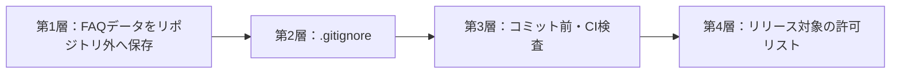

# ローカルFAQデータ・Git除外詳細設計書

## 1. 文書情報

| 項目 | 内容 |
|---|---|
| 文書名 | ローカルFAQデータ・Git除外詳細設計書 |
| 版 | 0.3（フルバックアップ保存・復元反映版） |
| 作成日 | 2026-08-08 |
| 上位文書 | `FAQシステム要件定義書.md` v0.5、`FAQシステム基本設計書.md` v0.7 |
| 対象 | 利用者が作成したFAQデータをGitHub等へ含めないための保存・検査設計 |

## 2. 目的

利用者がアプリ上で作成したFAQ、履歴、添付画像、HTML手順書、バックアップなどを、ソースコードのGitリポジトリやGitHub等のリリースへ混入させない。

FAQの題材が生成AI活用事例、PCトラブル、その他の内容であるかにかかわらず、同じ保護を適用する。本設計はFAQの題材を制限するものではない。

## 3. 結論

次の4層で保護する。



| 層 | 役割 | 位置づけ |
|---|---|---|
| 第1層 | Tauriの利用者別ローカルデータフォルダへ保存する | 主対策 |
| 第2層 | 誤ってリポジトリ内へ生成されたファイルをGitから除外する | 補助対策 |
| 第3層 | 強制追加や既追跡ファイルをコミット前・CIで検出する | 必須の最終検査 |
| 第4層 | インストーラーへ含めるファイルを明示的に限定する | 配布時の対策 |

`.gitignore`だけには依存しない。Gitの除外規則は未追跡ファイルを対象とし、すでに追跡されたファイルや`git add -f`による強制追加を防げないためである。

## 4. 固定する識別子

### 4.1 Tauri bundle identifier

内部識別子を次で固定する。

```text
jp.local.webknowledgesystem
```

- `tauri.conf.json`の`identifier`へ設定する。
- 画面上の正式名称が後で変わっても、内部識別子は変更しない。
- 識別子を変更するとTauriが解決する利用者データパスが変わるため、初回データ保存後の変更は禁止する。

### 4.2 Windows上のデータルート

Tauriの`appLocalDataDir`は、Windowsのローカルアプリデータフォルダとbundle identifierからアプリ専用パスを解決する。

想定パス：

```text
C:\Users\{Windowsユーザー}\AppData\Local\jp.local.webknowledgesystem\
```

実装ではパス文字列を組み立てず、Rust側でTauriのパス解決APIを使用する。

## 5. データ保存設計

### 5.1 データルート構成

```text
{appLocalDataDir}/
├─ data/
│  ├─ knowledge.db
│  ├─ knowledge.db-wal
│  └─ knowledge.db-shm
├─ attachments/
│  └─ articles/
├─ manuals/
├─ logs/
├─ restore-staging/
├─ safety-backups/
├─ settings/
└─ temp/
```

| ディレクトリ | 内容 |
|---|---|
| `data` | SQLite DBとジャーナル |
| `attachments/articles` | FAQ本文へ挿入した画像 |
| `manuals` | 取り込んだHTML手順書、CSS、画像 |
| `logs` | 診断ログ |
| `restore-staging` | 復元中の一時展開 |
| `safety-backups` | 復元直前に自動作成するローカル安全バックアップ |
| `settings` | DB外の端末設定 |
| `temp` | FAQ保存前の一時画像など |

### 5.2 禁止する保存先

通常実行、開発実行のどちらでも、次にはFAQデータを書き込まない。

- 現在の作業ディレクトリ
- Gitリポジトリのルートと配下
- `src`、`src-tauri`、`public`、`tests`、`docs`
- 実行ファイルの配置フォルダ
- Tauriのリソースフォルダ

### 5.3 データルート解決処理

Rustバックエンドに`DataRootService`を置き、アプリ起動時に一度だけ解決する。

処理順：

1. Tauriの`app.path().app_local_data_dir()`相当でパスを取得する。
2. 必要なディレクトリをRust側で作成する。
3. 作成後の絶対パスを正規化する。
4. データルートがリポジトリ、実行ファイル、リソースフォルダの配下ではないことを確認する。
5. 書き込み・読み取りの簡易確認を行う。
6. 成功したパスをアプリ状態へ保持し、Repository、添付、手順書、ログサービスへ渡す。

パス解決または検証に失敗した場合は起動を中止し、FAQデータを`./data`などへ代替保存しない。失敗時のフォールバックを現在の作業ディレクトリに置かないことが重要である。

### 5.4 フロントエンドとの境界

- React側へデータルートの書き込み権限を直接与えない。
- React側からDB絶対パスや保存先パスを指定させない。
- DB、画像、手順書への操作は型付きTauri Commandを通してRust側で行う。
- 画面へパスを表示する必要がある場合は、診断目的の読み取り専用情報として返す。
- 任意SQL、任意ファイル書き込み、任意フォルダ削除の汎用コマンドを公開しない。

### 5.5 自動テスト

- 自動テストではOSの一時ディレクトリにテスト専用データルートを作る。
- テスト用データルートは依存注入で`DataRootService`へ渡し、本番コードの保存先決定ロジックを上書きしない。
- テスト終了時に一時ディレクトリを破棄する。
- テスト用DBや添付ファイルをリポジトリへ書き出さない。

## 6. `.gitignore`設計

### 6.1 配置

リポジトリルートの`.gitignore`をGitで管理し、すべての開発環境へ同じ除外規則を配布する。

### 6.2 除外対象

| 分類 | 主なパターン |
|---|---|
| ルート直下の誤生成データ | `/data/`、`/attachments/`、`/manuals/`、`/backup/`、`/exports/`、`/logs/` |
| SQLite | `*.db`、`*.db-*`、`*.sqlite*` |
| フルバックアップ | `*.faqbackup`、`*.faqbackup.*` |
| JSONエクスポート | `*.knowledge-export.json` |
| 作成途中・復元退避 | `*.partial`、`/restore-staging/`、`/safety-backups/`、`/tmp/` |
| ローカル設定 | `.env`、`.env.*`、`/settings/local/` |
| ビルド成果物 | `/node_modules/`、`/dist/`、`/src-tauri/target/` |
| ローカル検討資料 | `/2026.08.08_ChatGPTとの会話.txt` |

`package.json`、`tsconfig.json`、Tauri設定、マイグレーション、設計書など、開発に必要なJSON・SQL・文書は除外しない。そのため、すべての`*.json`や`*.sql`を一括除外しない。

### 6.3 JSONエクスポートの拡張子

利用者が作成するJSONエクスポートは、表示名を自由入力できても、最終的なファイル名を次の形式にする。

```text
{任意名}.knowledge-export.json
```

これにより、通常のソースJSONと区別し、`.gitignore`と検査スクリプトの両方で確実に検出する。

### 6.4 注意事項

- `.gitignore`は未追跡ファイルを無視する仕組みであり、すでに追跡中のファイルには効かない。
- `.gitignore`へ追加する前に追跡されたデータは、Gitのインデックスから明示的に外す必要がある。
- `git add -f`は除外規則を上書きできるため、コミット前・CI検査を必須とする。

## 7. コミット前検査

### 7.1 検査スクリプト

実装開始時に次を作成する。

```text
scripts/check-no-runtime-data.ps1
```

スクリプトは次を検査する。

1. Gitで追跡中の全ファイル
2. コミット対象としてステージされた追加・変更ファイル
3. 禁止されたルートディレクトリ
4. 禁止拡張子とDBジャーナル
5. ローカルFAQデータの既知ファイル名

### 7.2 禁止パターン

ルート相対パスで次を拒否する。

```text
^(data|attachments|manuals|backup|backups|exports|logs|restore-staging|safety-backups|tmp)/
```

場所にかかわらず次を拒否する。

```text
*.db
*.db-*
*.sqlite
*.sqlite-*
*.sqlite3
*.sqlite3-*
*.faqbackup
*.faqbackup.*
*.knowledge-export.json
```

`src/features/attachments`のようなソースコード用ディレクトリは、ルート直下ではないため拒否しない。アプリアイコンや画面素材も、`src/assets`または`src-tauri/icons`にある場合は許可する。

### 7.3 Git hook

- リポジトリ内に共有用pre-commit hookを置く。
- 初期設定スクリプトで`core.hooksPath`を共有hookへ向ける。
- pre-commitから`check-no-runtime-data.ps1`を実行する。
- 検出時はコミットを中止し、該当パスと除去方法を表示する。

hookは`--no-verify`で回避できるため、hookだけを安全境界にしない。

## 8. CI検査

### 8.1 実行タイミング

GitHub Actionsで次のタイミングに検査する。

- push
- pull request
- リリース作成前

### 8.2 検査内容

1. `scripts/check-no-runtime-data.ps1`を実行する。
2. Gitで追跡されている全パスを検査する。
3. Tauriのリソース設定に利用者データディレクトリが含まれていないことを確認する。
4. ビルド後の配布フォルダにDB、バックアップ、エクスポート、手順書、添付画像がないことを確認する。
5. 検出時はビルド・リリースを失敗させる。

CIは`.gitignore`を再確認するのではなく、実際にGitで追跡されているファイルを検査する。

## 9. リリース梱包

### 9.1 許可リスト方式

Tauriの`bundle.resources`は、ソースに含まれる静的リソースだけを明示列挙する。

許可候補：

- アプリアイコン
- 画面表示に必要な同梱素材
- 初期DBマイグレーション
- 検索の初期除外語・同義語定義（FAQ内容を含まないもの）

禁止：

- `%LOCALAPPDATA%`配下の全ファイル
- `knowledge.db`とジャーナル
- 利用者が作成したFAQ、履歴、画像、手順書
- `.faqbackup`とJSONエクスポート
- 診断ログ

### 9.2 リリース前確認

- インストーラーを新しいWindows利用者環境へ導入する。
- 初回起動時に空のDBが利用者データフォルダへ作成されることを確認する。
- インストールフォルダにFAQデータが存在しないことを確認する。
- 開発PCのFAQが初期表示されないことを確認する。

## 10. バックアップ・エクスポート

- フルバックアップは利用者が選択した保存先へ作成する。
- JSONエクスポートは`.knowledge-export.json`を使用する。
- 保存先の初期値をGitリポジトリやアプリのインストールフォルダにしない。
- 開発実行・通常実行を問わず、選択された保存先がGitリポジトリ配下と判定できる場合は保存を拒否し、別の保存先を案内する。
- リポジトリ配下へ誤保存しても、`.gitignore`と検査スクリプトがGit登録を防ぐ。
- 復元前の安全バックアップは利用者データルート内の`safety-backups`へ作成し、フルバックアップへ再帰的に含めない。

## 11. Git開始時の確認

2026-08-08にローカルGitリポジトリを初期化し、`.gitignore`と共有hookを設定した。GitHubへ初めてpushする前、および除外規則を変更した場合は次を確認する。

1. `.gitignore`を最初のコミットへ含める。
2. `git status`で登録対象を一件ずつ確認する。
3. `git check-ignore -v`でDB、バックアップ、JSONエクスポートの代表パスが除外されることを確認する。
4. `git ls-files`で利用者データが追跡されていないことを確認する。
5. コミット前hookを設定する。
6. CI検査が成功してからGitHubへpushする。

## 12. 誤登録時の対応

### 12.1 push前

1. コミットまたはpushを停止する。
2. 該当ファイルをGitのステージ・追跡対象から外す。
3. FAQデータをリポジトリ外の正しい保存先へ移す。
4. `.gitignore`と検査スクリプトへ不足パターンを追加する。
5. `git ls-files`とコミット差分を再確認する。

### 12.2 push後

GitHub等へpushした場合、通常の削除コミットだけでは履歴に残る。公開範囲と内容を確認し、リポジトリ管理者の方針に従って履歴から除去する。必要な対応が完了するまで新しいリリースを停止する。

## 13. 受入条件

| ID | 受入条件 |
|---|---|
| DATA-01 | FAQ登録後、`knowledge.db`がTauriのappLocalDataDir配下に存在する。 |
| DATA-02 | FAQ登録、画像追加、手順書追加後もリポジトリ配下に利用者データが生成されない。 |
| DATA-03 | appLocalDataDirの解決に失敗した場合、`./data`へ代替保存せず起動エラーになる。 |
| DATA-04 | React側から任意のDB保存先を指定できない。 |
| GIT-01 | `.gitignore`がDB、ジャーナル、バックアップ、JSONエクスポート、ルートの利用者データフォルダを無視する。 |
| GIT-02 | 禁止ファイルを強制的にステージした場合、コミット前検査が失敗する。 |
| GIT-03 | 禁止ファイルが追跡されている場合、CIが失敗する。 |
| GIT-04 | FAQへ固有の確認用文字列を登録しても、リポジトリの追跡ファイルからその文字列が検出されない。 |
| REL-01 | インストーラーにDB、FAQ、履歴、画像、手順書、バックアップが含まれない。 |
| REL-02 | 新規PCへインストールした直後はFAQが空である。 |
| REL-03 | アプリ更新時は既存のappLocalDataDirを維持し、利用者データを上書きしない。 |

## 14. 実装順序

この設計はFAQ CRUDより先に実装・検証する。

1. `tauri.conf.json`のidentifierを固定する。
2. Rustの`DataRootService`を作成する。
3. appLocalDataDir配下のディレクトリ生成と失敗時終了を実装する。
4. SQLite接続先を`DataRootService`からだけ取得する。
5. `.gitignore`の除外規則を自動確認する。
6. `scripts/check-no-runtime-data.ps1`を作成する。
7. pre-commit hookを作成する。
8. GitHub Actionsへ同じ検査を追加する。
9. 空DB作成と最小FAQ保存で受入条件を確認する。
10. 合格後に分類・FAQ CRUDの実装を広げる。

### 14.1 初回実装の結果

| 項目 | 状態 | 確認内容 |
|---|---|---|
| bundle identifier | 完了 | `jp.local.webknowledgesystem`へ固定した。 |
| `DataRootService` | 完了 | 絶対パス、禁止ルート、読み書きを検証し、失敗時は起動を中止する。 |
| SQLite接続先 | 完了 | `DataRootService`が返す`data/knowledge.db`だけを使用する。 |
| `.gitignore` | 完了 | DB、ジャーナル、バックアップ、エクスポート、ルートの利用者データを除外する。 |
| コミット前検査 | 完了 | `scripts/check-no-runtime-data.ps1`と`.githooks/pre-commit`を実装し、強制追加の拒否を確認した。 |
| CI検査 | 実装完了・GitHub実行待ち | `.github/workflows/quality.yml`で追跡ファイル、テスト、ビルド、配布物を検査する。 |
| 空DB作成 | 完了 | Windows実行ファイルを起動し、利用者別フォルダへの作成を確認した。 |
| 最小FAQ保存 | 完了 | OS一時フォルダを使うDB結合テストで、保存、再オープン、一覧取得を確認した。 |
| リリース混入検査 | 完了 | リリースビルド後のフォルダにDB、バックアップ、エクスポートがないことを確認した。 |
| フルバックアップ | 完了 | OS一時フォルダの検証データで、SQLiteスナップショット、ZIP梱包、SHA-256検証、任意保存先への確定を確認した。 |
| 復元 | 完了 | 破損ファイル拒否、復元前安全バックアップ、DB・設定・添付ファイル復元を確認した。 |

## 15. 設計変更時のルール

次を変更する場合、本書と基本設計書を同じ作業内で更新する。

- bundle identifier
- 利用者データルート
- DB、添付、手順書、バックアップ、エクスポートの保存方式
- `.gitignore`の保護パターン
- コミット前・CI検査
- Tauriのリソース梱包

## 16. 参照資料

- `AGENTS.md`
- `FAQシステム要件定義書.md` v0.5
- `FAQシステム基本設計書.md` v0.7
- [Tauri 2：appLocalDataDir](https://v2.tauri.app/reference/javascript/api/namespacepath/#applocaldatadir)
- [Tauri 2：ファイルシステム](https://v2.tauri.app/plugin/file-system/)
- [Git：gitignore](https://git-scm.com/docs/gitignore)
- [GitHub：ファイルを無視する](https://docs.github.com/ja/get-started/git-basics/ignoring-files)
- [Git：git-check-ignore](https://git-scm.com/docs/git-check-ignore.html)
