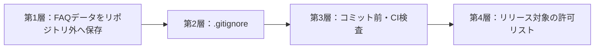

# ローカルFAQデータ・Git除外詳細設計書

## 1. 文書情報

| 項目 | 内容 |
|---|---|
| 文書名 | ローカルFAQデータ・Git除外詳細設計書 |
| 版 | 0.48（一人利用試行・延期記録・0.4.4候補版） |
| 作成日 | 2026-08-08 |
| 上位文書 | `FAQシステム要件定義書.md` v1.35、`FAQシステム基本設計書.md` v1.46 |
| 対象 | 利用者が作成したFAQデータをGitHub等へ含めないための保存・検査設計 |

## 2. 目的

利用者がアプリ上で作成したFAQ、履歴、添付画像、バックアップなどを、ソースコードのGitリポジトリやGitHub等のリリースへ混入させない。会社管理の外部資料本体はKnowledgeAppへ取り込まず、リポジトリやリリースへ複製しない。

FAQの題材が生成AI活用事例、PCトラブル、その他の内容であるかにかかわらず、同じ保護を適用する。本設計はFAQの題材を制限するものではない。

Surface実機試験で検出した画像保存不具合の修正では、Tiptapが表示用に追加する`width`・`height`属性をReact側で保存JSONから除外し、従来どおり管理画像の4属性だけをRustへ渡す。画像ファイル、DB列、添付メタデータ、保存先、バックアップ対象、Git除外パターンは変更しない。パスワード再設定ダイアログの入力値はReactの一時状態だけに保持し、ログやファイルへ保存せず、既存Rust処理がArgon2ハッシュだけを`users.password_hash`へ保存する。認証情報の保存先、DBスキーマ、バックアップ・エクスポート除外、Git除外方針も変更しない。

0.4.2診断版と0.4.3正式候補では、Rust側の画像参照検証を12分岐へ細分化するが、診断情報は固定コード、固定説明、安全化した属性名、文字数だけに限定する。FAQ本文、属性値、画像、絶対・相対パス、添付ID、DB内容をログや診断ファイルへ出力せず、Surfaceから返却する結果にも含めない。診断インストーラー、ZIP、結果票は利用者データではないがリリース試験成果物として`target`、Downloads、Surfaceの試験用フォルダにだけ置き、Gitへ含めない。

0.4.4の初期管理者緊急認証は、アプリコード内の固定Argon2ハッシュだけを使用する。平文をソース、SQLite、設定、ログ、診断、CSV、JSON、Codex委譲、バックアップ、リリース文書へ保存せず、DBスキーマ、`users.password_hash`、利用者データルート、バックアップ内容、Git除外パターンを変更しない。通常パスワードと利用停止判定を維持し、追加利用者へ緊急認証を適用しない。

### 2.1 2026-08-16 一人利用試行時のデータ境界

2026-08-16付で延期したコード署名、正式配布、Surface再試験、広範なWindows手動試験、表示・アクセシビリティ、大容量画面応答、ネットワーク・UNC障害および会社の実資料参照の確認は、本書の保存・Git除外要件を緩和しない。一人利用試行でも、DB、WAL、SHM、添付画像、履歴、バックアップ、CSV、JSON、Codex提案・委譲、診断ログ、一時ファイル、会社管理の外部資料をリポジトリや配布物へ含めてはならない。

会社PCでは、対象コミットを固定してリポジトリを取得した後、`scripts/setup-git-hooks.ps1`を実行する。アプリ起動後は利用者データルートがリポジトリ外のWindows利用者別ローカルデータフォルダであることを確認し、実FAQ登録前にローカルのフルバックアップを作成して検証データの復元を1回確認する。コミット前と配布物作成前には`scripts/check-no-runtime-data.ps1`を実行する。

コード署名を延期する間は、取得元のブランチ・コミットまたはインストーラーのSHA-256を固定して出所を確認する。ネットワーク・UNCバックアップ試験が完了するまではローカルバックアップだけを正式な退避先とし、会社管理の外部資料を実FAQへ登録するまでは合成パス・合成URLだけを検証に使用する。正式配布または複数人利用へ移る場合は、延期事項を再開して要件定義書v1.35と基本設計書v1.46の条件を満たす。

CSV一括編集で生成・選択する`*.knowledge-faq.csv`はFAQタイトル、概要、回答本文、作成者・更新者等を含む利用者データであり、保存場所がアプリのデータルート外でもソース管理・リリースへ含めない。アプリはGit管理フォルダ内のCSV入出力を拒否し、`.gitignore`と禁止ファイル検査も固定拡張子を拒否する。Excel互換のため実行時CSVだけはUTF-8 BOM・CRLFで生成するが、これはソースコード・設計文書のUTF-8 BOMなし・LF規則の例外であり、CSV自体を追跡しない。

DB第7版の`categories.management_code`、`articles.management_code`、`management_code_sequences`は`knowledge.db`内へ保存し、完全バックアップ・復元へ含める。内部UUIDを保持したままCSV形式第2版には`CAT-00001`／`FAQ-00001`形式の管理IDだけを出力する。既存行は移行時に補完し、新規行はDBトリガーで採番する。削除後も採番表を巻き戻さず、同じ管理IDを別データへ再利用しない。外部ファイル、保存フォルダ、Git除外パターンは追加しない。

管理IDのゼロ埋めは最低5桁であり、採番値`100000`以降は6桁以上へ自然に拡張するため、5桁到達による枯渇は発生しない。FAQまたは分類の採番値が9万件へ達した場合は、採番表や既存コードを初期化せず、表示幅、CSV・バックアップ容量、一括処理性能、運用手順を再評価する。評価結果によって形式変更が必要になった場合は、旧管理IDとの対応を保持する移行設計を別途作成する。

DB第6版の`users`、`articles.created_by_user_id`、`articles.updated_by_user_id`は`knowledge.db`の一部として、従来と同じデータルート、Git除外、完全バックアップ、復元の対象にする。パスワードは空欄を許可しても平文を保存せずArgon2ハッシュだけをDBへ保存し、診断ログ・CSV・Codex委譲へ含めない。空パスワード許可方針は既存`app_settings`の`password_policy`へ保存し、OFFへ切り替えても既存ハッシュを変更しない。CSVの作成者・更新者列は表示名だけで、パスワードハッシュ、利用状態、権限、最終ログインは含めない。

Codex FAQ標準構成と画像利用方針は、既存の概要とTiptap本文へ記載する内容・順序、および画像追加を案内する判断規則であり、新しいDB列、ファイル形式、保存先、バックアップ対象、Git除外パターンを追加しない。標準構成で作成された提案も従来どおり利用者確認前のローカルFAQデータとして扱い、`codex-inbox`へ保存してソース管理とリリースから除外する。下書き取込後に利用者が追加した画像・スクリーンショットは既存の`attachments/articles`へ保存し、他のFAQ添付画像と同じGit除外・バックアップ規則を適用する。

緑・青のカラーテーマ、検索結果タイトルのトップ分類名表示、FAQマスコット表示、空パスワード許可方針は、既存SQLiteの`app_settings`へ保存し、新しい保存フォルダ、ファイル形式、Git除外パターンを追加しない。これらはFAQ本文ではないが端末設定として利用者データルート内に留め、DBスナップショットを介してフルバックアップ・復元の対象とする。分類接頭辞は表示時に現在の分類階層から生成し、`articles.title`、検索索引、Codex提案へ保存しない。

FAQ詳細から一覧へ戻るための検索語・分類・下書き表示はURL検索パラメーター、スクロール位置はWebViewの`sessionStorage`へ一時保持する。この一時状態はFAQ、検索履歴、端末設定の正本ではなく、SQLite、利用者データフォルダ、バックアップ、エクスポート、リポジトリへ書き込まない。復元後またはアプリ終了時に破棄されるため、本書のGit除外パターンとバックアップ対象は変更しない。

検索結果の現在ページはURL検索パラメーターへ、分類ツリーで閉じた分類IDはWebViewの`sessionStorage`へ一時保持する。ページングはSQLiteから指定範囲を読み取るだけで新しいテーブル・列・履歴を追加しない。分類ツリーの開閉状態はアプリ終了時に破棄し、端末設定、FAQ、検索履歴、利用者データフォルダ、バックアップ、エクスポート、リポジトリへ保存しない。

検索結果の並び順はURL検索パラメーターへ一時保持し、Rust側で既存の`articles.updated_at`または`articles.importance`を使って全一致結果を並び替える。検索パネルの単色化と枠調整はReactとCSSの表示だけを変更する。どちらもDB列、設定値、検索履歴項目、新しいファイル、利用者データフォルダ、バックアップ、エクスポート、Git除外パターン、リリース許可リストを追加・変更しない。

Codex提案画面の上部説明、委譲方針バナー、確認待ち0件時の案内を簡素化する変更は表示文言だけに限定する。Codex提案、履歴、分類カタログ、委譲ファイル、SQLite、利用者データフォルダ、バックアップ、Git除外の保存形式・対象・保護方針は変更しない。

Codex連携用保存先の表示を提案画面から設定画面へ移す変更では、Rustが分類カタログと提案箱の既存固定パスを端末情報として返し、Reactは参照表示だけを行う。利用者入力、フォルダ選択、保存先変更コマンド、DB設定値を追加せず、appLocalDataDir、Git除外、バックアップ除外、プラグインの受け渡し先を変更しない。

コピー用テキスト枠は、既存の`articles.body_doc_json`へTiptapの`copyBlock`ノードとして保存し、新しいDB列、ファイル、保存フォルダ、Git除外パターンを追加しない。コピー操作は保存済み文字列をWindowsクリップボードへ一時的に書き込むだけであり、クリップボードの既存内容、コピー成否、コピー履歴をDB、診断ログ、利用者データフォルダへ保存しない。リッチテキスト文書形式版は2へ更新し、フルバックアップのmanifestへ記録するが、DBスキーマ版とバックアップ対象は変更しない。

新着・更新の表示終了日に端末の現在日付から7日後を初期表示する処理は、FAQ編集画面で空欄を補完するだけとする。保存時は既存の`articles.new_badge_until`または`articles.updated_badge_until`へ従来どおり`YYYY-MM-DD`を保存し、DBスキーマ、マイグレーション、バックアップ、Git除外対象を変更しない。回答欄直下の開発者向け説明枠を削除する変更も表示だけに限定し、画像、参考URL、コピー用テキスト枠の保存・検証・権限は変更しない。

統合FAQの公開後に元FAQを「統合済み」とする機能は、DB第5版の`article_merge_relations`へ統合元・統合先・版確認日時・統合日時を保存する。新しい外部ファイル、保存フォルダ、Git除外パターンは追加しない。関係は`knowledge.db`のスナップショットとしてフルバックアップ・復元対象に含め、元FAQの本文、状態、非表示、論理削除を変更しない。統合解除では関係行だけを削除する。

FAQ基本情報の入力単位カード、必須・任意バッジ、未入力・フォーカス・エラー時の強調はReactとCSSの表示だけを変更する。新規FAQの分類を空欄から開始する処理も保存前のReact状態だけであり、選択後は既存の`articles.category_id`へ保存する。入力項目、保存形式、SQLite、利用者データフォルダ、バックアップ、エクスポート、Git除外パターンを変更せず、新しい永続設定や操作履歴を追加しない。

FAQ回答区分の説明文変更はReactの静的表示文言だけに限定し、FAQ本文、入力値、SQLite、利用者データフォルダ、バックアップ、エクスポート、Git除外パターンを変更しない。

FAQ編集画面の検索情報・関連FAQ入力を外し、タグマスター選択へ置き換える変更では、初期DBから存在する`tags`と`article_tags`をそのまま正本に使用する。タグの追加・名称変更・未使用時削除はSQLite内で完結し、新しいDB列、外部ファイル、保存フォルダ、Git除外パターンを追加しない。タグ名称変更ではIDを維持して使用中FAQと検索索引へ反映する。FAQで使用中のタグは削除を拒否する。旧`article_symptoms`等の検索情報、`article_relations`、JSON内の既存値は互換データとして保持し、画面に表示しない既存値もFAQ編集保存時にそのまま送って消去しない。これらは従来どおり`knowledge.db`、JSON、完全バックアップの保護対象であり、リポジトリやリリースへ含めない。

2026-08-16の実装画面確認後、この境界を`0.4.0`の正式な保存設計として確定した。FAQ作成・編集画面から旧項目が見えないことを、旧データの削除許可とは解釈しない。将来の関連FAQ再設計までは、`article_relations`を直接更新する新しい画面・コマンドを追加せず、既存値の読取互換と非破壊保存だけを維持する。

FAQマスコットの`src/assets/mascot/faq-owl-spritesheet.webp`と`src/assets/mascot/faq-owl-mugi-spritesheet.webp`は、開発用に明示して作成した画面表示用の同梱静的素材としてGitとリリースで管理する。通常時の静止表示、眠り、友達の訪問・交流・帰宅はReactの一時的な画面状態として扱い、操作履歴や友達の滞在状態を保存しない。これらは利用者がFAQ本文へ追加する添付画像ではなく、`appLocalDataDir`、SQLite、フルバックアップ、JSONエクスポートへ複製・保存しない。既存の`src/assets`許可とリリース許可リストの範囲で扱うため、利用者データのGit除外パターンは変更しない。

ムギを含む場面を元スプライトセルの縦横比で表示する修正は、ReactとCSSの表示寸法だけを変更する。WebPアトラス本体、ファイル名、保存場所、SQLite、利用者データフォルダ、バックアップ、エクスポート、Git除外パターン、リリース許可リストは変更しない。

検索結果を2列カードから1列の横長カードへ変更する作業は、Reactの表示構造とCSSだけを変更する。FAQ、分類、検索履歴、端末設定の保存形式、SQLite、利用者データフォルダ、バックアップ、エクスポート、Git除外パターン、リリース許可リストは変更しない。

FAQ管理一覧の通常・詳細切替、操作メニュー集約、コンテナー幅に応じたカード表示はReactとCSSの一時的な画面状態だけを変更する。作成者・更新者はDB第6版の既存参照値を詳細表示時に描画し、表示モードと開いているメニューをSQLite、Web Storage、ファイル、履歴へ保存しない。DBスキーマ、バックアップ、CSV、Git除外パターン、リリース許可リストを変更しない。

共通ヘッダーとFAQ検索画面の文言簡素化は、Reactの表示文字列と見出し余白だけを変更する。FAQ、分類、検索履歴、端末設定の保存形式、SQLite、利用者データフォルダ、バックアップ、エクスポート、Git除外パターン、リリース許可リストは変更しない。

## 3. 結論

次の4層で保護する。



| 層 | 役割 | 位置づけ |
|---|---|---|
| 第1層 | Tauriの利用者別ローカルデータフォルダへ保存する | 主対策 |
| 第2層 | 誤ってリポジトリ内へ生成されたファイルをGitから除外する | 補助対策 |
| 第3層 | 強制追加や既追跡ファイルをコミット前・CIで検出する | 必須の最終検査 |
| 第4層 | インストーラーへ含めるファイルを明示的に限定する | 配布時の対策 |

`.gitignore`だけには依存しない。Gitの除外規則は未追跡ファイルを対象とし、すでに追跡されたファイルや`git add -f`による強制追加を防げないためである。

## 4. 固定する識別子

### 4.1 Tauri bundle identifier

内部識別子を次で固定する。

```text
jp.local.webknowledgesystem
```

- `tauri.conf.json`の`identifier`へ設定する。
- 画面上の正式名称が後で変わっても、内部識別子は変更しない。
- 識別子を変更するとTauriが解決する利用者データパスが変わるため、初回データ保存後の変更は禁止する。

### 4.2 Windows上のデータルート

Tauriの`appLocalDataDir`は、Windowsのローカルアプリデータフォルダとbundle identifierからアプリ専用パスを解決する。

想定パス：

```text
C:\Users\{Windowsユーザー}\AppData\Local\jp.local.webknowledgesystem\
```

実装ではパス文字列を組み立てず、Rust側でTauriのパス解決APIを使用する。

## 5. データ保存設計

### 5.1 データルート構成

```text
{appLocalDataDir}/
├─ data/
│  ├─ knowledge.db
│  ├─ knowledge.db-wal
│  └─ knowledge.db-shm
├─ attachments/
│  └─ articles/
├─ manuals/                  # 旧版バックアップ互換用。現行画面からは追加しない
├─ logs/
├─ restore-staging/
├─ safety-backups/
├─ settings/
├─ temp/
├─ codex-bridge/
│  ├─ categories.json
│  └─ delegations/
│     └─ {delegationId}.knowledge-delegation.json
└─ codex-inbox/
   └─ {requestId}.knowledge-proposal.json
```

| ディレクトリ | 内容 |
|---|---|
| `data` | SQLite DBとジャーナル |
| `attachments/articles` | FAQ本文へ挿入した画像 |
| `manuals` | 旧版バックアップ互換用の予約領域。現行画面からは追加せず、誤配置時のGit混入防止対象として維持する。 |
| `logs` | 診断ログ |
| `restore-staging` | 復元中の一時展開 |
| `safety-backups` | DB移行・復元・CSV取込の直前に自動作成するローカル安全バックアップ |
| `settings` | DB外の端末設定 |
| `temp` | FAQ保存前の一時画像など |
| `codex-bridge` | FAQ本文を含まない分類カタログと、利用者が画面で選んだFAQだけを含む修正・統合用の明示委譲ファイル。 |
| `codex-inbox` | 利用者確認前のCodex FAQ提案。DBへ未反映のローカル利用者データとして扱う。 |

画面のカラーテーマ、タイトル分類表示、FAQマスコット表示の設定は`settings`配下へ別ファイルを作らず、`data/knowledge.db`内の既存`app_settings`テーブルへ保存する。キー`appearance`のJSON値`{"colorTheme":"green|blue","showTopCategoryInTitle":true|false,"showMascot":true|false}`を表示設定に使用し、空パスワード許可は独立キー`password_policy`の`{"allowEmptyPasswords":true|false}`へ保存する。ReactからDBパスや任意SQLを受け取らず、未保存時は各表示項目と空パスワード許可をONとする。既存テーブルを使うためDBマイグレーションを追加しない。

### 5.2 禁止する保存先

通常実行、開発実行のどちらでも、次にはFAQデータを書き込まない。

- 現在の作業ディレクトリ
- Gitリポジトリのルートと配下
- `src`、`src-tauri`、`public`、`tests`、`docs`
- 実行ファイルの配置フォルダ
- Tauriのリソースフォルダ

### 5.3 データルート解決処理

Rustバックエンドに`DataRootService`を置き、アプリ起動時に一度だけ解決する。

処理順：

1. Tauriの`app.path().app_local_data_dir()`相当でパスを取得する。
2. 必要なディレクトリをRust側で作成する。
3. 作成後の絶対パスを正規化する。
4. データルートがリポジトリ、実行ファイル、リソースフォルダの配下ではないことを確認する。
5. 書き込み・読み取りの簡易確認を行う。
6. 成功したパスをアプリ状態へ保持し、Repository、添付、バックアップ、ログサービスへ渡す。

パス解決または検証に失敗した場合は起動を中止し、FAQデータを`./data`などへ代替保存しない。失敗時のフォールバックを現在の作業ディレクトリに置かないことが重要である。

### 5.4 フロントエンドとの境界

- React側へデータルートの書き込み権限を直接与えない。
- React側からDB絶対パスや保存先パスを指定させない。
- DBと画像への操作は型付きTauri Commandを通してRust側で行う。会社管理の外部資料本体を読み書きする汎用Commandは公開しない。
- 画面へパスを表示する必要がある場合は、診断目的の読み取り専用情報として返す。
- 任意SQL、任意ファイル書き込み、任意フォルダ削除の汎用コマンドを公開しない。

### 5.5 自動テスト

- 自動テストではOSの一時ディレクトリにテスト専用データルートを作る。
- テスト用データルートは依存注入で`DataRootService`へ渡し、本番コードの保存先決定ロジックを上書きしない。
- テスト終了時に一時ディレクトリを破棄する。
- テスト用DBや添付ファイルをリポジトリへ書き出さない。

### 5.6 DB版更新と復元時移行

- DBスキーマ第2版では、`articles`へ新着表示終了日、更新表示終了日、非表示の3項目を追加する。
- DBスキーマ第3版では、`categories.description`と`codex_proposal_receipts`を追加する。既存分類の説明は空文字とし、既存FAQを変更しない。
- DBスキーマ第4版では、確認待ち・承認・却下のCodex提案履歴と依頼系列を保持する`codex_proposal_history`を追加する。既存FAQを変更しない。
- DBスキーマ第5版では、統合元から統合先への解除可能な関係を保持する`article_merge_relations`を追加する。既存FAQには関係を自動付与しない。
- DBスキーマ第6版では、`users`と`articles`の作成者・更新者FKを追加する。利用者が0件なら初期管理者`0000`を空パスワードのArgon2ハッシュで作成し、既存FAQのNULL監査列を初期管理者へ補完する。
- DBスキーマ第7版では、分類とFAQへ人間向け管理IDおよび採番表を追加する。既存行は移行時に`CAT-00001`／`FAQ-00001`形式で補完し、採番値は削除後も再利用しない。
- 新規DBは第1版の初期構造を作成後、未適用マイグレーションを順番に実行して第7版にする。
- 第1～6版DBを開いた場合は、移行前安全バックアップを検証してから利用者データフォルダ内の同じDBへ各マイグレーションを順番に適用する。既存FAQの新着・更新は未設定、非表示はOFF、統合関係は未設定、作成者・更新者は初期管理者、管理IDは既存順で補完する。
- 第1～6版DBを含む完全バックアップは復元対象として許可し、復元直後に同じ移行、初期管理者・監査情報・管理ID補完を実行する。現在のアプリより新しいDB版は復元しない。
- マイグレーションSQLはソース管理対象とするが、移行対象の実DBとバックアップは従来どおりリポジトリ外へ置く。
- 自動テストではOS一時フォルダに第1～6版の旧DBを作成し、第7版への移行、既存FAQの保持、初期管理者と監査列、管理ID、分類説明、受付記録・提案履歴・統合関係を確認する。
- コピー用テキスト枠は既存の`body_doc_json`へ保存するためDBマイグレーションを追加しない。新規保存または更新したFAQの`body_format_version`を2とし、第1版本文は変更せず第2版の読取処理で互換表示する。フルバックアップの`rich_text_format_version`も2とし、第1版バックアップの復元を継続して許可する。

### 5.7 Surface実機リハーサル用合成データ

- `tests/release-fixtures`には、会社FAQ・履歴・添付・認証情報を含まないことが明示された開発用フィクスチャーだけを置く。
- 6桁管理ID用JSONはソース上では`six-digit-management-id.fixture.json`とし、通常の利用者エクスポートを示す固定拡張子を追跡しない。Surface上で試験を始めるときだけコピーを作成し、`*.knowledge-export.json`へ変更する。
- `base-faq.fixture.csv`は10,000件CSV生成スクリプトの自動検査専用である。SurfaceではKnowledgeApp自身が書き出した合成FAQ CSVを入力にして、`New-KnowledgeAppLargeCsvFixture.ps1`が試験用`*.knowledge-faq.csv`を生成する。
- `external-reference-test.html`はJavaScript、iframe、外部リソース、会社情報を含まない。外部HTMLをKnowledgeAppへ取り込む資料ではなく、コピーした参照先を利用者がブラウザーで開く責任境界の実機確認だけに使う。
- Surface検証パッケージと生成した旧版・現行版インストーラー、ZIP、合成CSV・JSON、バックアップ、結果作業ファイルは`src-tauri/target/release`またはSurfaceの試験用フォルダへ置き、Gitへ追加しない。
- 結果票と正式文書には実施結果、版、ハッシュ、件数、時間、エラー番号だけを記録し、DB、FAQ本文、パスワード、機密パスを持ち帰らない。

## 6. `.gitignore`設計

### 6.1 配置

リポジトリルートの`.gitignore`をGitで管理し、すべての開発環境へ同じ除外規則を配布する。

### 6.2 除外対象

| 分類 | 主なパターン |
|---|---|
| ルート直下の誤生成データ | `/data/`、`/attachments/`、`/manuals/`、`/backup/`、`/exports/`、`/logs/`、`/codex-inbox/`、`/codex-bridge/` |
| SQLite | `*.db`、`*.db-*`、`*.sqlite*` |
| フルバックアップ | `*.faqbackup`、`*.faqbackup.*` |
| JSONエクスポート | `*.knowledge-export.json` |
| Excel編集用FAQ CSV | `*.knowledge-faq.csv` |
| Codex提案・委譲 | `*.knowledge-proposal.json`、`*.knowledge-delegation.json` |
| 作成途中・復元退避 | `*.partial`、`/restore-staging/`、`/safety-backups/`、`/tmp/` |
| ローカル設定 | `.env`、`.env.*`、`/settings/local/` |
| ビルド成果物 | `/node_modules/`、`/dist/`、`/src-tauri/target/` |
| ローカル検討資料 | `/2026.08.08_ChatGPTとの会話.txt` |

`package.json`、`tsconfig.json`、Tauri設定、マイグレーション、設計書など、開発に必要なJSON・SQL・文書は除外しない。そのため、すべての`*.json`や`*.sql`を一括除外しない。

### 6.3 エクスポートの固定拡張子

利用者が作成するJSONエクスポートは、表示名を自由入力できても、最終的なファイル名を次の形式にする。

```text
{任意名}.knowledge-export.json
```

これにより、通常のソースJSONと区別し、`.gitignore`と検査スクリプトの両方で確実に検出する。

Excel編集用FAQ CSVは次の形式に固定する。

```text
{任意名}.knowledge-faq.csv
```

CSVはFAQ本文を含むため、`.knowledge-export.json`と同じくGit管理・リリースを禁止する。通常の開発用`.csv`フィクスチャーを一括除外せず、FAQ実データと判別できる固定複合拡張子だけを対象にする。

CSV形式第2版は、内部UUIDの代わりに`FAQ-`／`CAT-`接頭辞と5桁以上の連番からなる管理IDを含む。接頭辞によりFAQと分類を判別でき、Excelで先頭ゼロが数値変換により失われることを防ぐ。管理IDはFAQ本文と同様に利用者データとして扱い、診断ログやリポジトリへ転記しない。

### 6.4 注意事項

- `.gitignore`は未追跡ファイルを無視する仕組みであり、すでに追跡中のファイルには効かない。
- `.gitignore`へ追加する前に追跡されたデータは、Gitのインデックスから明示的に外す必要がある。
- `git add -f`は除外規則を上書きできるため、コミット前・CI検査を必須とする。

## 7. コミット前検査

### 7.1 検査スクリプト

実装開始時に次を作成する。

```text
scripts/check-no-runtime-data.ps1
```

スクリプトは次を検査する。

1. Gitで追跡中の全ファイル
2. コミット対象としてステージされた追加・変更ファイル
3. 禁止されたルートディレクトリ
4. 禁止拡張子とDBジャーナル
5. ローカルFAQデータの既知ファイル名

### 7.2 禁止パターン

ルート相対パスで次を拒否する。

```text
^(data|attachments|manuals|backup|backups|exports|logs|restore-staging|safety-backups|tmp|codex-inbox|codex-bridge)/
```

場所にかかわらず次を拒否する。

```text
*.db
*.db-*
*.sqlite
*.sqlite-*
*.sqlite3
*.sqlite3-*
*.faqbackup
*.faqbackup.*
*.knowledge-export.json
*.knowledge-faq.csv
*.knowledge-proposal.json
*.knowledge-delegation.json
```

`src/features/attachments`のようなソースコード用ディレクトリは、ルート直下ではないため拒否しない。アプリアイコンや画面素材も、`src/assets`または`src-tauri/icons`にある場合は許可する。

### 7.3 Git hook

- リポジトリ内に共有用pre-commit hookを置く。
- 初期設定スクリプトで`core.hooksPath`を共有hookへ向ける。
- pre-commitから`check-no-runtime-data.ps1`を実行する。
- 検出時はコミットを中止し、該当パスと除去方法を表示する。

hookは`--no-verify`で回避できるため、hookだけを安全境界にしない。

### 7.4 文字コード検査

- `.gitattributes`で追跡テキストをUTF-8運用の前提となるLFへ統一し、Git設定`core.autocrlf`による環境差を防ぐ。
- `.editorconfig`で対応エディターへUTF-8（BOMなし）・LFを指示する。
- `scripts/check-text-encoding.ps1`は追跡対象、またはコミット対象のテキストを厳密なUTF-8として読み取り、UTF-8 BOM、置換文字`U+FFFD`、NUL文字、CRを検出した場合は失敗する。
- PowerShellで文字列ファイルを読み書きする場合は`-Encoding UTF8`またはBOMなし`UTF8Encoding`を明示し、環境ごとに異なる既定文字コードを使わない。
- pre-commitでは文字コード検査を利用者データ混入検査より先に実行する。CIでもビルド前に同じ検査を行う。

## 8. CI検査

### 8.1 実行タイミング

GitHub Actionsで次のタイミングに検査する。

- push
- pull request
- リリース作成前

### 8.2 検査内容

1. `scripts/check-text-encoding.ps1`を実行する。
2. `scripts/check-no-runtime-data.ps1`を実行する。
3. Gitで追跡されている全パスを検査する。
4. React・Rustテスト、型検査、Rust整形、Clippyを実行する。
5. `npm run tauri build`でNSISインストーラーを生成する。
6. `scripts/check-release-bundle-config.ps1`でNSIS、利用者単位、空の`resources`、外部バイナリーなし、現行版インストーラー1件を検査する。
7. `scripts/check-no-runtime-data.ps1 -ReleaseDirectory`で、ビルド後の配布フォルダにDB、バックアップ、エクスポート、添付画像、会社管理の外部資料がないことを確認する。
8. インストーラーのSHA-256を記録し、CI成果物として保存する。
9. 検出時はビルド・リリースを失敗させる。

CIは`.gitignore`を再確認するのではなく、実際にGitで追跡されているファイルを検査する。

## 9. リリース梱包

### 9.1 許可リスト方式

現行版はTauriの`bundle.resources`を空配列とし、実行時の利用者データや会社管理資料を追加リソースとして梱包しない。Reactのビルドへ含める画面用素材はソース管理された静的UI素材だけに限定し、`externalBin`も設定しない。

許可候補：

- アプリアイコン
- 画面表示に必要な同梱素材
- `src/assets/mascot/faq-owl-spritesheet.webp`と`src/assets/mascot/faq-owl-mugi-spritesheet.webp`を含むアプリ固有の静的UI素材
- 初期DBマイグレーション
- 検索の初期除外語・同義語定義（FAQ内容を含まないもの）

禁止：

- `%LOCALAPPDATA%`配下の全ファイル
- `knowledge.db`とジャーナル
- 利用者が作成したFAQ、履歴、画像、会社管理の外部資料、旧版互換用`manuals`データ
- `.faqbackup`、JSONエクスポート、FAQ CSV
- 診断ログ

### 9.2 リリース前確認

- `scripts/check-release-bundle-config.ps1`で配布設定と現行版NSIS成果物を検査する。
- `scripts/check-no-runtime-data.ps1 -ReleaseDirectory`で配布フォルダ全体を検査する。
- インストーラーを新しいWindows利用者環境へ導入する。
- 初回起動時に空のDBが利用者データフォルダへ作成されることを確認する。
- インストールフォルダにFAQデータが存在しないことを確認する。
- 開発PCのFAQが初期表示されないことを確認する。

## 10. バックアップ・エクスポート

- フルバックアップは利用者が選択した保存先へ作成する。
- JSONエクスポートは`.knowledge-export.json`を使用する。
- Excel編集用CSVは`.knowledge-faq.csv`を使用し、Git管理フォルダを保存先・読込元にしない。
- 保存先の初期値をGitリポジトリやアプリのインストールフォルダにしない。
- 開発実行・通常実行を問わず、選択された保存先がGitリポジトリ配下と判定できる場合は保存を拒否し、別の保存先を案内する。
- リポジトリ配下へ誤保存しても、`.gitignore`と検査スクリプトがGit登録を防ぐ。
- 復元前の安全バックアップは利用者データルート内の`safety-backups`へ作成し、フルバックアップへ再帰的に含めない。
- CSV取込前も`safety-backups`へ完全バックアップを作成する。取込成功・失敗にかかわらず、利用者が明示的に整理するまで安全バックアップを保持する。
- 既存DBの版が現行版より古い場合も、DBを書込み可能で開く前に`safety-backups`へ`KnowledgeApp_before_migration_v{旧版}_to_v{新版}_{日時}.faqbackup`を作成する。検証完了前にマイグレーションを始めず、失敗時は旧DBを変更しない。
- 自動安全バックアップの保存先を、利用者が選んだ「前回成功したバックアップ先」として`settings/backup.json`へ記録しない。

### 10.1 Codexによる新規FAQ下書き時の取扱い

- KnowledgeAppは起動時、分類変更後、復元後、提案一覧更新時に`codex-bridge/categories.json`を再生成する。FAQ本文・概要・件数・履歴・添付・外部資料の参照先・内容は含めない。
- KnowledgeApp専用Codexプラグインの通常コマンドは、`%LOCALAPPDATA%\jp.local.webknowledgesystem\codex-bridge\categories.json`だけを読み、`codex-inbox`へだけ提案を書き込む。SQLiteを開く機能を持たせない。
- 提案は`{requestId}.knowledge-proposal.json`とし、同じフォルダに一意な`.partial`を完成させてから名称変更する。同じ受付番号が存在する場合は上書きしない。
- アプリは通常ファイル、固定拡張子、最大1MB、ファイル名と受付UUID一致、厳格JSON、許可リッチテキストを確認する。新規・統合は画像なし、修正は委譲元と同じ画像参照集合に限定し、不正提案からDBや添付フォルダを変更しない。
- 取込時は既存分類、または新規分類案1件をRust側で再検証し、FAQ下書きと受付記録を同じDBトランザクションで保存する。成功後に提案ファイルを削除し、削除できない場合も受付記録で再取込を防ぐ。
- `codex-inbox`、`codex-bridge`、`.knowledge-proposal.json`、`.partial`はフルバックアップ対象外とする。分類カタログは復元後に再生成し、確認前提案は端末移行の正本にしない。
- 提案箱・分類カタログをGitへ追加せず、ルート除外、拡張子除外、コミット前検査、CI検査で検出する。
- 会社FAQの元情報をCodexへ提示できるかは会社規定を優先し、利用者が会話で明示的に提供した内容以外を自動収集しない。
- 結論、手順、注意、備考、参考リンクの標準構成は提案JSON内の既存`faq.summary`と`faq.bodyDoc`で表現し、提案ファイルの保存場所、拡張子、上限、原子的保存、Git除外を変更しない。
- 画像・スクリーンショットが視認性・理解を実質的に高める場合も、新規・統合の提案JSONには画像ノード、外部画像URL、Base64、添付画像本体を含めない。Codexは提案送信後に追加対象の手順、画像内容、挿入位置、代替テキスト案を案内し、利用者が下書き取込後に既存の画像取り込み機能で追加する。利用条件が不明な画像は使わず、個人情報・機密情報・認証情報は除去またはマスクする。

### 10.2 CodexによるFAQ整理・統合時の取扱い

- 既存FAQ1件の修正または2～10件の統合では、利用者がKnowledgeApp画面で対象を選び、`codex-bridge/delegations`へ委譲ファイルを作成する。Codexがリポジトリだけを確認してもFAQ実データを取得できない構成を維持する。
- 委譲ファイルにはFAQ ID、委譲時更新日時、分類ID・表示階層、タイトル、概要、Tiptap本文、状態、重要度、添付のID・名称・代替文・形式だけを含める。DB、検索・閲覧履歴、未選択FAQ、添付画像本体、ローカルファイルパスを含めない。
- 修正案で画像・スクリーンショットが有用でも、添付画像本体が委譲されないため新規画像を追加しない。委譲元の画像ノード、参照、位置、代替テキストをそのまま維持し、追加・削除・並べ替えを行わない。
- Codexプラグインは利用者が依頼文で指定した委譲番号の通常ファイルだけを最大5MBまで読み、別番号やフォルダ全体を走査しない。
- 修正・統合提案の`seriesId`、元FAQ ID・更新日時が委譲ファイルと一致することをRust側で再検証する。
- 修正は現在DBの更新日時も照合し、委譲後に変更されたFAQへ古い案を上書きしない。統合案の承認は新規下書きだけを作り、この時点では元FAQを変更・削除しない。
- 提案はDB第4版以降の履歴へ保存する。却下後も内容を保持し、同一依頼系列で自身より新しい提案がない最新版だけを再検討へ戻す。
- 統合下書きを新着期限付きで公開した後、利用者が確認した場合だけ、DB第5版の`article_merge_relations`へ元FAQから統合先への関係を保存する。保存直前に委譲時更新日時と現在の元FAQを再照合し、変更・削除・別統合が1件でもあれば全件をロールバックする。
- 統合済みFAQは検索索引や本文を削除せず、通常検索SQLから除外する。FAQ管理・詳細では統合先を表示し、解除時は関係行だけを削除して元の状態・非表示設定を再利用する。統合済みFAQを別のCodex委譲へ含めない。
- 多数FAQの整理・統合を依頼する場合は、利用者が`.knowledge-export.json`をリポジトリ外へ出力し、対象ファイルと作業範囲を明示する。
- Codexが作成した統合候補は、アプリのJSONインポートで形式検証、差分プレビュー、利用者確認を行い、事前のフルバックアップ後にトランザクションで反映する。
- Codexから`knowledge.db`、WAL、SHM、添付画像フォルダを直接変更しない。検索索引、関連情報、論理削除、添付参照の不整合を防ぐため、SQLiteへの直接書き込みを統合経路にしない。
- JSONエクスポートと統合候補をGitへ追加せず、作業後も会社規定と利用者のデータ管理方針に従ってリポジトリ外で保管または削除する。
- 会社FAQをCodexへ提示できるかは会社規定を優先し、パスワード、秘密鍵、個人情報その他の保存禁止情報を含めない。
- JSONエクスポート・インポート機能が未実装の間は、Codexによる実FAQの一括整理・直接統合を正規運用として実施しない。

## 11. Git開始時の確認

2026-08-08にローカルGitリポジトリを初期化し、`.gitignore`と共有hookを設定した。GitHubへ初めてpushする前、および除外規則を変更した場合は次を確認する。

1. `.gitignore`を最初のコミットへ含める。
2. `git status`で登録対象を一件ずつ確認する。
3. `git check-ignore -v`でDB、バックアップ、JSONエクスポート、FAQ CSVの代表パスが除外されることを確認する。
4. `git ls-files`で利用者データが追跡されていないことを確認する。
5. コミット前hookを設定する。
6. CI検査が成功してからGitHubへpushする。

## 12. 誤登録時の対応

### 12.1 push前

1. コミットまたはpushを停止する。
2. 該当ファイルをGitのステージ・追跡対象から外す。
3. FAQデータをリポジトリ外の正しい保存先へ移す。
4. `.gitignore`と検査スクリプトへ不足パターンを追加する。
5. `git ls-files`とコミット差分を再確認する。

### 12.2 push後

GitHub等へpushした場合、通常の削除コミットだけでは履歴に残る。公開範囲と内容を確認し、リポジトリ管理者の方針に従って履歴から除去する。必要な対応が完了するまで新しいリリースを停止する。

## 13. 受入条件

| ID | 受入条件 |
|---|---|
| DATA-01 | FAQ登録後、`knowledge.db`がTauriのappLocalDataDir配下に存在する。 |
| DATA-02 | FAQ登録、画像追加、外部資料参照の記載後も、リポジトリ配下に利用者データや外部資料本体の複製が生成されない。 |
| DATA-03 | appLocalDataDirの解決に失敗した場合、`./data`へ代替保存せず起動エラーになる。 |
| DATA-04 | React側から任意のDB保存先を指定できない。 |
| DATA-05 | Codex用分類カタログに分類メタデータだけが含まれ、FAQ本文・件数・履歴を含まない。 |
| DATA-06 | Codex提案を承認するまでSQLiteへFAQを登録せず、承認後は必ず下書きとして登録する。 |
| DATA-07 | 新規分類案の作成、FAQ下書き、受付記録が同じトランザクションで成功または失敗する。 |
| DATA-08 | 既存FAQの委譲ファイルに、選択したFAQ以外の本文、DB、履歴、添付画像本体、外部資料本体が含まれない。選択FAQ本文にコピー用参照先が含まれる場合は、利用者が選択・委譲した本文の一部として扱う。 |
| DATA-09 | 修正案は委譲後に元FAQが変更されていない場合だけ反映し、統合案は元FAQを変更せず新規下書きにする。 |
| DATA-10 | 却下提案を履歴へ保持し、同一依頼系列では最新の却下案だけを再検討できる。 |
| DATA-11 | Codexが新規・統合FAQへ画像追加を案内しても提案JSONに画像データを含めず、下書き取込後に利用者が追加した画像を`attachments/articles`へ保存して、ソース管理とリリースから除外する。修正案は委譲元の画像参照を変更しない。 |
| DATA-12 | カラーテーマ設定が利用者データルート内の`app_settings`へ保存され、リポジトリ配下へ設定ファイルを生成しない。フルバックアップと復元で選択値を保持できる。 |
| DATA-13 | タイトル分類表示設定を`app_settings`へ保存して再起動・バックアップ・復元後も維持し、ON/OFF、分類名変更、FAQ移動のいずれでも`articles.title`、検索索引、Codex提案へ分類接頭辞を書き込まない。 |
| DATA-14 | FAQマスコット表示設定を`app_settings`へ保存して再起動・バックアップ・復元後も維持し、リポジトリ配下へ設定ファイルや操作履歴を生成しない。 |
| DATA-15 | コピー用テキスト枠が既存の`body_doc_json`だけへ保存され、コピー内容・成否・クリップボード既存内容を新しいファイル、履歴、診断ログへ保存しない。リッチテキスト形式第1版のFAQとバックアップを引き続き読み取れる。 |
| DATA-16 | 設定画面に表示するCodex分類カタログ・提案箱のパスが`DataRootService`の固定値と一致し、Reactから保存先を指定・変更できない。表示移動によって新しい設定値、フォルダ、バックアップ対象を追加しない。 |
| DATA-17 | 新着・更新の表示終了日初期値が既存列へ保存され、初期値計算と回答欄の説明枠削除によって新しいDB列、設定値、ファイル、履歴、バックアップ対象、Git除外パターンを追加しない。 |
| DATA-18 | 統合FAQの公開成功後に利用者が確認した場合だけ、未変更・未削除の元FAQ全件を`article_merge_relations`へ同一トランザクションで保存する。元FAQの本文・状態・非表示・論理削除は変更せず、通常検索除外と統合先表示を行い、解除後は元の設定へ戻る。関係中の統合先は公開・非表示OFFに保ち、非表示・下書き・廃止・論理削除を拒否する。関係はDBスナップショットのバックアップ・復元対象となり、外部ファイルやGit除外パターンを追加しない。 |
| DATA-19 | FAQ基本情報の視認性改善と新規FAQ分類の未選択初期化が保存前のReact表示状態だけに限定され、選択後は既存の分類IDを保存する。DB列、設定、ファイル、履歴、バックアップ対象、Git除外パターンを追加・変更しない。 |
| DATA-20 | FAQ回答区分の説明文変更がReactの静的表示だけに限定され、FAQ本文、DB、設定、ファイル、履歴、バックアップ対象、Git除外パターンを追加・変更しない。 |
| DATA-21 | 検索結果の並び順がURLだけへ一時保持され、既存の更新日時・重要度で検索時に並び替えられる。検索パネルの単色化と合わせて、DB列、設定値、検索履歴項目、ファイル、バックアップ対象、Git除外パターンを追加・変更しない。 |
| DATA-22 | DB第6版で利用者、Argon2パスワードハッシュ、FAQ作成者・更新者をDBへ保存し、旧DB・旧バックアップから初期管理者へ安全に補完できる。パスワードハッシュをCSV、Codex委譲、ログへ含めない。 |
| DATA-23 | CSVで未変更の回答本文は現在の構造化本文を保持し、変更本文だけをプレーンテキスト段落へ置換する。取込前バックアップ、SHA-256再検査、全行トランザクションにより失敗時に部分反映しない。 |
| DATA-24 | 空パスワード許可方針を`app_settings`の独立キーへ保存し、OFF後の利用者追加・パスワード再設定だけを拒否する。既存の`users.password_hash`、DBスキーマ、保存フォルダ、Git除外パターンを変更せず、フルバックアップ・復元で設定値を保持する。 |
| DATA-25 | FAQ管理一覧の通常・詳細切替、行操作メニュー、カード表示がReactとCSSの一時状態だけで完結し、FAQ・監査情報・設定・履歴を変更しない。画面を開き直すと通常表示へ戻り、バックアップ・CSV・Git除外対象を追加しない。 |
| DATA-26 | DB第7版で既存・新規のFAQと分類へ一意な接頭辞付き管理IDを付与し、CSV形式第2版には内部UUIDを出力しない。削除後も採番済み番号を再利用せず、旧DB・旧バックアップを移行しても既存FAQを保持する。数値部は最低5桁とし、`99999`超では6桁以上へ自動拡張する。採番値9万件を目安に表示幅・容量・性能・運用を再評価する。 |
| DATA-27 | 外部資料参照は既存の`body_doc_json`内のコピー用テキストまたはHTTP/HTTPS参考URLとして保存し、新しい外部ファイル、DB表、保存フォルダを作らない。パスは自動オープンせず、外部資料本体を検索・バックアップ・Git管理へ取り込まない。初期DBの`manuals`関連表とフォルダは旧版互換用に非破壊で保持する。 |
| DATA-28 | 初期管理者緊急認証は固定Argon2ハッシュをアプリコード内だけに保持し、平文、利用回数、入力値を利用者データ、ログ、診断、エクスポートへ保存しない。初期管理者の通常ハッシュ、DBスキーマ、バックアップ、Git除外パターンを変更しない。 |
| GIT-01 | `.gitignore`がDB、ジャーナル、バックアップ、JSONエクスポート、FAQ CSV、ルートの利用者データフォルダを無視する。 |
| GIT-02 | 禁止ファイルを強制的にステージした場合、コミット前検査が失敗する。 |
| GIT-03 | 禁止ファイルが追跡されている場合、CIが失敗する。 |
| GIT-04 | FAQへ固有の確認用文字列を登録しても、リポジトリの追跡ファイルからその文字列が検出されない。 |
| GIT-05 | `codex-inbox`、`codex-bridge`、`.knowledge-proposal.json`、`.knowledge-delegation.json`を強制的にステージした場合、コミット前・CI検査が失敗する。 |
| GIT-06 | 追跡対象またはコミット対象のテキストがUTF-8（BOMなし）・LFでない場合、コミット前・CI検査が失敗する。日本語を含むCodex提案JSONはUTF-8で保存・再読込して同じ内容になる。 |
| REL-01 | インストーラーにDB、FAQ、履歴、画像、バックアップ、会社管理の外部資料、旧版互換用`manuals`データが含まれない。 |
| REL-02 | 新規PCへインストールした直後はFAQが空である。 |
| REL-03 | アプリ更新時は既存のappLocalDataDirを維持し、利用者データを上書きしない。 |
| REL-04 | 配布物にフクロウ単独用とムギ場面用のFAQマスコット静的スプライトシートが含まれ、同じフォルダやリソース指定へ利用者FAQの添付画像、DB、バックアップ、エクスポートを含めない。 |

## 14. 実装順序

この設計はFAQ CRUDより先に実装・検証する。

1. `tauri.conf.json`のidentifierを固定する。
2. Rustの`DataRootService`を作成する。
3. appLocalDataDir配下のディレクトリ生成と失敗時終了を実装する。
4. SQLite接続先を`DataRootService`からだけ取得する。
5. `.gitignore`の除外規則を自動確認する。
6. `scripts/check-no-runtime-data.ps1`を作成する。
7. pre-commit hookを作成する。
8. GitHub Actionsへ同じ検査を追加する。
9. 空DB作成と最小FAQ保存で受入条件を確認する。
10. 合格後に分類・FAQ CRUDの実装を広げる。

### 14.1 初回実装の結果

| 項目 | 状態 | 確認内容 |
|---|---|---|
| bundle identifier | 完了 | `jp.local.webknowledgesystem`へ固定した。 |
| `DataRootService` | 完了 | 絶対パス、禁止ルート、読み書きを検証し、失敗時は起動を中止する。 |
| SQLite接続先 | 完了 | `DataRootService`が返す`data/knowledge.db`だけを使用する。 |
| `.gitignore` | 完了 | DB、ジャーナル、バックアップ、エクスポート、ルートの利用者データを除外する。 |
| コミット前検査 | 完了 | `scripts/check-no-runtime-data.ps1`と`.githooks/pre-commit`を実装し、強制追加の拒否を確認した。 |
| 文字コード検査 | 完了 | `.gitattributes`、`.editorconfig`、`scripts/check-text-encoding.ps1`を追加し、UTF-8違反、BOM、置換文字、NUL文字、LF以外の改行をpre-commitとCIで拒否する。 |
| CI検査 | 実装完了・GitHub実行待ち | `.github/workflows/quality.yml`で追跡ファイル、テスト、ビルド、配布物を検査する。 |
| NSIS配布検査 | 完了 | CIとローカルで利用者単位NSISを生成し、空の`resources`、外部バイナリーなし、現行版成果物、配布フォルダへの利用者データ混入を検査する。SHA-256を成果物情報として記録する。 |
| リリース性能試験 | 完了 | OS一時フォルダへFAQ 10,000件、分類1,000件、履歴100万件を生成し、検索、詳細、履歴ページング、CSV、DBバックアップをリリースモードで計測する。生成データと成果物はリポジトリ・配布物へ含めない。 |
| Surface検証パッケージ | 0.4.3で終了 | 0.2.0、旧互換データ作成用0.3.4、本格利用候補0.4.3、ハッシュ検証、10,000件CSV生成、6桁管理ID、外部HTML、合成画像、正式テスト計画・手順・結果票を15ファイルのZIPへまとめた。ZIPは20,179,635 bytes、SHA-256は`FEFBDD5945D05BC6F7CC18F9CD19D313A0A48AAF515A39C1B1AFCBE00B945AF1`で、再展開後の全ファイル検査とSurface手動試験は良好との利用者報告を受けた。0.4.4以降はSurfaceパッケージを作成せず会社環境で検証する。過去パッケージと実行時データはGitへ含めない。 |
| 空DB作成 | 完了 | Windows実行ファイルを起動し、利用者別フォルダへの作成を確認した。 |
| 最小FAQ保存 | 完了 | OS一時フォルダを使うDB結合テストで、保存、再オープン、一覧取得を確認した。 |
| リリース混入検査 | 完了 | リリースビルド後のフォルダにDB、バックアップ、エクスポートがないことを確認した。 |
| フルバックアップ | 完了 | OS一時フォルダの検証データで、SQLiteスナップショット、ZIP梱包、SHA-256検証、任意保存先への確定を確認した。 |
| 復元 | 完了 | 破損ファイル拒否、復元前安全バックアップ、DB・設定・添付ファイル復元を確認した。 |
| FAQ添付画像 | 完了 | 選択・貼り付け画像を`temp/staged-article-images`へ一時保存し、FAQ保存成功時だけ`attachments/articles/{articleId}`へ確定する。本文JSONとDBには絶対パスを保存しない。 |
| 添付画像検査 | 完了 | PNG・JPEG・WebP・GIFのファイル内容、10MB上限、サイズ、SHA-256をRust側で検査する。外部画像URLとBase64画像を本文へ保存しない。 |
| 添付画像表示範囲 | 完了 | Tauri asset protocolの読取範囲を添付画像と保存前一時画像の2フォルダへ限定し、DBや設定ファイルを公開しない。 |
| 画像付きFAQ複製 | 完了 | 元画像の形式・サイズ・SHA-256を再検証し、新しいUUIDで一時保存した後、複製先FAQ専用フォルダへ確定する。元FAQと複製先は画像ファイルを共有しない。 |
| DB第2版移行 | 完了 | 新着・更新表示終了日と非表示を追加し、第1版DBを開いた場合および旧バックアップ復元後に自動移行する。OS一時フォルダの結合テストで確認した。 |
| DB第3版移行 | 完了 | 分類説明とCodex受付記録を追加し、第1版DB・旧バックアップから第3版へ移行する結合テストを確認した。 |
| DB第4版移行 | 完了 | Codex提案履歴・依頼系列を追加し、第1版DB・旧バックアップから第4版へ移行する結合テストを確認した。 |
| DB第5版移行・統合済み関係 | 完了 | `article_merge_relations`を追加し、第1版DB・旧バックアップから第5版へ移行する。統合関係の一括保存、通常検索除外、管理・詳細表示、解除、元FAQ保持をDB・画面テストで確認した。 |
| DB第6版移行・利用者監査 | 完了 | `users`とFAQ作成者・更新者を追加し、初期管理者、空パスワードのArgon2ハッシュ、旧DB・旧バックアップの監査者補完をDB結合テストで確認した。 |
| DB第7版移行・CSV管理ID | 完了 | FAQ・分類へ接頭辞付き管理IDと永続採番表を追加し、旧DB・旧バックアップへの補完、CSVでの内部UUID非出力、管理IDによる更新をDB結合テストで確認した。 |
| 空パスワード許可方針 | 完了 | 既存`app_settings`へ初期値ONで保存し、管理者だけが変更できる。OFF後の追加・再設定拒否と、既存空パスワード利用者のログイン維持をDB・画面テストで確認した。 |
| 初期管理者緊急認証 | 実装・自動試験完了、一人利用確認待ち | 通常パスワード不一致時だけ初期管理者の内部固定IDへ固定Argon2ハッシュを追加照合する。追加利用者・利用停止中の初期管理者へ適用せず、平文を保存・表示・記録しないことをRust試験で確認した。一人利用開始前に会社PCで通常認証・緊急認証と分離管理を確認し、正式配布時の会社判断は延期事項として再開する。 |
| FAQ管理一覧レスポンシブ表示 | 完了 | 通常／詳細切替、折り返さない作成者・更新者表示、「編集＋その他の操作」、900px以下のカード表示を画面テストと複数表示幅の実表示で確認した。保存形式への影響はない。 |
| FAQ CSV | 完了 | 形式第2版のFAQ・分類管理ID、内部UUID非出力、固定複合拡張子、UTF-8 BOM・CRLF、本文ハッシュ、未変更本文の構造保持、変更本文の安全な段落置換、プレビュー、SHA-256再検査、取込前バックアップ、一括トランザクションを実装した。 |
| Codex分類カタログ | 完了 | appLocalDataDir内へ分類メタデータだけを原子的に出力し、FAQ件数・本文を含めないテストを確認した。 |
| Codex提案箱 | 完了 | 固定保存先、1MB上限、厳格形式、新規・統合の画像拒否、修正画像参照の維持、利用者確認後の反映、受付UUIDによる重複防止を実装した。 |
| Codexプラグイン | 完了 | マニフェスト・スキル・分類取得・提案送信コマンドをリポジトリで管理し、検証スクリプトと一時フォルダを使う自動テストを確認した。画像が必要な場合の挿入位置案内、著作権・機密情報・代替テキストの規則もスキル検査対象とする。 |
| Codex既存FAQ委譲 | 完了 | 1件の修正・2～10件の統合を明示選択し、固定委譲番号からだけ取得するプラグイン試験を確認した。 |
| Codex提案履歴 | 完了 | 承認・却下履歴、最新却下案だけの再検討、版競合拒否、統合元FAQ保持をDB・画面テストで確認した。 |
| カラーテーマ設定 | 完了 | 緑・青の選択を既存`app_settings`へ保存し、全画面へ即時反映する。テーマ未保存時のグリーン既定値、ブルー保存、ソース管理外の利用者データルート内保持をテストした。 |
| FAQタイトル分類表示設定 | 完了 | 初期値ONで検索結果へ現在のトップ分類名を動的に付け、OFFでタイトル本体だけを表示する。旧設定JSONの互換読込、設定保存、下位分類からのトップ分類判定、タイトル本体を変更しないことをテストした。 |
| コピー用テキスト枠 | 完了 | 選択文字列をTiptap `copyBlock`として既存本文JSONへ保存し、書込専用のクリップボード権限で正確にコピーする。リッチテキスト形式第2版、第1版互換、追加ファイル・履歴なしを確認した。 |
| FAQマスコット静的素材・表示設定 | 完了 | フクロウ単独用とムギ場面用の透明WebPアトラスを`src/assets/mascot`へ置き、利用者データルート・バックアップ・FAQ添付とは分離して同梱する。通常時の静止表示とクリック時モーション、ムギの滞在状態は保存せず、表示ON/OFFだけを既存`app_settings`へ保存する。 |
| Codex連携用保存先の参照表示 | 完了 | 分類カタログと提案箱の固定パスをRustの端末情報から設定画面へ表示し、入力・選択・変更操作を持たせない。 |
| FAQ表示終了日初期値・回答補助説明整理 | 完了 | 新着・更新を空欄でONにしたときだけ端末の現在日付から7日後を画面で補完し、既存の日付列へ保存する。回答欄直下の3つの説明枠を削除し、保存形式と利用者データ保護へ影響しないことを確認した。 |
| FAQ基本情報の視認性改善 | 完了 | 基本情報を入力単位ごとの薄いカードとして表示し、必須・任意・公開時必須、フォーカス、入力エラーを判別しやすくする。保存形式と利用者データ保護へ影響しないことを確認した。 |
| FAQ回答説明文の整理 | 完了 | 回答区分の説明を、結論を簡潔に示してから手順や詳細へ進む案内へ変更した。保存形式と利用者データ保護へ影響しないことを確認した。 |
| 検索パネル単色化・検索結果並び替え | 完了 | 検索パネルと入力欄を白の単色と明確な実線枠へ変更し、更新日・重要度の昇順／降順を全一致結果へ適用してから50件ずつ返す。並び順はURLだけへ一時保持し、DB、設定、検索履歴、ファイル、バックアップ、Git除外へ影響しないことを確認した。 |
| 外部資料参照への変更 | 完了 | 専用HTML手順書管理を廃止し、既存のコピー用テキスト枠とHTTP/HTTPS参考URLを正式な外部資料参照方式とした。外部資料本体は取り込まず、旧版互換用`manuals`領域とGit除外規則は非破壊・防御目的で維持する。 |

## 15. 設計変更時のルール

次を変更する場合、本書と基本設計書を同じ作業内で更新する。

- bundle identifier
- 利用者データルート
- DB、添付、外部資料参照、旧版互換用`manuals`領域、バックアップ、エクスポートの保存方式
- `.gitignore`の保護パターン
- コミット前・CI検査
- 文字コード・改行コードの統一方針
- Tauriのリソース梱包

## 16. 参照資料

- `AGENTS.md`
- `FAQシステム要件定義書.md` v1.35
- `FAQシステム基本設計書.md` v1.46
- [Tauri 2：appLocalDataDir](https://v2.tauri.app/reference/javascript/api/namespacepath/#applocaldatadir)
- [Tauri 2：ファイルシステム](https://v2.tauri.app/plugin/file-system/)
- [Git：gitignore](https://git-scm.com/docs/gitignore)
- [GitHub：ファイルを無視する](https://docs.github.com/ja/get-started/git-basics/ignoring-files)
- [Git：git-check-ignore](https://git-scm.com/docs/git-check-ignore.html)
