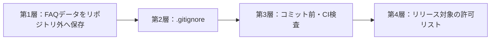

# ローカルFAQデータ・Git除外詳細設計書

### 2026-09-19 通常配布の生成・検査境界（C# 0.7.2）

通常配布の入口`npm run build:exe`は、リポジトリ外の新規出力先だけを使用する。省略時はWindowsのドキュメントフォルダー内に版・日時・識別子を付ける。配布対象は`standalone/KnowledgeApp.CSharp.exe`だけであり、内部のbuildフォルダー・合成検査資源・利用者データは配布しない。合成起動検査まで成功した結果とSHA-256をmanifestへ残す。生成時に本番・固定検証DBを開かず、依存復元を利用者FAQや他アプリの探索へ広げない。既存exe・出力先を無断上書きせず、失敗した出力は成功と扱わない。

### 2026-09-16 起動計測・単一exeの境界（C# 0.7.2）

起動の並行準備でも、DB整合検査・毎起動のフル安全バックアップ・失敗時停止・排他・ブラウザー一時領域の分離を維持する。DBの初期化・保存を画面表示後へ延期しない。計測・起動失敗・終了試験はTEMP直下の既存合成ルート規則に従うGUID専用領域だけを使う。テスト用DB factoryは名前を限定した内部アセンブリだけが呼べ、通常の起動引数・設定・環境変数から任意DBへ接続する入口を追加しない。旧版のソースは明示された保管先から隔離コピーし、合成専用ID・固定先でRelease再ビルドする。旧版と新版の実DB・未委譲FAQ・既存プロファイルを探索しない。

単一exeにはプログラム・UI・許可済み静的資源・依存ランタイム・補助exe・ライセンス案内だけを含める。既存配布許可リストとUIハッシュ検査を適用し、FAQ、DB、WAL、SHM、画像、バックアップ、ログ、個人結果を含めない。自己展開先は.NET標準の利用者別キャッシュであり、実行資源だけを持つ。FAQは固定の`jp.local.webknowledgesystem.csharp`、検証は従来の`.csharp-rehearsal`、ブラウザープロファイルは起動ごとの合成TEMPを使い、3領域の役割を混ぜない。exe差し替え・削除やキャッシュ整理をFAQ削除へ連動させない。

配布検査では`DOTNET_BUNDLE_EXTRACT_BASE_DIR`と`DOTNET_STARTUP_HOOKS`を検査用子プロセスにだけ指定し、当該テストが新規作成した隔離先へ展開する。通常起動前に終了する検査hookは配布exeへ同梱しない。実利用者の本番・固定検証DBへ到達させない。起動時間の数値は合成データの測定であり、実FAQ件数・実画像サイズを推定した結果とは扱わない。

用途別保存先とCodex連携先は、配布exeの親と展開キャッシュの両方に対して一致・子・祖先の重複を拒否する。本体側で外側exeの位置を検査してから補助プロセスへ渡し、補助側でも自身の実行資源を保護する。外側exeの場所へDBを保存するモードや、利用者が選んでいない資料・アプリの探索は追加しない。

既存のカスタムCodex連携先設定も再読込時に同じ重複検査を行い、所有者JSON・連携領域へのアクセス前に拒否する。exe移動で旧設定が不適合になっても、別の連携先へ自動変更しない。単一exe検査では、実行ファイルの配置先・展開先を指す合成設定がこの段階で拒否されることを確認する。

### 2026-09-06 起動修正の検証境界（C# 0.7.1）

画面資源の二重完了だけを修正し、DB第9版、実FAQ、認証ハッシュ、復旧キー、保存先とバックアップ形式は変更しない。実WebView2起動試験は`App.OnStartup`とDB初期化用`OnLoaded`を呼ばず、毎回OS一時フォルダーの専用合成ルートへブラウザープロファイルを作る。ブラウザー終了後に自分が作った領域だけを削除し、本番・固定検証DBや既存プロファイルを探索しない。FAQ・DB・パスワード等をGitへ絶対にコミットしない前提を維持する。

### 2026-09-06 保存先設定・複数人共有（C# 0.7.0実装）

Windows 11 PC上のHTTPS共有サービスを追加した。SQLite・画像はホストのローカル`%ProgramData%/KnowledgeApp.Shared`へ保存し、I-O DATA製NAS（型番未確認）はバックアップ先とする。単独利用のC#専用LocalApplicationDataと`--rehearsal`は維持する。共有接続では端末のDBを開かず、障害時にも自動切替しない。共有環境の初期管理者はローカルコンソールで非空パスワードを設定してからサービスを起動する。

3役割はadmin/editor/viewer。旧userをID・認証ハッシュ・監査保持のままeditorへ移行する。追加・編集・公開・複製・Codex明示委譲は管理者とFAQ編集者、削除・復元・マスター変更・一括入出力・バックアップ・システム設定は管理者に限定する。新規利用者の初期選択は閲覧のみ。最後の有効な管理者を保護し、役割・認証情報・有効状態の変更はログインと復旧キーを失効させる。閲覧者のFAQ・画像・関連FAQ・閲覧履歴は公開・表示中・未削除・未統合の条件で検査する。

DB第9版に役割制約、FAQのrevision、履歴のuser_id、Codex提案の所有者・系列を追加した。既存履歴と表示設定は移行時の先頭管理者（created_at、id順）へ引き継ぎ、それ以降は利用者別に保存する。共有FAQ更新は読込時のrevision必須、競合時はART-010で拒否し入力を保持する。復元は全接続を失効させ、空欄パスワードしかない管理者データの共有復元は正本置換前に拒否する。

管理者は端末ごとのバックアップ/JSON/CSVの書出・取込初期フォルダーを設定できる。共有管理者にはサーバーからNASへのバックアップ退避先も別表示する。設定はdevice-settings内で原子的に確定し、portableなバックアップには含めない。未設定と明示的な標準復帰を区別し、使用不能なカスタム先から黙って移動しない。Git内・再解析点・特殊パス・管理領域の重複を拒否する。接続確認は別プロセスを10秒で打ち切る。実転送は一時名へ保存・内容検査後に確定し、NAS転送失敗時も検証済みローカル退避を保持する。

単独利用のCodex連携先は、親フォルダーから専用子フォルダーを作成して切り替える。未処理提案を先に処理し、委譲履歴だけを複写、元ファイルを保持する。環境ID・世代・所有情報・Windows ACL・切替ロックをアプリと4本のプラグインコマンドで検査する。共有利用は環境/利用者別の専用端末領域とサーバーAPIで明示委譲だけを交換する。共有交換領域の親変更とCodexのNAS直接利用は初回共有版の対象外とし、別の境界・障害試験を経て追加する。実際のFAQ・DB・認証情報をGitへコミットしない前提を維持する。

共有APIはHTTPS・証明書検証・サーバーID照合を必須とし、任意Originを拒否する。接続ごとのメモリー内認証、画像/転送ファイルの所有権、利用者別Codex提案、失効確認をバックエンドで実施する。処理番号と内容ハッシュで同一書込の再送を照合する。SQLiteとファイルの業務操作は全体排他、待機15秒で未開始の混雑エラーを返す。正本の任意ローカル移設（段階C）、アプリ名・インストーラー文言再設計は別段階。

実装・合成試験と実環境導入を区別する。導入済みアプリ、実DB、実NAS、証明書ストア、Windowsサービス登録は開発作業で変更していない。具体的な導入・移行・残る実機確認は[共有サーバー導入手順](共有サーバー導入手順.md)、結果は[実装計画・記録](保存先設定・複数人共有_実装計画.md)を参照する。本書の後段に残る旧2役割・固定先・0.6.0以前の段階説明と下記旧計画より、本節の0.7.0仕様を優先する。

### 2026-09-06 テーマ・表現の更新

利用場所で題材を分ける説明を廃し、日常から仕事まで安全にFAQを活用する趣旨へ統一した。利用者データと認証情報のGit登録禁止を明記する。変更は文書上のテーマ・表現・保護原則の明確化であり、UI、機能、認証方式、DB形式、保存先、バックアップ、Git除外・検査の実装は変更しない。過去の試験結果と未確認事項は維持する。

### 2026-09-06 管理者パスワード復旧（C# 0.6.0実装）

復旧キーのハッシュ・世代・案内状態・試行制限をリポジトリ外のDBへ追加するDB第8版の非破壊マイグレーションを追加する。既存FAQ・利用者・認証ハッシュを保持し、既存キーは未発行とする。キーの平文と一時復旧権限は保存・ログ出力・Git登録せず、CSV／JSON・Codexへ復旧情報を出力しない。フルバックアップはキーのハッシュ・状態をDBの一部として含み、復元時は起動中の認証・復旧権限を破棄する。古いバックアップで以前のキーが有効へ戻り得ることを明記し、必要時は復元後に再発行する。実DBを調査せず合成データで検証する。 詳細・実装順序・試験は[管理者パスワード復旧 実装計画](管理者パスワード復旧_実装計画.md)を参照する。C# 0.6.0で実装し、下記の旧暫定認証・DB第7版固定の記述を本節で更新する。過去の試験・配布記録は当時の履歴として保持する。実利用環境の更新・受入を自動試験済みとは扱わない。

### C# 0.6.0の復旧処理・保存契約

- `0008_recovery_keys.sql`で`user_recovery_keys`を追加する。`user_id`はusersへの主キー兼外部キー、`key_hash`は未発行時NULL、`generation`はキー世代、`auth_version`は通常認証世代、`setup_state`はpending/existing/skipped/issued、`issued_at`は発行日時、`failed_attempts`は0～5、`blocked_until`はUTC停止期限である。全利用者に行を持たせ、発行・利用は有効な管理者本人だけに制限する。
- 新規利用者挿入時はpending、既存移行はexisting・キーNULLにする。本人のパスワード再確認付き発行でissuedへ、明示スキップでskippedへ更新する。一般利用者に初回案内を出さない。
- 暗号学的乱数の各バイトから32種類へ偏りなく割り当てた16文字（80ビット）を生成する。0/1/I/Oを除き、表示は4文字×4組。ASCII英字の大小・半角空白・ハイフンだけを正規化する。16バイトsalt・Argon2id（19MiB、反復2、並列度1、出力32バイト）でキーと通常パスワードをハッシュ化する。
- 未認証の`verify_recovery_key`は管理者ログインID・キーを照合し、C#のメモリに対象ID・キー世代・DB世代・UTC期限と単調時計の開始時刻を保持する。画面にはランダム32バイト由来の一時トークンと期限だけを返す。通常ログイン権限は与えない。5分で失効し、照合やキャンセルだけではキーを消費しない。
- `complete_password_recovery`は対象・世代・期限を再検査し、空欄でないパスワードと確認欄の一致を要求する。通常パスワード更新・旧キー無効化・新キー保存・認証世代更新を同一トランザクションで確定する。保存失敗は全体を巻き戻す。成功後は新キーを一度だけ表示し、別途通常ログインを要求する。
- パスワード・権限・利用可否の変更時はDBトリガーでキーと認証世代を失効させる。再発行はキー世代を進める。起動・復元の検査では必須行、ハッシュ形式、値範囲、日時、失効トリガーを検査する。復元でDBを変更する前にDB世代を変え、復元前のセッション・一時権限を拒否する。プレビューや不正バックアップの事前拒否だけでは通常セッションを失効させない。
- キー誤入力の回数と15分停止はDBに保存し、再起動で解除しない。キー未発行はREC-002、無効照合はREC-001、停止中はREC-003、期限切れ・失効はREC-004、空欄・確認不一致はREC-005で日本語案内する。
- 本番・検証ルートのDB第7版は書込前のコピー検査後、既存の安全退避領域へ検証済みフル`.faqbackup`を作ってから第8版へ更新する。退避失敗は移行しない。第1～6版DBの直置きは引き続き拒否する。第1～7版バックアップは原本を変更せずステージで第8版へ移行し、第8版の復元も可能とする。バックアップ形式は第1版を維持する。旧アプリへの第8版逆移行は保証しない。
- フルバックアップのDBにはキーのハッシュ・世代・状態を含む。平文キーと一時トークンは含めない。古いバックアップ復元では当時のパスワードやキーが戻るため、必要時は再設定・再発行する。CSV/JSON・Codex・ログには復旧情報を追加しない。Web Storageへ秘密を保存しない。
- 固定ホストAPIは`get_recovery_key_status`、`issue_recovery_key`、`skip_recovery_setup`、`verify_recovery_key`、`complete_password_recovery`、`cancel_password_recovery`とする。入力の余分な項目を拒否し、対象管理者を発行画面から任意指定させない。発行・照合・確定・スキップは既存の終了保護へ加える。

### 2026-09-06 実装前の計画履歴（冒頭の0.7.0仕様へ更新済み）

保存先可変化でもGit配下拒否・用途別パス検査・リンク迂回防止を維持し、設定時と実I/O時に検査する案とする。ネットワーク先は明示的なバックアップ/CSV/JSON入出力から対応を計画し、起動前安全退避・復旧記録・稼働DBはローカル保持を推奨する。端末依存パスはバックアップ復元だけで自動有効化しない。

詳細は[保存先設定・複数人共有 実装計画](保存先設定・複数人共有_実装計画.md)を参照する。今回の更新は計画の追記であり、現行C# 0.6.0の固定保存先・DB第8版・認証・配布物は変更しない。追加回答により、約50名が利用する可能性、管理者・FAQ編集者・閲覧のみ（新設）の3役割とし、管理者とFAQ編集者がFAQを追加・編集可能、常時起動PCまたはNASを利用可能という前提を確認した。現行の一般利用者は編集可能なのでFAQ編集者へ引き継ぐ案とし、新しい閲覧権限をC#とUIの両方で制限する。既存ID・認証ハッシュ・監査を保つ役割移行と権限改修を計画の先頭に置く。公開・削除等の詳細権限は計画書の推奨案として扱う。PCでC#共有サービスを運用しDB・画像はそのPC内、NASはバックアップ先とする案を第一候補とする。実際の同時利用数・管理者/FAQ編集者数・実機性能・NAS単独運用の可否は未確定である。

## 1. 文書情報

| 項目 | 内容 |
|---|---|
| 文書名 | ローカルFAQデータ・Git除外詳細設計書 |
| 版 | 0.85（単一exeの通常配布・生成検査境界） |
| 作成日 | 2026-08-08 |
| 上位文書 | `FAQシステム要件定義書.md` v1.59、`FAQシステム基本設計書.md` v1.80 |
| 対象 | 利用者が作成したFAQデータをGitHub等へ含めないための保存・検査設計 |

### 現在の正式保存先（2026-09-06確定）

C# 0.5.0で正式主系への切替報告を受領した。今回の復旧キー対応版0.6.0も同じ保存先を使用する。現行の正本は2.0.8の`LocalApplicationData/jp.local.webknowledgesystem.csharp`である。以降に残るTauriの保存先と試作の非接続条件は旧版・過去段階の説明として扱う。

保管先は利用者確認済みの`C:\Users\takow\Documents\game_development\program\old\KnowledgeApp_Archive\Tauri_0.4.4_20260906`とする。確定コミットのソースZIP・展開済みソース・旧インストーラーを区別して保存し、SHA-256照合後に旧版専用ファイルを作業ツリー外へ移す。旧ビルドキャッシュ等の退避物は再現元ソースZIPと区別する。DB、FAQ添付画像、利用者バックアップをソースZIP・配布物へ混ぜない。旧版/C#の利用者データと導入済みアプリは変更しない。履歴削除・force push・自動GitHub送信は行わない。

### 文書整理時の分離（2026-09-06）

利用者依頼による旧版/移行計画37文書の整理では、上記アーカイブ内の新規`document-cleanup-20260906/`へ原文をコピーし、全件のSHA-256一致を確認する。既存ソースZIPを上書きせず、現行ツリーからの削除は利用者に委ねる。[文書整理ガイド](文書整理ガイド.md)の一覧以外を削除対象に含めない。保管計画書1件には基準ZIP以後の更新があるため、古いZIPだけでなく今回の原文コピーを保管する。FAQのDB・画像・バックアップ、個人結果票、メール原本、導入済みアプリは読取・変更・整理対象にしない。C#配布物と再生成可能なビルド出力も文書削除から分離する。データ保存方式、Git除外規則、配布検査、安全境界は変更しない。

## 2. 目的

「日常から仕事まで、セキュアにFAQナレッジを活用できる」というテーマを、利用場所に依存しないデータ分離で支える。

**実際のFAQ・データベース・パスワードなどの利用者データや認証情報は、GitHubを含むGitリポジトリへ絶対にコミットしない。** 公開・非公開を問わず、DBのWAL／SHM、添付画像、履歴、バックアップ、CSV／JSONエクスポート、Codex提案・委譲、診断ログ、一時ファイル、外部資料、APIキー・トークン・秘密鍵・緊急認証情報も対象とする。文書・ソース・画像への転記も禁止する。

Git管理対象はプログラム、設計文書、秘密を含まない設定例、実データを含まない開発用フィクスチャー、配布用静的素材だけとする。利用者データは従来どおりリポジトリ外へ保存し、既存のGit除外、コミット前・CI・配布物検査を維持する。これらの混入検査だけで任意の本文中の秘密をすべて検出できるとはみなさず、コミット対象の差分でも転記がないことを確認する。設定例には実際に使える秘密値を記載しない。

利用者がアプリ上で作成したFAQ、履歴、添付画像、バックアップなどを、ソースコードのGitリポジトリやGitHub等のリリースへ混入させない。アプリ外で管理する外部資料本体はKnowledgeAppへ取り込まず、リポジトリやリリースへ複製しない。

FAQの題材が生成AI活用事例、PCトラブル、その他の内容であるかにかかわらず、同じ保護を適用する。本設計はFAQの題材を制限するものではない。

Surface実機試験で検出した画像保存不具合の修正では、Tiptapが表示用に追加する`width`・`height`属性をReact側で保存JSONから除外し、従来どおり管理画像の4属性だけをRustへ渡す。画像ファイル、DB列、添付メタデータ、保存先、バックアップ対象、Git除外パターンは変更しない。パスワード再設定ダイアログの入力値はReactの一時状態だけに保持し、ログやファイルへ保存せず、既存Rust処理がArgon2ハッシュだけを`users.password_hash`へ保存する。認証情報の保存先、DBスキーマ、バックアップ・エクスポート除外、Git除外方針も変更しない。

0.4.2診断版と0.4.3正式候補では、Rust側の画像参照検証を12分岐へ細分化するが、診断情報は固定コード、固定説明、安全化した属性名、文字数だけに限定する。FAQ本文、属性値、画像、絶対・相対パス、添付ID、DB内容をログや診断ファイルへ出力せず、Surfaceから返却する結果にも含めない。診断インストーラー、ZIP、結果票は利用者データではないがリリース試験成果物として`target`、Downloads、Surfaceの試験用フォルダにだけ置き、Gitへ含めない。

0.4.4の初期管理者緊急認証は、アプリコード内の固定Argon2ハッシュだけを使用する。平文をソース、SQLite、設定、ログ、診断、CSV、JSON、Codex委譲、バックアップ、リリース文書へ保存せず、DBスキーマ、`users.password_hash`、利用者データルート、バックアップ内容、Git除外パターンを変更しない。通常パスワードと利用停止判定を維持し、追加利用者へ緊急認証を適用しない。

`.msg`安全読取は、原本を読取専用で開き、ルートと宛先ストレージの標準MAPI項目だけをメモリ上で優先取得する。添付ストレージと添付データは読み取らず、原本、抽出途中データ、例外メッセージを利用者データフォルダ、ログ、Git、バックアップへ保存しない。標準MAPI項目に本文がない場合の互換解析でも、委譲対象は画面で確認・マスクした本文に限定する。自動試験では実メールを使わず、OS一時フォルダに生成して試験終了時に削除する合成`.msg`だけを使う。委譲時の選択・マスク、固定JSON、原本パス・ファイル名・添付の除外境界は変更しない。

C#認証・権限、分類・検索・FTS5、FAQ詳細・閲覧履歴およびSQLite移行基盤の段階試験は、OS一時フォルダ直下の`knowledgeapp-csharp-auth-{UUID}`、`knowledgeapp-csharp-search-{UUID}`または`knowledgeapp-data-check-{UUID}`だけを許可する。合成DB、WAL、SHM、移行前`.faqbackup`は同じ一時ルート内に作成し、試験終了時に接頭辞と一時フォルダ配下であることを再検証してから削除する。C#試作版へ本番DBのパスを渡すAPI、任意DBを開くAPI、任意SQLを実行するAPIは設けない。利用者が本番DBの変更・消去を許可した場合も、この段階ではその許可へ依存せず、合成DBだけで互換性を確認する。

C# FAQ編集・監査段階も同じ合成DB境界を使用する。新規・更新・複製・論理削除・復元は、`articles`、`article_tags`、`article_search_documents`、`article_search_fts`および監査列を1トランザクションで反映し、失敗時に部分保存しない。通常更新は旧検索情報と既存関連FAQを保持し、検索文書ではタイトル・概要・本文・タグだけを更新する。添付段階の完了後は、合成画像の一時保存・確定・巻戻し・独立複製・本文除去後削除を専用サービスだけに許可し、任意ファイル操作を公開しない。利用者テストの記入済みExcelはリポジトリ外へ保存し、合成FAQの結果だけを記録する。

C#検索・閲覧履歴段階も同じ合成DB境界を使用する。Reactから受ける操作は検索履歴一覧、閲覧履歴一覧、履歴削除の型付き3契約に限定し、DBパス、表名、列名、SQLを指定させない。削除対象は`search`または`view`の固定値と、検証済み日付範囲または全件指定だけを受け、1トランザクションで処理する。検索履歴削除時は閲覧履歴の`source_search_log_id`だけをNULLにし、閲覧履歴を連動削除しない。合成履歴、DB、WAL、SHMはOS一時ルート内だけに作成・破棄し、手動試験用Excelはリポジトリ外の固定テスト用フォルダへ置く。本番履歴、実FAQ、既存本番DBはこの段階で開かない。

C# CSV・JSON入出力段階も同じ合成DB境界を使用する。画面へ公開するファイル操作は、CSV／JSONそれぞれの保存先選択・読込元選択と固定6契約だけに限定し、任意拡張子、任意ディレクトリ走査、DBパス、SQLを受け付けない。選択後はC#側で絶対パス、`.knowledge-faq.csv`／`.knowledge-export.json`、既存親フォルダ、Git管理外を再検証する。合成入出力ファイルはリポジトリ外の`%TEMP%\knowledgeapp-data-check-{UUID}`または利用者手動試験用フォルダへ置き、テスト終了後に削除できる。取込前安全バックアップは合成データルートの`safety-backups`へ現行format version 1の`.faqbackup`として作成し、DBスナップショットと対象ファイルのサイズ・SHA-256をmanifestと照合する。CSV／JSON本体、安全バックアップ、部分ファイルをリポジトリや配布物へ含めず、利用者手動試験が合格するまで本番DBを開かない。

C#フルバックアップ・復元段階も同じ合成DB境界を使用する。Reactから公開するファイル操作は`.faqbackup`の保存先選択と復元元選択だけとし、C#側で管理者権限、絶対パス、固定拡張子、Git管理外、書込可否、空き容量を再検証する。作成時は合成データルートの`temp/full-backup-{UUID}`へDBスナップショットとアーカイブを組み立て、manifestのファイル数・サイズ・SHA-256を検証してから保存先の`.partial`を確定する。復元時は`restore-staging/restore-{UUID}`へ検証展開し、現在状態を`safety-backups`へ退避してからDB、`attachments/articles`、`manuals`、`settings`を入れ替える。失敗時はDBと管理フォルダを戻し、成功時は認証セッションを破棄する。`safety-backups`、`temp`、`restore-staging`、Codex領域、アプリ外で管理する外部資料本体はアーカイブへ含めない。合成バックアップ、部分ファイル、手動試験結果をGit・配布物へ含めず、利用者手動試験が合格するまで本番DBを開かない。

C#ファイル操作のタイムアウト修正では、固定7ダイアログと固定9入出力の待機をWebViewの起動中メモリだけで管理する。長時間入出力中はWPFの終了保護を維持し、完了前に合成DB・作業用ファイルを破棄しない。DBスキーマ、保存形式、保存先、バックアップ対象、認証、Git除外・配布許可リストは変更しない。自動試験は合成メッセージと既存の一時合成DBだけを使う。再テスト用Excelはリポジトリ外へ新規作成し、以前の記入済み結果を上書きしない。2026-09-05に利用者からタイムアウト再試験と残りのフルバックアップ項目の全合格を受領し、`backup_restore`ゲートを合格とした。

C# Codex連携段階も本番DBを開かず、同じ一時合成ルートだけを使用する。固定カタログ・提案箱・委譲フォルダは既存DBの合成ルートから導出し、画面から任意の保存先を指定させない。提案は1MB、委譲は5MB、通常ファイルとUTF-8厳格JSONに限定し、未知項目・不正形式・受付ID差替えを拒否する。受付・承認の双方で選択した委譲内容だけを検証し、メール原本、未選択FAQ、画像本体、外部資料本体へ読取範囲を広げない。画像ノードの属性・位置・順序を維持し、提案履歴は既存Rust JSONとの意味互換を保つ。受付記録・履歴・承認FAQ・必要な分類・検索索引・統合関係は既存DB列とトランザクションを使用し、DB版を追加しない。

Codex状態更新の固定7処理は実際の応答まで待機し、長時間入出力9件と合わせて終了保護する。待機情報は起動中メモリだけに保持する。分類変更・復元後はカタログを再生成するが、`codex-bridge`、`codex-inbox`、部分ファイルをバックアップ対象へ追加しない。DB内の提案履歴と受付記録は従来どおりSQLiteスナップショットに含まれる。専用自動試験45シナリオは一時合成DB・合成ファイルで合格し、利用者U1～U7の画面受入も完了した。実プラグインとC#本番固定ルートの往復は未確認であり、`codex_bridge`全体は未合格、本番未接続を維持する。

試作UI用`CodexSyntheticUiFixture.Seed(database)`は新規の`knowledgeapp-csharp-search-{UUID}`に限り固定合成FAQを確認し、合成委譲と3種類の提案を一度だけ生成する。利用者の認証、提案の履歴受付、元FAQの変更は行わず、既存・復元後ルートへ再生成しない。現行専用プラグインは本番固定ルートを使うため、試作の委譲番号から実プラグインを呼ばない。UI合成案、委譲、部分ファイルも合成ルート終了時の検証削除対象とする。

### 2.0.1 2026-09-05 Codex画面受入後のタグ・安全境界

第9段階U1～U7は利用者から全合格を受領した。実プラグインとC#本番固定ルートの往復は未実施であり、試作の合成委譲を本番向けプラグインへ送らない境界を維持する。

タグマスターの追加・名称変更・未使用削除をC#へ移植するが、既存の`tags`・`article_tags`と検索索引だけを同一トランザクションで更新する。FAQの本文・監査・履歴は変更せず、DB版・保存場所・バックアップ対象を追加しない。新しい必須`tag_master`ゲートを別に確認する。

タグ保存`save_tag`を実応答待機と終了保護へ追加し、長時間入出力9件・Codex状態更新7件と合わせて固定17件とする。待機情報は起動中メモリだけに置き、索引更新中の合成DB破棄を防ぐ。`delete_tag`の通常30秒期限は維持する。

`FileSystemBoundary`で許可された一時合成ルートのUUID・直下条件、ルートと既存祖先・対象の再解析点を検査する。DBを開く前、添付・一時ファイル、バックアップの収集元と入出力先、復元の移動元先、CSV/JSON処理で検証する。デバイスパス・代替データストリームとリンク経由のGit迂回を拒否し、通常のUNCバックアップは維持する。期限切れ一時画像の整理は既知のUUID生成名だけを対象とし、未知ファイルやリンク先の内容を読み書き・削除しない。異常なルートの終了時破棄は中止して残す。

通常UNCは`ValidatePathSyntax`で構文上許可するが、保存済みバックアップ先文字列の表示・設定取得では`Directory.Exists`などによる共有先への自動アクセスを行わない。実操作時だけ実体・アクセスを検査し、明示されていない共有先の探索や存在確認を追加しない。

WebViewへは実行ファイルから決定したUIの静的資産と、固定UUID配置の管理画像・一時画像だけをC#の許可応答で提供する。ルート全体をフォルダ公開せず、DB・設定・バックアップ・メタデータを提供しない。CSP、正規ドキュメントの送信元確認、ドキュメント世代、外部遷移・通信・フレーム・新窓・不要権限・ダウンロード拒否は起動中メモリだけで管理する。要求本文やパスを診断ログへ追加しない。

WebView2の利用者プロファイル・ブラウザーキャッシュは、既定のexe隣ではなく、明示指定した合成ルートの`temp/webview2-profile`だけへ保存する。`CreateAsync`後の`environment.UserDataFolder`を期待パスとI/Oなしで正規化比較し、不一致の場合はWebView初期化前に固定`SYS-001`で停止する。未知のプロファイル、環境変数、レジストリを読取・変更しない。プロファイルはリポジトリ・配布物・バックアップの対象とせず、以前の`bin`配下に残っている既存プロファイルを自動削除しない。

`HostShutdownPolicy`に従い、固定17処理の実行中は終了を拒否し、終了開始後の二重要求を抑止する。WebView2初期化と`BrowserProcessExited`を合計最大5秒まで待機した後にDBを破棄し、ブラウザープロセス終了と固定ルートの安全性を確認できた場合だけ合成ルートを削除して最終終了する。`Browser.Dispose`直後にプロファイルのロックが解放されたとはみなさない。期限超過・再解析点・ロック等で安全削除できなければ合成一時データを残し、パス・例外を含めない固定警告で通知する。強制削除、プロセスkill、他インスタンス操作を行わない。

検証は新規の独立した一時合成ルート、無害なマーカーと合成ファイルだけを使い、拒否時に別の試験ルートの内容が変わらないことを確認する。リンクの破棄でリンク先を再帰削除しない。本番DB・外部資料・メールを確認対象へ広げず、個人記入用のMarkdown結果は従来のリポジトリ外フォルダへ保存する。本番固定ルート・配布環境を含む全ゲートの完了までは本番切替しない。

タグC#合成24シナリオ、FileBoundaryの合成junction、実Dispatcher配線とDataCheck全体、SecurityCheckの既存98シナリオ、CodexCheck再試験45シナリオの自動試験は合格した。終了制御32件とプロファイル照合12件を追加したSecurityCheck計142件もすべて合格した。2026-09-05に利用者からT1～T8全項目合格の報告を受領し、タグ操作・画面回帰・通常入出力・終了確認の受入を完了した。T2は自然文検索の共通部分一致として受容し、検索・DB・ファイル境界の設計は変更しない。本番環境の確認は未実施であり、今回の合格を本番切替の許可として扱わない。

### 2.0.2 2026-09-05 単一起動・検証用パッケージ

第11段階のC#単一起動では、Windows利用者ごとの試作専用OS排他と表示要求専用IPCを使う。ロックファイル、FAQ、認証情報、送信引数を保存しない。第2起動ではDB・一時データ・WebViewを追加作成しない。試作識別子は本番Tauri版と分離し、既存版の強制終了や本番DB接続を行わない。排他の解放はDB・ブラウザーの終了処理後とし、安全な一時ルート破棄の条件を緩和しない。

同梱UIはexe隣接の`ui`だけから読み、祖先・カレントディレクトリ・環境変数で別UIへ切り替えない。パッケージ生成では新規出力先、再解析点検査、最終配置の許可リストとハッシュ照合を使う。画面資産はビルド済みの`index.html`と許可された静的資産だけとし、ビルドフォルダーの無差別コピーで既存WebViewプロファイルやデータを持ち込まない。成果物と依存物情報はGit除外されたビルド先またはリポジトリ外の検証フォルダーに置く。

実行時は従来のOS一時フォルダー直下の合成ルートを使い、DB・画像・WebViewプロファイルをパッケージ内へ生成しない。利用者テストの記録はリポジトリ外へ新規作成する。DB版・本番保存先・バックアップ対象・検索方式・本番プラグインとの境界は変更しない。本番固定ルート、永続化、データコピー比較、NSIS・更新・アンインストールは今回のパッケージ試験と分離して後続ゲートに残す。

### 2.0.3 2026-09-05 C#固定検証データの保持

第11段階P1～P4は利用者から全合格を受領した。第12段階から試作UIのDBはWindows利用者の`LocalApplicationData/jp.local.webknowledgesystem.csharp-rehearsal`に保持する。本番`jp.local.webknowledgesystem`、リポジトリ、exe隣には保存しない。新しい固定ルートには初回だけ空のDB・初期管理者を作成し、従来のFAQ・Codexサンプルは投入しない。検証用でも利用者が入力した内容はGit管理・配布の対象外である。

初期化中／完了の固定マーカーは環境の識別だけを持ち、FAQ本文・利用者情報・パスワードは含めない。完了確認前の既存データ、初期化途中、DB欠落・破損・現行以外の版では停止し、再初期化・別ルートへの退避的起動・元データ削除を行わない。復元は既存の管理対象だけを入れ替え、ルート直下の環境マーカーは変更しない。マーカーもバックアップ・Git・配布物の対象外とする。

添付、履歴、設定、入出力、Codexの管理元だけを固定検証ルートへ広げ、管理内パス・再解析点・Git混入防止・HTTP/HTTPSとコピー専用境界は維持する。新しい管理元検証と、従来の合成ルート削除許可を分離する。永続ルートへ再帰削除APIを適用しない。任意データルートを利用者・画面・CLI・環境変数で上書きする機能は設けない。本番DB・メール原本・外部資料の探索は行わない。

WebView専用の起動ごとの一時ルートは`%TEMP%/knowledgeapp-csharp-search-{UUID}`へ別途生成する。ここにはDBを作らず、ブラウザー終了を確認できた場合だけ今回生成したルートを整理する。永続領域のFAQ・画像・設定は正常終了・待機期限超過のいずれでも削除しない。既存の期限切れ一時画像整理は既知の生成名だけを対象とし、未知ファイルや過去のプロファイルを一括削除しない。

自動試験はinternalの試験境界から厳格な一時合成ルートだけを使い、実際の固定検証ルートや本番DBを読取・変更しない。実画面試験では空の専用環境と利用者が作成した合成内容だけを使用する。短いMarkdownの手順・結果は`Documents/KnowledgeApp_Test/outputs/csharp-rehearsal-20260905`に置き、過去のExcel・Markdown結果を保持する。合格は継続保存の検証環境に限定し、本番コピー比較・実Codex往復・正式配布の合格へ広げない。

メール委譲はホストが明示注入する検証ルートの`codex-bridge/mail-delegations`だけへ保存する。既定の本番用providerを検証画面で生成しない。保存・破棄の都度、固定検証ルートと委譲ディレクトリまでの実体境界を再検証する。実プラグイン未接続のため、メール画面で本番向け依頼文をクリップボードへコピーしない。原本の自動走査、添付読取、DB読取範囲、バックアップ対象は広げない。

初期化完了後は、明示的に保存したバックアップや個人フォルダーなど未知の項目を探索・削除せず無視し、既知の管理ディレクトリだけを検証する。初期化マーカーのない非空ルートは引き続き拒否する。SQLite事前検査は元DBの副作用を避けるため、DBと既存WALを読取ハンドルで保持して専用の一時コピーへ取り、そのコピーだけにSQLite接続する。元の補助ファイルを生成・変更せず、拒否時の元ファイルのSHA-256保持も合成試験する。一時検査コピーだけを終了時整理し、永続ルートを削除対象にしない。

`.gitignore`と混入防止検査へ固定検証フォルダー名と初期化中／完了マーカーを追加し、実行時の環境識別ファイルもソースや配布物へ混入させない。第12段階は74件の専用自動試験、既存回帰とパッケージ19件、実行物・UI照合が合格した。2026-09-05に利用者R1～R4も全合格を受領した。本番・対象環境の残条件は未実施として分離する。

### 2.0.4 2026-09-05 C#旧版バックアップの復元作業領域

第13段階では、管理者が明示的に選んだ正規の第1～7版DBを含む`.faqbackup`だけを、同じC#固定検証ルートへ復元する。第1～6版は検査用コピーと`restore-staging`の生成DBだけを現行SQLで第7版へ移行し、元バックアップ・本番DBを変更しない。スキーマ・履歴・外部キー・認証・本文・添付の検査完了前に現在の検証DBや画像を置換しない。旧版DBの固定ルートへの直置きは引き続き起動拒否とする。

復元直前の現在データのフルバックアップ、DB・管理ファイル入替失敗時のロールバック、復元成功時のログアウトを維持する。初期化マーカー、Codex提案・委譲、ブラウザープロファイル、安全バックアップ自身、外部資料本体を復元対象へ追加しない。作業領域の整理は今回生成した管理内パスだけを再検証して行い、固定ルートや利用者が指定した元ファイルへ再帰削除を適用しない。

合成試験の生成コードはソース管理し、生成したDB・画像・旧版バックアップはリポジトリ外の専用一時領域に作る。利用者用の合成第5・6版フィクスチャーは`Documents/KnowledgeApp_Test/runtime/csharp-legacy-backup-20260905/fixtures`、新規のB1～B4記録は`Documents/KnowledgeApp_Test/outputs/csharp-legacy-backup-20260905/CSharp_旧版バックアップ互換_試験記録.md`へ置く。旧R1～R4記録と既存パッケージを上書きしない。配布物へDB・バックアップ・個人結果を含めない。

### 2.0.5 2026-09-05 C#本文・復元確認の補完

第13段階B1～B4は利用者から全合格を受領した。第14段階の本文互換は既存のDB第7版・保存先・画像管理・CSV/JSON形式を変更しない。長文と深いJSONのテストデータは生成コードからOS一時合成ルートへだけ作り、実FAQを読み込まない。個人用の試験手順と合成フィクスチャーはリポジトリ外の`Documents/KnowledgeApp_Test`へ新規保存し、過去の記録を上書きしない。第14段階の配布物・合成JSONは`runtime/csharp-content-restore-20260905`、手順と個人結果は`outputs/csharp-content-restore-20260905`へ分離する。JSON取込は同じ読込済み文書へ検査と反映を固定し、対象ファイルの途中差替えで未検査の内容を取り込まない。

復元確認トークンと認証セッションへの結び付け、パス、アーカイブSHA-256は起動中メモリだけで保持する。SQLite、設定、履歴、バックアップ、CSV/JSON、Codex委譲、診断ログへ保存しない。最終読取ハンドルの実体と照合し、差替え・別パス・期限切れ・再使用は現在の検証データに書き込む前に拒否する。生成ステージと安全バックアップの既存管理境界を維持し、本番データルート・外部資料・メール原本へ対象を広げない。

### 2.0.6 2026-09-05 C# Codex深さ互換の合成検証

第14段階C1～C4（C2再試験を含む）は利用者から全合格を受領した。第15段階のCodex JSON全体127コンテナへの互換補完は、DB第7版、提案・委譲の形式と容量、固定保存先、原子的書込、履歴保持、バックアップ対象を変更しない。既存の深い提案履歴を読むために保存形式を変換・再作成せず、Codex本文や履歴を新たな診断ログへ出力しない。実メール、実FAQ、未選択FAQ、画像本体、外部資料をCodexが探索することもない。

自動試験の深い本文、委譲・提案・履歴、互換比較のファイルは新規の厳格なOS一時合成ルートだけへ生成する。生成コードはソース管理できるが、生成されたJSON・SQLite・画像・バックアップは管理対象外とする。境界超過の拒否では元の合成DB・既存ファイルが不変であることを確認する。

手動用の合成FAQ1件・分類1件は、専用の空の合成DBで今回のC4後の管理ID1の状態と衝突しない管理ID2を採番し、通常のJSON書出しを通して生成する。空環境とFAQ1件・分類1件・PNG1件・ブルー設定の合成環境へ実出力を取り込み、ローカル委譲と元データ保持を自動検証する。実DBから空き番号を探索せず、既存の管理ID2がある場合は従来どおり取込を拒否する。

第15段階パッケージと合成JSONはリポジトリ外の`Documents/KnowledgeApp_Test/runtime/csharp-codex-depth-20260905`、手順と個人結果は`outputs/csharp-codex-depth-20260905`へ別名保存する。旧パッケージ・C1バックアップ・C2不合格記録・再試験結果を上書きしない。手動では利用者が選んだ合成FAQだけを現在の検証ルート内へ委譲し、本番固定ルートへコピーせず、現行プラグインへ依頼文を送信しない。過去段階の一連操作と区別し、実連携・本番・正式配布の未実施を合格扱いにしない。

### 2.0.7 2026-09-06 最終候補のデータ保護

通常起動の固定検証ルートは維持する。本番候補だけが固定引数・ネイティブ確認・起動排他の後に`LocalApplicationData/jp.local.webknowledgesystem`を開く。パス変更引数・設定・環境変数による任意ルート指定は設けない。旧Tauriの既存有効第7版DBを再初期化せず、空環境だけへ`.knowledgeapp-csharp-initializing`／`.knowledgeapp-csharp-initialized`を作成する。マーカー・DB・既存WAL・管理ファイルの実体検証を維持し、合成ルートを削除するAPIの許可範囲を本番へ拡張しない。

起動前の退避は`safety-backups/KnowledgeApp_before_csharp_{GUID}.faqbackup`へ毎回固有名で作成・検証する。安全退避は通常のバックアップの対象へ再帰的に含めず、自動世代削除もしない。元のバックアップとCodex提案・委譲は復元で巻き戻らないため、実切替・切戻し前に未処理依頼を整理する。認証情報をログへ出力せず、既存hashを引き継ぐ。

復元中断の記録は固定`restore-pending.json`、確定前は`restore-intent-{UUID}.partial`を使い、許可された安全バックアップの葉名とSHA-256・形式だけを保存する。任意絶対パスを受け付けず、記録・退避・DB・管理ファイルの検証失敗は`BK-012`で停止する。復旧用の作業コピーは管理内`restore-staging/recovery-{UUID}`だけを使用する。復旧自身の中断時も同じ記録から再実行でき、記録は整合復旧の完了後だけ削除する。DBを欠落状態で新規作成してごまかさない。実行時記録・初期化マーカーはGit・配布・通常バックアップの対象外とする。

起動中ロックの0バイトファイル`.knowledgeapp-installation-lock`はインストーラーが導入先へ作成し、アプリがread/FileShare.Readで保持する。FAQ内容を含まず、DB用マーカーと役割を分ける。元の配布ペイロードへ実行時のファイルを混入させない。NSISの削除試験はTEMPのGUID隔離導入先と専用テスト用HKCUキー・ショートカットのみで行い、ユーザーの旧版・本番インストール・データフォルダーに対して実行しない。

自動試験は全て新規合成ルートを使う。C#/Rustのバックアップ実往復、PowerShellコマンドの委譲・提案往復も合成入力だけを使い、本番SQLite・FAQ・画像・メール原本を探索しない。個人用結果は従来どおりリポジトリ外へ保存する。今回の実行環境で登録済みプラグインが確認できない場合、ソース修正とコマンド試験までとし、無断の登録・設定変更・キャッシュ置換で実連携済みとしない。

第16段階の実行物では候補使用をハード無効化し、本番DBを開かない。Rust起動保護は`restore-pending.json`と`.knowledgeapp-csharp-initializing`のメタデータだけを確認し、本文・退避アーカイブをRustから探索しない。存在・リンク偽装・検査不能時はC#での復旧確認を案内して止める。未更新の旧exeはこの保護を持たないため、既存インストールやショートカットを無断変更せず、切戻し入口の確認を後続へ残す。

### 2.0.8 2026-09-06 C#正式切替時の分離

C# 0.5.0の本番ルートはOSの`LocalApplicationData/jp.local.webknowledgesystem.csharp`へ固定し、旧Tauriの`jp.local.webknowledgesystem`および検証用の`jp.local.webknowledgesystem.csharp-rehearsal`から独立する。従来2.0.7の共有ルート候補は廃止する。通常起動で旧DB・WAL・SHM・添付・メール・未委譲FAQを探索またはコピーしない。空の専用ルートへ初期管理者を用意し、引継ぎは利用者がアプリで選択した正規`.faqbackup`だけを通常復元する。復元後は引継ぎ元の認証を使い、既存セッションは無効になる。

起動・復元前の安全バックアップと`restore-pending.json`はC#専用領域へ保存する。C#復元・復旧・終了整理は旧版と検証領域を変更しない。旧版は切替直前の退避状態として残り、以後の更新はC#だけへ記録する。逆方向の引継ぎが必要なら、C#の最新バックアップを旧版アプリで明示復元し、自動同期やファイル直置きは行わない。

4つのプラグインコマンドは`[Environment]::GetFolderPath(LocalApplicationData)`から同じ専用rootを解決する。Codexは指定委譲番号のJSONまたは新規依頼の分類カタログだけを読む。旧ルートへの自動フォールバック・保留提案の自動移動・未選択メール走査はしない。既存の本文サイズ・深さ・マスク・承認・監査の境界は保持する。

専用rootの名前をGit除外・混入検査にも追加する。実際のバックアップ、DB、FAQ本文、画像、登録状況の個人結果はGit対象にしない。正式NSISは別のC#導入先へ実行物だけを配置し、更新・アンインストールでデータrootを削除しない。合成分離試験はTEMPの2rootだけを使い、本番rootを直接比較・ダンプしない。

### 2.1 2026-08-16 一人利用試行時のデータ境界

2026-08-16付で延期したコード署名、正式配布、Surface再試験、広範なWindows手動試験、表示・アクセシビリティ、大容量画面応答、ネットワーク・UNC障害および実環境の資料参照の確認は、本書の保存・Git除外要件を緩和しない。一人利用試行でも、DB、WAL、SHM、添付画像、履歴、バックアップ、CSV、JSON、Codex提案・委譲、診断ログ、一時ファイル、アプリ外で管理する外部資料をリポジトリや配布物へ含めてはならない。

対象PCでは、対象コミットを固定してリポジトリを取得した後、`scripts/setup-git-hooks.ps1`を実行する。アプリ起動後は利用者データルートがリポジトリ外のWindows利用者別ローカルデータフォルダであることを確認し、実FAQ登録前にローカルのフルバックアップを作成して検証データの復元を1回確認する。コミット前と配布物作成前には`scripts/check-no-runtime-data.ps1`を実行する。

コード署名を延期する間は、取得元のブランチ・コミットまたはインストーラーのSHA-256を固定して出所を確認する。ネットワーク・UNCバックアップ試験が完了するまではローカルバックアップだけを正式な退避先とし、アプリ外で管理する外部資料を実FAQへ登録するまでは合成パス・合成URLだけを検証に使用する。正式配布または複数人利用へ移る場合は、延期事項を再開して要件定義書v1.35と基本設計書v1.46の条件を満たす。

CSV一括編集で生成・選択する`*.knowledge-faq.csv`はFAQタイトル、概要、回答本文、作成者・更新者等を含む利用者データであり、保存場所がアプリのデータルート外でもソース管理・リリースへ含めない。アプリはGit管理フォルダ内のCSV入出力を拒否し、`.gitignore`と禁止ファイル検査も固定拡張子を拒否する。Excel互換のため実行時CSVだけはUTF-8 BOM・CRLFで生成するが、これはソースコード・設計文書のUTF-8 BOMなし・LF規則の例外であり、CSV自体を追跡しない。

DB第7版の`categories.management_code`、`articles.management_code`、`management_code_sequences`は`knowledge.db`内へ保存し、完全バックアップ・復元へ含める。内部UUIDを保持したままCSV形式第2版には`CAT-00001`／`FAQ-00001`形式の管理IDだけを出力する。既存行は移行時に補完し、新規行はDBトリガーで採番する。削除後も採番表を巻き戻さず、同じ管理IDを別データへ再利用しない。外部ファイル、保存フォルダ、Git除外パターンは追加しない。

管理IDのゼロ埋めは最低5桁であり、採番値`100000`以降は6桁以上へ自然に拡張するため、5桁到達による枯渇は発生しない。FAQまたは分類の採番値が9万件へ達した場合は、採番表や既存コードを初期化せず、表示幅、CSV・バックアップ容量、一括処理性能、運用手順を再評価する。評価結果によって形式変更が必要になった場合は、旧管理IDとの対応を保持する移行設計を別途作成する。

DB第6版の`users`、`articles.created_by_user_id`、`articles.updated_by_user_id`は`knowledge.db`の一部として、従来と同じデータルート、Git除外、完全バックアップ、復元の対象にする。パスワードは空欄を許可しても平文を保存せずArgon2ハッシュだけをDBへ保存し、診断ログ・CSV・Codex委譲へ含めない。空パスワード許可方針は既存`app_settings`の`password_policy`へ保存し、OFFへ切り替えても既存ハッシュを変更しない。CSVの作成者・更新者列は表示名だけで、パスワードハッシュ、利用状態、権限、最終ログインは含めない。

Codex FAQ標準構成と画像利用方針は、既存の概要とTiptap本文へ記載する内容・順序、および画像追加を案内する判断規則であり、新しいDB列、ファイル形式、保存先、バックアップ対象、Git除外パターンを追加しない。標準構成で作成された提案も従来どおり利用者確認前のローカルFAQデータとして扱い、`codex-inbox`へ保存してソース管理とリリースから除外する。下書き取込後に利用者が追加した画像・スクリーンショットは既存の`attachments/articles`へ保存し、他のFAQ添付画像と同じGit除外・バックアップ規則を適用する。

緑・青のカラーテーマ、検索結果タイトルのトップ分類名表示、FAQマスコット表示、空パスワード許可方針は、既存SQLiteの`app_settings`へ保存し、新しい保存フォルダ、ファイル形式、Git除外パターンを追加しない。これらはFAQ本文ではないが端末設定として利用者データルート内に留め、DBスナップショットを介してフルバックアップ・復元の対象とする。分類接頭辞は表示時に現在の分類階層から生成し、`articles.title`、検索索引、Codex提案へ保存しない。

FAQ詳細から一覧へ戻るための検索語・分類・下書き表示はURL検索パラメーター、スクロール位置はWebViewの`sessionStorage`へ一時保持する。この一時状態はFAQ、検索履歴、端末設定の正本ではなく、SQLite、利用者データフォルダ、バックアップ、エクスポート、リポジトリへ書き込まない。復元後またはアプリ終了時に破棄されるため、本書のGit除外パターンとバックアップ対象は変更しない。

複数タブ利用時のFAQ検索・一覧と各FAQ詳細の縦スクロール位置は、Reactの起動中メモリへ画面キーと数値だけを保持する。FAQ本文、検索語、パスその他の利用者データを含めず、SQLite、Web Storage、利用者データフォルダ、検索・閲覧履歴、バックアップ、エクスポート、リポジトリへ書き込まない。タブの均等縮小もReactとCSSの表示だけで完結するため、新しい保存先、Git除外、リリース許可項目を追加しない。

検索結果の現在ページはURL検索パラメーターへ、分類ツリーで閉じた分類IDはWebViewの`sessionStorage`へ一時保持する。ページングはSQLiteから指定範囲を読み取るだけで新しいテーブル・列・履歴を追加しない。分類ツリーの開閉状態はアプリ終了時に破棄し、端末設定、FAQ、検索履歴、利用者データフォルダ、バックアップ、エクスポート、リポジトリへ保存しない。

検索結果の並び順はURL検索パラメーターへ一時保持し、Rust側で既存の`articles.updated_at`または`articles.importance`を使って全一致結果を並び替える。検索パネルの単色化と枠調整はReactとCSSの表示だけを変更する。どちらもDB列、設定値、検索履歴項目、新しいファイル、利用者データフォルダ、バックアップ、エクスポート、Git除外パターン、リリース許可リストを追加・変更しない。

Codex提案画面の上部説明、委譲方針バナー、確認待ち0件時の案内を簡素化する変更は表示文言だけに限定する。Codex提案、履歴、分類カタログ、委譲ファイル、SQLite、利用者データフォルダ、バックアップ、Git除外の保存形式・対象・保護方針は変更しない。

Codex連携用保存先の表示を提案画面から設定画面へ移す変更では、Rustが分類カタログと提案箱の既存固定パスを端末情報として返し、Reactは参照表示だけを行う。利用者入力、フォルダ選択、保存先変更コマンド、DB設定値を追加せず、appLocalDataDir、Git除外、バックアップ除外、プラグインの受け渡し先を変更しない。

コピー用テキスト枠は、既存の`articles.body_doc_json`へTiptapの`copyBlock`ノードとして保存し、新しいDB列、ファイル、保存フォルダ、Git除外パターンを追加しない。コピー操作は保存済み文字列をWindowsクリップボードへ一時的に書き込むだけであり、クリップボードの既存内容、コピー成否、コピー履歴をDB、診断ログ、利用者データフォルダへ保存しない。リッチテキスト文書形式版は2へ更新し、フルバックアップのmanifestへ記録するが、DBスキーマ版とバックアップ対象は変更しない。

新着・更新の表示終了日に端末の現在日付から7日後を初期表示する処理は、FAQ編集画面で空欄を補完するだけとする。保存時は既存の`articles.new_badge_until`または`articles.updated_badge_until`へ従来どおり`YYYY-MM-DD`を保存し、DBスキーマ、マイグレーション、バックアップ、Git除外対象を変更しない。回答欄直下の開発者向け説明枠を削除する変更も表示だけに限定し、画像、参考URL、コピー用テキスト枠の保存・検証・権限は変更しない。

統合FAQの公開後に元FAQを「統合済み」とする機能は、DB第5版の`article_merge_relations`へ統合元・統合先・版確認日時・統合日時を保存する。新しい外部ファイル、保存フォルダ、Git除外パターンは追加しない。関係は`knowledge.db`のスナップショットとしてフルバックアップ・復元対象に含め、元FAQの本文、状態、非表示、論理削除を変更しない。統合解除では関係行だけを削除する。

FAQ基本情報の入力単位カード、必須・任意バッジ、未入力・フォーカス・エラー時の強調はReactとCSSの表示だけを変更する。新規FAQの分類を空欄から開始する処理も保存前のReact状態だけであり、選択後は既存の`articles.category_id`へ保存する。入力項目、保存形式、SQLite、利用者データフォルダ、バックアップ、エクスポート、Git除外パターンを変更せず、新しい永続設定や操作履歴を追加しない。

FAQ回答区分の説明文変更はReactの静的表示文言だけに限定し、FAQ本文、入力値、SQLite、利用者データフォルダ、バックアップ、エクスポート、Git除外パターンを変更しない。

FAQ編集画面の検索情報・関連FAQ入力を外し、タグマスター選択へ置き換える変更では、初期DBから存在する`tags`と`article_tags`をそのまま正本に使用する。タグの追加・名称変更・未使用時削除はSQLite内で完結し、新しいDB列、外部ファイル、保存フォルダ、Git除外パターンを追加しない。タグ名称変更ではIDを維持して使用中FAQと検索索引へ反映する。FAQで使用中のタグは削除を拒否する。旧`article_symptoms`等の検索情報、`article_relations`、JSON内の既存値は互換データとして保持し、画面に表示しない既存値もFAQ編集保存時にそのまま送って消去しない。これらは従来どおり`knowledge.db`、JSON、完全バックアップの保護対象であり、リポジトリやリリースへ含めない。

2026-08-16の実装画面確認後、この境界を`0.4.0`の正式な保存設計として確定した。FAQ作成・編集画面から旧項目が見えないことを、旧データの削除許可とは解釈しない。将来の関連FAQ再設計までは、`article_relations`を直接更新する新しい画面・コマンドを追加せず、既存値の読取互換と非破壊保存だけを維持する。

FAQマスコットの`src/assets/mascot/faq-owl-spritesheet.webp`と`src/assets/mascot/faq-owl-mugi-spritesheet.webp`は、開発用に明示して作成した画面表示用の同梱静的素材としてGitとリリースで管理する。通常時の静止表示、眠り、友達の訪問・交流・帰宅はReactの一時的な画面状態として扱い、操作履歴や友達の滞在状態を保存しない。これらは利用者がFAQ本文へ追加する添付画像ではなく、`appLocalDataDir`、SQLite、フルバックアップ、JSONエクスポートへ複製・保存しない。既存の`src/assets`許可とリリース許可リストの範囲で扱うため、利用者データのGit除外パターンは変更しない。

ムギを含む場面を元スプライトセルの縦横比で表示する修正は、ReactとCSSの表示寸法だけを変更する。WebPアトラス本体、ファイル名、保存場所、SQLite、利用者データフォルダ、バックアップ、エクスポート、Git除外パターン、リリース許可リストは変更しない。

検索結果を2列カードから1列の横長カードへ変更する作業は、Reactの表示構造とCSSだけを変更する。FAQ、分類、検索履歴、端末設定の保存形式、SQLite、利用者データフォルダ、バックアップ、エクスポート、Git除外パターン、リリース許可リストは変更しない。

FAQ管理一覧の通常・詳細切替、操作メニュー集約、コンテナー幅に応じたカード表示はReactとCSSの一時的な画面状態だけを変更する。作成者・更新者はDB第6版の既存参照値を詳細表示時に描画し、表示モードと開いているメニューをSQLite、Web Storage、ファイル、履歴へ保存しない。DBスキーマ、バックアップ、CSV、Git除外パターン、リリース許可リストを変更しない。

共通ヘッダーとFAQ検索画面の文言簡素化は、Reactの表示文字列と見出し余白だけを変更する。FAQ、分類、検索履歴、端末設定の保存形式、SQLite、利用者データフォルダ、バックアップ、エクスポート、Git除外パターン、リリース許可リストは変更しない。

FAQ詳細タブはReactの起動中メモリだけに`articleId`と表示タイトルを最大10件保持する。FAQ検索・一覧と各FAQ詳細の縦スクロール位置も画面キーごとの数値として同じ起動中メモリだけに保持する。SQLite、Web Storage、設定ファイル、検索・閲覧履歴、バックアップ、エクスポートへタブ状態または画面別スクロール位置を書き込まない。同じFAQを再度開いても同じタブを使い、11件目の操作では既存タブを自動削除しないため、新しい利用者データやGit除外パターンを追加しない。

C#試作版はbundle identifier互換の固定値`jp.local.webknowledgesystem`と、最終的に同じ`%LOCALAPPDATA%\jp.local.webknowledgesystem`を使用する。現行Tauri版とC#版が同じ本番DBへ同時接続することは禁止し、書込機能を含む全同等性ゲートが合格するまではC#試作版から既存DBを開かない。認証、分類・検索、FAQ詳細およびFAQ編集段階のWPFホストは起動ごとの合成DBだけを開き、詳細取得成功後の明示要求で同じ合成DBの`view_logs`へ閲覧履歴を追加し、FAQ編集操作は同じ合成DB内だけへ反映する。ウィンドウ終了時にルート全体を破棄する。C#の`bin`、`obj`、発行物はビルド成果物としてGitへ含めない。

メール原本は利用者が明示した外部フォルダに置いたまま読取専用で扱い、`appLocalDataDir`、リポジトリ、配布物、フルバックアップへ複製しない。選択・確認・マスク済み本文だけを`codex-bridge/mail-delegations/{delegationId}.knowledge-mail-delegation.json`へ原子的に保存し、通常バックアップから除外する。原本パス、未選択メール、添付、Outlookプロファイル、認証情報を委譲、ログ、診断へ含めない。処理途中のプレビューはメモリを優先し、一時ファイルが必要な場合だけ`temp/mail-preview/{sessionId}`へ置いて終了・破棄時に削除する。

## 3. 結論

次の4層で保護する。



| 層 | 役割 | 位置づけ |
|---|---|---|
| 第1層 | Tauriの利用者別ローカルデータフォルダへ保存する | 主対策 |
| 第2層 | 誤ってリポジトリ内へ生成されたファイルをGitから除外する | 補助対策 |
| 第3層 | 強制追加や既追跡ファイルをコミット前・CIで検出する | 必須の最終検査 |
| 第4層 | インストーラーへ含めるファイルを明示的に限定する | 配布時の対策 |

`.gitignore`だけには依存しない。Gitの除外規則は未追跡ファイルを対象とし、すでに追跡されたファイルや`git add -f`による強制追加を防げないためである。

## 4. 固定する識別子

### 4.1 Tauri bundle identifier

内部識別子を次で固定する。

```text
jp.local.webknowledgesystem
```

- `tauri.conf.json`の`identifier`へ設定する。
- 画面上の正式名称が後で変わっても、内部識別子は変更しない。
- 識別子を変更するとTauriが解決する利用者データパスが変わるため、初回データ保存後の変更は禁止する。

### 4.2 Windows上のデータルート

Tauriの`appLocalDataDir`は、Windowsのローカルアプリデータフォルダとbundle identifierからアプリ専用パスを解決する。

想定パス：

```text
C:\Users\{Windowsユーザー}\AppData\Local\jp.local.webknowledgesystem\
```

実装ではパス文字列を組み立てず、Rust側でTauriのパス解決APIを使用する。

## 5. データ保存設計

### 5.1 データルート構成

```text
{appLocalDataDir}/
├─ data/
│  ├─ knowledge.db
│  ├─ knowledge.db-wal
│  └─ knowledge.db-shm
├─ attachments/
│  └─ articles/
├─ manuals/                  # 旧版バックアップ互換用。現行画面からは追加しない
├─ logs/
├─ restore-staging/
├─ safety-backups/
├─ settings/
├─ temp/
├─ codex-bridge/
│  ├─ categories.json
│  ├─ delegations/
│  │  └─ {delegationId}.knowledge-delegation.json
│  └─ mail-delegations/
│     └─ {delegationId}.knowledge-mail-delegation.json
└─ codex-inbox/
   └─ {requestId}.knowledge-proposal.json
```

| ディレクトリ | 内容 |
|---|---|
| `data` | SQLite DBとジャーナル |
| `attachments/articles` | FAQ本文へ挿入した画像 |
| `manuals` | 旧版バックアップ互換用の予約領域。現行画面からは追加せず、誤配置時のGit混入防止対象として維持する。 |
| `logs` | 診断ログ |
| `restore-staging` | 復元中の一時展開 |
| `safety-backups` | DB移行・復元・CSV取込の直前に自動作成するローカル安全バックアップ |
| `settings` | DB外の端末設定 |
| `temp` | FAQ保存前の一時画像など。メールプレビューが一時ファイルを必要とする場合は`mail-preview/{sessionId}`へ限定する。 |
| `codex-bridge` | FAQ本文を含まない分類カタログ、利用者が画面で選んだFAQの修正・統合用委譲、および選択・確認・マスク済みメール本文の新規FAQ用委譲。メール原本、原本パス、未選択メール、添付は置かない。 |
| `codex-inbox` | 利用者確認前のCodex FAQ提案。DBへ未反映のローカル利用者データとして扱う。 |

画面のカラーテーマ、タイトル分類表示、FAQマスコット表示の設定は`settings`配下へ別ファイルを作らず、`data/knowledge.db`内の既存`app_settings`テーブルへ保存する。キー`appearance`のJSON値`{"colorTheme":"green|blue","showTopCategoryInTitle":true|false,"showMascot":true|false}`を表示設定に使用し、空パスワード許可は独立キー`password_policy`の`{"allowEmptyPasswords":true|false}`へ保存する。ReactからDBパスや任意SQLを受け取らず、未保存時は各表示項目と空パスワード許可をONとする。既存テーブルを使うためDBマイグレーションを追加しない。

### 5.2 禁止する保存先

通常実行、開発実行のどちらでも、次にはFAQデータを書き込まない。

- 現在の作業ディレクトリ
- Gitリポジトリのルートと配下
- `src`、`src-tauri`、`public`、`tests`、`docs`
- 実行ファイルの配置フォルダ
- Tauriのリソースフォルダ

### 5.3 データルート解決処理

Rustバックエンドに`DataRootService`を置き、アプリ起動時に一度だけ解決する。

処理順：

1. Tauriの`app.path().app_local_data_dir()`相当でパスを取得する。
2. 必要なディレクトリをRust側で作成する。
3. 作成後の絶対パスを正規化する。
4. データルートがリポジトリ、実行ファイル、リソースフォルダの配下ではないことを確認する。
5. 書き込み・読み取りの簡易確認を行う。
6. 成功したパスをアプリ状態へ保持し、Repository、添付、バックアップ、ログサービスへ渡す。

パス解決または検証に失敗した場合は起動を中止し、FAQデータを`./data`などへ代替保存しない。失敗時のフォールバックを現在の作業ディレクトリに置かないことが重要である。

### 5.4 フロントエンドとの境界

- React側へデータルートの書き込み権限を直接与えない。
- React側からDB絶対パスや保存先パスを指定させない。
- 現行版のDBと画像への操作は型付きTauri Commandを通してRust側で行う。C#移行版は同じ用途別契約をWebView2メッセージで実装する。アプリ外で管理する外部資料本体を読み書きする汎用Commandは公開しない。
- メール走査は利用者が明示指定したフォルダを1回だけ読取専用で扱う専用処理とし、任意フォルダを常時監視するAPI、Codexから走査を開始するAPI、原本を返すAPIを公開しない。
- 画面へパスを表示する必要がある場合は、診断目的の読み取り専用情報として返す。
- 任意SQL、任意ファイル書き込み、任意フォルダ削除の汎用コマンドを公開しない。

### 5.5 自動テスト

- 自動テストではOSの一時ディレクトリにテスト専用データルートを作る。
- テスト用データルートは依存注入で`DataRootService`へ渡し、本番コードの保存先決定ロジックを上書きしない。
- テスト終了時に一時ディレクトリを破棄する。
- テスト用DBや添付ファイルをリポジトリへ書き出さない。

2026-09-05以降の段階試験記録はMarkdownを基本とし、Excelは必須にしない。自動試験、Codexの実画面操作、利用者確認を区別し、未実施の確認を合格として扱わない。個人が記入するチェックリストと結果は形式にかかわらず`%USERPROFILE%\Documents\KnowledgeApp_Test\outputs\{フェーズ名}`へ保存し、リポジトリ、アプリデータ、配布物、フルバックアップへ含めない。テンプレートであっても個人記入用は実施者名、端末情報、エラー詳細などが後から記入されるため、リポジトリ内へ保存しない。既存のExcel結果を保存し、同意なしに新方式へ置換・上書きしない。緊急認証情報、実パスワード、実FAQ・メール本文、実ファイルパスを本文、セル、コメント、画像へ記録しない。ソース管理可能な合成試験コード・設計手順・結果要約には個人情報と実データを含めない。

### 5.6 DB版更新と復元時移行

- DBスキーマ第2版では、`articles`へ新着表示終了日、更新表示終了日、非表示の3項目を追加する。
- DBスキーマ第3版では、`categories.description`と`codex_proposal_receipts`を追加する。既存分類の説明は空文字とし、既存FAQを変更しない。
- DBスキーマ第4版では、確認待ち・承認・却下のCodex提案履歴と依頼系列を保持する`codex_proposal_history`を追加する。既存FAQを変更しない。
- DBスキーマ第5版では、統合元から統合先への解除可能な関係を保持する`article_merge_relations`を追加する。既存FAQには関係を自動付与しない。
- DBスキーマ第6版では、`users`と`articles`の作成者・更新者FKを追加する。利用者が0件なら初期管理者`0000`を空パスワードのArgon2ハッシュで作成し、既存FAQのNULL監査列を初期管理者へ補完する。
- DBスキーマ第7版では、分類とFAQへ人間向け管理IDおよび採番表を追加する。既存行は移行時に`CAT-00001`／`FAQ-00001`形式で補完し、採番値は削除後も再利用しない。
- 新規DBは第1版の初期構造を作成後、未適用マイグレーションを順番に実行して第7版にする。
- 第1～6版DBを開いた場合は、移行前安全バックアップを検証してから利用者データフォルダ内の同じDBへ各マイグレーションを順番に適用する。既存FAQの新着・更新は未設定、非表示はOFF、統合関係は未設定、作成者・更新者は初期管理者、管理IDは既存順で補完する。
- 第1～6版DBを含む完全バックアップは復元対象として許可し、復元直後に同じ移行、初期管理者・監査情報・管理ID補完を実行する。現在のアプリより新しいDB版は復元しない。
- マイグレーションSQLはソース管理対象とするが、移行対象の実DBとバックアップは従来どおりリポジトリ外へ置く。
- 自動テストではOS一時フォルダに第1～6版の旧DBを作成し、第7版への移行、既存FAQの保持、初期管理者と監査列、管理ID、分類説明、受付記録・提案履歴・統合関係を確認する。
- コピー用テキスト枠は既存の`body_doc_json`へ保存するためDBマイグレーションを追加しない。新規保存または更新したFAQの`body_format_version`を2とし、第1版本文は変更せず第2版の読取処理で互換表示する。フルバックアップの`rich_text_format_version`も2とし、第1版バックアップの復元を継続して許可する。

### 5.7 Surface実機リハーサル用合成データ

- `tests/release-fixtures`には、実FAQ・履歴・添付・認証情報を含まないことが明示された開発用フィクスチャーだけを置く。
- 6桁管理ID用JSONはソース上では`six-digit-management-id.fixture.json`とし、通常の利用者エクスポートを示す固定拡張子を追跡しない。Surface上で試験を始めるときだけコピーを作成し、`*.knowledge-export.json`へ変更する。
- `base-faq.fixture.csv`は10,000件CSV生成スクリプトの自動検査専用である。SurfaceではKnowledgeApp自身が書き出した合成FAQ CSVを入力にして、`New-KnowledgeAppLargeCsvFixture.ps1`が試験用`*.knowledge-faq.csv`を生成する。
- `external-reference-test.html`はJavaScript、iframe、外部リソース、機密情報を含まない。外部HTMLをKnowledgeAppへ取り込む資料ではなく、コピーした参照先を利用者がブラウザーで開く責任境界の実機確認だけに使う。
- Surface検証パッケージと生成した旧版・現行版インストーラー、ZIP、合成CSV・JSON、バックアップ、結果作業ファイルは`src-tauri/target/release`またはSurfaceの試験用フォルダへ置き、Gitへ追加しない。
- 結果票と正式文書には実施結果、版、ハッシュ、件数、時間、エラー番号だけを記録し、DB、FAQ本文、パスワード、機密パスを持ち帰らない。

## 6. `.gitignore`設計

### 6.1 配置

リポジトリルートの`.gitignore`をGitで管理し、すべての開発環境へ同じ除外規則を配布する。

### 6.2 除外対象

| 分類 | 主なパターン |
|---|---|
| ルート直下の誤生成データ | `/data/`、`/attachments/`、`/manuals/`、`/backup/`、`/exports/`、`/logs/`、`/codex-inbox/`、`/codex-bridge/` |
| メール委譲・原本 | `*.knowledge-mail-delegation.json`、`*.msg`、`*.pst`をすべて拒否する。解析試験が必要な場合も、追跡ファイルへ置かずOS一時フォルダの合成データを使う。 |
| SQLite | `*.db`、`*.db-*`、`*.sqlite*` |
| フルバックアップ | `*.faqbackup`、`*.faqbackup.*` |
| JSONエクスポート | `*.knowledge-export.json` |
| Excel編集用FAQ CSV | `*.knowledge-faq.csv` |
| Codex提案・委譲 | `*.knowledge-proposal.json`、`*.knowledge-delegation.json` |
| 作成途中・復元退避 | `*.partial`、`/restore-staging/`、`/safety-backups/`、`/tmp/` |
| ローカル設定 | `.env`、`.env.*`、`/settings/local/` |
| ビルド成果物 | `/node_modules/`、`/dist/`、`/src-tauri/target/` |
| ローカル検討資料 | `/2026.08.08_ChatGPTとの会話.txt` |

`package.json`、`tsconfig.json`、Tauri設定、マイグレーション、設計書など、開発に必要なJSON・SQL・文書は除外しない。そのため、すべての`*.json`や`*.sql`を一括除外しない。

### 6.3 エクスポートの固定拡張子

利用者が作成するJSONエクスポートは、表示名を自由入力できても、最終的なファイル名を次の形式にする。

```text
{任意名}.knowledge-export.json
```

これにより、通常のソースJSONと区別し、`.gitignore`と検査スクリプトの両方で確実に検出する。

Excel編集用FAQ CSVは次の形式に固定する。

```text
{任意名}.knowledge-faq.csv
```

CSVはFAQ本文を含むため、`.knowledge-export.json`と同じくGit管理・リリースを禁止する。通常の開発用`.csv`フィクスチャーを一括除外せず、FAQ実データと判別できる固定複合拡張子だけを対象にする。

CSV形式第2版は、内部UUIDの代わりに`FAQ-`／`CAT-`接頭辞と5桁以上の連番からなる管理IDを含む。接頭辞によりFAQと分類を判別でき、Excelで先頭ゼロが数値変換により失われることを防ぐ。管理IDはFAQ本文と同様に利用者データとして扱い、診断ログやリポジトリへ転記しない。

### 6.4 注意事項

- `.gitignore`は未追跡ファイルを無視する仕組みであり、すでに追跡中のファイルには効かない。
- `.gitignore`へ追加する前に追跡されたデータは、Gitのインデックスから明示的に外す必要がある。
- `git add -f`は除外規則を上書きできるため、コミット前・CI検査を必須とする。

## 7. コミット前検査

### 7.1 検査スクリプト

実装開始時に次を作成する。

```text
scripts/check-no-runtime-data.ps1
```

スクリプトは次を検査する。

1. Gitで追跡中の全ファイル
2. コミット対象としてステージされた追加・変更ファイル
3. 禁止されたルートディレクトリ
4. 禁止拡張子とDBジャーナル
5. ローカルFAQデータの既知ファイル名

### 7.2 禁止パターン

ルート相対パスで次を拒否する。

```text
^(data|attachments|manuals|backup|backups|exports|logs|restore-staging|safety-backups|tmp|codex-inbox|codex-bridge)/
```

場所にかかわらず次を拒否する。

```text
*.db
*.db-*
*.sqlite
*.sqlite-*
*.sqlite3
*.sqlite3-*
*.faqbackup
*.faqbackup.*
*.knowledge-export.json
*.knowledge-faq.csv
*.knowledge-proposal.json
*.knowledge-delegation.json
```

`src/features/attachments`のようなソースコード用ディレクトリは、ルート直下ではないため拒否しない。アプリアイコンや画面素材も、`src/assets`または`src-tauri/icons`にある場合は許可する。

### 7.3 Git hook

- リポジトリ内に共有用pre-commit hookを置く。
- 初期設定スクリプトで`core.hooksPath`を共有hookへ向ける。
- pre-commitから`check-no-runtime-data.ps1`を実行する。
- 検出時はコミットを中止し、該当パスと除去方法を表示する。

hookは`--no-verify`で回避できるため、hookだけを安全境界にしない。

### 7.4 文字コード検査

- `.gitattributes`で追跡テキストをUTF-8運用の前提となるLFへ統一し、Git設定`core.autocrlf`による環境差を防ぐ。
- `.editorconfig`で対応エディターへUTF-8（BOMなし）・LFを指示する。
- `scripts/check-text-encoding.ps1`は追跡対象、またはコミット対象のテキストを厳密なUTF-8として読み取り、UTF-8 BOM、置換文字`U+FFFD`、NUL文字、CRを検出した場合は失敗する。
- PowerShellで文字列ファイルを読み書きする場合は`-Encoding UTF8`またはBOMなし`UTF8Encoding`を明示し、環境ごとに異なる既定文字コードを使わない。
- pre-commitでは文字コード検査を利用者データ混入検査より先に実行する。CIでもビルド前に同じ検査を行う。

## 8. CI検査

### 8.1 実行タイミング

GitHub Actionsで次のタイミングに検査する。

- push
- pull request
- リリース作成前

### 8.2 検査内容

1. `scripts/check-text-encoding.ps1`を実行する。
2. `scripts/check-no-runtime-data.ps1`を実行する。
3. Gitで追跡されている全パスを検査する。
4. React・Rustテスト、型検査、Rust整形、Clippyを実行する。
5. `npm run tauri build`でNSISインストーラーを生成する。
6. `scripts/check-release-bundle-config.ps1`でNSIS、利用者単位、空の`resources`、外部バイナリーなし、現行版インストーラー1件を検査する。
7. `scripts/check-no-runtime-data.ps1 -ReleaseDirectory`で、ビルド後の配布フォルダにDB、バックアップ、エクスポート、添付画像、アプリ外で管理する外部資料がないことを確認する。
8. インストーラーのSHA-256を記録し、CI成果物として保存する。
9. 検出時はビルド・リリースを失敗させる。

CIは`.gitignore`を再確認するのではなく、実際にGitで追跡されているファイルを検査する。

## 9. リリース梱包

### 9.1 許可リスト方式

現行版はTauriの`bundle.resources`を空配列とし、実行時の利用者データや外部管理資料を追加リソースとして梱包しない。Reactのビルドへ含める画面用素材はソース管理された静的UI素材だけに限定し、`externalBin`も設定しない。

許可候補：

- アプリアイコン
- 画面表示に必要な同梱素材
- `src/assets/mascot/faq-owl-spritesheet.webp`と`src/assets/mascot/faq-owl-mugi-spritesheet.webp`を含むアプリ固有の静的UI素材
- 初期DBマイグレーション
- 検索の初期除外語・同義語定義（FAQ内容を含まないもの）

禁止：

- `%LOCALAPPDATA%`配下の全ファイル
- `knowledge.db`とジャーナル
- 利用者が作成したFAQ、履歴、画像、アプリ外で管理する外部資料、旧版互換用`manuals`データ
- `.faqbackup`、JSONエクスポート、FAQ CSV
- 診断ログ

### 9.2 リリース前確認

- 通常配布は`npm run build:exe`で生成し、`Test-CSharpStandaloneExe.ps1`で同梱依存・展開後のUI・保存境界・合成DBのログイン表示を確認する。
- NSISを配布する場合は、C#の`Test-CSharpReleasePackage.ps1`と`Test-CSharpInstallerRegression.ps1`による配布物・導入更新削除の検査を追加する。
- `scripts/check-no-runtime-data.ps1 -ReleaseDirectory`で配布フォルダ全体を検査する。
- 対象PCでは新しいWindows利用者環境へ単一exeだけをコピーして起動する。NSIS版を配布する場合はその導入も確認する。
- 初回起動時に空のDBが利用者データフォルダへ作成されることを確認する。
- exe配置先・展開キャッシュにFAQデータが存在しないことを確認する。
- 開発PCのFAQが初期表示されないことを確認する。

## 10. バックアップ・エクスポート

- フルバックアップは利用者が選択した保存先へ作成する。
- JSONエクスポートは`.knowledge-export.json`を使用する。
- Excel編集用CSVは`.knowledge-faq.csv`を使用し、Git管理フォルダを保存先・読込元にしない。
- 保存先の初期値をGitリポジトリやアプリのインストールフォルダにしない。
- 開発実行・通常実行を問わず、選択された保存先がGitリポジトリ配下と判定できる場合は保存を拒否し、別の保存先を案内する。
- リポジトリ配下へ誤保存しても、`.gitignore`と検査スクリプトがGit登録を防ぐ。
- 復元前の安全バックアップは利用者データルート内の`safety-backups`へ作成し、フルバックアップへ再帰的に含めない。
- CSV取込前も`safety-backups`へ完全バックアップを作成する。取込成功・失敗にかかわらず、利用者が明示的に整理するまで安全バックアップを保持する。
- 既存DBの版が現行版より古い場合も、DBを書込み可能で開く前に`safety-backups`へ`KnowledgeApp_before_migration_v{旧版}_to_v{新版}_{日時}.faqbackup`を作成する。検証完了前にマイグレーションを始めず、失敗時は旧DBを変更しない。
- 自動安全バックアップの保存先を、利用者が選んだ「前回成功したバックアップ先」として`settings/backup.json`へ記録しない。

### 10.1 Codexによる新規FAQ下書き時の取扱い

- KnowledgeAppは起動時、分類変更後、復元後、提案一覧更新時に`codex-bridge/categories.json`を再生成する。FAQ本文・概要・件数・履歴・添付・外部資料の参照先・内容は含めない。
- KnowledgeApp専用Codexプラグインの通常コマンドは、`%LOCALAPPDATA%\jp.local.webknowledgesystem\codex-bridge\categories.json`だけを読み、`codex-inbox`へだけ提案を書き込む。SQLiteを開く機能を持たせない。
- 提案は`{requestId}.knowledge-proposal.json`とし、同じフォルダに一意な`.partial`を完成させてから名称変更する。同じ受付番号が存在する場合は上書きしない。
- アプリは通常ファイル、固定拡張子、最大1MB、ファイル名と受付UUID一致、厳格JSON、許可リッチテキストを確認する。新規・統合は画像なし、修正は委譲元と同じ画像参照集合に限定し、不正提案からDBや添付フォルダを変更しない。
- 取込時は既存分類、または新規分類案1件をRust側で再検証し、FAQ下書きと受付記録を同じDBトランザクションで保存する。成功後に提案ファイルを削除し、削除できない場合も受付記録で再取込を防ぐ。
- `codex-inbox`、`codex-bridge`、`.knowledge-proposal.json`、`.partial`はフルバックアップ対象外とする。分類カタログは復元後に再生成し、確認前提案は端末移行の正本にしない。
- 提案箱・分類カタログをGitへ追加せず、ルート除外、拡張子除外、コミット前検査、CI検査で検出する。
- 実FAQの元情報をCodexへ提示できるかは利用環境の規定を優先し、利用者が会話で明示的に提供した内容以外を自動収集しない。
- 結論、手順、注意、備考、参考リンクの標準構成は提案JSON内の既存`faq.summary`と`faq.bodyDoc`で表現し、提案ファイルの保存場所、拡張子、上限、原子的保存、Git除外を変更しない。
- 画像・スクリーンショットが視認性・理解を実質的に高める場合も、新規・統合の提案JSONには画像ノード、外部画像URL、Base64、添付画像本体を含めない。Codexは提案送信後に追加対象の手順、画像内容、挿入位置、代替テキスト案を案内し、利用者が下書き取込後に既存の画像取り込み機能で追加する。利用条件が不明な画像は使わず、個人情報・機密情報・認証情報は除去またはマスクする。

### 10.2 CodexによるFAQ整理・統合時の取扱い

- 既存FAQ1件の修正または2～10件の統合では、利用者がKnowledgeApp画面で対象を選び、`codex-bridge/delegations`へ委譲ファイルを作成する。Codexがリポジトリだけを確認してもFAQ実データを取得できない構成を維持する。
- 委譲ファイルにはFAQ ID、委譲時更新日時、分類ID・表示階層、タイトル、概要、Tiptap本文、状態、重要度、添付のID・名称・代替文・形式だけを含める。DB、検索・閲覧履歴、未選択FAQ、添付画像本体、ローカルファイルパスを含めない。
- 修正案で画像・スクリーンショットが有用でも、添付画像本体が委譲されないため新規画像を追加しない。委譲元の画像ノード、参照、位置、代替テキストをそのまま維持し、追加・削除・並べ替えを行わない。
- Codexプラグインは利用者が依頼文で指定した委譲番号の通常ファイルだけを最大5MBまで読み、別番号やフォルダ全体を走査しない。
- 修正・統合提案の`seriesId`、元FAQ ID・更新日時が委譲ファイルと一致することをRust側で再検証する。
- 修正は現在DBの更新日時も照合し、委譲後に変更されたFAQへ古い案を上書きしない。統合案の承認は新規下書きだけを作り、この時点では元FAQを変更・削除しない。
- 提案はDB第4版以降の履歴へ保存する。却下後も内容を保持し、同一依頼系列で自身より新しい提案がない最新版だけを再検討へ戻す。
- 統合下書きを新着期限付きで公開した後、利用者が確認した場合だけ、DB第5版の`article_merge_relations`へ元FAQから統合先への関係を保存する。保存直前に委譲時更新日時と現在の元FAQを再照合し、変更・削除・別統合が1件でもあれば全件をロールバックする。
- 統合済みFAQは検索索引や本文を削除せず、通常検索SQLから除外する。FAQ管理・詳細では統合先を表示し、解除時は関係行だけを削除して元の状態・非表示設定を再利用する。統合済みFAQを別のCodex委譲へ含めない。
- 多数FAQの整理・統合を依頼する場合は、利用者が`.knowledge-export.json`をリポジトリ外へ出力し、対象ファイルと作業範囲を明示する。
- Codexが作成した統合候補は、アプリのJSONインポートで形式検証、差分プレビュー、利用者確認を行い、事前のフルバックアップ後にトランザクションで反映する。
- Codexから`knowledge.db`、WAL、SHM、添付画像フォルダを直接変更しない。検索索引、関連情報、論理削除、添付参照の不整合を防ぐため、SQLiteへの直接書き込みを統合経路にしない。
- JSONエクスポートと統合候補をGitへ追加せず、作業後も利用環境の規定と利用者のデータ管理方針に従ってリポジトリ外で保管または削除する。
- 実FAQをCodexへ提示できるかは利用環境の規定を優先し、パスワード、秘密鍵、個人情報その他の保存禁止情報を含めない。
- JSONエクスポート・インポート機能が未実装の間は、Codexによる実FAQの一括整理・直接統合を正規運用として実施しない。

## 11. Git開始時の確認

2026-08-08にローカルGitリポジトリを初期化し、`.gitignore`と共有hookを設定した。GitHubへ初めてpushする前、および除外規則を変更した場合は次を確認する。

1. `.gitignore`を最初のコミットへ含める。
2. `git status`で登録対象を一件ずつ確認する。
3. `git check-ignore -v`でDB、バックアップ、JSONエクスポート、FAQ CSVの代表パスが除外されることを確認する。
4. `git ls-files`で利用者データが追跡されていないことを確認する。
5. コミット前hookを設定する。
6. CI検査が成功してからGitHubへpushする。

2026-08-16の初回公開では、`yknk1015/local-knowledge-app`をPublic、既定ブランチを`main`とする。初回push前に、公開対象の全コミットで作成者・コミッター情報をGitHubの`noreply`へ統一し、個人メールアドレスを公開履歴へ含めない。書き換え前後の対応と検査結果は`GitHub公開記録.md`へ保存する。Public化しても本書の除外対象は変更せず、正式配布または機密情報を含む運用へ進む前に公開範囲を再確認する。

## 12. 誤登録時の対応

### 12.1 push前

1. コミットまたはpushを停止する。
2. 該当ファイルをGitのステージ・追跡対象から外す。
3. FAQデータをリポジトリ外の正しい保存先へ移す。
4. `.gitignore`と検査スクリプトへ不足パターンを追加する。
5. `git ls-files`とコミット差分を再確認する。

### 12.2 push後

GitHub等へpushした場合、通常の削除コミットだけでは履歴に残る。公開範囲と内容を確認し、リポジトリ管理者の方針に従って履歴から除去する。必要な対応が完了するまで新しいリリースを停止する。

## 13. 受入条件

| ID | 受入条件 |
|---|---|
| DATA-01 | FAQ登録後、`knowledge.db`がTauriのappLocalDataDir配下に存在する。 |
| DATA-02 | FAQ登録、画像追加、外部資料参照の記載後も、リポジトリ配下に利用者データや外部資料本体の複製が生成されない。 |
| DATA-03 | appLocalDataDirの解決に失敗した場合、`./data`へ代替保存せず起動エラーになる。 |
| DATA-04 | React側から任意のDB保存先を指定できない。 |
| DATA-05 | Codex用分類カタログに分類メタデータだけが含まれ、FAQ本文・件数・履歴を含まない。 |
| DATA-06 | Codex提案を承認するまでSQLiteへFAQを登録せず、承認後は必ず下書きとして登録する。 |
| DATA-07 | 新規分類案の作成、FAQ下書き、受付記録が同じトランザクションで成功または失敗する。 |
| DATA-08 | 既存FAQの委譲ファイルに、選択したFAQ以外の本文、DB、履歴、添付画像本体、外部資料本体が含まれない。選択FAQ本文にコピー用参照先が含まれる場合は、利用者が選択・委譲した本文の一部として扱う。 |
| DATA-09 | 修正案は委譲後に元FAQが変更されていない場合だけ反映し、統合案は元FAQを変更せず新規下書きにする。 |
| DATA-10 | 却下提案を履歴へ保持し、同一依頼系列では最新の却下案だけを再検討できる。 |
| DATA-11 | Codexが新規・統合FAQへ画像追加を案内しても提案JSONに画像データを含めず、下書き取込後に利用者が追加した画像を`attachments/articles`へ保存して、ソース管理とリリースから除外する。修正案は委譲元の画像参照を変更しない。 |
| DATA-12 | カラーテーマ設定が利用者データルート内の`app_settings`へ保存され、リポジトリ配下へ設定ファイルを生成しない。フルバックアップと復元で選択値を保持できる。 |
| DATA-13 | タイトル分類表示設定を`app_settings`へ保存して再起動・バックアップ・復元後も維持し、ON/OFF、分類名変更、FAQ移動のいずれでも`articles.title`、検索索引、Codex提案へ分類接頭辞を書き込まない。 |
| DATA-14 | FAQマスコット表示設定を`app_settings`へ保存して再起動・バックアップ・復元後も維持し、リポジトリ配下へ設定ファイルや操作履歴を生成しない。 |
| DATA-15 | コピー用テキスト枠が既存の`body_doc_json`だけへ保存され、コピー内容・成否・クリップボード既存内容を新しいファイル、履歴、診断ログへ保存しない。リッチテキスト形式第1版のFAQとバックアップを引き続き読み取れる。 |
| DATA-16 | 設定画面に表示するCodex分類カタログ・提案箱のパスが`DataRootService`の固定値と一致し、Reactから保存先を指定・変更できない。表示移動によって新しい設定値、フォルダ、バックアップ対象を追加しない。 |
| DATA-17 | 新着・更新の表示終了日初期値が既存列へ保存され、初期値計算と回答欄の説明枠削除によって新しいDB列、設定値、ファイル、履歴、バックアップ対象、Git除外パターンを追加しない。 |
| DATA-18 | 統合FAQの公開成功後に利用者が確認した場合だけ、未変更・未削除の元FAQ全件を`article_merge_relations`へ同一トランザクションで保存する。元FAQの本文・状態・非表示・論理削除は変更せず、通常検索除外と統合先表示を行い、解除後は元の設定へ戻る。関係中の統合先は公開・非表示OFFに保ち、非表示・下書き・廃止・論理削除を拒否する。関係はDBスナップショットのバックアップ・復元対象となり、外部ファイルやGit除外パターンを追加しない。 |
| DATA-19 | FAQ基本情報の視認性改善と新規FAQ分類の未選択初期化が保存前のReact表示状態だけに限定され、選択後は既存の分類IDを保存する。DB列、設定、ファイル、履歴、バックアップ対象、Git除外パターンを追加・変更しない。 |
| DATA-20 | FAQ回答区分の説明文変更がReactの静的表示だけに限定され、FAQ本文、DB、設定、ファイル、履歴、バックアップ対象、Git除外パターンを追加・変更しない。 |
| DATA-21 | 検索結果の並び順がURLだけへ一時保持され、既存の更新日時・重要度で検索時に並び替えられる。検索パネルの単色化と合わせて、DB列、設定値、検索履歴項目、ファイル、バックアップ対象、Git除外パターンを追加・変更しない。 |
| DATA-22 | DB第6版で利用者、Argon2パスワードハッシュ、FAQ作成者・更新者をDBへ保存し、旧DB・旧バックアップから初期管理者へ安全に補完できる。パスワードハッシュをCSV、Codex委譲、ログへ含めない。 |
| DATA-23 | CSVで未変更の回答本文は現在の構造化本文を保持し、変更本文だけをプレーンテキスト段落へ置換する。取込前バックアップ、SHA-256再検査、全行トランザクションにより失敗時に部分反映しない。 |
| DATA-24 | 空パスワード許可方針を`app_settings`の独立キーへ保存し、OFF後の利用者追加・パスワード再設定だけを拒否する。既存の`users.password_hash`、DBスキーマ、保存フォルダ、Git除外パターンを変更せず、フルバックアップ・復元で設定値を保持する。 |
| DATA-25 | FAQ管理一覧の通常・詳細切替、行操作メニュー、カード表示がReactとCSSの一時状態だけで完結し、FAQ・監査情報・設定・履歴を変更しない。画面を開き直すと通常表示へ戻り、バックアップ・CSV・Git除外対象を追加しない。 |
| DATA-26 | DB第7版で既存・新規のFAQと分類へ一意な接頭辞付き管理IDを付与し、CSV形式第2版には内部UUIDを出力しない。削除後も採番済み番号を再利用せず、旧DB・旧バックアップを移行しても既存FAQを保持する。数値部は最低5桁とし、`99999`超では6桁以上へ自動拡張する。採番値9万件を目安に表示幅・容量・性能・運用を再評価する。 |
| DATA-27 | 外部資料参照は既存の`body_doc_json`内のコピー用テキストまたはHTTP/HTTPS参考URLとして保存し、新しい外部ファイル、DB表、保存フォルダを作らない。パスは自動オープンせず、外部資料本体を検索・バックアップ・Git管理へ取り込まない。初期DBの`manuals`関連表とフォルダは旧版互換用に非破壊で保持する。 |
| DATA-28 | 初期管理者緊急認証は固定Argon2ハッシュをアプリコード内だけに保持し、平文、利用回数、入力値を利用者データ、ログ、診断、エクスポートへ保存しない。初期管理者の通常ハッシュ、DBスキーマ、バックアップ、Git除外パターンを変更しない。 |
| DATA-29 | FAQタブと、FAQ検索・一覧およびFAQ ID別の縦スクロール位置が起動中メモリだけで完結し、SQLite、Web Storage、設定、履歴、バックアップ、エクスポートへ保存されない。 |
| DATA-30 | C#試作版が現行データルートを互換先として報告する一方、書込同等性ゲート合格前は既存本番DBを開かず、現行版と同時接続しない。 |
| DATA-31 | メール委譲には選択・確認・マスク済み本文だけが含まれ、原本パス、未選択メール、添付、Outlookプロファイル、認証情報を含まない。原本と委譲はGit・配布・通常バックアップへ含まれない。 |
| DATA-32 | C#段階移植DBはOS一時フォルダ直下の固定接頭辞だけを許可し、Rust版と同じ第1～7版SQLを適用する。第1～6版は移行前スナップショットを検証後に移行し、破損・将来版・一時フォルダ外のDBは変更せず拒否する。 |
| DATA-33 | 個人記入用テスト手順・結果はMarkdown／Excelなどの形式によらずリポジトリ外の固定テスト用フォルダへ保存し、認証情報、実FAQ・メール本文、実ファイルパスを記録しない。自動試験と実画面・利用者確認を区別し、既存Excel結果を保持する。 |
| DATA-34 | C#分類・検索段階は`knowledgeapp-csharp-search-{UUID}`へ合成分類・FAQ・同義語・FTS5索引だけを作成する。終了時に同接頭辞とOS一時フォルダ直下を再検証して削除し、本番DB、実FAQ、外部資料を読み取らない。 |
| DATA-35 | C# FAQ詳細段階は同じ合成DBの既存FAQ、タグ、旧検索情報、関連・統合関係だけを型付きで読み、詳細取得成功後の明示要求でだけ合成`view_logs`へ記録する。添付本体、実FAQ、本番履歴を読み取らず、タブ状態と画面別スクロール位置はReactメモリだけに保持する。 |
| DATA-36 | C# FAQ編集・監査段階は同じ合成DB内だけで基本情報、本文、タグ、状態・表示、管理ID、監査、検索文書、FTS5をトランザクション更新する。旧検索情報・既存関連FAQを通常更新で保持し、添付はDATA-37の専用境界だけで扱う。失敗時は部分保存せず、本番DB、実FAQ、任意ファイルを読み書きしない。 |
| DATA-37 | C#リッチテキスト・添付段階は、同じOS一時フォルダ直下の合成データルートに限り、画像を`temp/staged-article-images`へ一時保存してFAQ保存成功後だけ`attachments/articles/{articleId}`へ確定する。本文・DBにはUUID管理参照と相対パスだけを保存し、DB失敗時は新規確定ファイルを戻し、本文から外した画像はDB成功後だけ削除する。複製画像は新UUID・別ファイルとし、論理削除・復元では保持する。WebView2へは確定画像と一時画像の専用仮想ホストだけを公開し、DB、設定、バックアップ、メタデータ、本番データルートを公開・読取しない。 |
| DATA-38 | C#検索・閲覧履歴段階は、合成DBの`search_logs`と`view_logs`だけを型付き一覧・削除契約で扱う。絞り込み文字列と日付を検証し、表名は`search`／`view`から固定選択する。検索履歴削除後も閲覧履歴を保持し、本番履歴、実FAQ、DBパス、任意SQL、任意ファイル操作を公開しない。 |
| DATA-39 | C# CSV・JSON段階は、固定複合拡張子とGit管理外の絶対パスだけをWPFダイアログから受け、形式・SHA-256・既存DB衝突を反映前に検査する。取込直前に検証済み`.faqbackup`を作成し、単一トランザクションで合成DBへ反映する。合成入出力ファイル、安全バックアップ、部分ファイル、本番FAQをソース管理・配布へ含めない。 |
| DATA-40 | C#フルバックアップ段階は、管理者の明示操作と`.faqbackup`専用契約だけを受け、DB・管理添付・設定・旧版互換ファイルをmanifestのサイズ・SHA-256・版と照合して確定する。復元前安全バックアップとDB・管理フォルダの巻戻しを備え、復元成功後はログアウトする。合成アーカイブ、部分ファイル、復元ステージ、本番FAQをソース管理・配布へ含めない。 |
| GIT-01 | `.gitignore`がDB、ジャーナル、バックアップ、JSONエクスポート、FAQ CSV、ルートの利用者データフォルダを無視する。 |
| GIT-02 | 禁止ファイルを強制的にステージした場合、コミット前検査が失敗する。 |
| GIT-03 | 禁止ファイルが追跡されている場合、CIが失敗する。 |
| GIT-04 | FAQへ固有の確認用文字列を登録しても、リポジトリの追跡ファイルからその文字列が検出されない。 |
| GIT-05 | `codex-inbox`、`codex-bridge`、`.knowledge-proposal.json`、`.knowledge-delegation.json`を強制的にステージした場合、コミット前・CI検査が失敗する。 |
| GIT-08 | `.knowledge-mail-delegation.json`、`.msg`、`.pst`を強制的にステージした場合、コミット前・CI検査が失敗する。合成試験データもOS一時フォルダで生成し、追跡しない。 |
| GIT-06 | 追跡対象またはコミット対象のテキストがUTF-8（BOMなし）・LFでない場合、コミット前・CI検査が失敗する。日本語を含むCodex提案JSONはUTF-8で保存・再読込して同じ内容になる。 |
| GIT-07 | Publicへの初回push前に、公開対象コミットの作成者・コミッターへ個人メールアドレスが残っておらず、GitHubの`noreply`へ統一されている。 |
| REL-01 | インストーラーにDB、FAQ、履歴、画像、バックアップ、アプリ外で管理する外部資料、旧版互換用`manuals`データが含まれない。 |
| REL-02 | 新規PCへインストールした直後はFAQが空である。 |
| REL-03 | アプリ更新時は既存のappLocalDataDirを維持し、利用者データを上書きしない。 |
| REL-04 | 配布物にフクロウ単独用とムギ場面用のFAQマスコット静的スプライトシートが含まれ、同じフォルダやリソース指定へ利用者FAQの添付画像、DB、バックアップ、エクスポートを含めない。 |

## 14. 実装順序

この設計はFAQ CRUDより先に実装・検証する。

1. `tauri.conf.json`のidentifierを固定する。
2. Rustの`DataRootService`を作成する。
3. appLocalDataDir配下のディレクトリ生成と失敗時終了を実装する。
4. SQLite接続先を`DataRootService`からだけ取得する。
5. `.gitignore`の除外規則を自動確認する。
6. `scripts/check-no-runtime-data.ps1`を作成する。
7. pre-commit hookを作成する。
8. GitHub Actionsへ同じ検査を追加する。
9. 空DB作成と最小FAQ保存で受入条件を確認する。
10. 合格後に分類・FAQ CRUDの実装を広げる。

### 14.1 初回実装の結果

| 項目 | 状態 | 確認内容 |
|---|---|---|
| bundle identifier | 完了 | `jp.local.webknowledgesystem`へ固定した。 |
| `DataRootService` | 完了 | 絶対パス、禁止ルート、読み書きを検証し、失敗時は起動を中止する。 |
| SQLite接続先 | 完了 | `DataRootService`が返す`data/knowledge.db`だけを使用する。 |
| `.gitignore` | 完了 | DB、ジャーナル、バックアップ、エクスポート、ルートの利用者データを除外する。 |
| コミット前検査 | 完了 | `scripts/check-no-runtime-data.ps1`と`.githooks/pre-commit`を実装し、強制追加の拒否を確認した。 |
| 文字コード検査 | 完了 | `.gitattributes`、`.editorconfig`、`scripts/check-text-encoding.ps1`を追加し、UTF-8違反、BOM、置換文字、NUL文字、LF以外の改行をpre-commitとCIで拒否する。 |
| CI検査 | 実装完了・GitHub実行待ち | `.github/workflows/quality.yml`で追跡ファイル、テスト、ビルド、配布物を検査する。 |
| NSIS配布検査 | 完了 | CIとローカルで利用者単位NSISを生成し、空の`resources`、外部バイナリーなし、現行版成果物、配布フォルダへの利用者データ混入を検査する。SHA-256を成果物情報として記録する。 |
| リリース性能試験 | 完了 | OS一時フォルダへFAQ 10,000件、分類1,000件、履歴100万件を生成し、検索、詳細、履歴ページング、CSV、DBバックアップをリリースモードで計測する。生成データと成果物はリポジトリ・配布物へ含めない。 |
| Surface検証パッケージ | 0.4.3で終了 | 0.2.0、旧互換データ作成用0.3.4、本格利用候補0.4.3、ハッシュ検証、10,000件CSV生成、6桁管理ID、外部HTML、合成画像、正式テスト計画・手順・結果票を15ファイルのZIPへまとめた。ZIPは20,179,635 bytes、SHA-256は`FEFBDD5945D05BC6F7CC18F9CD19D313A0A48AAF515A39C1B1AFCBE00B945AF1`で、再展開後の全ファイル検査とSurface手動試験は良好との利用者報告を受けた。0.4.4以降はSurfaceパッケージを作成せず対象環境で検証する。過去パッケージと実行時データはGitへ含めない。 |
| 空DB作成 | 完了 | Windows実行ファイルを起動し、利用者別フォルダへの作成を確認した。 |
| 最小FAQ保存 | 完了 | OS一時フォルダを使うDB結合テストで、保存、再オープン、一覧取得を確認した。 |
| リリース混入検査 | 完了 | リリースビルド後のフォルダにDB、バックアップ、エクスポートがないことを確認した。 |
| フルバックアップ | 完了 | OS一時フォルダの検証データで、SQLiteスナップショット、ZIP梱包、SHA-256検証、任意保存先への確定を確認した。 |
| 復元 | 完了 | 破損ファイル拒否、復元前安全バックアップ、DB・設定・添付ファイル復元を確認した。 |
| FAQ添付画像 | 完了 | 選択・貼り付け画像を`temp/staged-article-images`へ一時保存し、FAQ保存成功時だけ`attachments/articles/{articleId}`へ確定する。本文JSONとDBには絶対パスを保存しない。 |
| 添付画像検査 | 完了 | PNG・JPEG・WebP・GIFのファイル内容、10MB上限、サイズ、SHA-256をRust側で検査する。外部画像URLとBase64画像を本文へ保存しない。 |
| 添付画像表示範囲 | 完了 | Tauri asset protocolの読取範囲を添付画像と保存前一時画像の2フォルダへ限定し、DBや設定ファイルを公開しない。 |
| 画像付きFAQ複製 | 完了 | 元画像の形式・サイズ・SHA-256を再検証し、新しいUUIDで一時保存した後、複製先FAQ専用フォルダへ確定する。元FAQと複製先は画像ファイルを共有しない。 |
| DB第2版移行 | 完了 | 新着・更新表示終了日と非表示を追加し、第1版DBを開いた場合および旧バックアップ復元後に自動移行する。OS一時フォルダの結合テストで確認した。 |
| DB第3版移行 | 完了 | 分類説明とCodex受付記録を追加し、第1版DB・旧バックアップから第3版へ移行する結合テストを確認した。 |
| DB第4版移行 | 完了 | Codex提案履歴・依頼系列を追加し、第1版DB・旧バックアップから第4版へ移行する結合テストを確認した。 |
| DB第5版移行・統合済み関係 | 完了 | `article_merge_relations`を追加し、第1版DB・旧バックアップから第5版へ移行する。統合関係の一括保存、通常検索除外、管理・詳細表示、解除、元FAQ保持をDB・画面テストで確認した。 |
| DB第6版移行・利用者監査 | 完了 | `users`とFAQ作成者・更新者を追加し、初期管理者、空パスワードのArgon2ハッシュ、旧DB・旧バックアップの監査者補完をDB結合テストで確認した。 |
| DB第7版移行・CSV管理ID | 完了 | FAQ・分類へ接頭辞付き管理IDと永続採番表を追加し、旧DB・旧バックアップへの補完、CSVでの内部UUID非出力、管理IDによる更新をDB結合テストで確認した。 |
| 空パスワード許可方針 | 完了 | 既存`app_settings`へ初期値ONで保存し、管理者だけが変更できる。OFF後の追加・再設定拒否と、既存空パスワード利用者のログイン維持をDB・画面テストで確認した。 |
| 初期管理者緊急認証 | 実装・自動試験完了、一人利用確認待ち | 通常パスワード不一致時だけ初期管理者の内部固定IDへ固定Argon2ハッシュを追加照合する。追加利用者・利用停止中の初期管理者へ適用せず、平文を保存・表示・記録しないことをRust試験で確認した。一人利用開始前に対象PCで通常認証・緊急認証と分離管理を確認し、正式配布時の運用責任者の判断は延期事項として再開する。 |
| FAQ管理一覧レスポンシブ表示 | 完了 | 通常／詳細切替、折り返さない作成者・更新者表示、「編集＋その他の操作」、900px以下のカード表示を画面テストと複数表示幅の実表示で確認した。保存形式への影響はない。 |
| FAQ CSV | 完了 | 形式第2版のFAQ・分類管理ID、内部UUID非出力、固定複合拡張子、UTF-8 BOM・CRLF、本文ハッシュ、未変更本文の構造保持、変更本文の安全な段落置換、プレビュー、SHA-256再検査、取込前バックアップ、一括トランザクションを実装した。 |
| Codex分類カタログ | 完了 | appLocalDataDir内へ分類メタデータだけを原子的に出力し、FAQ件数・本文を含めないテストを確認した。 |
| Codex提案箱 | 完了 | 固定保存先、1MB上限、厳格形式、新規・統合の画像拒否、修正画像参照の維持、利用者確認後の反映、受付UUIDによる重複防止を実装した。 |
| Codexプラグイン | 完了 | マニフェスト・スキル・分類取得・提案送信コマンドをリポジトリで管理し、検証スクリプトと一時フォルダを使う自動テストを確認した。画像が必要な場合の挿入位置案内、著作権・機密情報・代替テキストの規則もスキル検査対象とする。 |
| Codex既存FAQ委譲 | 完了 | 1件の修正・2～10件の統合を明示選択し、固定委譲番号からだけ取得するプラグイン試験を確認した。 |
| Codex提案履歴 | 完了 | 承認・却下履歴、最新却下案だけの再検討、版競合拒否、統合元FAQ保持をDB・画面テストで確認した。 |
| カラーテーマ設定 | 完了 | 緑・青の選択を既存`app_settings`へ保存し、全画面へ即時反映する。テーマ未保存時のグリーン既定値、ブルー保存、ソース管理外の利用者データルート内保持をテストした。 |
| FAQタイトル分類表示設定 | 完了 | 初期値ONで検索結果へ現在のトップ分類名を動的に付け、OFFでタイトル本体だけを表示する。旧設定JSONの互換読込、設定保存、下位分類からのトップ分類判定、タイトル本体を変更しないことをテストした。 |
| コピー用テキスト枠 | 完了 | 選択文字列をTiptap `copyBlock`として既存本文JSONへ保存し、書込専用のクリップボード権限で正確にコピーする。リッチテキスト形式第2版、第1版互換、追加ファイル・履歴なしを確認した。 |
| FAQマスコット静的素材・表示設定 | 完了 | フクロウ単独用とムギ場面用の透明WebPアトラスを`src/assets/mascot`へ置き、利用者データルート・バックアップ・FAQ添付とは分離して同梱する。通常時の静止表示とクリック時モーション、ムギの滞在状態は保存せず、表示ON/OFFだけを既存`app_settings`へ保存する。 |
| Codex連携用保存先の参照表示 | 完了 | 分類カタログと提案箱の固定パスをRustの端末情報から設定画面へ表示し、入力・選択・変更操作を持たせない。 |
| FAQ表示終了日初期値・回答補助説明整理 | 完了 | 新着・更新を空欄でONにしたときだけ端末の現在日付から7日後を画面で補完し、既存の日付列へ保存する。回答欄直下の3つの説明枠を削除し、保存形式と利用者データ保護へ影響しないことを確認した。 |
| FAQ基本情報の視認性改善 | 完了 | 基本情報を入力単位ごとの薄いカードとして表示し、必須・任意・公開時必須、フォーカス、入力エラーを判別しやすくする。保存形式と利用者データ保護へ影響しないことを確認した。 |
| FAQ回答説明文の整理 | 完了 | 回答区分の説明を、結論を簡潔に示してから手順や詳細へ進む案内へ変更した。保存形式と利用者データ保護へ影響しないことを確認した。 |
| 検索パネル単色化・検索結果並び替え | 完了 | 検索パネルと入力欄を白の単色と明確な実線枠へ変更し、更新日・重要度の昇順／降順を全一致結果へ適用してから50件ずつ返す。並び順はURLだけへ一時保持し、DB、設定、検索履歴、ファイル、バックアップ、Git除外へ影響しないことを確認した。 |
| 外部資料参照への変更 | 完了 | 専用HTML手順書管理を廃止し、既存のコピー用テキスト枠とHTTP/HTTPS参考URLを正式な外部資料参照方式とした。外部資料本体は取り込まず、旧版互換用`manuals`領域とGit除外規則は非破壊・防御目的で維持する。 |
| C#非デグレ移行 | Codex画面受入完了、タグ・安全境界を実装検証中 | WPF＋WebView2で現行UIを再利用し、認証からフルバックアップ・復元まで利用者試験に合格した。Codex連携8契約は合成45シナリオと利用者U1～U7に合格し画面受入を完了したが、実プラグインとC#本番固定ルートの往復は未確認のため`codex_bridge`全体は未合格。第10段階の必須`tag_master`、ホスト／ファイル安全境界と本番・配布環境の確認も残るため`cutoverAllowed=false`、現行Tauri版主系、既存本番DB未接続を維持する。 |
| FAQタブ | 現行版・C#詳細段階の一連操作合格 | 最大10件を横スクロールなしで均等縮小し、FAQ検索・一覧とFAQ ID別の縦位置を起動中メモリだけで保持する。C#画面の詳細、関連FAQ、最大10タブ、重複防止、11件目拒否、画面別スクロール、タブ終了、再起動時破棄を利用者手動試験18項目で確認した。 |
| Outlook履歴のFAQ化 | `.msg`先行実装・自動試験・利用者手動試験合格 | 自動監視せず、明示操作、選択・マスク、専用委譲、明示破棄を実装した。原本パス・ファイル名・添付の非委譲と、Codex固定読取の原本項目拒否を確認した。`.pst`は内容を読まず段階対応とする。 |

## 15. 設計変更時のルール

次を変更する場合、本書と基本設計書を同じ作業内で更新する。

- bundle identifier
- 利用者データルート
- DB、添付、外部資料参照、旧版互換用`manuals`領域、バックアップ、エクスポートの保存方式
- `.gitignore`の保護パターン
- コミット前・CI検査
- 文字コード・改行コードの統一方針
- Tauriのリソース梱包

## 16. 参照資料

- `AGENTS.md`
- `FAQシステム要件定義書.md` v1.59
- `FAQシステム基本設計書.md` v1.80
- [文書整理ガイド](文書整理ガイド.md)
- [今後の課題](今後の課題.md)
- [Tauri 2：appLocalDataDir](https://v2.tauri.app/reference/javascript/api/namespacepath/#applocaldatadir)
- [Tauri 2：ファイルシステム](https://v2.tauri.app/plugin/file-system/)
- [Git：gitignore](https://git-scm.com/docs/gitignore)
- [GitHub：ファイルを無視する](https://docs.github.com/ja/get-started/git-basics/ignoring-files)
- [Git：git-check-ignore](https://git-scm.com/docs/git-check-ignore.html)
